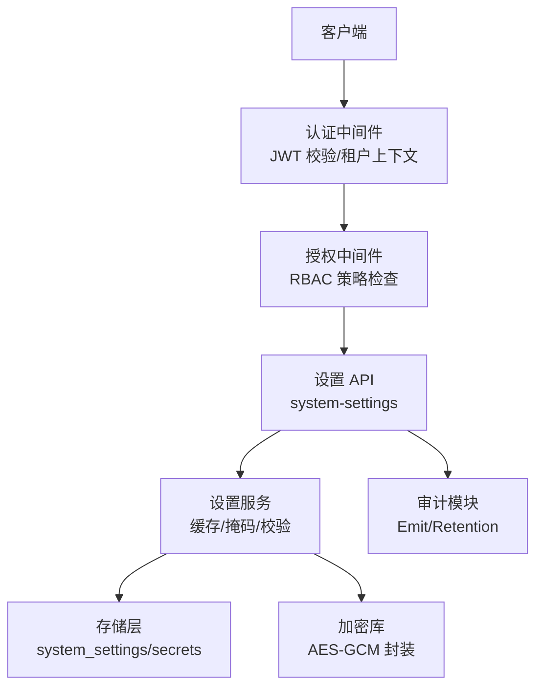
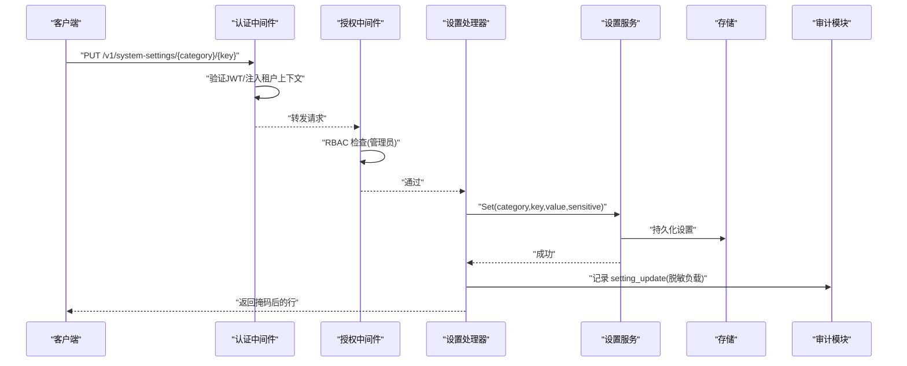
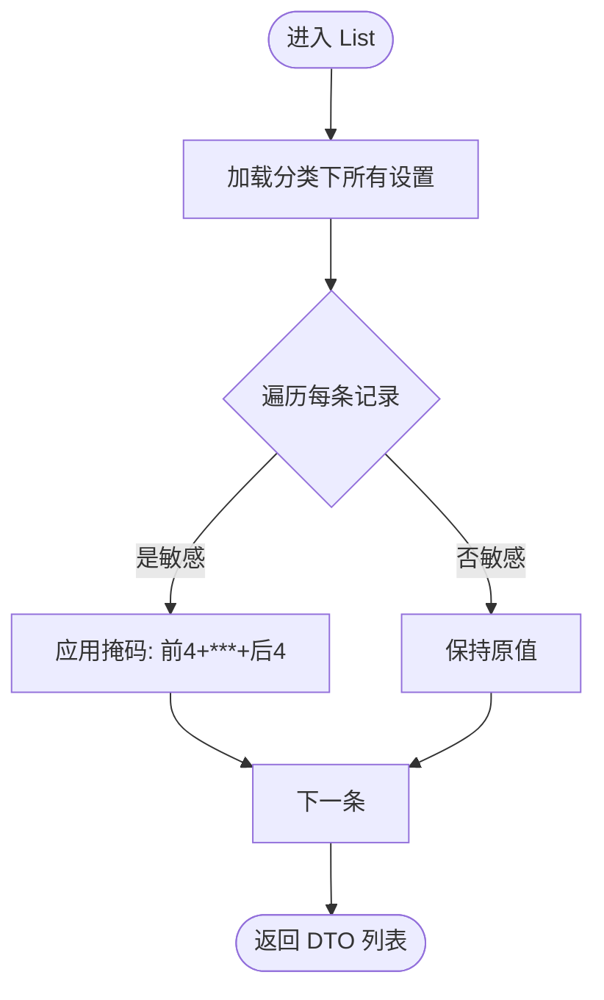
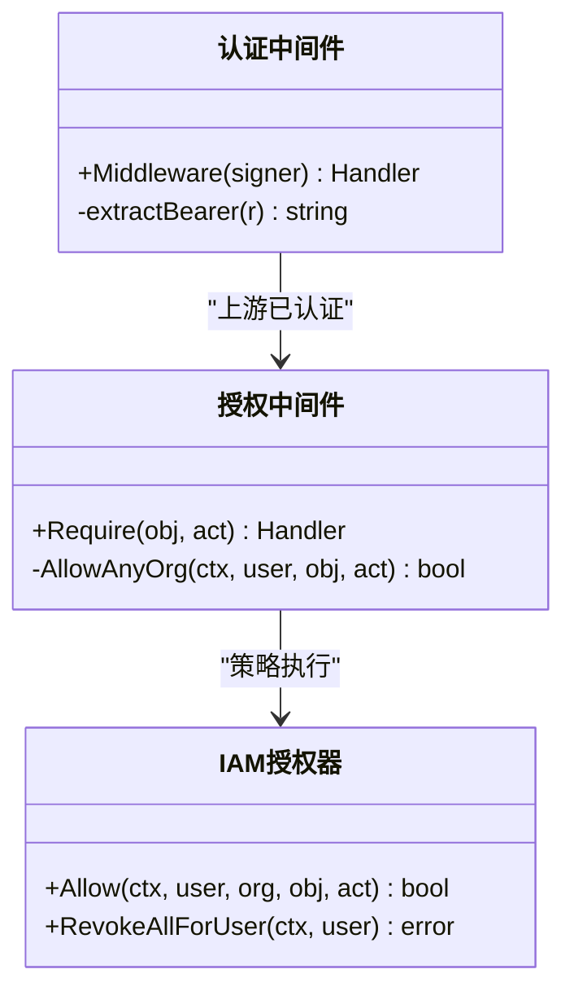
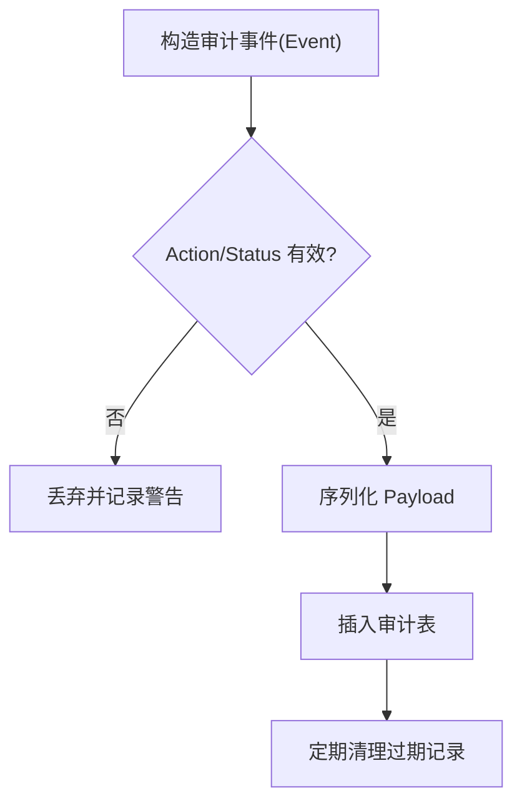
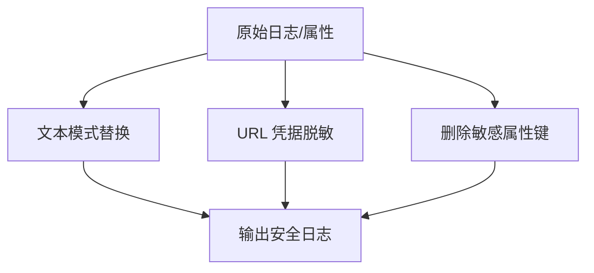
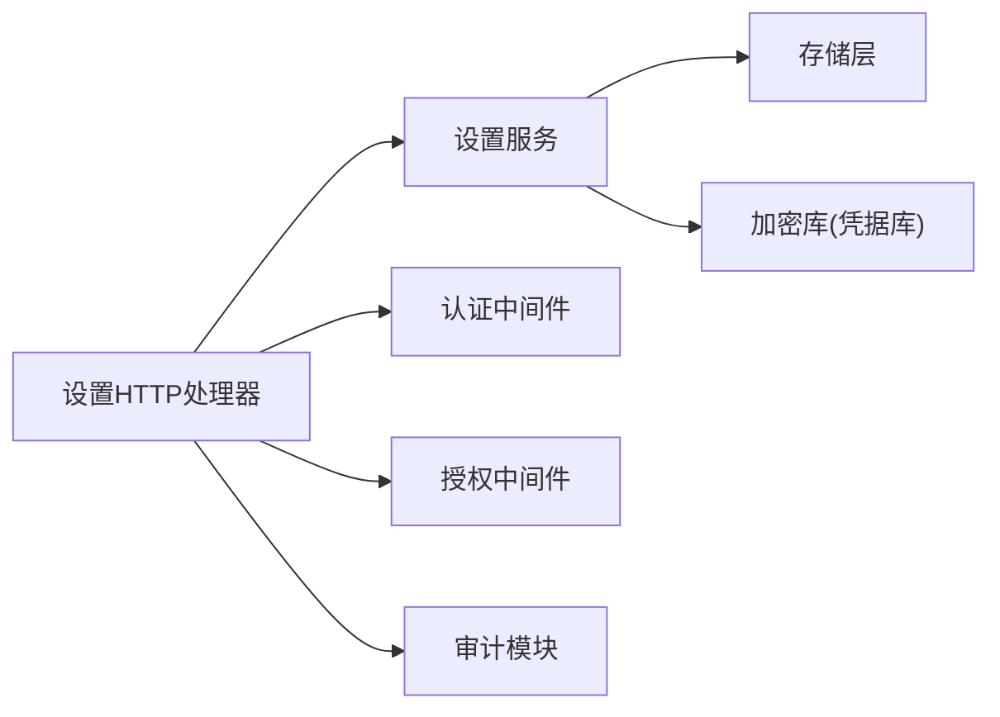

# 配置安全与权限

<cite>
**本文引用的文件**
- [internal/manager/server/setting/http.go](file://internal/manager/server/setting/http.go)
- [internal/manager/biz/setting/service.go](file://internal/manager/biz/setting/service.go)
- [internal/manager/model/setting/model.go](file://internal/manager/model/setting/model.go)
- [internal/pkg/auth/middleware.go](file://internal/pkg/auth/middleware.go)
- [internal/pkg/authzmw/middleware.go](file://internal/pkg/authzmw/middleware.go)
- [internal/iam/biz/authz/authz.go](file://internal/iam/biz/authz/authz.go)
- [internal/manager/biz/audit/usecase.go](file://internal/manager/biz/audit/usecase.go)
- [internal/manager/model/audit/log.go](file://internal/manager/model/audit/log.go)
- [internal/pkg/secretbox/secretbox.go](file://internal/pkg/secretbox/secretbox.go)
- [internal/manager/biz/secret/usecase.go](file://internal/manager/biz/secret/usecase.go)
- [internal/manager/model/secret/model.go](file://internal/manager/model/secret/model.go)
- [internal/pkg/k8sredact/redact.go](file://internal/pkg/k8sredact/redact.go)
- [internal/edgeagent/plugins/logs/render.go](file://internal/edgeagent/plugins/logs/render.go)
- [tests/e2e/settings_reveal_test.go](file://tests/e2e/settings_reveal_test.go)
</cite>

## 目录
1. [简介](#简介)
2. [项目结构](#项目结构)
3. [核心组件](#核心组件)
4. [架构总览](#架构总览)
5. [详细组件分析](#详细组件分析)
6. [依赖关系分析](#依赖关系分析)
7. [性能考虑](#性能考虑)
8. [故障排查指南](#故障排查指南)
9. [结论](#结论)
10. [附录](#附录)

## 简介
本技术文档聚焦于“配置安全与权限控制”，覆盖以下关键主题：
- 敏感字段的标识与掩码机制，确保敏感信息不泄露到 API 响应中。
- 配置的访问控制模型：基于角色的权限控制（RBAC）与资源隔离。
- 配置加密存储的实现原理与安全最佳实践。
- 配置操作的审计日志记录，确保所有配置变更可追溯。
- 配置安全的配置选项与加固建议。
- 常见安全威胁的防护措施与漏洞修复指南。

## 项目结构
围绕配置安全与权限，系统采用分层设计：HTTP 层负责路由与鉴权校验；业务服务层负责缓存、掩码、校验与持久化；数据层负责存储；认证与授权中间件贯穿请求链路；审计模块记录操作轨迹；密钥库提供凭据加密能力。



图表来源
- [internal/pkg/auth/middleware.go:10-53](file://internal/pkg/auth/middleware.go#L10-L53)
- [internal/pkg/authzmw/middleware.go:57-97](file://internal/pkg/authzmw/middleware.go#L57-L97)
- [internal/manager/server/setting/http.go:45-50](file://internal/manager/server/setting/http.go#L45-L50)
- [internal/manager/biz/setting/service.go:49-70](file://internal/manager/biz/setting/service.go#L49-L70)
- [internal/manager/biz/audit/usecase.go:72-116](file://internal/manager/biz/audit/usecase.go#L72-L116)
- [internal/pkg/secretbox/secretbox.go:53-75](file://internal/pkg/secretbox/secretbox.go#L53-L75)

章节来源
- [internal/manager/server/setting/http.go:1-50](file://internal/manager/server/setting/http.go#L1-L50)
- [internal/manager/biz/setting/service.go:1-20](file://internal/manager/biz/setting/service.go#L1-L20)

## 核心组件
- 认证与授权
  - JWT 认证中间件：从 Authorization 或查询参数提取令牌并验证，将租户上下文写入请求上下文。
  - RBAC 授权中间件：基于 casbin 的策略进行对象-动作级授权，支持超级用户快速放行。
- 配置管理
  - HTTP 处理器：暴露 system-settings 接口，读路径对任意已认证用户开放，写路径要求管理员角色。
  - 设置服务：维护进程内缓存，提供 Get/Set/List/Delete 能力，并在列表返回时对敏感值进行掩码。
  - 敏感字段识别：默认根据键名后缀自动标记为敏感（如 _api_key/_secret/_token/_password），也可由请求显式指定。
- 凭据加密
  - 密钥库使用 AES-256-GCM 对凭据字段进行落盘加密，密钥来自环境变量派生，未设置时降级为弱密钥并告警。
  - 对外 API 仅暴露字段名，不暴露值。
- 审计日志
  - 统一审计事件模型，记录操作主体、资源、动作、结果与结构化负载（需调用方先脱敏）。
  - 支持保留期清理任务，避免审计表无限增长。

章节来源
- [internal/pkg/auth/middleware.go:10-53](file://internal/pkg/auth/middleware.go#L10-L53)
- [internal/pkg/authzmw/middleware.go:57-97](file://internal/pkg/authzmw/middleware.go#L57-L97)
- [internal/manager/server/setting/http.go:67-137](file://internal/manager/server/setting/http.go#L67-L137)
- [internal/manager/biz/setting/service.go:205-259](file://internal/manager/biz/setting/service.go#L205-L259)
- [internal/pkg/secretbox/secretbox.go:31-51](file://internal/pkg/secretbox/secretbox.go#L31-L51)
- [internal/manager/biz/secret/usecase.go:1-43](file://internal/manager/biz/secret/usecase.go#L1-L43)
- [internal/manager/biz/audit/usecase.go:72-116](file://internal/manager/biz/audit/usecase.go#L72-L116)

## 架构总览
下图展示一次配置更新请求的完整链路：认证 → 授权 → 处理 → 掩码/审计 → 存储。



图表来源
- [internal/pkg/auth/middleware.go:21-53](file://internal/pkg/auth/middleware.go#L21-L53)
- [internal/pkg/authzmw/middleware.go:70-97](file://internal/pkg/authzmw/middleware.go#L70-L97)
- [internal/manager/server/setting/http.go:81-137](file://internal/manager/server/setting/http.go#L81-L137)
- [internal/manager/biz/setting/service.go:108-131](file://internal/manager/biz/setting/service.go#L108-L131)
- [internal/manager/biz/audit/usecase.go:72-116](file://internal/manager/biz/audit/usecase.go#L72-L116)

## 详细组件分析

### 敏感字段标识与掩码机制
- 自动标记规则：当键名以 _api_key、_secret、_token、_password 结尾时，默认视为敏感字段。
- 列表掩码策略：对敏感字段采用“前4+后4”掩码，短于等于8字符则全部掩码；非敏感字段原样返回。
- 明文查看：提供 reveal 端点，仅限管理员读取明文，用于 UI 的“显示/隐藏”切换。
- E2E 验证：端到端测试覆盖了 PUT 自动标记、LIST 掩码、REVEAL 明文返回的一致性。



图表来源
- [internal/manager/biz/setting/service.go:205-259](file://internal/manager/biz/setting/service.go#L205-L259)
- [internal/manager/server/setting/http.go:192-202](file://internal/manager/server/setting/http.go#L192-L202)
- [tests/e2e/settings_reveal_test.go:24-68](file://tests/e2e/settings_reveal_test.go#L24-L68)

章节来源
- [internal/manager/server/setting/http.go:81-137](file://internal/manager/server/setting/http.go#L81-L137)
- [internal/manager/server/setting/http.go:139-167](file://internal/manager/server/setting/http.go#L139-L167)
- [internal/manager/biz/setting/service.go:205-259](file://internal/manager/biz/setting/service.go#L205-L259)
- [tests/e2e/settings_reveal_test.go:24-68](file://tests/e2e/settings_reveal_test.go#L24-L68)

### 访问控制模型（RBAC 与资源隔离）
- 认证：JWT 中间件解析令牌，提取用户、角色、是否超级用户，并写入租户上下文。
- 授权：授权中间件基于 casbin 策略进行对象-动作判断；超级用户直接放行；未配置策略时兼容旧部署。
- 资源隔离：当前阶段按对象域（如 edge:*、user:*）与动作（read/write/delete/manage）进行细粒度控制；未来可扩展组织维度。



图表来源
- [internal/pkg/auth/middleware.go:21-53](file://internal/pkg/auth/middleware.go#L21-L53)
- [internal/pkg/authzmw/middleware.go:57-97](file://internal/pkg/authzmw/middleware.go#L57-L97)
- [internal/iam/biz/authz/authz.go:233-247](file://internal/iam/biz/authz/authz.go#L233-L247)

章节来源
- [internal/pkg/auth/middleware.go:10-53](file://internal/pkg/auth/middleware.go#L10-L53)
- [internal/pkg/authzmw/middleware.go:1-97](file://internal/pkg/authzmw/middleware.go#L1-L97)
- [internal/iam/biz/authz/authz.go:1-247](file://internal/iam/biz/authz/authz.go#L1-L247)

### 配置加密存储（凭据库）
- 加密算法：AES-256-GCM，密钥由环境变量派生；未设置时使用内置弱密钥并报告 KeyIsWeak。
- 密文格式：版本前缀 + base64(nonce || ciphertext+tag)，便于后续方案升级。
- 读写语义：写入时密封 JSON 字段映射；读取时解密；无版本前缀的值按历史明文兼容读取。
- API 脱敏：凭据库的 list/get 仅暴露字段名，不暴露值。

```mermaid
sequenceDiagram
participant App as "应用"
participant Box as "加密库"
participant DB as "数据库"
App->>Box : "Encrypt(明文)"
Box-->>App : "密文字符串"
App->>DB : "保存密文"
App->>DB : "读取密文"
DB-->>App : "密文"
App->>Box : "Decrypt(密文)"
Box-->>App : "明文"
```

图表来源
- [internal/pkg/secretbox/secretbox.go:31-109](file://internal/pkg/secretbox/secretbox.go#L31-L109)
- [internal/manager/biz/secret/usecase.go:1-43](file://internal/manager/biz/secret/usecase.go#L1-L43)
- [internal/manager/model/secret/model.go:32-45](file://internal/manager/model/secret/model.go#L32-L45)

章节来源
- [internal/pkg/secretbox/secretbox.go:1-110](file://internal/pkg/secretbox/secretbox.go#L1-L110)
- [internal/manager/biz/secret/usecase.go:1-43](file://internal/manager/biz/secret/usecase.go#L1-L43)
- [internal/manager/model/secret/model.go:32-45](file://internal/manager/model/secret/model.go#L32-L45)

### 审计日志记录
- 事件模型：包含主体、资源、动作、状态、错误信息与结构化负载。
- 写入策略：失败不阻塞业务，仅记录警告；负载需调用方先行脱敏。
- 保留策略：定时任务按保留天数清理过期审计记录。
- 设置变更：在设置更新/删除时记录 setting_update / setting_delete，负载携带 category/key/sensitive/value_hint。



图表来源
- [internal/manager/biz/audit/usecase.go:72-116](file://internal/manager/biz/audit/usecase.go#L72-L116)
- [internal/manager/biz/audit/usecase.go:149-183](file://internal/manager/biz/audit/usecase.go#L149-L183)
- [internal/manager/server/setting/http.go:116-122](file://internal/manager/server/setting/http.go#L116-L122)
- [internal/manager/model/audit/log.go:10-47](file://internal/manager/model/audit/log.go#L10-L47)

章节来源
- [internal/manager/biz/audit/usecase.go:1-191](file://internal/manager/biz/audit/usecase.go#L1-L191)
- [internal/manager/model/audit/log.go:1-136](file://internal/manager/model/audit/log.go#L1-L136)
- [internal/manager/server/setting/http.go:116-122](file://internal/manager/server/setting/http.go#L116-L122)

### 日志与遥测中的敏感数据保护
- 文本脱敏：对常见凭据模式（authorization/token/password/secret/api-key 等）进行替换。
- URL 凭据：对 URL 中的用户名密码片段进行脱敏。
- 属性过滤：删除匹配敏感键名的属性，限制属性数量与长度，防止敏感信息外泄。



图表来源
- [internal/pkg/k8sredact/redact.go:8-42](file://internal/pkg/k8sredact/redact.go#L8-L42)
- [internal/edgeagent/plugins/logs/render.go:147-165](file://internal/edgeagent/plugins/logs/render.go#L147-L165)

章节来源
- [internal/pkg/k8sredact/redact.go:1-43](file://internal/pkg/k8sredact/redact.go#L1-L43)
- [internal/edgeagent/plugins/logs/render.go:147-165](file://internal/edgeagent/plugins/logs/render.go#L147-L165)

## 依赖关系分析
- 设置 API 依赖设置服务；设置服务依赖存储与缓存；设置服务在列表时进行掩码。
- 认证中间件为所有受保护路由提供身份；授权中间件在设置写路径强制管理员角色。
- 审计模块独立于业务，仅在关键路径记录事件。
- 加密库被凭据库使用，保障凭据不落明文。



图表来源
- [internal/manager/server/setting/http.go:45-50](file://internal/manager/server/setting/http.go#L45-L50)
- [internal/manager/biz/setting/service.go:49-70](file://internal/manager/biz/setting/service.go#L49-L70)
- [internal/pkg/auth/middleware.go:21-53](file://internal/pkg/auth/middleware.go#L21-L53)
- [internal/pkg/authzmw/middleware.go:70-97](file://internal/pkg/authzmw/middleware.go#L70-L97)
- [internal/manager/biz/audit/usecase.go:72-116](file://internal/manager/biz/audit/usecase.go#L72-L116)
- [internal/pkg/secretbox/secretbox.go:53-75](file://internal/pkg/secretbox/secretbox.go#L53-L75)

章节来源
- [internal/manager/server/setting/http.go:1-281](file://internal/manager/server/setting/http.go#L1-L281)
- [internal/manager/biz/setting/service.go:1-259](file://internal/manager/biz/setting/service.go#L1-L259)

## 性能考虑
- 设置服务使用进程内缓存减少热路径的数据库往返，提升 LLM 等高频读取场景的性能。
- 列表掩码在内存中进行，开销极小；对敏感字段仅做字符串截取与拼接。
- 审计写入失败不影响主流程，降低对延迟的影响。
- 加密库使用一次性密钥派生，避免重复计算成本。

[本节为通用性能讨论，不直接分析具体文件]

## 故障排查指南
- 无法列出或更新设置
  - 确认已通过认证中间件获取租户上下文。
  - 写路径需要管理员角色，否则返回禁止访问。
- 敏感值仍泄露
  - 检查键名是否符合敏感后缀规则；必要时在请求中显式设置 sensitive=true。
  - 确认列表返回走的是设置服务的 List 路径，而非直连存储。
- 明文查看失败
  - reveal 端点仅允许管理员；请确认角色与上下文。
- 审计缺失
  - 检查审计写入是否失败（会记录警告但不阻塞业务）；确认保留策略未误删。
- 凭据解密失败
  - 检查环境变量密钥是否正确；若使用弱密钥，启动时会告警，应尽快设置强密钥。

章节来源
- [internal/manager/server/setting/http.go:224-235](file://internal/manager/server/setting/http.go#L224-L235)
- [internal/manager/biz/setting/service.go:205-259](file://internal/manager/biz/setting/service.go#L205-L259)
- [internal/manager/biz/audit/usecase.go:72-116](file://internal/manager/biz/audit/usecase.go#L72-L116)
- [internal/pkg/secretbox/secretbox.go:31-51](file://internal/pkg/secretbox/secretbox.go#L31-L51)

## 结论
本系统在配置安全与权限方面实现了多层防护：
- 通过自动敏感标记与列表掩码，避免敏感信息外泄；提供受限的明文查看通道。
- 基于 JWT 的认证与 casbin 的 RBAC 授权，实现细粒度的资源访问控制。
- 凭据库采用 AES-GCM 加密存储，结合环境变量密钥管理，降低数据泄露风险。
- 统一的审计日志记录与保留策略，确保配置变更可追溯且可控。
- 日志与遥测管道内置敏感数据脱敏，进一步降低侧信道泄露可能。

[本节为总结性内容，不直接分析具体文件]

## 附录

### 配置安全的配置选项与加固建议
- 必须设置强加密密钥：配置环境变量以派生 AES 密钥，避免使用内置弱密钥。
- 启用最小权限：为普通用户授予只读权限，写操作限定管理员。
- 开启审计并合理保留：配置审计保留天数，定期清理过期记录。
- 严格输入校验：对设置值进行范围与格式校验（例如布尔开关、超时秒数）。
- 日志脱敏：确保所有日志输出经过脱敏处理，避免凭据落入日志。

[本节为通用建议，不直接分析具体文件]

### 常见安全威胁与防护措施
- 凭据泄露到 API 响应
  - 措施：列表掩码、reveal 限管理员、敏感键自动标记。
- 越权修改配置
  - 措施：写路径强制管理员角色；授权中间件拒绝非法操作。
- 数据库备份泄露
  - 措施：凭据库使用 AES-GCM 加密；密钥不在数据库中。
- 日志泄露敏感信息
  - 措施：文本与 URL 脱敏、属性键过滤、限制属性大小。
- 审计丢失或被篡改
  - 措施：审计写入失败不阻塞业务但记录警告；保留策略由系统任务执行。

[本节为通用防护建议，不直接分析具体文件]