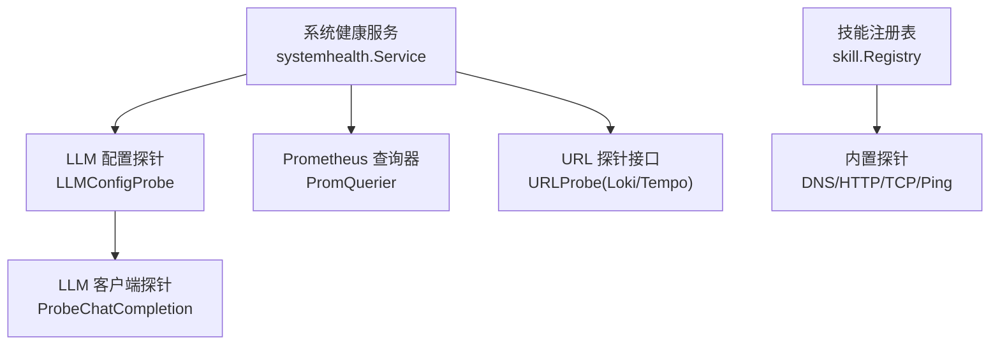
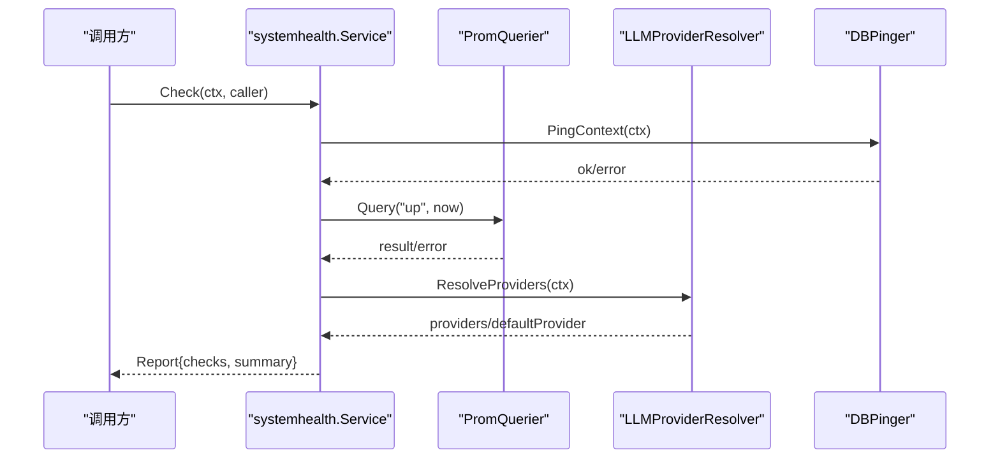
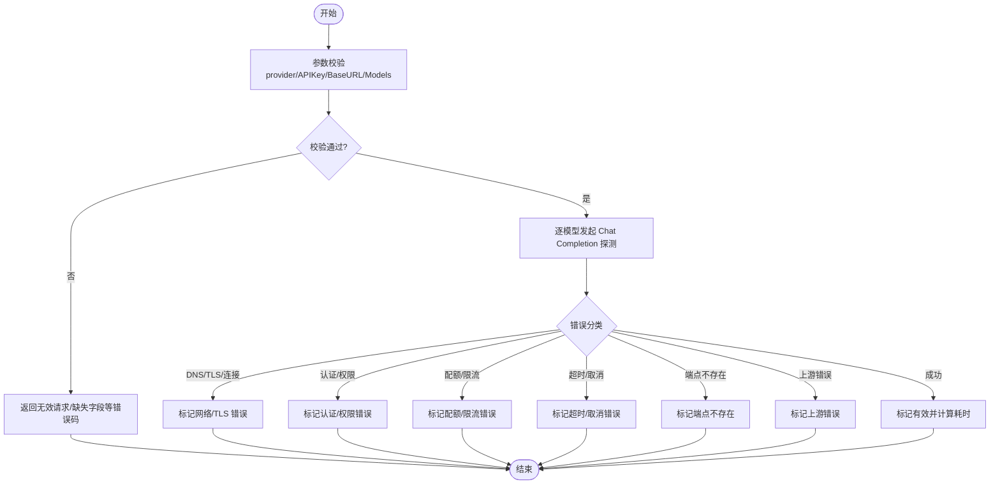
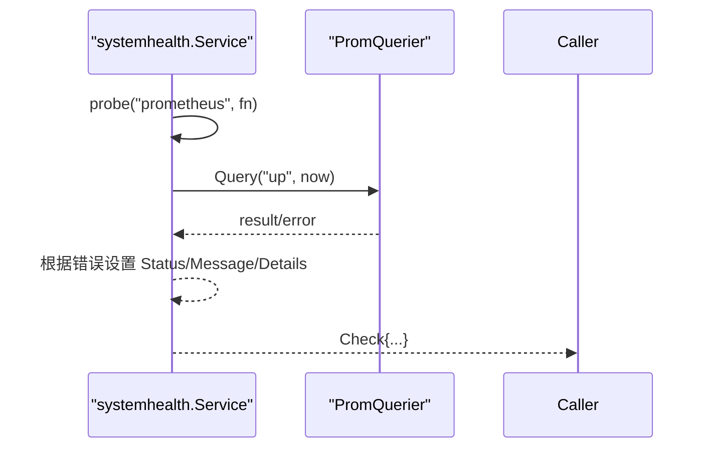
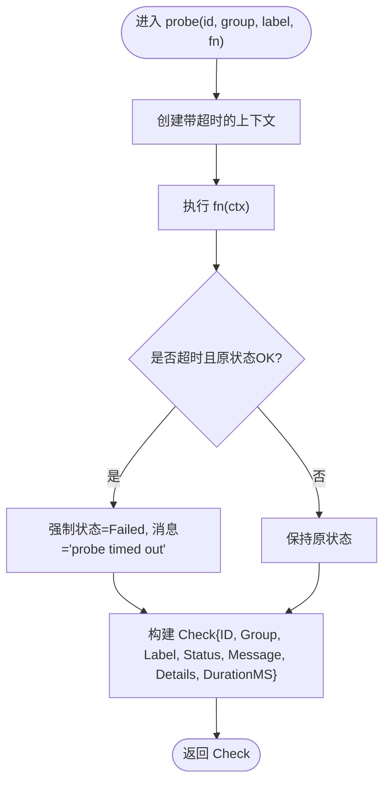
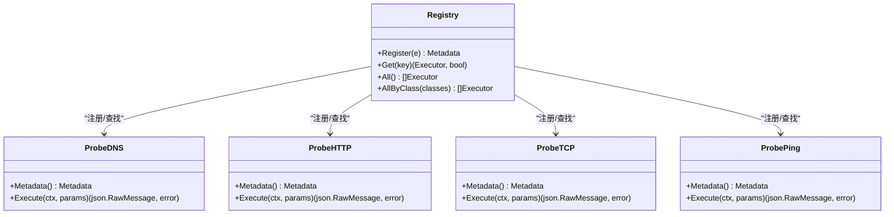
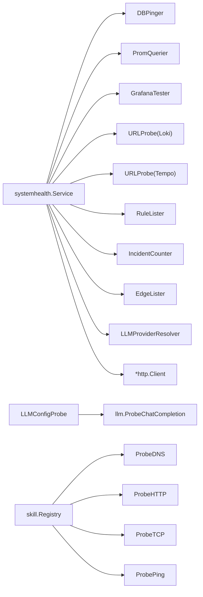

# 配置探针系统

<cite>
**本文引用的文件**
- [internal/manager/biz/setting/llm_probe.go](file://internal/manager/biz/setting/llm_probe.go)
- [internal/pkg/llm/probe.go](file://internal/pkg/llm/probe.go)
- [internal/manager/service/systemhealth/service.go](file://internal/manager/service/systemhealth/service.go)
- [internal/skill/registry.go](file://internal/skill/registry.go)
- [internal/skill/builtin/probe_dns.go](file://internal/skill/builtin/probe_dns.go)
- [internal/skill/builtin/probe_http.go](file://internal/skill/builtin/probe_http.go)
- [internal/skill/builtin/probe_ping.go](file://internal/skill/builtin/probe_ping.go)
- [internal/skill/builtin/probe_tcp.go](file://internal/skill/builtin/probe_tcp.go)
</cite>

## 目录
1. [简介](#简介)
2. [项目结构](#项目结构)
3. [核心组件](#核心组件)
4. [架构总览](#架构总览)
5. [详细组件分析](#详细组件分析)
6. [依赖关系分析](#依赖关系分析)
7. [性能与超时重试](#性能与超时重试)
8. [监控指标与日志记录](#监控指标与日志记录)
9. [故障排查指南](#故障排查指南)
10. [结论](#结论)
11. [附录：自定义探针开发指南](#附录自定义探针开发指南)

## 简介
本技术文档围绕“配置探针系统”展开，聚焦以下目标：
- 解释探针机制的工作原理，包括 LLM 连接性测试、Prometheus 连接测试等健康检查实现细节。
- 说明探针的注册机制、执行流程与结果处理。
- 覆盖探针的配置选项、超时设置和重试策略。
- 提供自定义探针的开发指南与最佳实践。
- 阐述探针执行的监控指标与日志记录机制。
- 解释探针在配置更新流程中的作用，以及如何通过探针确保配置变更的有效性。

## 项目结构
配置探针系统由三层组成：
- 系统级健康检查层：集中管理对数据库、Prometheus、Grafana、Loki、Tempo、Qdrant、LLM 等的连通性与可用性探测。
- 配置校验探针层：针对具体配置（如 LLM Provider）进行预验证，避免保存错误配置。
- 可插拔技能探针层：以“技能”形式注册的通用网络/主机探针（DNS、HTTP、TCP、Ping），用于更细粒度的连通性检测。

图表来源
- [internal/manager/service/systemhealth/service.go:119-154](file://internal/manager/service/systemhealth/service.go#L119-L154)
- [internal/manager/biz/setting/llm_probe.go:85-101](file://internal/manager/biz/setting/llm_probe.go#L85-L101)
- [internal/pkg/llm/probe.go:23-71](file://internal/pkg/llm/probe.go#L23-L71)
- [internal/skill/registry.go:10-47](file://internal/skill/registry.go#L10-L47)

章节来源
- [internal/manager/service/systemhealth/service.go:119-154](file://internal/manager/service/systemhealth/service.go#L119-L154)
- [internal/manager/biz/setting/llm_probe.go:85-101](file://internal/manager/biz/setting/llm_probe.go#L85-L101)
- [internal/pkg/llm/probe.go:23-71](file://internal/pkg/llm/probe.go#L23-L71)
- [internal/skill/registry.go:10-47](file://internal/skill/registry.go#L10-L47)

## 核心组件
- 系统健康服务：统一编排各项健康检查，返回结构化报告（状态、消息、详情、耗时）。
- LLM 配置探针：对未持久化的 LLM Provider 草稿进行参数校验与在线连通性验证，支持多种错误码分类。
- LLM 客户端探针：发送最小化 Chat Completion 请求，复用生产环境的 URL 归一化与鉴权路径，但不记录指标与日志，避免污染遥测。
- 技能探针注册表：进程内全局注册表，按 Key 查找并执行技能；内置 DNS、HTTP、TCP、Ping 探针均通过 init() 自动注册。

章节来源
- [internal/manager/service/systemhealth/service.go:19-50](file://internal/manager/service/systemhealth/service.go#L19-L50)
- [internal/manager/biz/setting/llm_probe.go:56-101](file://internal/manager/biz/setting/llm_probe.go#L56-L101)
- [internal/pkg/llm/probe.go:15-71](file://internal/pkg/llm/probe.go#L15-L71)
- [internal/skill/registry.go:10-47](file://internal/skill/registry.go#L10-L47)

## 架构总览
系统健康服务作为入口，聚合多项子探针：
- 数据库 Ping
- Prometheus 查询 up
- Grafana 集成测试
- Loki/Tempo 就绪探针
- Qdrant 集合可达性
- Frontier 客户端开关
- 告警引擎规则与事件计数
- Edge 代理在线情况
- LLM Provider 解析与配置
- Embedding Provider 配置

每个子探针通过统一的 probe 包装函数执行，带超时控制与耗时统计，最终汇总为整体健康报告。

图表来源
- [internal/manager/service/systemhealth/service.go:132-154](file://internal/manager/service/systemhealth/service.go#L132-L154)
- [internal/manager/service/systemhealth/service.go:166-187](file://internal/manager/service/systemhealth/service.go#L166-L187)
- [internal/manager/service/systemhealth/service.go:356-376](file://internal/manager/service/systemhealth/service.go#L356-L376)

章节来源
- [internal/manager/service/systemhealth/service.go:132-154](file://internal/manager/service/systemhealth/service.go#L132-L154)

## 详细组件分析

### LLM 配置探针
- 输入输出：
  - 输入：LLMProbeInput（provider、api_key、base_url、default_model、models）
  - 输出：LLMProbeResult（valid、code、provider、model、detail、latency_ms、saved、disabled）
- 关键流程：
  - 参数校验：provider 白名单、API Key 长度限制、BaseURL 格式校验、模型列表去重与上限、默认模型一致性。
  - 在线验证：使用 ProbeChatCompletion 对每个暴露模型发起最小化请求，捕获并分类错误（DNS/TLS/连接/认证/权限/配额/限流/超时/端点不存在/上游错误等）。
  - 保存边界：Save 方法将已验证的配置原子写入设置存储，空 API Key 表示禁用，跳过上游调用。
- 超时与重试：
  - 默认探针超时 20 秒，可通过上下文或配置注入。
  - 无重试策略：探针旨在快速失败并给出明确错误码，避免重复请求造成上游压力。

图表来源
- [internal/manager/biz/setting/llm_probe.go:205-331](file://internal/manager/biz/setting/llm_probe.go#L205-L331)
- [internal/pkg/llm/probe.go:23-71](file://internal/pkg/llm/probe.go#L23-L71)

章节来源
- [internal/manager/biz/setting/llm_probe.go:56-101](file://internal/manager/biz/setting/llm_probe.go#L56-L101)
- [internal/manager/biz/setting/llm_probe.go:191-331](file://internal/manager/biz/setting/llm_probe.go#L191-L331)
- [internal/pkg/llm/probe.go:23-71](file://internal/pkg/llm/probe.go#L23-L71)

### Prometheus 连接测试
- 健康检查逻辑：
  - 若 Prometheus 未启用或未接入，则标记为降级（degraded）。
  - 启用时执行 Query("up", now)，成功则 OK，失败则 Failed。
- 超时控制：
  - 由系统健康服务的 probe 包装函数统一注入上下文超时。
- 结果处理：
  - 返回结构化 Check，包含 ID、Group、Label、Status、Message、Details、DurationMS。

图表来源
- [internal/manager/service/systemhealth/service.go:178-187](file://internal/manager/service/systemhealth/service.go#L178-L187)
- [internal/manager/service/systemhealth/service.go:388-412](file://internal/manager/service/systemhealth/service.go#L388-L412)

章节来源
- [internal/manager/service/systemhealth/service.go:178-187](file://internal/manager/service/systemhealth/service.go#L178-L187)
- [internal/manager/service/systemhealth/service.go:388-412](file://internal/manager/service/systemhealth/service.go#L388-L412)

### 系统健康探针统一执行流程
- 统一 probe 包装：
  - 为每个子探针创建带超时的上下文。
  - 执行回调函数获取状态、消息、详情。
  - 若超时且原状态为 OK，则强制改为 Failed，并提示“probe timed out”。
  - 记录 DurationMS。
- 汇总与总体状态：
  - 统计 OK/Degraded/Failed/Unknown 数量。
  - 总体状态优先级：Failed > Degraded > Unknown > OK。

图表来源
- [internal/manager/service/systemhealth/service.go:388-412](file://internal/manager/service/systemhealth/service.go#L388-L412)

章节来源
- [internal/manager/service/systemhealth/service.go:388-412](file://internal/manager/service/systemhealth/service.go#L388-L412)

### 技能探针注册与执行
- 注册机制：
  - 各内置探针在 init() 中调用 skill.Register，向全局注册表登记。
  - 注册时校验 Metadata，禁止重复 Key。
- 执行流程：
  - 通过 skill.Get(key) 获取 Executor。
  - 调用 Execute(ctx, params) 返回 JSON 结果。
- 内置探针：
  - DNS：解析主机名到 A/AAAA 地址，返回延迟与错误。
  - HTTP：HEAD/GET 请求，返回状态码、延迟、内容长度，允许跳过 TLS 校验以便探测自签名服务。
  - TCP：拨号目标 host:port，返回连通性与延迟。
  - Ping：调用系统 ping 命令，限制包数与超时，返回退出码与原始输出。

图表来源
- [internal/skill/registry.go:10-47](file://internal/skill/registry.go#L10-L47)
- [internal/skill/builtin/probe_dns.go:13-39](file://internal/skill/builtin/probe_dns.go#L13-L39)
- [internal/skill/builtin/probe_http.go:15-47](file://internal/skill/builtin/probe_http.go#L15-L47)
- [internal/skill/builtin/probe_tcp.go:13-39](file://internal/skill/builtin/probe_tcp.go#L13-L39)
- [internal/skill/builtin/probe_ping.go:14-43](file://internal/skill/builtin/probe_ping.go#L14-L43)

章节来源
- [internal/skill/registry.go:10-47](file://internal/skill/registry.go#L10-L47)
- [internal/skill/builtin/probe_dns.go:13-39](file://internal/skill/builtin/probe_dns.go#L13-L39)
- [internal/skill/builtin/probe_http.go:15-47](file://internal/skill/builtin/probe_http.go#L15-L47)
- [internal/skill/builtin/probe_tcp.go:13-39](file://internal/skill/builtin/probe_tcp.go#L13-L39)
- [internal/skill/builtin/probe_ping.go:14-43](file://internal/skill/builtin/probe_ping.go#L14-L43)

## 依赖关系分析
- systemhealth.Service 依赖：
  - DBPinger：数据库连通性。
  - PromQuerier：Prometheus 查询。
  - GrafanaTester：Grafana 集成测试。
  - URLProbe：Loki/Tempo 就绪探针。
  - RuleLister/IncidentCounter：告警引擎规则与事件。
  - EdgeLister：边缘代理在线状态。
  - LLMProviderResolver：LLM Provider 解析。
  - *http.Client：Qdrant 集合可达性。
- LLMConfigProbe 依赖：
  - EnvProviderDefaults：默认 BaseURL 等环境配置。
  - llm.ProbeChatCompletion：最小化 Chat Completion 请求。
- 技能探针依赖：
  - skill.Registry：全局注册与查找。
  - 系统工具：ping 命令、net/http、net.Dial。

图表来源
- [internal/manager/service/systemhealth/service.go:84-117](file://internal/manager/service/systemhealth/service.go#L84-L117)
- [internal/manager/biz/setting/llm_probe.go:85-101](file://internal/manager/biz/setting/llm_probe.go#L85-L101)
- [internal/pkg/llm/probe.go:23-71](file://internal/pkg/llm/probe.go#L23-L71)
- [internal/skill/registry.go:10-47](file://internal/skill/registry.go#L10-L47)

章节来源
- [internal/manager/service/systemhealth/service.go:84-117](file://internal/manager/service/systemhealth/service.go#L84-L117)
- [internal/manager/biz/setting/llm_probe.go:85-101](file://internal/manager/biz/setting/llm_probe.go#L85-L101)
- [internal/pkg/llm/probe.go:23-71](file://internal/pkg/llm/probe.go#L23-L71)
- [internal/skill/registry.go:10-47](file://internal/skill/registry.go#L10-L47)

## 性能与超时重试
- 超时策略：
  - 系统健康探针统一使用 Config.ProbeTimeout（默认 3 秒）包裹上下文，防止长时间阻塞。
  - LLM 配置探针默认 20 秒超时，可通过上下文或配置注入。
  - 技能探针各自定义合理默认值（如 HTTP 默认 5000ms，Ping 单包 3000ms，最大包数与超时上限受保护）。
- 重试策略：
  - 当前实现未引入重试：探针设计为快速失败并返回明确错误码，避免放大上游压力与噪声。
  - 对于需要高可用的场景，可在上层调度器增加重试与退避策略。
- 资源保护：
  - LLM 探针不记录指标与日志，避免污染运行时遥测。
  - HTTP 探针允许跳过 TLS 校验，便于探测内部自签名服务，但需谨慎使用。

章节来源
- [internal/manager/service/systemhealth/service.go:119-129](file://internal/manager/service/systemhealth/service.go#L119-L129)
- [internal/manager/biz/setting/llm_probe.go:47-54](file://internal/manager/biz/setting/llm_probe.go#L47-L54)
- [internal/pkg/llm/probe.go:23-28](file://internal/pkg/llm/probe.go#L23-L28)
- [internal/skill/builtin/probe_http.go:62-91](file://internal/skill/builtin/probe_http.go#L62-L91)
- [internal/skill/builtin/probe_ping.go:60-99](file://internal/skill/builtin/probe_ping.go#L60-L99)

## 监控指标与日志记录
- 系统健康探针：
  - 每个 Check 包含 DurationMS，可用于前端展示与慢探针识别。
  - 通过 Summary 统计 OK/Degraded/Failed/Unknown 数量，反映整体健康度。
- LLM 配置探针：
  - LLMProbeResult 包含 latency_ms，用于评估上游响应速度。
  - 错误分类细致，便于前端引导用户修复配置。
- 技能探针：
  - DNS/HTTP/TCP/Ping 均返回延迟与错误信息，便于定位网络问题。
- 日志记录：
  - 系统健康探针未显式记录日志，仅通过结构化结果传递。
  - LLM 探针刻意避免记录指标与日志，防止敏感信息与上游响应泄露。
  - 技能探针在执行过程中可能产生系统日志（如 ping 命令输出），但结果中已剥离敏感信息。

章节来源
- [internal/manager/service/systemhealth/service.go:28-50](file://internal/manager/service/systemhealth/service.go#L28-L50)
- [internal/manager/biz/setting/llm_probe.go:67-78](file://internal/manager/biz/setting/llm_probe.go#L67-L78)
- [internal/pkg/llm/probe.go:23-28](file://internal/pkg/llm/probe.go#L23-L28)
- [internal/skill/builtin/probe_http.go:55-60](file://internal/skill/builtin/probe_http.go#L55-L60)
- [internal/skill/builtin/probe_ping.go:51-58](file://internal/skill/builtin/probe_ping.go#L51-L58)

## 故障排查指南
- LLM 配置问题：
  - 缺失 API Key：返回 missing-api-key。
  - 不支持的 Provider：返回 unsupported-provider。
  - BaseURL 非法或缺失：返回 invalid-base-url/missing-base-url。
  - 认证失败/权限不足：返回 authentication-failed/permission-denied。
  - 模型不存在：返回 model-not-found。
  - 配额超限/限流：返回 quota-exceeded/rate-limited。
  - 超时/取消：返回 timeout/canceled。
  - DNS/TLS/连接失败：返回 dns-failed/tls-failed/connection-failed。
  - 端点不存在：返回 endpoint-not-found。
  - 上游错误：返回 upstream-error。
- Prometheus 不可用：
  - 未启用或未接入：degraded。
  - 查询失败：failed，携带错误消息。
- 技能探针常见问题：
  - DNS 解析失败：检查域名与 DNS 服务器。
  - HTTP 不可达：检查 URL、端口、防火墙、TLS 证书。
  - TCP 连接失败：检查目标地址与端口开放情况。
  - Ping 失败：检查网络连通性与 ICMP 策略。

章节来源
- [internal/manager/biz/setting/llm_probe.go:22-45](file://internal/manager/biz/setting/llm_probe.go#L22-L45)
- [internal/manager/service/systemhealth/service.go:178-187](file://internal/manager/service/systemhealth/service.go#L178-L187)
- [internal/skill/builtin/probe_dns.go:41-50](file://internal/skill/builtin/probe_dns.go#L41-L50)
- [internal/skill/builtin/probe_http.go:49-60](file://internal/skill/builtin/probe_http.go#L49-L60)
- [internal/skill/builtin/probe_tcp.go:41-50](file://internal/skill/builtin/probe_tcp.go#L41-L50)
- [internal/skill/builtin/probe_ping.go:45-58](file://internal/skill/builtin/probe_ping.go#L45-L58)

## 结论
配置探针系统通过分层设计与统一封装，提供了稳定、可观测、可扩展的健康检查能力：
- 系统健康服务负责编排与汇总，保证一致性与可观测性。
- LLM 配置探针提供细粒度配置校验与在线验证，避免错误配置入库。
- 技能探针提供通用网络探测能力，便于扩展与定制。
- 超时与错误分类清晰，便于前端引导与运维排障。
- 当前实现强调快速失败与最小化影响，适合在生产环境中安全使用。

## 附录：自定义探针开发指南
- 系统健康探针：
  - 实现对应接口（如 URLProbe、GrafanaTester、PromQuerier 等），并在 systemhealth.Service 中注册检查项。
  - 使用 probe 包装函数获得超时与耗时统计。
- LLM 配置探针：
  - 如需新增 Provider，需在白名单与默认配置中补充，并确保 ProbeChatCompletion 能正确路由与鉴权。
  - 遵循错误分类规范，返回明确的 code 与 detail。
- 技能探针：
  - 实现 Metadata 与 Execute 方法，并通过 skill.Register 在 init() 中注册。
  - 参数校验与默认值处理要严谨，避免恶意或异常输入。
  - 结果应包含延迟与错误信息，便于诊断。
- 最佳实践：
  - 严格控制超时与资源占用，避免探针成为瓶颈。
  - 不记录敏感信息，不在探针中执行写操作（除非明确为 mutating/dangerous 类技能）。
  - 使用结构化结果，便于前端展示与自动化处理。
  - 在配置更新流程中，先执行探针验证，再持久化配置，确保变更有效性。

章节来源
- [internal/manager/service/systemhealth/service.go:52-82](file://internal/manager/service/systemhealth/service.go#L52-L82)
- [internal/manager/biz/setting/llm_probe.go:333-346](file://internal/manager/biz/setting/llm_probe.go#L333-L346)
- [internal/skill/registry.go:26-33](file://internal/skill/registry.go#L26-L33)
- [internal/skill/builtin/probe_dns.go:13-39](file://internal/skill/builtin/probe_dns.go#L13-L39)
- [internal/skill/builtin/probe_http.go:15-47](file://internal/skill/builtin/probe_http.go#L15-L47)
- [internal/skill/builtin/probe_tcp.go:13-39](file://internal/skill/builtin/probe_tcp.go#L13-L39)
- [internal/skill/builtin/probe_ping.go:14-43](file://internal/skill/builtin/probe_ping.go#L14-L43)