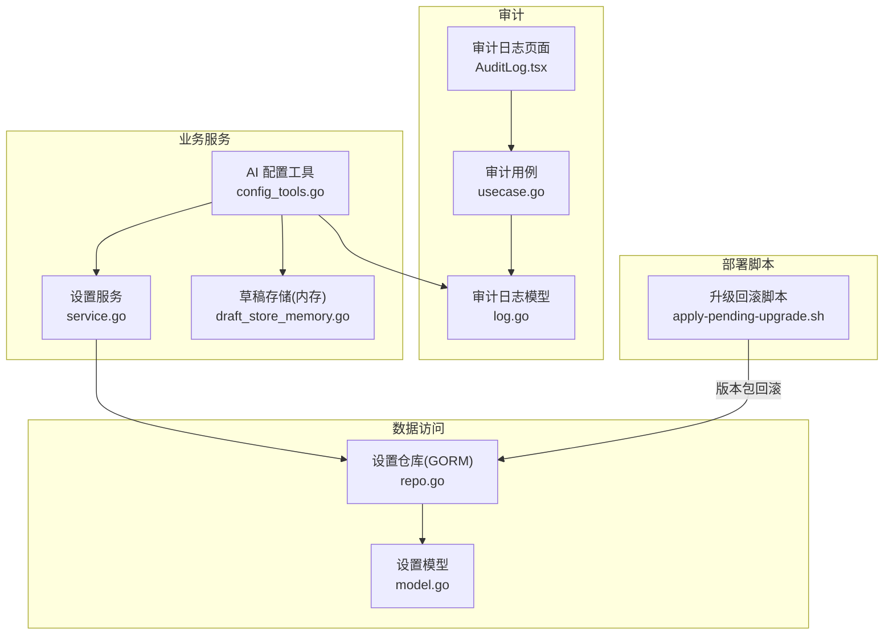
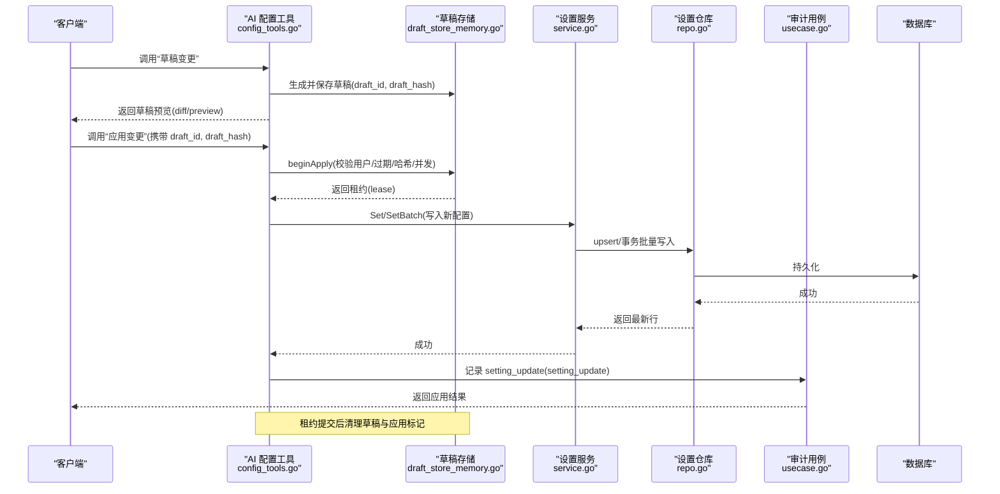
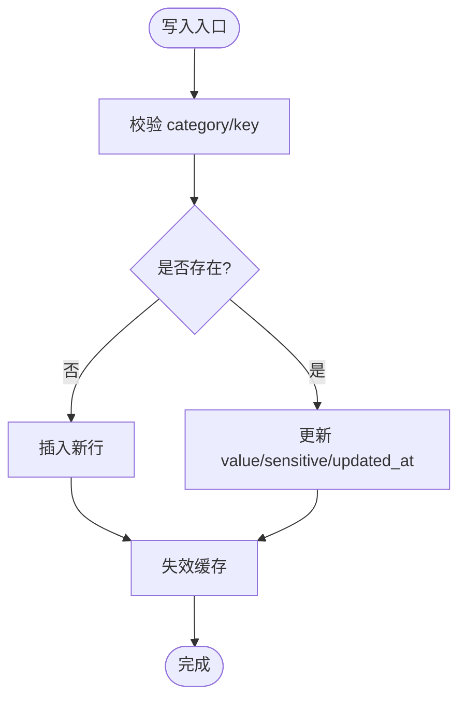
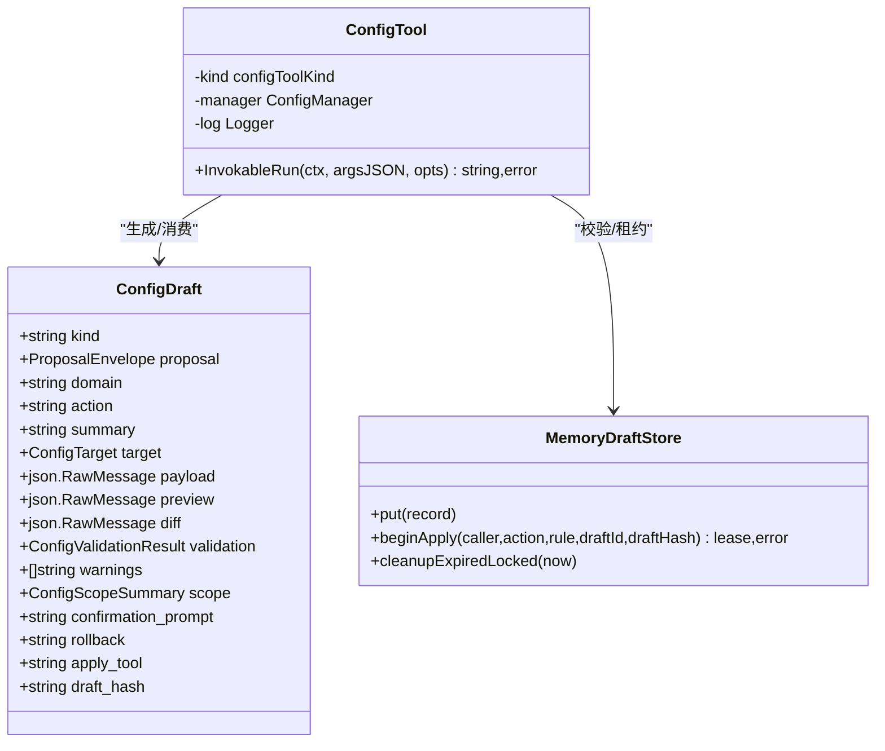
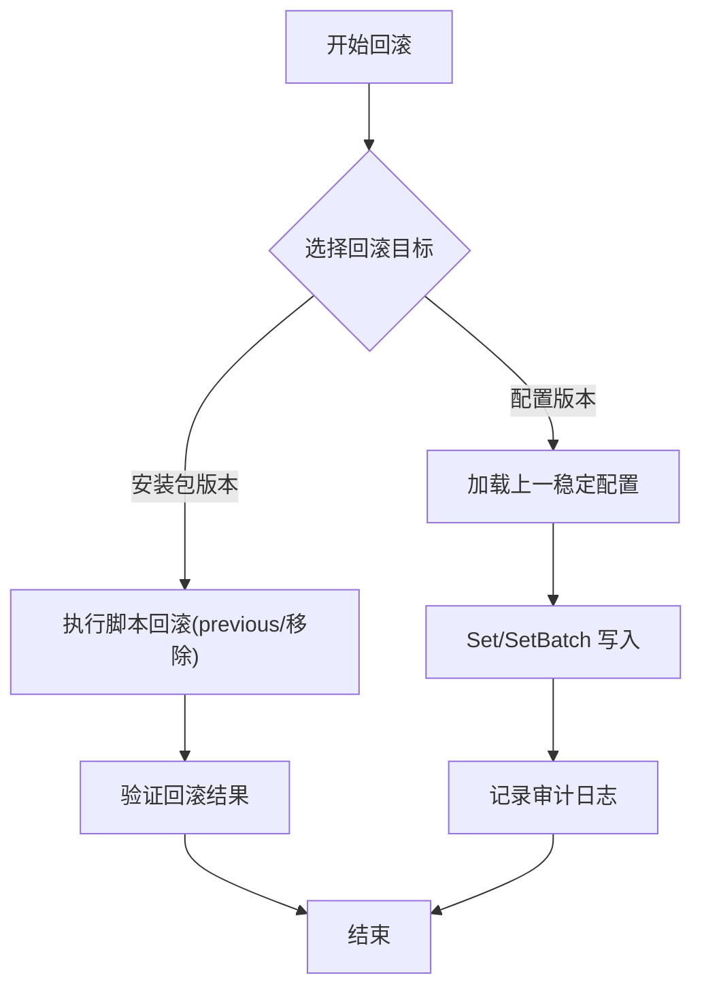
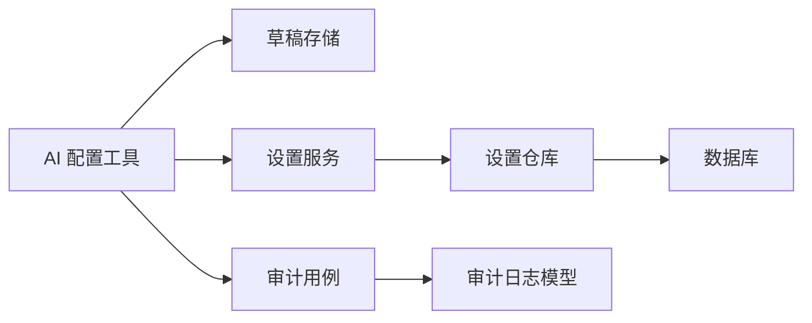

# 配置版本管理

<cite>
**本文引用的文件**
- [internal/manager/biz/setting/service.go](file://internal/manager/biz/setting/service.go)
- [internal/manager/data/setting/store/repo.go](file://internal/manager/data/setting/store/repo.go)
- [internal/manager/model/setting/model.go](file://internal/manager/model/setting/model.go)
- [internal/manager/biz/aiops/tools/config_tools.go](file://internal/manager/biz/aiops/tools/config_tools.go)
- [internal/manager/biz/aiops/alertconfig/draft_store_memory.go](file://internal/manager/biz/aiops/alertconfig/draft_store_memory.go)
- [internal/manager/model/audit/log.go](file://internal/manager/model/audit/log.go)
- [internal/manager/biz/audit/usecase.go](file://internal/manager/biz/audit/usecase.go)
- [web/src/pages/settings/AuditLog.tsx](file://web/src/pages/settings/AuditLog.tsx)
- [deploy/install/apply-pending-upgrade.sh](file://deploy/install/apply-pending-upgrade.sh)
</cite>

## 目录
1. [简介](#简介)
2. [项目结构](#项目结构)
3. [核心组件](#核心组件)
4. [架构总览](#架构总览)
5. [详细组件分析](#详细组件分析)
6. [依赖关系分析](#依赖关系分析)
7. [性能考虑](#性能考虑)
8. [故障排查指南](#故障排查指南)
9. [结论](#结论)
10. [附录](#附录)

## 简介
本技术文档围绕配置版本管理系统，系统阐述配置版本的存储结构、版本号与元数据管理、变更的版本控制机制（创建、比较、合并）、回滚实现原理与使用方法、冲突检测与解决策略、版本查询API使用示例与最佳实践，以及配置审计日志的记录格式与分析方法。目标是帮助读者在不深入源码的情况下理解系统的整体设计与关键流程，并在多租户环境下安全、可追溯地管理配置。

## 项目结构
本项目采用分层架构：
- 业务服务层：提供设置项的读写、缓存、批量写入等能力。
- 数据访问层：基于 GORM 的键值型设置表持久化，支持幂等 upsert 与事务性批量写入。
- AI 工具与草稿机制：通过“草稿-校验-应用”的流程实现配置变更的版本化与可回滚。
- 审计子系统：记录所有变更操作，支持时间范围查询与保留清理。
- 前端展示：审计日志查看界面，便于运维人员追踪变更。

**图表来源**
- [internal/manager/biz/setting/service.go:1-259](file://internal/manager/biz/setting/service.go#L1-L259)
- [internal/manager/data/setting/store/repo.go:1-129](file://internal/manager/data/setting/store/repo.go#L1-L129)
- [internal/manager/biz/aiops/tools/config_tools.go:73-90](file://internal/manager/biz/aiops/tools/config_tools.go#L73-L90)
- [internal/manager/biz/aiops/alertconfig/draft_store_memory.go:1-130](file://internal/manager/biz/aiops/alertconfig/draft_store_memory.go#L1-L130)
- [internal/manager/model/audit/log.go:1-136](file://internal/manager/model/audit/log.go#L1-L136)
- [internal/manager/biz/audit/usecase.go:118-190](file://internal/manager/biz/audit/usecase.go#L118-L190)
- [web/src/pages/settings/AuditLog.tsx:1-26](file://web/src/pages/settings/AuditLog.tsx#L1-L26)
- [deploy/install/apply-pending-upgrade.sh:123-161](file://deploy/install/apply-pending-upgrade.sh#L123-L161)

**章节来源**
- [internal/manager/biz/setting/service.go:1-259](file://internal/manager/biz/setting/service.go#L1-L259)
- [internal/manager/data/setting/store/repo.go:1-129](file://internal/manager/data/setting/store/repo.go#L1-L129)
- [internal/manager/model/audit/log.go:1-136](file://internal/manager/model/audit/log.go#L1-L136)
- [internal/manager/biz/audit/usecase.go:118-190](file://internal/manager/biz/audit/usecase.go#L118-L190)
- [web/src/pages/settings/AuditLog.tsx:1-26](file://web/src/pages/settings/AuditLog.tsx#L1-L26)
- [deploy/install/apply-pending-upgrade.sh:123-161](file://deploy/install/apply-pending-upgrade.sh#L123-L161)

## 核心组件
- 设置服务（Service）：提供获取、更新、批量更新、删除、列表等操作；内置进程内缓存，敏感字段在列表响应中脱敏；支持按分类读取开关类配置。
- 设置仓库（Repo）：基于 GORM 的键值对存储，支持唯一索引上的幂等 upsert、事务性批量写入、删除与列表查询。
- AI 配置工具（ConfigTool）：封装“草稿变更”和“应用变更”两类工具，负责参数解析、校验、哈希一致性检查、并发保护与结果序列化。
- 草稿存储（Memory Draft Store）：内存级草稿暂存与租约管理，确保 apply 时仅一次生效、防重放、过期清理与用户归属校验。
- 审计日志（Audit Log）：统一记录“谁在何时对什么资源做了什么”，包含状态、错误码、负载摘要与请求ID，支持时间范围查询与保留清理。
- 升级回滚脚本：用于安装包的原子应用与失败回滚，保证版本切换的一致性。

**章节来源**
- [internal/manager/biz/setting/service.go:39-165](file://internal/manager/biz/setting/service.go#L39-L165)
- [internal/manager/data/setting/store/repo.go:24-96](file://internal/manager/data/setting/store/repo.go#L24-L96)
- [internal/manager/biz/aiops/tools/config_tools.go:160-254](file://internal/manager/biz/aiops/tools/config_tools.go#L160-L254)
- [internal/manager/biz/aiops/alertconfig/draft_store_memory.go:13-130](file://internal/manager/biz/aiops/alertconfig/draft_store_memory.go#L13-L130)
- [internal/manager/model/audit/log.go:10-47](file://internal/manager/model/audit/log.go#L10-L47)
- [internal/manager/biz/audit/usecase.go:118-190](file://internal/manager/biz/audit/usecase.go#L118-L190)
- [deploy/install/apply-pending-upgrade.sh:123-161](file://deploy/install/apply-pending-upgrade.sh#L123-L161)

## 架构总览
下图展示了从“草稿创建→校验→应用→审计→回滚”的端到端流程，体现版本化与可追溯性。

**图表来源**
- [internal/manager/biz/aiops/tools/config_tools.go:212-254](file://internal/manager/biz/aiops/tools/config_tools.go#L212-L254)
- [internal/manager/biz/aiops/alertconfig/draft_store_memory.go:42-85](file://internal/manager/biz/aiops/alertconfig/draft_store_memory.go#L42-L85)
- [internal/manager/biz/setting/service.go:108-165](file://internal/manager/biz/setting/service.go#L108-L165)
- [internal/manager/data/setting/store/repo.go:43-96](file://internal/manager/data/setting/store/repo.go#L43-L96)
- [internal/manager/model/audit/log.go:100-104](file://internal/manager/model/audit/log.go#L100-L104)
- [internal/manager/biz/audit/usecase.go:118-147](file://internal/manager/biz/audit/usecase.go#L118-L147)

## 详细组件分析

### 配置版本存储结构与元数据
- 存储结构：系统设置以“分类(category)+键(key)”为唯一标识的键值对存储，值(value)与是否敏感(sensitive)构成核心元数据，更新时间(updated_at)用于版本演进与排序。
- 幂等写入：通过唯一索引与 on conflict 更新实现幂等 upsert，避免重复写入导致版本混乱。
- 批量写入：将一组相关设置放入同一事务，要么全部提交，要么全部回滚，保证配置组合的一致性。
- 缓存策略：服务层维护进程内缓存，写操作后失效对应键，读路径命中则直接返回，减少数据库压力。
- 敏感字段处理：列表接口对敏感值进行掩码显示，防止泄露；仅在需要明文时由上层显式获取。

**图表来源**
- [internal/manager/data/setting/store/repo.go:43-96](file://internal/manager/data/setting/store/repo.go#L43-L96)
- [internal/manager/biz/setting/service.go:108-165](file://internal/manager/biz/setting/service.go#L108-L165)

**章节来源**
- [internal/manager/data/setting/store/repo.go:24-96](file://internal/manager/data/setting/store/repo.go#L24-L96)
- [internal/manager/biz/setting/service.go:49-165](file://internal/manager/biz/setting/service.go#L49-L165)

### 版本控制机制：创建、比较与合并
- 版本创建：通过“草稿变更”工具生成配置草案，附带 diff/preview、作用域摘要、确认提示、回滚引用与草稿哈希，形成可追踪的版本快照。
- 版本比较：草稿中包含 diff 与 preview，便于变更前预览差异与影响面。
- 合并策略：应用阶段以“草稿+哈希”作为不可变契约，确保最终落库的配置与预览一致；批量写入在同一事务中完成，避免部分提交导致的中间态。
- 并发与防重放：草稿存储维护 applying 标记与过期时间，防止同一草稿被重复应用或过期后仍被使用。

**图表来源**
- [internal/manager/biz/aiops/tools/config_tools.go:160-254](file://internal/manager/biz/aiops/tools/config_tools.go#L160-L254)
- [internal/manager/biz/aiops/tools/config_tools.go:73-90](file://internal/manager/biz/aiops/tools/config_tools.go#L73-L90)
- [internal/manager/biz/aiops/alertconfig/draft_store_memory.go:13-130](file://internal/manager/biz/aiops/alertconfig/draft_store_memory.go#L13-L130)

**章节来源**
- [internal/manager/biz/aiops/tools/config_tools.go:73-90](file://internal/manager/biz/aiops/tools/config_tools.go#L73-L90)
- [internal/manager/biz/aiops/tools/config_tools.go:212-254](file://internal/manager/biz/aiops/tools/config_tools.go#L212-L254)
- [internal/manager/biz/aiops/alertconfig/draft_store_memory.go:42-85](file://internal/manager/biz/aiops/alertconfig/draft_store_memory.go#L42-L85)

### 配置回滚功能：原理与使用
- 应用侧回滚：草稿应用成功后，若后续发现异常，可通过“回滚引用”定位到上一稳定版本进行恢复；草稿租约在提交后清理，避免误用。
- 部署侧回滚：升级脚本在应用新版本前备份旧版本，失败时自动回滚至 previous 或移除新增文件，确保系统一致性。
- 建议实践：任何变更都应先走“草稿→预览→审批→应用”流程，并记录审计日志；回滚需同样经过审批与审计。

**图表来源**
- [deploy/install/apply-pending-upgrade.sh:123-161](file://deploy/install/apply-pending-upgrade.sh#L123-L161)
- [internal/manager/biz/setting/service.go:108-165](file://internal/manager/biz/setting/service.go#L108-L165)
- [internal/manager/model/audit/log.go:100-104](file://internal/manager/model/audit/log.go#L100-L104)

**章节来源**
- [deploy/install/apply-pending-upgrade.sh:123-161](file://deploy/install/apply-pending-upgrade.sh#L123-L161)
- [internal/manager/biz/setting/service.go:108-165](file://internal/manager/biz/setting/service.go#L108-L165)

### 配置冲突检测与解决策略（多租户环境）
- 冲突检测：
  - 草稿哈希校验：应用时必须携带与草稿一致的 hash，防止篡改或过期使用。
  - 并发控制：草稿存储维护 applying 标记，避免同一草稿被多次应用。
  - 用户归属校验：确保只有发起草稿的用户才能应用该草稿，避免越权。
- 解决策略：
  - 批量事务：将一组相关设置写入同一事务，避免部分提交导致的冲突。
  - 幂等 upsert：基于唯一索引的更新，保证多次写入结果一致。
  - 多租户扩展：当前服务注释指出未来可扩展 org_id 前缀到缓存键，以隔离不同租户的配置空间。

**章节来源**
- [internal/manager/biz/aiops/alertconfig/draft_store_memory.go:42-85](file://internal/manager/biz/aiops/alertconfig/draft_store_memory.go#L42-L85)
- [internal/manager/data/setting/store/repo.go:43-96](file://internal/manager/data/setting/store/repo.go#L43-L96)
- [internal/manager/biz/setting/service.go:1-14](file://internal/manager/biz/setting/service.go#L1-L14)

### 配置版本查询 API 与最佳实践
- 查询能力：
  - 列表查询：按分类列出设置项，敏感值自动掩码。
  - 单值查询：按分类+键获取明文值（适用于内部解析器）。
  - 审计日志查询：按时间范围、资源类型、动作过滤，支持限制条数。
- 最佳实践：
  - 使用分类与键精确查询，避免全表扫描。
  - 结合审计日志的时间范围与动作筛选，快速定位变更事件。
  - 对敏感配置使用最小权限原则，仅必要组件获取明文。

**章节来源**
- [internal/manager/biz/setting/service.go:205-222](file://internal/manager/biz/setting/service.go#L205-L222)
- [internal/manager/biz/audit/usecase.go:118-147](file://internal/manager/biz/audit/usecase.go#L118-L147)
- [web/src/pages/settings/AuditLog.tsx:1-26](file://web/src/pages/settings/AuditLog.tsx#L1-L26)

### 配置审计日志：记录格式与分析方法
- 记录格式：
  - 基础字段：发生时间、用户ID/邮箱/角色、IP、User-Agent、动作、资源类型/ID/名称、状态、错误码/信息、负载JSON、请求ID、创建时间。
  - 动作枚举：如 setting_update、setting_delete 等，具体细节在负载 JSON 中描述。
  - 负载脱敏：敏感字段在上层已脱敏，只保留形状与提示。
- 分析方法：
  - 按时间范围与动作筛选，聚焦变更事件。
  - 结合请求ID关联结构化日志，还原完整调用链。
  - 定期清理历史日志，平衡存储成本与合规要求。

**章节来源**
- [internal/manager/model/audit/log.go:10-47](file://internal/manager/model/audit/log.go#L10-L47)
- [internal/manager/model/audit/log.go:100-104](file://internal/manager/model/audit/log.go#L100-L104)
- [internal/manager/biz/audit/usecase.go:118-190](file://internal/manager/biz/audit/usecase.go#L118-L190)

## 依赖关系分析
- 服务层依赖仓库接口，屏蔽底层数据库差异；仓库使用 GORM 会话，线程安全。
- AI 工具依赖草稿存储与服务层，实现“草稿-应用”闭环。
- 审计模块独立于业务逻辑，仅记录动作与负载摘要，不影响主流程性能。
- 升级脚本与数据库无直接耦合，但通过版本包与回滚逻辑保障系统一致性。

**图表来源**
- [internal/manager/biz/aiops/tools/config_tools.go:212-254](file://internal/manager/biz/aiops/tools/config_tools.go#L212-L254)
- [internal/manager/biz/setting/service.go:108-165](file://internal/manager/biz/setting/service.go#L108-L165)
- [internal/manager/data/setting/store/repo.go:43-96](file://internal/manager/data/setting/store/repo.go#L43-L96)
- [internal/manager/model/audit/log.go:10-47](file://internal/manager/model/audit/log.go#L10-L47)
- [internal/manager/biz/audit/usecase.go:118-147](file://internal/manager/biz/audit/usecase.go#L118-L147)

**章节来源**
- [internal/manager/biz/aiops/tools/config_tools.go:212-254](file://internal/manager/biz/aiops/tools/config_tools.go#L212-L254)
- [internal/manager/biz/setting/service.go:108-165](file://internal/manager/biz/setting/service.go#L108-L165)
- [internal/manager/data/setting/store/repo.go:43-96](file://internal/manager/data/setting/store/repo.go#L43-L96)
- [internal/manager/model/audit/log.go:10-47](file://internal/manager/model/audit/log.go#L10-L47)
- [internal/manager/biz/audit/usecase.go:118-147](file://internal/manager/biz/audit/usecase.go#L118-L147)

## 性能考虑
- 缓存命中：设置服务使用进程内缓存，读路径短路与数据库交互，降低延迟。
- 批量写入：相关设置通过事务批量写入，减少网络往返与锁竞争。
- 审计日志：异步或批量化写入可降低对主流程的影响；合理设置保留周期，避免无限增长。
- 并发控制：草稿应用的租约机制避免重复执行，提升吞吐稳定性。

[本节为通用指导，不直接分析具体文件]

## 故障排查指南
- 常见问题：
  - 草稿过期：应用时报错“config_draft expired”，需重新生成草稿。
  - 哈希不一致：应用时报错“draft_hash does not match”，检查传入的草稿哈希是否与服务器生成的一致。
  - 并发冲突：应用时报错“config_draft is already being applied”，等待或重试。
  - 用户归属不符：应用时报错“belongs to a different user”，确认调用者身份。
- 排查步骤：
  - 通过审计日志按时间范围与动作筛选，定位变更事件。
  - 结合请求ID关联结构化日志，还原调用链。
  - 检查草稿存储中的 applying 标记与过期时间。

**章节来源**
- [internal/manager/biz/aiops/alertconfig/draft_store_memory.go:42-85](file://internal/manager/biz/aiops/alertconfig/draft_store_memory.go#L42-L85)
- [internal/manager/biz/audit/usecase.go:118-147](file://internal/manager/biz/audit/usecase.go#L118-L147)
- [web/src/pages/settings/AuditLog.tsx:1-26](file://web/src/pages/settings/AuditLog.tsx#L1-L26)

## 结论
本配置版本管理系统通过“草稿-校验-应用-审计-回滚”的闭环设计，实现了配置的版本化、可追溯与安全变更。借助幂等写入、事务批量、并发控制与敏感字段脱敏，系统在多租户环境下具备良好的扩展性与稳定性。建议在实际使用中严格遵循“先草稿后应用”的流程，并结合审计日志进行变更分析与问题定位。

[本节为总结性内容，不直接分析具体文件]

## 附录
- 术语说明：
  - 草稿：配置变更的临时快照，包含预览、差异与作用域摘要。
  - 租约：应用草稿时的短期独占许可，防止重复应用。
  - 幂等：多次执行产生相同结果，避免重复写入导致的状态不一致。
- 参考路径：
  - 设置服务：[internal/manager/biz/setting/service.go](file://internal/manager/biz/setting/service.go)
  - 设置仓库：[internal/manager/data/setting/store/repo.go](file://internal/manager/data/setting/store/repo.go)
  - AI 配置工具：[internal/manager/biz/aiops/tools/config_tools.go](file://internal/manager/biz/aiops/tools/config_tools.go)
  - 草稿存储：[internal/manager/biz/aiops/alertconfig/draft_store_memory.go](file://internal/manager/biz/aiops/alertconfig/draft_store_memory.go)
  - 审计日志模型：[internal/manager/model/audit/log.go](file://internal/manager/model/audit/log.go)
  - 审计用例：[internal/manager/biz/audit/usecase.go](file://internal/manager/biz/audit/usecase.go)
  - 审计日志页面：[web/src/pages/settings/AuditLog.tsx](file://web/src/pages/settings/AuditLog.tsx)
  - 升级回滚脚本：[deploy/install/apply-pending-upgrade.sh](file://deploy/install/apply-pending-upgrade.sh)

[本节为补充信息，不直接分析具体文件]