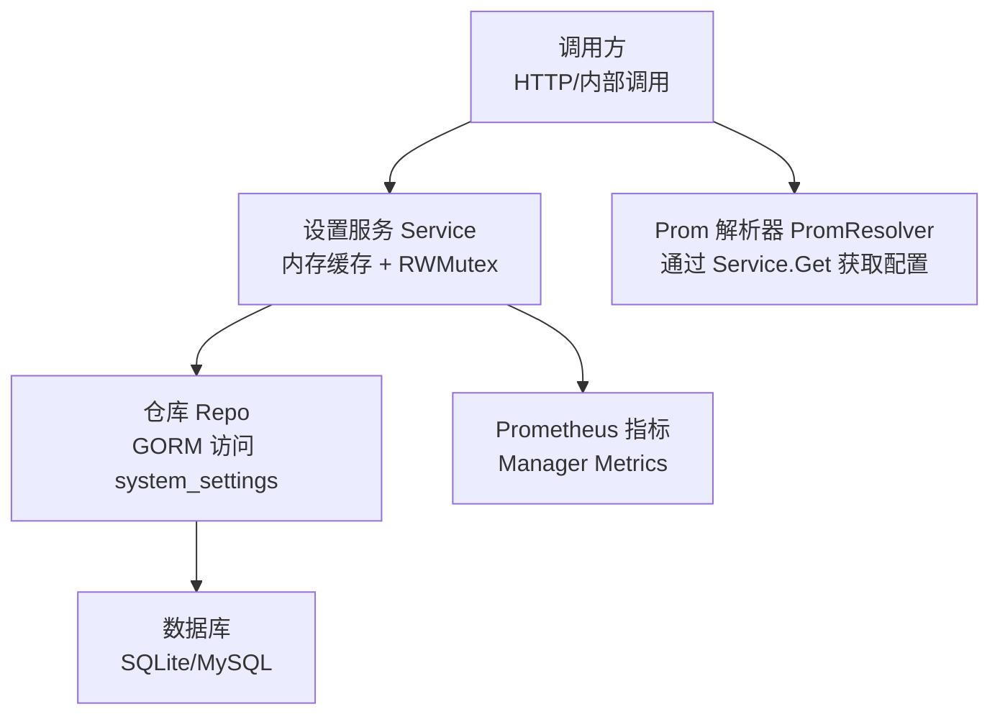
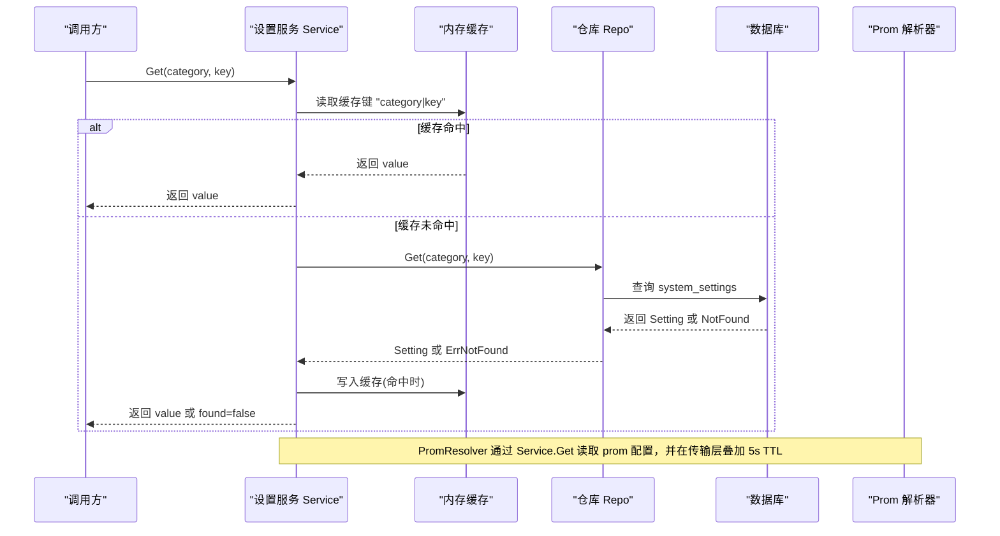
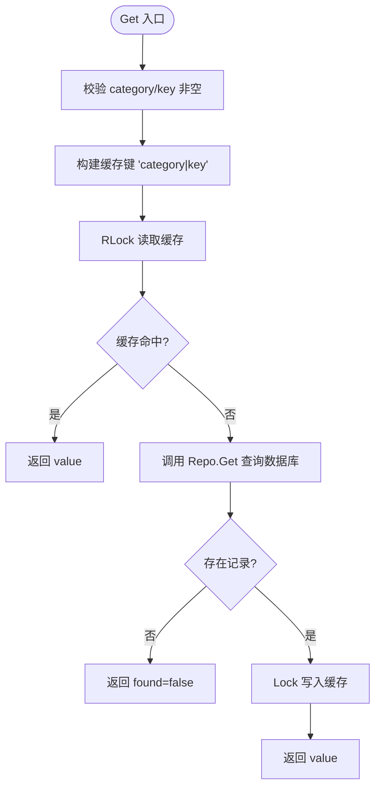
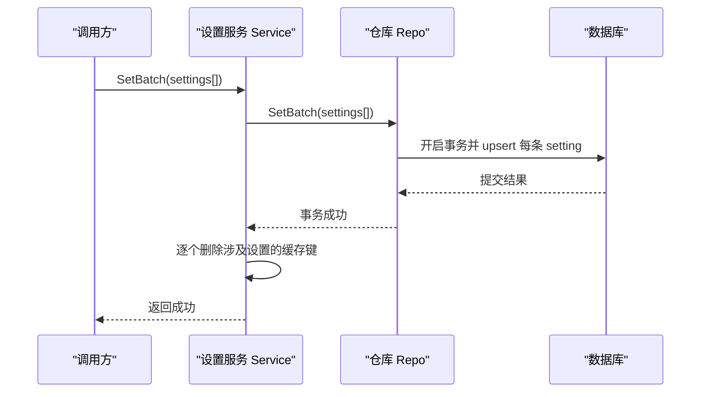
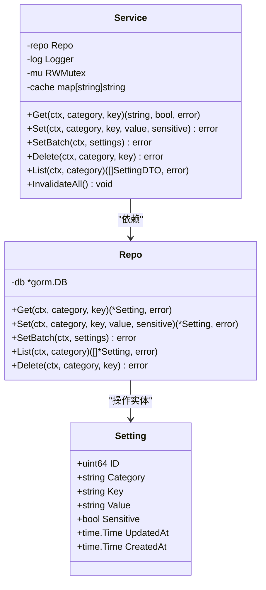

# 配置缓存机制

<cite>
**本文引用的文件**
- [internal/manager/biz/setting/service.go](file://internal/manager/biz/setting/service.go)
- [internal/manager/data/setting/store/repo.go](file://internal/manager/data/setting/store/repo.go)
- [internal/manager/model/setting/model.go](file://internal/manager/model/setting/model.go)
- [internal/manager/biz/setting/promauth.go](file://internal/manager/biz/setting/promauth.go)
- [internal/pkg/prom/manager_metrics.go](file://internal/pkg/prom/manager_metrics.go)
- [cmd/ongrid/main.go](file://cmd/ongrid/main.go)
</cite>

## 目录
1. [简介](#简介)
2. [项目结构](#项目结构)
3. [核心组件](#核心组件)
4. [架构总览](#架构总览)
5. [详细组件分析](#详细组件分析)
6. [依赖关系分析](#依赖关系分析)
7. [性能考量](#性能考量)
8. [故障排查指南](#故障排查指南)
9. [结论](#结论)
10. [附录](#附录)

## 简介
本技术文档聚焦于系统设置（system_settings）的内存缓存机制，围绕以下目标展开：
- 解释内存缓存的设计原理：缓存键生成策略、读路径与写路径的一致性保证、并发安全。
- 说明缓存失效机制：写操作后如何清理缓存条目，批量写入时的原子性与一致性。
- 给出性能优化建议：批量操作优化、缓存预热策略、热点访问模式下的行为。
- 提供监控指标与调试方法：如何通过日志与指标定位缓存相关问题。
- 列出可配置的选项与调优建议：包括敏感字段处理、默认值回退、以及外部依赖（如 Prometheus）的读取方式。
- 覆盖失效场景与恢复策略：例如数据库异常、手动修改数据后的缓存刷新。

该缓存位于管理器侧的设置服务中，用于减少高频读取对数据库的压力，同时保持与持久化层的一致性。

## 项目结构
与配置缓存直接相关的代码分布在业务服务层、数据仓库层、模型定义层以及监控注册层：
- 业务服务层：实现进程内内存缓存、读写逻辑、敏感字段掩码、批量更新与失效。
- 数据仓库层：基于 GORM 的 system_settings 表进行增删改查，支持事务性批量写入。
- 模型定义层：定义 Setting 实体、分类与键常量，明确敏感标记与时间戳。
- 监控注册层：提供统一的 Prometheus 指标注册与观测点，便于观察系统运行状态。

图表来源
- [internal/manager/biz/setting/service.go:49-106](file://internal/manager/biz/setting/service.go#L49-L106)
- [internal/manager/data/setting/store/repo.go:24-96](file://internal/manager/data/setting/store/repo.go#L24-L96)
- [internal/manager/biz/setting/promauth.go:11-40](file://internal/manager/biz/setting/promauth.go#L11-L40)
- [internal/pkg/prom/manager_metrics.go:155-317](file://internal/pkg/prom/manager_metrics.go#L155-L317)

章节来源
- [internal/manager/biz/setting/service.go:1-259](file://internal/manager/biz/setting/service.go#L1-L259)
- [internal/manager/data/setting/store/repo.go:1-129](file://internal/manager/data/setting/store/repo.go#L1-L129)
- [internal/manager/model/setting/model.go:1-246](file://internal/manager/model/setting/model.go#L1-L246)
- [internal/manager/biz/setting/promauth.go:1-40](file://internal/manager/biz/setting/promauth.go#L1-L40)
- [internal/pkg/prom/manager_metrics.go:1-532](file://internal/pkg/prom/manager_metrics.go#L1-L532)
- [cmd/ongrid/main.go:421-426](file://cmd/ongrid/main.go#L421-L426)

## 核心组件
- 设置服务 Service：进程内内存缓存，使用 map[string]string 存储“类别|键”到值的映射；通过 sync.RWMutex 保证并发安全；提供 Get/Set/SetBatch/Delete/InvalidateAll/List 等方法。
- 仓库 Repo：封装 GORM 对 system_settings 表的访问，提供 Get/Set/SetBatch/List/Delete；SetBatch 使用事务确保原子性。
- 模型 Setting：包含 ID、Category、Key、Value、Sensitive、UpdatedAt、CreatedAt；通过唯一索引 (category, key) 保证幂等写入。
- Prom 解析器 PromResolver：通过 Service.Get 读取 Prometheus 相关配置（查询 URL、远写 URL、鉴权），并叠加 5s TTL 的传输层缓存，使 UI 编辑在约 5 秒内生效。
- Manager 指标：统一注册 Prometheus 指标，暴露 HTTP 请求、LLM 调用、数据库连接池等观测点，便于监控与排障。

章节来源
- [internal/manager/biz/setting/service.go:49-106](file://internal/manager/biz/setting/service.go#L49-L106)
- [internal/manager/data/setting/store/repo.go:15-96](file://internal/manager/data/setting/store/repo.go#L15-L96)
- [internal/manager/model/setting/model.go:14-33](file://internal/manager/model/setting/model.go#L14-L33)
- [internal/manager/biz/setting/promauth.go:11-40](file://internal/manager/biz/setting/promauth.go#L11-L40)
- [internal/pkg/prom/manager_metrics.go:155-317](file://internal/pkg/prom/manager_metrics.go#L155-L317)

## 架构总览
下图展示了从调用方到数据库的完整链路，以及缓存命中与失效的关键节点：

图表来源
- [internal/manager/biz/setting/service.go:72-106](file://internal/manager/biz/setting/service.go#L72-L106)
- [internal/manager/data/setting/store/repo.go:24-41](file://internal/manager/data/setting/store/repo.go#L24-L41)
- [internal/manager/biz/setting/promauth.go:11-40](file://internal/manager/biz/setting/promauth.go#L11-L40)

## 详细组件分析

### 内存缓存设计与并发安全
- 缓存键生成策略：采用“类别|键”拼接作为缓存键，确保不同分类下的同名键不会冲突。
- 读路径：先尝试从内存缓存读取；命中则直接返回；未命中则访问仓库并从数据库加载，随后写入缓存。
- 写路径：执行 Set/SetBatch 后删除对应缓存键，确保下一次 Get 重新从数据库加载最新值。
- 并发安全：使用 sync.RWMutex，读多写少场景下 RLock 允许多个并发读，写时使用 Lock 独占。
- 列表接口 List：不直接使用内存缓存，而是从仓库读取并按敏感标记进行掩码处理，避免将敏感值泄露给 API 调用方。

图表来源
- [internal/manager/biz/setting/service.go:72-106](file://internal/manager/biz/setting/service.go#L72-L106)

章节来源
- [internal/manager/biz/setting/service.go:49-106](file://internal/manager/biz/setting/service.go#L49-L106)

### 缓存失效与一致性保证
- 单条写入 Set：成功写入数据库后立即删除对应缓存键，下次读取会重新加载。
- 批量写入 SetBatch：在数据库事务提交成功后，再逐个删除涉及的缓存键，保证“要么全部持久化，要么全部不持久化”，避免部分更新导致的不一致。
- 删除 Delete：成功删除后同样删除缓存键，防止读到已删除的值。
- 全量失效 InvalidateAll：提供清空所有缓存的方法，适用于管理员手动修改数据库后需要立即刷新的场景。

图表来源
- [internal/manager/biz/setting/service.go:133-165](file://internal/manager/biz/setting/service.go#L133-L165)
- [internal/manager/data/setting/store/repo.go:66-89](file://internal/manager/data/setting/store/repo.go#L66-L89)

章节来源
- [internal/manager/biz/setting/service.go:108-165](file://internal/manager/biz/setting/service.go#L108-L165)
- [internal/manager/data/setting/store/repo.go:66-96](file://internal/manager/data/setting/store/repo.go#L66-L96)

### 敏感字段处理与列表接口
- 列表接口 List：从仓库读取指定分类的所有设置，若敏感标记为真，则对值进行掩码处理（保留首尾若干字符并用星号填充中间）。
- 目的：避免敏感信息（如 API Key、密码）通过列表接口明文返回，仅在显式读取单个设置时返回明文。

章节来源
- [internal/manager/biz/setting/service.go:205-222](file://internal/manager/biz/setting/service.go#L205-L222)
- [internal/manager/model/setting/model.go:14-29](file://internal/manager/model/setting/model.go#L14-L29)

### 外部依赖与配置读取（Prom 解析器）
- PromResolver 通过 Service.Get 读取 Prometheus 相关配置（查询 URL、远写 URL、鉴权信息）。
- 传输层还叠加了 5s TTL 的缓存，使得 UI 编辑的配置变更在约 5 秒内传播到下游，无需重启服务。

章节来源
- [internal/manager/biz/setting/promauth.go:11-40](file://internal/manager/biz/setting/promauth.go#L11-L40)

## 依赖关系分析
- 服务层依赖仓库层：Service 通过 Repo 接口访问数据，解耦具体数据库实现。
- 仓库层依赖 GORM：使用 GORM 的上下文与事务能力，确保并发安全与事务一致性。
- 模型层提供常量与实体：Category 与 Key 常量集中管理，避免硬编码字符串带来的不一致。
- 监控层提供指标：Manager Metrics 在启动时注册，供 Prometheus 抓取，便于观察系统健康度。

图表来源
- [internal/manager/biz/setting/service.go:49-106](file://internal/manager/biz/setting/service.go#L49-L106)
- [internal/manager/data/setting/store/repo.go:15-96](file://internal/manager/data/setting/store/repo.go#L15-L96)
- [internal/manager/model/setting/model.go:14-33](file://internal/manager/model/setting/model.go#L14-L33)

章节来源
- [internal/manager/biz/setting/service.go:49-106](file://internal/manager/biz/setting/service.go#L49-L106)
- [internal/manager/data/setting/store/repo.go:15-96](file://internal/manager/data/setting/store/repo.go#L15-L96)
- [internal/manager/model/setting/model.go:14-33](file://internal/manager/model/setting/model.go#L14-L33)

## 性能考量
- 缓存命中率优化：
  - 热点键优先：由于缓存键为“类别|键”，常见 LLM 配置（如 openai_model、openai_api_key）会被频繁读取，命中率高，显著降低数据库压力。
  - 列表接口不走缓存：避免大对象缓存占用内存，且敏感值需掩码，直接从仓库读取更合适。
- 批量写入优化：
  - SetBatch 使用数据库事务，减少多次往返；成功后再批量删除缓存键，避免脏读。
- 缓存预热策略：
  - 启动时可调用 SetIfAbsent 注入环境变量导出的默认配置，避免冷启动时大量缓存未命中导致的数据库冲击。
- 并发安全：
  - RWMutex 在读多写少场景下表现良好；map 容量较小（预期 < 100 行），无需引入复杂结构。
- 外部依赖缓存：
  - PromResolver 叠加 5s TTL，平衡了配置变更的及时性与网络开销。

[本节为通用性能讨论，不直接分析具体文件]

## 故障排查指南
- 缓存未命中或延迟生效：
  - 检查是否调用了 Set/SetBatch/Delete 以触发缓存失效；确认事务提交成功后再删除缓存键。
  - 对于 Prom 配置，注意传输层 5s TTL 的影响，UI 编辑后可能需要等待短暂时间。
- 敏感值泄露风险：
  - 确认列表接口返回的是掩码后的值；如需明文，应使用 Get 接口并限制调用范围。
- 数据库异常与恢复：
  - 当仓库层返回 ErrNotFound 时，服务层将其视为“不存在”，不会写入缓存；若数据库不可用，需关注上层重试与降级策略。
  - 若管理员手动修改数据库，可调用 InvalidateAll 清空缓存，确保下次读取从数据库加载最新值。
- 监控与日志：
  - 使用 Manager Metrics 观察 HTTP 请求、数据库连接池、LLM 调用等指标，辅助定位瓶颈。
  - 服务层在设置更新时会记录日志，包含类别、键、敏感标记等信息，便于审计。

章节来源
- [internal/manager/biz/setting/service.go:108-165](file://internal/manager/biz/setting/service.go#L108-L165)
- [internal/manager/data/setting/store/repo.go:24-96](file://internal/manager/data/setting/store/repo.go#L24-L96)
- [internal/pkg/prom/manager_metrics.go:155-317](file://internal/pkg/prom/manager_metrics.go#L155-L317)
- [cmd/ongrid/main.go:421-426](file://cmd/ongrid/main.go#L421-L426)

## 结论
该配置缓存机制通过简洁的内存缓存设计、严格的缓存失效策略与并发安全保障，有效降低了高频读取对数据库的压力，同时保证了与持久化层的一致性。结合批量写入、敏感字段掩码、外部依赖的短 TTL 缓存以及完善的监控指标，系统在性能、安全性与可运维性方面达到了良好平衡。建议在部署时启用缓存预热、合理设置批量写入规模，并通过监控指标持续观察缓存命中率与数据库负载，以便及时调整策略。

[本节为总结性内容，不直接分析具体文件]

## 附录
- 配置项与分类：
  - 分类常量：llm、prom、grafana、loki、tempo、websearch、agent、platform。
  - 键常量：各分类下的 well-known 键（如 openai_api_key、query_url、root_url 等），用于统一管理配置。
- 启动流程中的指标注册：
  - 在应用启动时注册 Manager Metrics，暴露 /metrics 端点，便于 Prometheus 抓取。

章节来源
- [internal/manager/model/setting/model.go:35-246](file://internal/manager/model/setting/model.go#L35-L246)
- [cmd/ongrid/main.go:421-426](file://cmd/ongrid/main.go#L421-L426)