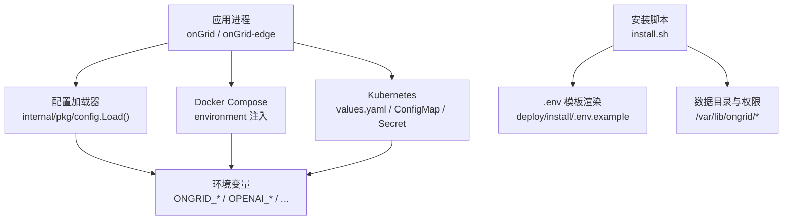
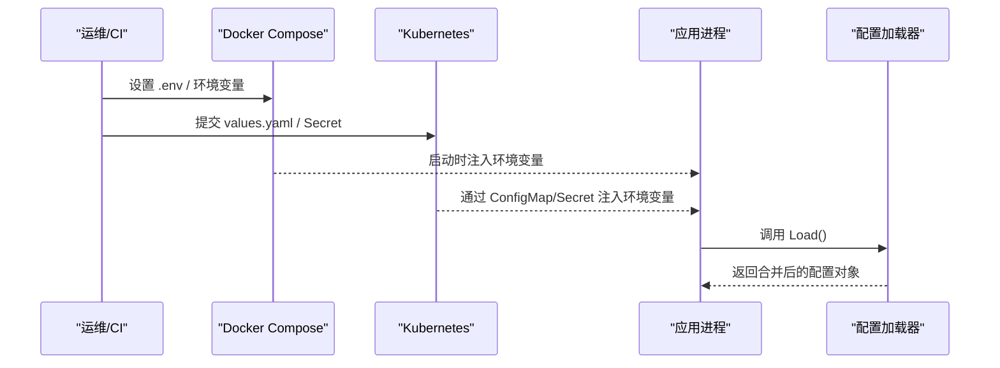
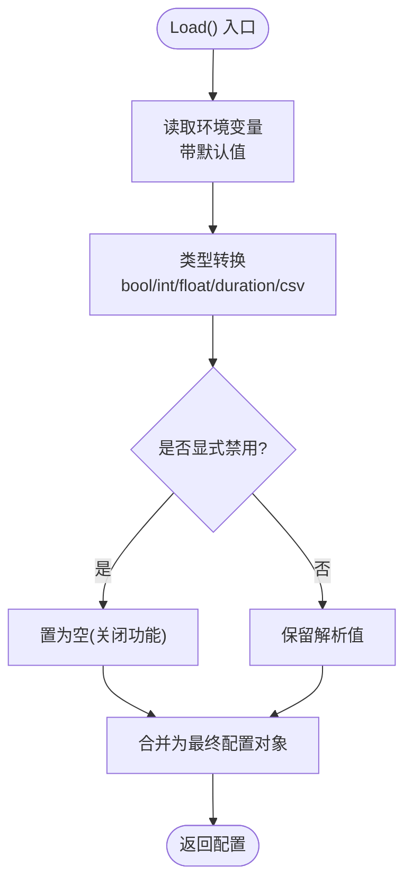
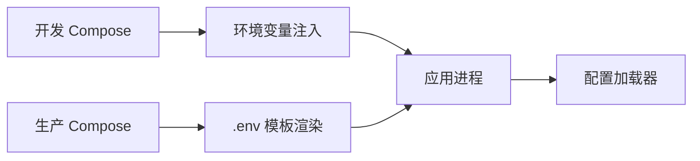
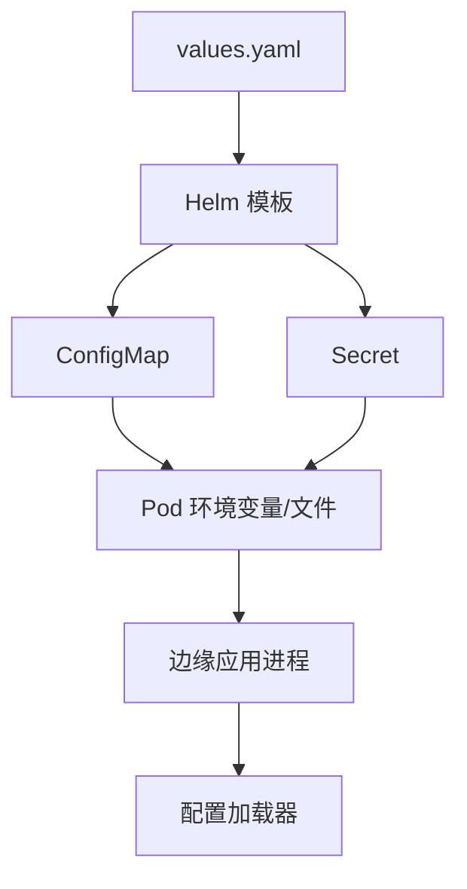
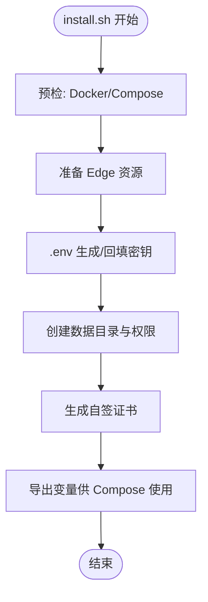
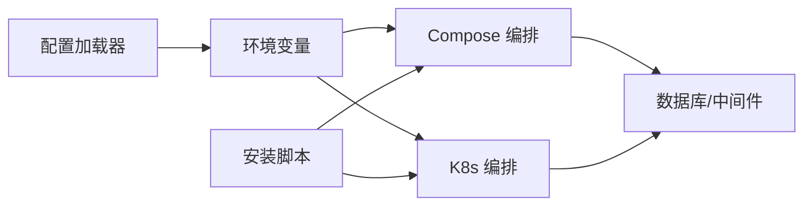

# 多环境配置管理

<cite>
**本文引用的文件**
- [internal/pkg/config/config.go](file://internal/pkg/config/config.go)
- [internal/pkg/config/config_test.go](file://internal/pkg/config/config_test.go)
- [deploy/docker-compose.yml](file://deploy/docker-compose.yml)
- [deploy/install/docker-compose.yml](file://deploy/install/docker-compose.yml)
- [deploy/Dockerfile.ongrid](file://deploy/Dockerfile.ongrid)
- [deploy/Dockerfile.ongrid-edge](file://deploy/Dockerfile.ongrid-edge)
- [deploy/kubernetes/ongrid-edge/values.yaml](file://deploy/kubernetes/ongrid-edge/values.yaml)
- [deploy/kubernetes/ongrid-edge/templates/configmap.yaml](file://deploy/kubernetes/ongrid-edge/templates/configmap.yaml)
- [deploy/install/.env.example](file://deploy/install/.env.example)
- [deploy/install/install.sh](file://deploy/install/install.sh)
</cite>

## 目录
1. [简介](#简介)
2. [项目结构](#项目结构)
3. [核心组件](#核心组件)
4. [架构总览](#架构总览)
5. [详细组件分析](#详细组件分析)
6. [依赖关系分析](#依赖关系分析)
7. [性能考虑](#性能考虑)
8. [故障排查指南](#故障排查指南)
9. [结论](#结论)
10. [附录](#附录)

## 简介
本技术文档围绕 Ongrid 的多环境配置管理，系统阐述开发、测试、生产环境的配置隔离策略与落地实践。内容覆盖环境变量管理、配置文件组织、部署脚本设计；深入说明容器化环境下的配置注入机制（Docker 环境变量、Kubernetes ConfigMap/Secret）；提供配置模板化与参数化的实现方式，支持不同环境的差异化配置；解释配置验证与一致性检查机制；给出环境切换最佳实践与自动化部署方案；并包含配置迁移与版本兼容性管理策略。

## 项目结构
Ongrid 的配置体系由“运行时配置加载器 + 编排层配置源 + 安装与部署脚本”三部分构成：
- 运行时配置加载器：Go 包 internal/pkg/config 统一从环境变量读取配置并提供默认值。
- 编排层配置源：
  - Docker Compose（本地开发与生产打包）通过 environment 块注入变量。
  - Kubernetes Helm Chart（边缘侧）通过 values.yaml、ConfigMap/Secret 注入。
- 安装与部署脚本：install.sh 负责生成 .env、准备数据目录、TLS 证书、Edge 资源等。

图表来源
- [internal/pkg/config/config.go:417-549](file://internal/pkg/config/config.go#L417-L549)
- [deploy/docker-compose.yml:55-152](file://deploy/docker-compose.yml#L55-L152)
- [deploy/install/docker-compose.yml:59-215](file://deploy/install/docker-compose.yml#L59-L215)
- [deploy/install/.env.example:1-217](file://deploy/install/.env.example#L1-L217)
- [deploy/install/install.sh:683-800](file://deploy/install/install.sh#L683-L800)

章节来源
- [internal/pkg/config/config.go:417-549](file://internal/pkg/config/config.go#L417-L549)
- [deploy/docker-compose.yml:55-152](file://deploy/docker-compose.yml#L55-L152)
- [deploy/install/docker-compose.yml:59-215](file://deploy/install/docker-compose.yml#L59-L215)
- [deploy/install/.env.example:1-217](file://deploy/install/.env.example#L1-L217)
- [deploy/install/install.sh:683-800](file://deploy/install/install.sh#L683-L800)

## 核心组件
- 配置加载器（internal/pkg/config）
  - 单一入口 Load() 聚合所有模块配置（HTTP、DB、JWT、LLM、Prometheus、Grafana、通知、告警、日志/追踪、边缘采集器等）。
  - 全部通过环境变量解析，具备强默认值与类型安全转换（字符串、布尔、整数、浮点、时长、CSV 列表）。
  - 支持显式禁用某些能力（如日志/追踪 URL 设置为 off/disabled 时返回空串）。
- 编排与环境
  - 本地开发：deploy/docker-compose.yml 直接以 environment 注入变量，便于快速迭代。
  - 生产打包：deploy/install/docker-compose.yml 将敏感项绑定到 .env，避免硬编码。
  - Kubernetes：Helm values.yaml 驱动 ConfigMap/Secret 生成，供边缘控制器/节点使用。
- 安装脚本（install.sh）
  - 生成或复用 .env，自动填充缺失的密钥（MySQL、JWT、管理员密码、PCAP 解析器密钥等）。
  - 准备数据目录与权限，确保各子服务以正确的 UID 写入。
  - 自动生成自签 TLS 证书，引导 Public URL/Tunnel 地址。

章节来源
- [internal/pkg/config/config.go:18-667](file://internal/pkg/config/config.go#L18-L667)
- [internal/pkg/config/config_test.go:8-155](file://internal/pkg/config/config_test.go#L8-L155)
- [deploy/install/install.sh:683-800](file://deploy/install/install.sh#L683-L800)

## 架构总览
下图展示多环境配置在运行时的注入路径与优先级：环境变量 > 编排层默认值 > 代码默认值。

图表来源
- [deploy/docker-compose.yml:55-152](file://deploy/docker-compose.yml#L55-L152)
- [deploy/install/docker-compose.yml:59-215](file://deploy/install/docker-compose.yml#L59-L215)
- [deploy/kubernetes/ongrid-edge/values.yaml:1-188](file://deploy/kubernetes/ongrid-edge/values.yaml#L1-L188)
- [deploy/kubernetes/ongrid-edge/templates/configmap.yaml:1-47](file://deploy/kubernetes/ongrid-edge/templates/configmap.yaml#L1-L47)
- [internal/pkg/config/config.go:417-549](file://internal/pkg/config/config.go#L417-L549)

## 详细组件分析

### 配置加载器（internal/pkg/config）
- 设计要点
  - 集中式 Load() 函数，按模块分组读取环境变量并赋予默认值。
  - 类型安全的解析工具函数：getEnvBool/getEnvInt/getEnvFloat/getEnvDuration/getEnvCSV。
  - 可选能力开关：getOptionalURL 支持 off/disabled/disable/none/null 关闭日志/追踪查询。
- 关键配置域
  - HTTP/Metrics/Tunnel 监听地址
  - DB（MySQL/SQLite）、JWT、OpenAI/多 LLM 提供商
  - Prometheus、Grafana、通知渠道（Webhook/Slack/飞书/钉钉）
  - 内置告警阈值与评估间隔
  - 日志/追踪后端 URL（Loki/Tempo）
  - 边缘采集模式（off/embedded/scrape）与抓取配置路径
- 验证与一致性
  - 单元测试覆盖默认值与覆盖行为，确保新增/修改环境变量有回归保障。
  - 对 URL 类字段提供“显式禁用”语义，避免误配导致的服务不可用。

图表来源
- [internal/pkg/config/config.go:417-549](file://internal/pkg/config/config.go#L417-L549)
- [internal/pkg/config/config.go:551-667](file://internal/pkg/config/config.go#L551-L667)

章节来源
- [internal/pkg/config/config.go:18-667](file://internal/pkg/config/config.go#L18-L667)
- [internal/pkg/config/config_test.go:8-363](file://internal/pkg/config/config_test.go#L8-L363)

### Docker 环境与 Compose 配置
- 本地开发（deploy/docker-compose.yml）
  - 通过 environment 直接注入 ONGRID_* 等变量，便于调试。
  - 暴露必要端口（metrics 9100），内部网络互通（frontier/prometheus/loki/tempo/qdrant/grafana）。
  - 使用命名卷持久化 MySQL/Prom/Grafana/Loki/Tempo/Qdrant 数据。
- 生产打包（deploy/install/docker-compose.yml）
  - 所有敏感信息来自 .env（MYSQL_ROOT_PASSWORD、MYSQL_PASSWORD、JWT_SECRET、GRAFANA_ADMIN_PASSWORD 等）。
  - 数据目录改为宿主机 bind-mount（/var/lib/ongrid/*），便于备份与替换存储介质。
  - 仅暴露 metrics 端口，API 经 nginx 反向代理与 TLS 终止。
- 镜像构建（Dockerfile）
  - ongrid：基于 debian-slim，集成 ONNX Runtime 共享库，非 root 用户运行。
  - ongrid-edge：distroless 运行时，内嵌 node_exporter/process_exporter/otelcol-contrib。

图表来源
- [deploy/docker-compose.yml:55-152](file://deploy/docker-compose.yml#L55-L152)
- [deploy/install/docker-compose.yml:59-215](file://deploy/install/docker-compose.yml#L59-L215)
- [deploy/Dockerfile.ongrid:1-159](file://deploy/Dockerfile.ongrid#L1-L159)
- [deploy/Dockerfile.ongrid-edge:1-127](file://deploy/Dockerfile.ongrid-edge#L1-L127)

章节来源
- [deploy/docker-compose.yml:1-405](file://deploy/docker-compose.yml#L1-L405)
- [deploy/install/docker-compose.yml:1-528](file://deploy/install/docker-compose.yml#L1-L528)
- [deploy/Dockerfile.ongrid:1-159](file://deploy/Dockerfile.ongrid#L1-L159)
- [deploy/Dockerfile.ongrid-edge:1-127](file://deploy/Dockerfile.ongrid-edge#L1-L127)

### Kubernetes 配置注入（Helm/ConfigMap/Secret）
- values.yaml
  - 定义边缘侧运行模式、控制器指标、独立 Scraper、Telemetry Gateway、Pod 安全上下文等。
- ConfigMap
  - 根据 values 渲染 mode、manager-public-url、manager-tunnel-addr、指标端点/超时/限制等。
- Secret
  - 用于注入凭证（如 controller/telemetry 凭据），避免明文进入镜像或配置。
- 注入方式
  - 通过 Helm 模板将 values 映射为 Pod 环境变量或挂载文件，应用进程仍通过 Load() 读取环境变量。

图表来源
- [deploy/kubernetes/ongrid-edge/values.yaml:1-188](file://deploy/kubernetes/ongrid-edge/values.yaml#L1-L188)
- [deploy/kubernetes/ongrid-edge/templates/configmap.yaml:1-47](file://deploy/kubernetes/ongrid-edge/templates/configmap.yaml#L1-L47)

章节来源
- [deploy/kubernetes/ongrid-edge/values.yaml:1-188](file://deploy/kubernetes/ongrid-edge/values.yaml#L1-L188)
- [deploy/kubernetes/ongrid-edge/templates/configmap.yaml:1-47](file://deploy/kubernetes/ongrid-edge/templates/configmap.yaml#L1-L47)

### 安装脚本与 .env 模板
- install.sh
  - 检测/安装 Docker 与 compose v2。
  - 准备 Edge 资源（下载/校验/打包），原子替换 edge 目录。
  - 创建/复用 .env，自动填充缺失密钥（MySQL/JWT/管理员/Grafana/PCAP 解析器）。
  - 生成自签 TLS 证书，推断 Public URL/Tunnel 地址。
  - 创建并授权数据目录（/var/lib/ongrid/*），按子服务 UID 设置权限。
- .env.example
  - 提供完整的环境变量清单与注释，作为生产部署的基线模板。

图表来源
- [deploy/install/install.sh:307-800](file://deploy/install/install.sh#L307-L800)
- [deploy/install/.env.example:1-217](file://deploy/install/.env.example#L1-L217)

章节来源
- [deploy/install/install.sh:1-800](file://deploy/install/install.sh#L1-L800)
- [deploy/install/.env.example:1-217](file://deploy/install/.env.example#L1-L217)

## 依赖关系分析
- 配置加载器依赖
  - 环境变量（ONGRID_*、OPENAI_*、GRAFANA_*、PROM_*、LOG/TRACE_* 等）。
  - 编排层提供的网络可达性（mysql、prometheus、loki、tempo、qdrant、grafana、frontier）。
- 编排依赖
  - Compose：服务间通过 docker network 通信，健康检查保证启动顺序。
  - Kubernetes：Helm 模板将 values 转换为 ConfigMap/Secret，并通过 Pod spec 注入。
- 安装脚本依赖
  - 外部工具：openssl、docker、curl、tar、awk 等。
  - 网络：CNB 仓库/上游发行版（edge 二进制、prometheus/loki/tempo 镜像）。

图表来源
- [internal/pkg/config/config.go:417-549](file://internal/pkg/config/config.go#L417-L549)
- [deploy/docker-compose.yml:55-152](file://deploy/docker-compose.yml#L55-L152)
- [deploy/install/docker-compose.yml:59-215](file://deploy/install/docker-compose.yml#L59-L215)
- [deploy/install/install.sh:307-800](file://deploy/install/install.sh#L307-L800)

章节来源
- [internal/pkg/config/config.go:417-549](file://internal/pkg/config/config.go#L417-L549)
- [deploy/docker-compose.yml:55-152](file://deploy/docker-compose.yml#L55-L152)
- [deploy/install/docker-compose.yml:59-215](file://deploy/install/docker-compose.yml#L59-L215)
- [deploy/install/install.sh:307-800](file://deploy/install/install.sh#L307-L800)

## 性能考虑
- 配置加载开销极低（纯内存解析），无 I/O 瓶颈。
- 编排层建议：
  - 生产环境避免将 API 端口直接暴露到宿主机，统一经 nginx 反代与 TLS 终止。
  - 合理设置指标采集间隔与批大小，避免过载（参考 values.yaml 中 metrics 相关限制）。
- 存储与缓存：
  - 数据目录 bind-mount 至宿主 SSD/NFS/iSCSI，减少容器重启带来的 IO 抖动。
  - 嵌入模型缓存（embeddings）需可写且持久化，避免重复下载。

[本节为通用指导，不直接分析具体文件]

## 故障排查指南
- 常见问题定位
  - 环境变量未生效：确认 Compose/K8s 是否正确注入；检查 Load() 默认值与覆盖逻辑。
  - 日志/追踪不可用：检查 LOG/TRACE URL 是否被显式禁用（off/disabled）或网络不可达。
  - 权限问题：install.sh 已按子服务 UID chown，若自定义镜像或 UID 变更需同步调整。
  - TLS 证书：首次安装会生成自签证书，浏览器可能告警；生产应替换为可信证书。
- 诊断步骤
  - 查看 .env 与 Compose/K8s 实际注入的环境变量。
  - 检查数据目录权限与磁盘空间。
  - 使用单元测试覆盖新变量的默认值与覆盖行为。

章节来源
- [internal/pkg/config/config_test.go:8-363](file://internal/pkg/config/config_test.go#L8-L363)
- [deploy/install/install.sh:641-800](file://deploy/install/install.sh#L641-L800)

## 结论
Ongrid 的多环境配置管理以“环境变量为中心”，结合 Compose 与 Helm 两种编排方式，实现了开发、测试、生产的清晰隔离与一致的可观测性。通过 install.sh 的模板化与自动化，降低了人工错误风险；通过配置加载器的类型安全解析与单元测试，保障了配置的健壮性与可维护性。建议在 CI/CD 中引入配置校验与差异对比，进一步降低发布风险。

[本节为总结性内容，不直接分析具体文件]

## 附录

### 环境切换最佳实践
- 开发环境
  - 使用 deploy/docker-compose.yml，直接通过 environment 注入变量，便于快速调试。
  - 启用本地嵌入模型与 Grafana 自动初始化，减少外部依赖。
- 测试环境
  - 基于生产 Compose 模板，替换 .env 中的服务地址与密钥，保持与生产一致的拓扑。
  - 使用独立的数据库与存储路径，避免污染生产数据。
- 生产环境
  - 严格使用 .env 管理密钥，禁止硬编码；通过 install.sh 生成随机密钥。
  - 使用受信任的 TLS 证书与域名，对外仅暴露必要端口。
  - 将数据目录指向高性能存储，并制定备份策略。

[本节为通用指导，不直接分析具体文件]

### 配置迁移与版本兼容性
- 数据目录迁移
  - 旧版命名卷需迁移至 bind-mount 路径（/var/lib/ongrid/*），install.sh 会提示并协助识别遗留卷。
- 环境变量演进
  - 新增变量需提供默认值与向后兼容逻辑；通过单元测试覆盖默认值与覆盖行为。
- Helm 升级
  - 使用 values.yaml 的 null 继承策略，保证升级时不破坏既有配置。
  - 利用 pre-upgrade hook 处理需要停机或状态迁移的步骤。

章节来源
- [deploy/install/install.sh:549-570](file://deploy/install/install.sh#L549-L570)
- [deploy/kubernetes/ongrid-edge/values.yaml:91-133](file://deploy/kubernetes/ongrid-edge/values.yaml#L91-L133)