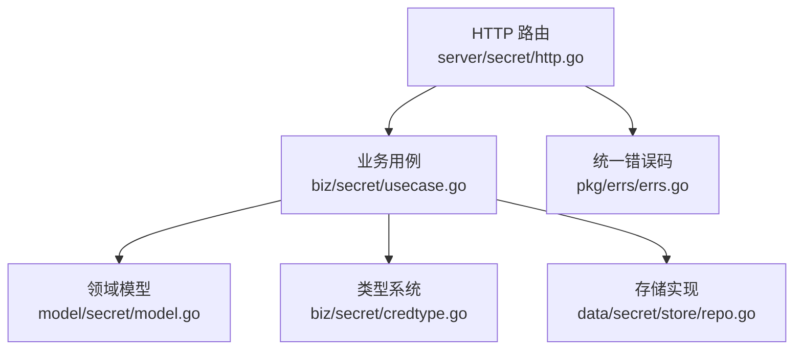
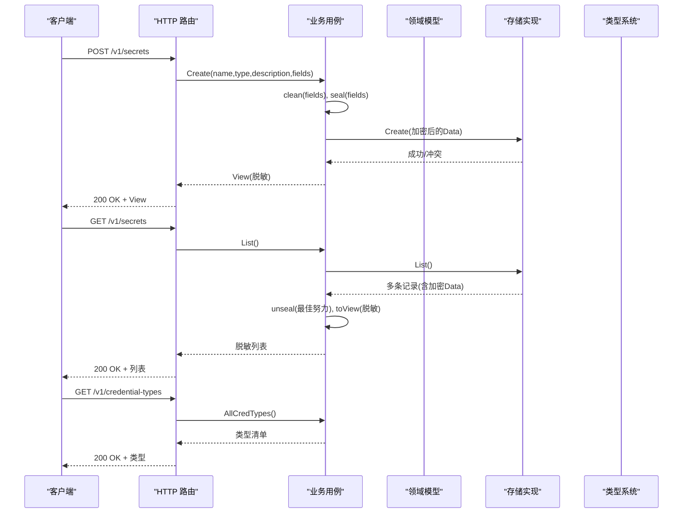
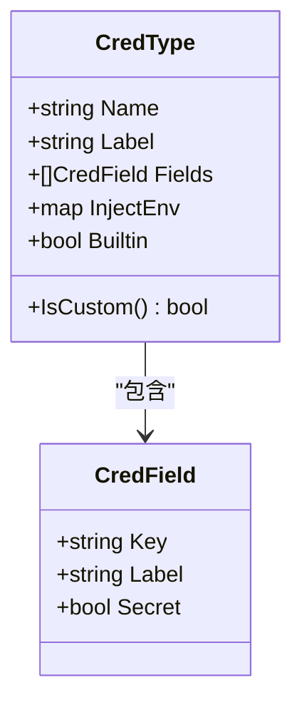
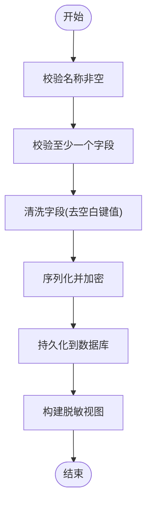
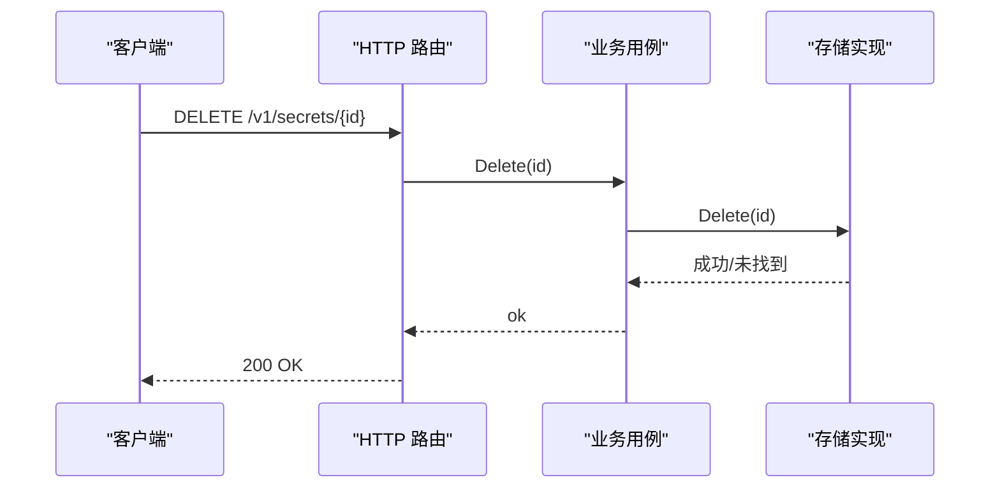
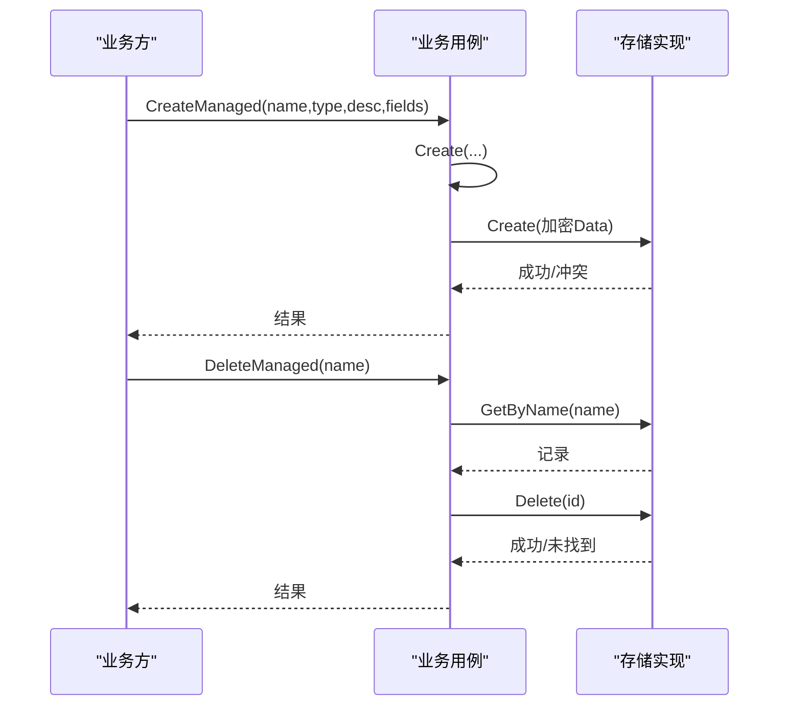
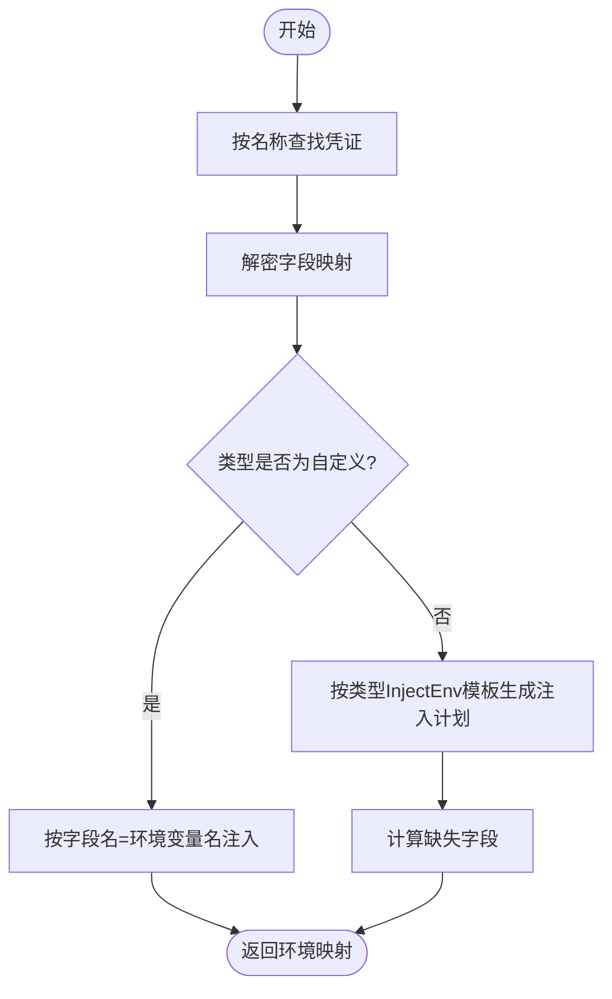
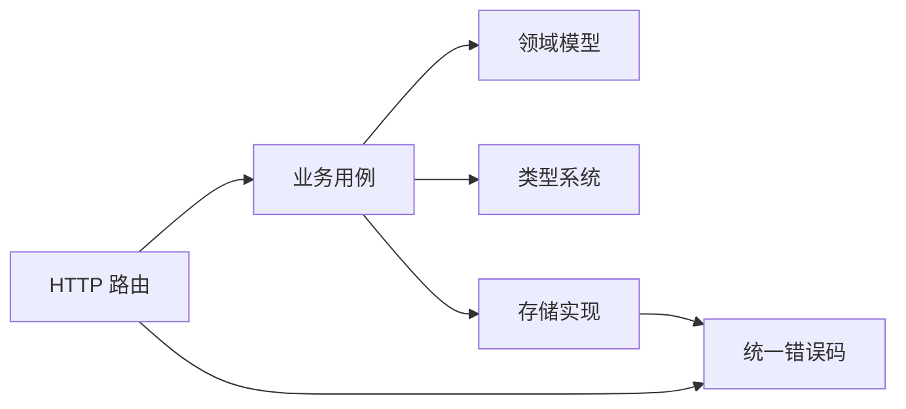

# 凭证生命周期管理

<cite>
**本文引用的文件**
- [internal/manager/biz/secret/usecase.go](file://internal/manager/biz/secret/usecase.go)
- [internal/manager/biz/secret/credtype.go](file://internal/manager/biz/secret/credtype.go)
- [internal/manager/model/secret/model.go](file://internal/manager/model/secret/model.go)
- [internal/manager/server/secret/http.go](file://internal/manager/server/secret/http.go)
- [internal/manager/data/secret/store/repo.go](file://internal/manager/data/secret/store/repo.go)
- [internal/pkg/errs/errs.go](file://internal/pkg/errs/errs.go)
- [tests/e2e/credentials_test.go](file://tests/e2e/credentials_test.go)
</cite>

## 目录
1. [简介](#简介)
2. [项目结构](#项目结构)
3. [核心组件](#核心组件)
4. [架构总览](#架构总览)
5. [详细组件分析](#详细组件分析)
6. [依赖关系分析](#依赖关系分析)
7. [性能与一致性](#性能与一致性)
8. [故障排查指南](#故障排查指南)
9. [结论](#结论)
10. [附录：API 接口与使用示例](#附录api-接口与使用示例)

## 简介
本技术文档围绕“凭证（Credential）”的完整生命周期展开，覆盖创建、更新、删除以及 CreateManaged/DeleteManaged 等特殊场景；解释凭证类型系统（内置类型与自定义类型的区别与适用场景）；说明按名称查找与字段映射解析；阐述清理策略与数据持久化方案；提供完整的 API 接口说明与使用示例；并给出错误处理与异常情况的应对策略。

## 项目结构
凭证能力由四层构成：HTTP 路由层、业务用例层、领域模型层、存储实现层。类型系统独立定义，供 UI 渲染与注入规则复用。

**图表来源**
- [internal/manager/server/secret/http.go:27-33](file://internal/manager/server/secret/http.go#L27-L33)
- [internal/manager/biz/secret/usecase.go:21-46](file://internal/manager/biz/secret/usecase.go#L21-L46)
- [internal/manager/model/secret/model.go:17-45](file://internal/manager/model/secret/model.go#L17-L45)
- [internal/manager/biz/secret/credtype.go:16-63](file://internal/manager/biz/secret/credtype.go#L16-L63)
- [internal/manager/data/secret/store/repo.go:18-88](file://internal/manager/data/secret/store/repo.go#L18-L88)
- [internal/pkg/errs/errs.go:12-26](file://internal/pkg/errs/errs.go#L12-L26)

**章节来源**
- [internal/manager/server/secret/http.go:27-33](file://internal/manager/server/secret/http.go#L27-L33)
- [internal/manager/biz/secret/usecase.go:21-46](file://internal/manager/biz/secret/usecase.go#L21-L46)
- [internal/manager/model/secret/model.go:17-45](file://internal/manager/model/secret/model.go#L17-L45)
- [internal/manager/biz/secret/credtype.go:16-63](file://internal/manager/biz/secret/credtype.go#L16-L63)
- [internal/manager/data/secret/store/repo.go:18-88](file://internal/manager/data/secret/store/repo.go#L18-L88)
- [internal/pkg/errs/errs.go:12-26](file://internal/pkg/errs/errs.go#L12-L26)

## 核心组件
- HTTP 路由与鉴权：仅管理员可访问，列表返回脱敏视图（仅字段名，不返回值）。
- 业务用例：负责加密/解密、字段清洗、类型解析、注入计划生成、受管凭证实例的生命周期。
- 领域模型：凭证实体包含唯一名称、类型、加密后的字段数据、描述与时间戳。
- 存储实现：基于 GORM 的增删改查，按名称查询用于注入路径。
- 类型系统：声明字段结构与注入规则，支持内置与自定义类型。

**章节来源**
- [internal/manager/server/secret/http.go:27-33](file://internal/manager/server/secret/http.go#L27-L33)
- [internal/manager/biz/secret/usecase.go:48-175](file://internal/manager/biz/secret/usecase.go#L48-L175)
- [internal/manager/model/secret/model.go:17-45](file://internal/manager/model/secret/model.go#L17-L45)
- [internal/manager/data/secret/store/repo.go:24-88](file://internal/manager/data/secret/store/repo.go#L24-L88)
- [internal/manager/biz/secret/credtype.go:16-63](file://internal/manager/biz/secret/credtype.go#L16-L63)

## 架构总览
凭证从创建到使用的端到端流程如下：

**图表来源**
- [internal/manager/server/secret/http.go:27-42](file://internal/manager/server/secret/http.go#L27-L42)
- [internal/manager/biz/secret/usecase.go:48-72](file://internal/manager/biz/secret/usecase.go#L48-L72)
- [internal/manager/biz/secret/usecase.go:123-135](file://internal/manager/biz/secret/usecase.go#L123-L135)
- [internal/manager/data/secret/store/repo.go:24-75](file://internal/manager/data/secret/store/repo.go#L24-L75)
- [internal/manager/biz/secret/credtype.go:56-63](file://internal/manager/biz/secret/credtype.go#L56-L63)

## 详细组件分析

### 凭证类型系统
- 类型定义：每个类型声明字段结构（键、标签、是否敏感）与注入规则（环境变量映射模板）。
- 内置类型：腾讯云、AWS、阿里云、GitHub、Elasticsearch、SNMP 等，均通过注册表集中管理。
- 自定义类型：名为 “custom”，无固定字段与注入规则，所有字段将按同名环境变量注入。
- 查找与回退：未知类型会回退为 “custom”，确保未声明类型的凭证仍可注入。

**图表来源**
- [internal/manager/biz/secret/credtype.go:16-35](file://internal/manager/biz/secret/credtype.go#L16-L35)
- [internal/manager/biz/secret/credtype.go:37-63](file://internal/manager/biz/secret/credtype.go#L37-L63)

**章节来源**
- [internal/manager/biz/secret/credtype.go:16-136](file://internal/manager/biz/secret/credtype.go#L16-L136)

### 创建与更新
- 创建：校验名称与至少一个字段；空类型默认视为 “custom”；对字段进行清洗后加密存储；返回列表视图（脱敏）。
- 更新：可选择仅更新描述或同时更新字段；若更新字段则重新清洗并加密；不存在时返回未找到。

**图表来源**
- [internal/manager/biz/secret/usecase.go:48-72](file://internal/manager/biz/secret/usecase.go#L48-L72)
- [internal/manager/biz/secret/usecase.go:74-89](file://internal/manager/biz/secret/usecase.go#L74-L89)
- [internal/manager/data/secret/store/repo.go:24-53](file://internal/manager/data/secret/store/repo.go#L24-L53)

**章节来源**
- [internal/manager/biz/secret/usecase.go:48-89](file://internal/manager/biz/secret/usecase.go#L48-L89)
- [internal/manager/data/secret/store/repo.go:24-53](file://internal/manager/data/secret/store/repo.go#L24-L53)

### 删除
- 按 ID 删除：调用存储层删除，不存在返回未找到。
- 受管实例删除：按不可变名称查找并删除，用于补偿配置保存失败时的临时凭证实例。

**图表来源**
- [internal/manager/server/secret/http.go:102-116](file://internal/manager/server/secret/http.go#L102-L116)
- [internal/manager/biz/secret/usecase.go:120-121](file://internal/manager/biz/secret/usecase.go#L120-L121)
- [internal/manager/data/secret/store/repo.go:55-65](file://internal/manager/data/secret/store/repo.go#L55-L65)

**章节来源**
- [internal/manager/server/secret/http.go:102-116](file://internal/manager/server/secret/http.go#L102-L116)
- [internal/manager/biz/secret/usecase.go:120-121](file://internal/manager/biz/secret/usecase.go#L120-L121)
- [internal/manager/data/secret/store/repo.go:55-65](file://internal/manager/data/secret/store/repo.go#L55-L65)

### CreateManaged 与 DeleteManaged（特殊场景）
- CreateManaged：用于产品表单直接接收写-only 秘密的场景，每次旋转应生成新名称，避免失败配置修改在用凭证。
- DeleteManaged：在拥有者配置保存失败且尚未持久化引用时，作为补偿删除该临时凭证实例。

**图表来源**
- [internal/manager/biz/secret/usecase.go:91-118](file://internal/manager/biz/secret/usecase.go#L91-L118)
- [internal/manager/data/secret/store/repo.go:24-88](file://internal/manager/data/secret/store/repo.go#L24-L88)

**章节来源**
- [internal/manager/biz/secret/usecase.go:91-118](file://internal/manager/biz/secret/usecase.go#L91-L118)

### 查找与解析机制
- 按名称查找：注入路径通过名称获取加密数据并解密，返回列表视图不包含值。
- 字段映射：
  - ResolveFields：返回解密后的字段映射，仅供进程内注入使用。
  - ResolveInjection：根据类型注入规则生成环境变量映射；自定义类型将每个字段作为同名环境变量注入；缺失字段会返回缺失列表。

**图表来源**
- [internal/manager/biz/secret/usecase.go:137-175](file://internal/manager/biz/secret/usecase.go#L137-L175)
- [internal/manager/biz/secret/credtype.go:47-63](file://internal/manager/biz/secret/credtype.go#L47-L63)

**章节来源**
- [internal/manager/biz/secret/usecase.go:137-175](file://internal/manager/biz/secret/usecase.go#L137-L175)
- [internal/manager/biz/secret/credtype.go:47-63](file://internal/manager/biz/secret/credtype.go#L47-L63)

### 版本管理与变更历史追踪
- 当前设计：凭证实体包含 CreatedAt/UpdatedAt 时间戳，但不维护显式版本字段或变更历史表。
- 建议实践：如需审计与回滚，可在上层引入版本号与变更记录（例如新增 version 字段与 history 表），或在外部审计系统中记录变更事件。

[本节为概念性说明，不直接分析具体文件]

### 清理策略与数据持久化
- 清理策略：删除操作为硬删除；列表与查询不会返回敏感值；受管实例需在使用失败时及时清理。
- 持久化方案：字段以 JSON 形式经 AES-GCM 加密后存储于数据库；列表读取时采用“最佳努力”解密，即使解密失败也返回脱敏元数据。

**章节来源**
- [internal/manager/model/secret/model.go:17-45](file://internal/manager/model/secret/model.go#L17-L45)
- [internal/manager/biz/secret/usecase.go:123-135](file://internal/manager/biz/secret/usecase.go#L123-L135)
- [internal/manager/data/secret/store/repo.go:24-88](file://internal/manager/data/secret/store/repo.go#L24-L88)

## 依赖关系分析
- HTTP 路由依赖业务用例与统一错误码。
- 业务用例依赖领域模型、类型系统与存储实现。
- 存储实现依赖 GORM 与统一错误码。

**图表来源**
- [internal/manager/server/secret/http.go:27-33](file://internal/manager/server/secret/http.go#L27-L33)
- [internal/manager/biz/secret/usecase.go:21-46](file://internal/manager/biz/secret/usecase.go#L21-L46)
- [internal/manager/data/secret/store/repo.go:18-88](file://internal/manager/data/secret/store/repo.go#L18-L88)
- [internal/pkg/errs/errs.go:12-26](file://internal/pkg/errs/errs.go#L12-L26)

**章节来源**
- [internal/manager/server/secret/http.go:27-33](file://internal/manager/server/secret/http.go#L27-L33)
- [internal/manager/biz/secret/usecase.go:21-46](file://internal/manager/biz/secret/usecase.go#L21-L46)
- [internal/manager/data/secret/store/repo.go:18-88](file://internal/manager/data/secret/store/repo.go#L18-L88)
- [internal/pkg/errs/errs.go:12-26](file://internal/pkg/errs/errs.go#L12-L26)

## 性能与一致性
- 加密/解密开销：每次写入与注入路径涉及 JSON 编解码与对称加密，建议在高频路径中缓存解密结果（进程内）以减少重复解密。
- 列表性能：列表返回脱敏视图，解密失败仍返回元数据，保证可用性；可按需分页或过滤以提升大规模场景性能。
- 一致性：存储层按名称唯一约束防止重复；更新与删除操作在单条记录上执行，事务边界由上层控制。

[本节提供通用指导，不直接分析具体文件]

## 故障排查指南
- 常见错误与状态码：
  - 未授权/禁止：请求缺少管理员权限。
  - 未找到：凭证不存在或更新/删除目标不存在。
  - 冲突：创建时名称重复。
  - 无效参数：缺少必要字段或字段为空。
- 定位步骤：
  - 检查 HTTP 响应中的 error/code 字段。
  - 确认管理员身份与会话上下文。
  - 验证名称唯一性与字段完整性。
  - 对于注入失败，检查类型与字段映射是否匹配。

**章节来源**
- [internal/manager/server/secret/http.go:156-171](file://internal/manager/server/secret/http.go#L156-L171)
- [internal/pkg/errs/errs.go:12-26](file://internal/pkg/errs/errs.go#L12-L26)

## 结论
凭证系统通过类型化的字段与注入规则实现了灵活而安全的凭据管理；列表与查询严格脱敏，保障安全；CreateManaged/DeleteManaged 为产品集成提供了可靠的临时凭证实例管理能力；结合加密存储与统一的错误码体系，具备良好的一致性与可观测性。未来可引入版本与变更历史以满足更严格的审计需求。

[本节为总结性内容，不直接分析具体文件]

## 附录：API 接口与使用示例

### 接口总览
- 获取凭证类型：GET /v1/credential-types
- 列出凭证：GET /v1/secrets
- 创建凭证：POST /v1/secrets
- 更新凭证：PUT /v1/secrets/{id}
- 删除凭证：DELETE /v1/secrets/{id}

所有接口均需管理员权限；列表返回脱敏视图（包含字段名，不含值）。

**章节来源**
- [internal/manager/server/secret/http.go:27-33](file://internal/manager/server/secret/http.go#L27-L33)
- [internal/manager/server/secret/http.go:44-116](file://internal/manager/server/secret/http.go#L44-L116)

### 创建凭证
- 方法：POST /v1/secrets
- 请求体字段：name、type、description、fields
- 行为：校验必填项，清洗并加密字段，存储后返回脱敏视图

**章节来源**
- [internal/manager/server/secret/http.go:56-76](file://internal/manager/server/secret/http.go#L56-L76)
- [internal/manager/biz/secret/usecase.go:48-72](file://internal/manager/biz/secret/usecase.go#L48-L72)

### 更新凭证
- 方法：PUT /v1/secrets/{id}
- 请求体字段：description、fields（可选）
- 行为：仅更新描述或同时更新字段；字段更新需重新加密

**章节来源**
- [internal/manager/server/secret/http.go:78-100](file://internal/manager/server/secret/http.go#L78-L100)
- [internal/manager/biz/secret/usecase.go:74-89](file://internal/manager/biz/secret/usecase.go#L74-L89)

### 删除凭证
- 方法：DELETE /v1/secrets/{id}
- 行为：按 ID 删除，不存在返回未找到

**章节来源**
- [internal/manager/server/secret/http.go:102-116](file://internal/manager/server/secret/http.go#L102-L116)
- [internal/manager/data/secret/store/repo.go:55-65](file://internal/manager/data/secret/store/repo.go#L55-L65)

### 获取凭证类型
- 方法：GET /v1/credential-types
- 行为：返回内置与自定义类型清单，供前端渲染表单

**章节来源**
- [internal/manager/server/secret/http.go:35-42](file://internal/manager/server/secret/http.go#L35-L42)
- [internal/manager/biz/secret/credtype.go:56-63](file://internal/manager/biz/secret/credtype.go#L56-L63)

### 使用示例（端到端测试参考）
- 认证：先登录获取管理员令牌。
- 创建：POST /api/v1/secrets，提交 name/type/description/fields。
- 列表：GET /api/v1/secrets，验证返回包含 field_keys 且不泄露 value。
- 类型：GET /api/v1/credential-types，验证包含 custom 等类型。

**章节来源**
- [tests/e2e/credentials_test.go:22-77](file://tests/e2e/credentials_test.go#L22-L77)