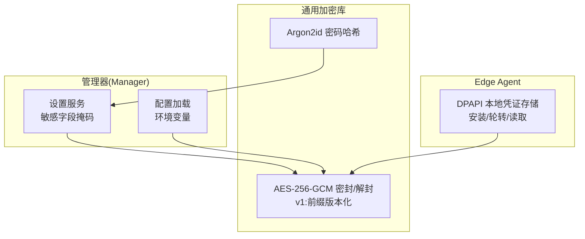
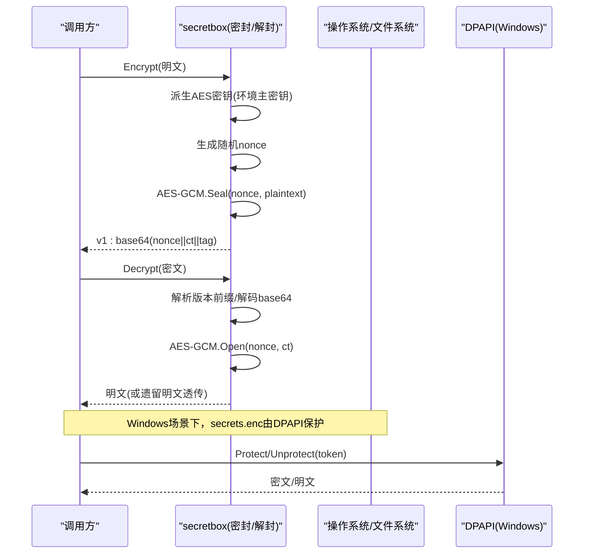
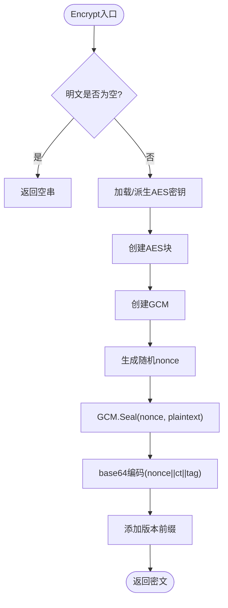
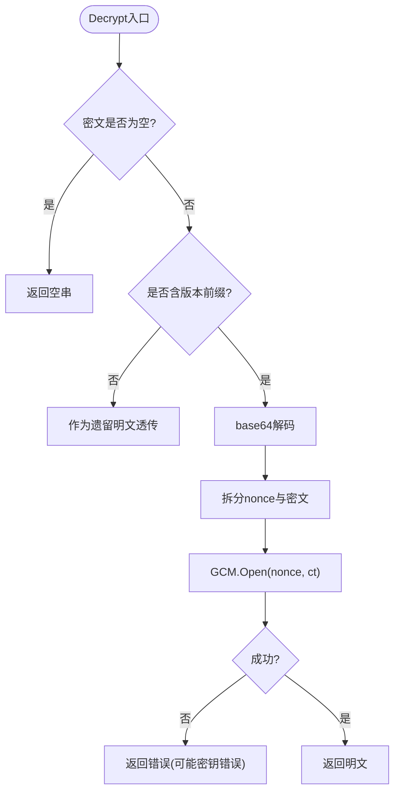
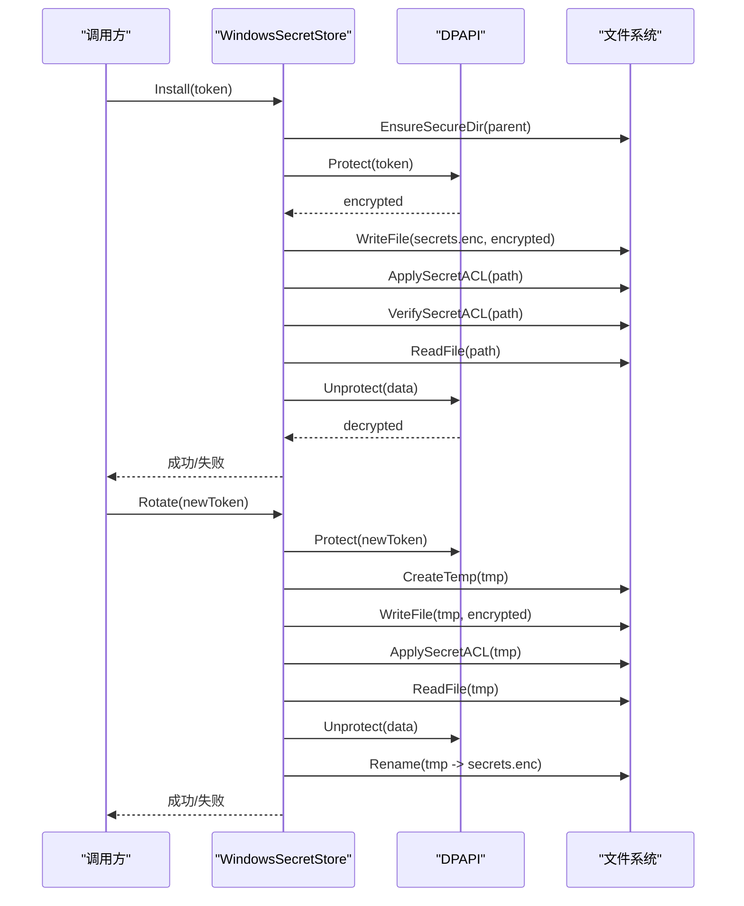
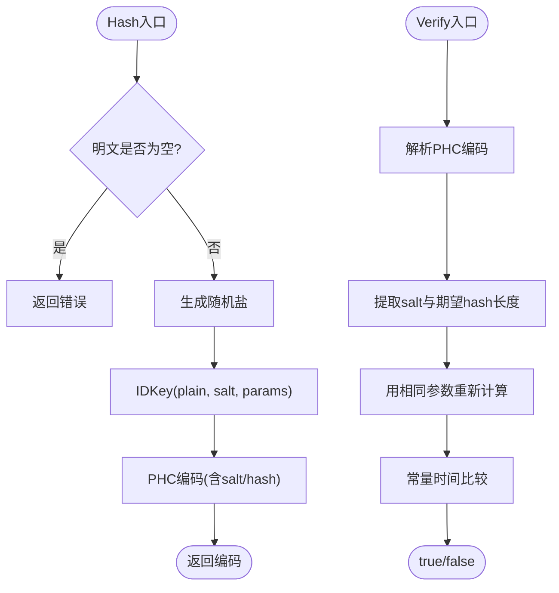
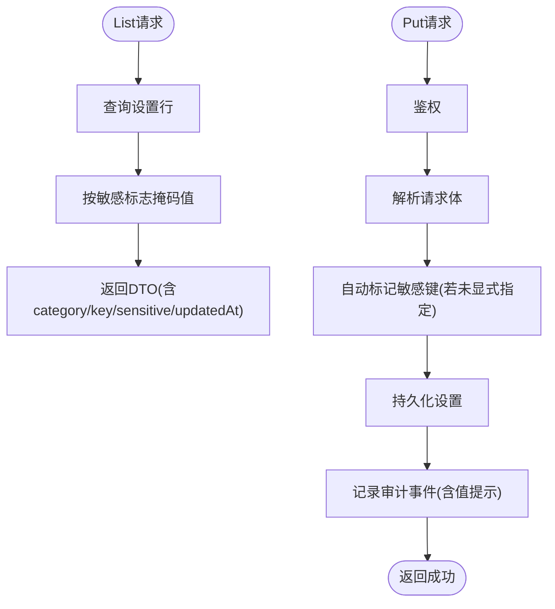
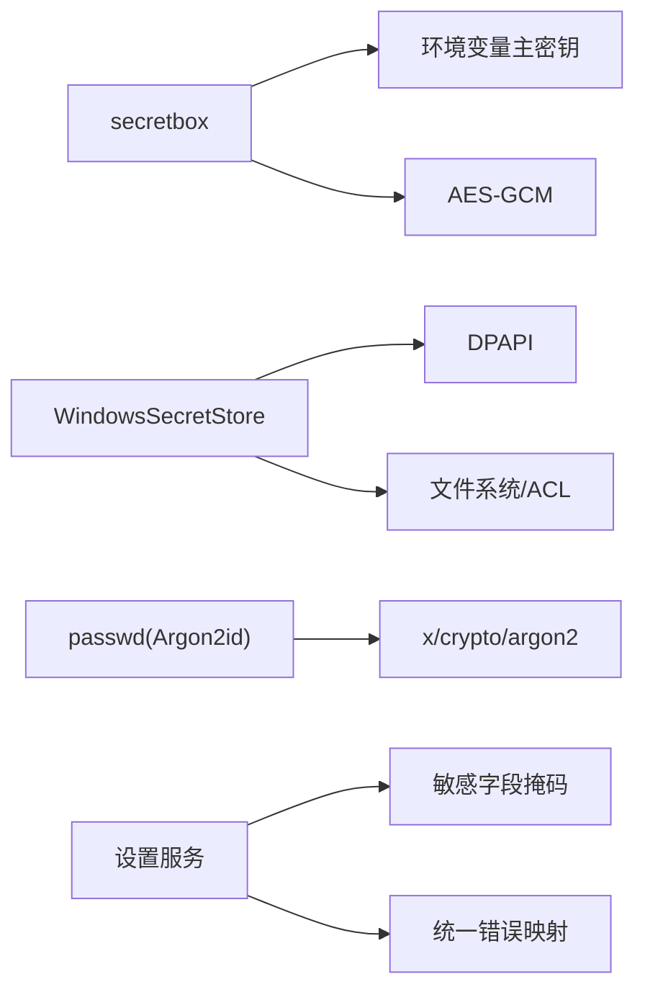

# 加密存储机制

<cite>
**本文引用的文件**
- [internal/pkg/secretbox/secretbox.go](file://internal/pkg/secretbox/secretbox.go)
- [internal/pkg/secretbox/secretbox_test.go](file://internal/pkg/secretbox/secretbox_test.go)
- [internal/edgeagent/config/secrets.go](file://internal/edgeagent/config/secrets.go)
- [internal/edgeagent/install/secrets_windows.go](file://internal/edgeagent/install/secrets_windows.go)
- [internal/pkg/passwd/argon2.go](file://internal/pkg/passwd/argon2.go)
- [internal/pkg/passwd/argon2_test.go](file://internal/pkg/passwd/argon2_test.go)
- [internal/pkg/config/config.go](file://internal/pkg/config/config.go)
- [internal/manager/biz/setting/service.go](file://internal/manager/biz/setting/service.go)
- [internal/manager/server/setting/http.go](file://internal/manager/server/setting/http.go)
- [internal/pkg/errs/errs.go](file://internal/pkg/errs/errs.go)
</cite>

## 目录
1. [简介](#简介)
2. [项目结构](#项目结构)
3. [核心组件](#核心组件)
4. [架构总览](#架构总览)
5. [详细组件分析](#详细组件分析)
6. [依赖关系分析](#依赖关系分析)
7. [性能考量](#性能考量)
8. [故障排查指南](#故障排查指南)
9. [结论](#结论)
10. [附录](#附录)

## 简介
本技术文档聚焦于系统中的“密钥与敏感数据”的加密存储机制，覆盖以下主题：
- 对称加密算法选择与实现原理（AES-GCM）
- 密钥派生与管理（主密钥、盐值、迭代次数）
- 数据密封（seal）与解封（unseal）流程（JSON序列化、加密处理、错误处理）
- 字段级加密策略与安全边界
- 配置选项与性能优化建议
- 安全最佳实践与常见攻击防护

该机制确保数据库转储或文件泄露不会直接暴露明文敏感信息，同时提供向后兼容的迁移路径。

## 项目结构
与加密存储相关的代码主要分布在以下模块：
- 通用加密库：用于应用层敏感字段的 AES-256-GCM 加解密
- Edge Agent 侧本地凭证存储：Windows DPAPI 封装与安装/轮转流程
- 密码哈希：Argon2id 用户密码哈希与校验
- 配置加载：环境变量驱动的运行时配置（含安全相关开关）
- 设置服务：敏感字段列表返回时的掩码策略与审计提示

图表来源
- [internal/pkg/secretbox/secretbox.go:1-110](file://internal/pkg/secretbox/secretbox.go#L1-L110)
- [internal/edgeagent/config/secrets.go:1-39](file://internal/edgeagent/config/secrets.go#L1-L39)
- [internal/edgeagent/install/secrets_windows.go:1-170](file://internal/edgeagent/install/secrets_windows.go#L1-L170)
- [internal/pkg/passwd/argon2.go:1-79](file://internal/pkg/passwd/argon2.go#L1-L79)
- [internal/manager/biz/setting/service.go:205-258](file://internal/manager/biz/setting/service.go#L205-L258)
- [internal/pkg/config/config.go:417-549](file://internal/pkg/config/config.go#L417-L549)

章节来源
- [internal/pkg/secretbox/secretbox.go:1-110](file://internal/pkg/secretbox/secretbox.go#L1-L110)
- [internal/edgeagent/config/secrets.go:1-39](file://internal/edgeagent/config/secrets.go#L1-L39)
- [internal/edgeagent/install/secrets_windows.go:1-170](file://internal/edgeagent/install/secrets_windows.go#L1-L170)
- [internal/pkg/passwd/argon2.go:1-79](file://internal/pkg/passwd/argon2.go#L1-L79)
- [internal/manager/biz/setting/service.go:205-258](file://internal/manager/biz/setting/service.go#L205-L258)
- [internal/pkg/config/config.go:417-549](file://internal/pkg/config/config.go#L417-L549)

## 核心组件
- AES-256-GCM 密封/解封库
  - 使用环境主密钥派生的 32 字节 AES 密钥
  - 密文格式带版本前缀，便于未来方案演进
  - 支持遗留明文数据的透明读取（迁移期）
- Windows DPAPI 本地凭证存储
  - 通过系统 API 保护 secrets.enc
  - 安装/轮转包含 ACL 强制与 round-trip 验证
- Argon2id 密码哈希
  - 随机盐、参数嵌入编码、常量时间比较
- 设置服务敏感字段掩码
  - 列表响应时对敏感值进行掩码，避免 UI 泄露
- 配置加载
  - 集中从环境变量加载运行参数，包括安全相关项

章节来源
- [internal/pkg/secretbox/secretbox.go:1-110](file://internal/pkg/secretbox/secretbox.go#L1-L110)
- [internal/edgeagent/install/secrets_windows.go:1-170](file://internal/edgeagent/install/secrets_windows.go#L1-L170)
- [internal/pkg/passwd/argon2.go:1-79](file://internal/pkg/passwd/argon2.go#L1-L79)
- [internal/manager/biz/setting/service.go:205-258](file://internal/manager/biz/setting/service.go#L205-L258)
- [internal/pkg/config/config.go:417-549](file://internal/pkg/config/config.go#L417-L549)

## 架构总览
整体加密存储架构围绕“密钥外置、字段级加密、平台原生保护、渐进式迁移”展开：
- 主密钥来自环境变量，不入库；数据库仅保存密文
- 每个敏感字段独立加密，支持空值保持为空
- 密文带版本前缀，便于后续升级加密方案
- Windows 平台使用 DPAPI 保护本地凭证文件，并配合严格的 ACL
- 密码采用 Argon2id 哈希，防止离线爆破

图表来源
- [internal/pkg/secretbox/secretbox.go:31-109](file://internal/pkg/secretbox/secretbox.go#L31-L109)
- [internal/edgeagent/install/secrets_windows.go:36-86](file://internal/edgeagent/install/secrets_windows.go#L36-L86)
- [internal/edgeagent/config/secrets.go:21-38](file://internal/edgeagent/config/secrets.go#L21-L38)

## 详细组件分析

### AES-256-GCM 密封/解封（secretbox）
- 算法与模式
  - AES-256 + GCM 认证加密，提供机密性与完整性
- 密钥管理
  - 从环境变量主密钥派生 32 字节 AES 密钥（SHA-256）
  - 未设置主密钥时使用固定回退值，并提供弱密钥检测
- 密文格式
  - 版本前缀 + base64(nonce || ciphertext+tag)
  - 空输入保持空字符串，避免无意义噪声
- 迁移兼容
  - 无前缀的旧明文在解封时原样返回，支持向前迁移
- 错误处理
  - base64 解码失败、密文过短、GCM 打开失败等均有明确错误

图表来源
- [internal/pkg/secretbox/secretbox.go:53-75](file://internal/pkg/secretbox/secretbox.go#L53-L75)

图表来源
- [internal/pkg/secretbox/secretbox.go:77-109](file://internal/pkg/secretbox/secretbox.go#L77-L109)

章节来源
- [internal/pkg/secretbox/secretbox.go:1-110](file://internal/pkg/secretbox/secretbox.go#L1-L110)
- [internal/pkg/secretbox/secretbox_test.go:1-30](file://internal/pkg/secretbox/secretbox_test.go#L1-L30)

### Windows DPAPI 本地凭证存储
- 目标
  - 在 Windows 上以系统能力保护本地 secrets.enc 文件
- 安装流程
  - 确保父目录ACL受限（SYSTEM/管理员）
  - DPAPI 加密 token 后写入文件
  - 显式应用/验证ACL，并进行 round-trip 验证
  - 失败时清理临时文件，避免残留明文窗口
- 轮转流程
  - 原子替换：先写临时文件，再重命名到最终路径
  - 临时文件继承父目录ACL，降低明文暴露面
  - 轮转完成后再次验证ACL（失败仅告警，因新token已生效）
- 读取流程
  - 读取文件并通过 DPAPI 解密，空结果视为错误

图表来源
- [internal/edgeagent/install/secrets_windows.go:36-169](file://internal/edgeagent/install/secrets_windows.go#L36-L169)
- [internal/edgeagent/config/secrets.go:21-38](file://internal/edgeagent/config/secrets.go#L21-L38)

章节来源
- [internal/edgeagent/install/secrets_windows.go:1-170](file://internal/edgeagent/install/secrets_windows.go#L1-L170)
- [internal/edgeagent/config/secrets.go:1-39](file://internal/edgeagent/config/secrets.go#L1-L39)

### Argon2id 密码哈希
- 算法与参数
  - Argon2id，内存、时间、并行度参数可调
  - 随机盐，参数随编码输出，便于未来调整而不破坏历史
- 安全性
  - 常量时间比较，避免时序侧信道
  - 拒绝无效编码或版本不匹配
- 用途
  - 用户密码等需要抗爆破的场景

图表来源
- [internal/pkg/passwd/argon2.go:26-78](file://internal/pkg/passwd/argon2.go#L26-L78)

章节来源
- [internal/pkg/passwd/argon2.go:1-79](file://internal/pkg/passwd/argon2.go#L1-L79)
- [internal/pkg/passwd/argon2_test.go:1-50](file://internal/pkg/passwd/argon2_test.go#L1-L50)

### 设置服务中的敏感字段掩码与审计
- 列表响应掩码
  - 对敏感字段按规则掩码（保留首尾若干字符，中间用占位符）
  - 短值可完全掩码
- 更新审计
  - 记录操作资源、状态及值提示（非完整敏感值）
- 自动标记敏感键
  - 已知敏感键自动标记，减少前端负担并确保掩码正确

图表来源
- [internal/manager/biz/setting/service.go:205-258](file://internal/manager/biz/setting/service.go#L205-L258)
- [internal/manager/server/setting/http.go:81-122](file://internal/manager/server/setting/http.go#L81-L122)

章节来源
- [internal/manager/biz/setting/service.go:205-258](file://internal/manager/biz/setting/service.go#L205-L258)
- [internal/manager/server/setting/http.go:81-122](file://internal/manager/server/setting/http.go#L81-L122)

## 依赖关系分析
- secretbox 依赖
  - 标准库 crypto/aes, crypto/cipher, crypto/rand, crypto/sha256
  - 环境变量 ONGRID_SECRET_KEY 提供主密钥来源
- Windows SecretStore 依赖
  - 系统 DPAPI（CryptProtectData/CryptUnprotectData）
  - 文件系统权限控制（ACL）
- passwd 依赖
  - golang.org/x/crypto/argon2
- 设置服务依赖
  - 业务层敏感字段标识与掩码逻辑
  - HTTP 处理器统一错误映射

图表来源
- [internal/pkg/secretbox/secretbox.go:10-21](file://internal/pkg/secretbox/secretbox.go#L10-L21)
- [internal/edgeagent/install/secrets_windows.go:5-13](file://internal/edgeagent/install/secrets_windows.go#L5-L13)
- [internal/pkg/passwd/argon2.go:3-12](file://internal/pkg/passwd/argon2.go#L3-L12)
- [internal/manager/server/setting/http.go:81-122](file://internal/manager/server/setting/http.go#L81-L122)
- [internal/pkg/errs/errs.go:1-54](file://internal/pkg/errs/errs.go#L1-L54)

章节来源
- [internal/pkg/secretbox/secretbox.go:1-110](file://internal/pkg/secretbox/secretbox.go#L1-L110)
- [internal/edgeagent/install/secrets_windows.go:1-170](file://internal/edgeagent/install/secrets_windows.go#L1-L170)
- [internal/pkg/passwd/argon2.go:1-79](file://internal/pkg/passwd/argon2.go#L1-L79)
- [internal/manager/server/setting/http.go:81-122](file://internal/manager/server/setting/http.go#L81-L122)
- [internal/pkg/errs/errs.go:1-54](file://internal/pkg/errs/errs.go#L1-L54)

## 性能考量
- 密钥派生
  - 使用一次性初始化（sync.Once），避免重复开销
  - SHA-256 派生成本低，适合高频加解密
- 加密算法
  - AES-GCM 硬件加速友好，吞吐高，延迟低
  - 每次加密生成随机 nonce，保证语义安全
- 密码哈希
  - Argon2id 参数调优平衡安全与性能（默认约 60ms/次）
  - 可通过环境变量逐步提升参数以应对算力增长
- I/O 与文件权限
  - Windows 场景下，严格 ACL 减少明文驻留风险
  - 原子替换避免并发竞态导致的中间态泄露
- 缓存与复用
  - 设置服务可对敏感配置做短期缓存，但需考虑失效策略

[本节为通用指导，无需特定文件引用]

## 故障排查指南
- 解密失败
  - 检查环境变量主密钥是否正确设置
  - 确认密文是否携带版本前缀且 base64 有效
  - 关注“密文过短”或“open 失败”的错误提示
- 弱密钥警告
  - 当未设置主密钥时，系统将使用内置回退密钥，应尽快配置真实主密钥
- Windows 凭证问题
  - 检查父目录 ACL 是否被修改
  - 查看 round-trip 验证失败原因（读写/解密不一致）
  - 轮转失败时检查临时文件是否残留
- 密码验证失败
  - 确认编码格式与版本一致
  - 检查传入明文是否为空
- 列表响应未掩码
  - 确认敏感字段标志是否正确设置
  - 检查更新接口是否自动标记了敏感键

章节来源
- [internal/pkg/secretbox/secretbox.go:31-109](file://internal/pkg/secretbox/secretbox.go#L31-L109)
- [internal/edgeagent/install/secrets_windows.go:36-169](file://internal/edgeagent/install/secrets_windows.go#L36-L169)
- [internal/pkg/passwd/argon2.go:26-78](file://internal/pkg/passwd/argon2.go#L26-L78)
- [internal/manager/biz/setting/service.go:205-258](file://internal/manager/biz/setting/service.go#L205-L258)
- [internal/manager/server/setting/http.go:81-122](file://internal/manager/server/setting/http.go#L81-L122)

## 结论
本加密存储机制通过 AES-256-GCM 与 Argon2id 的组合，结合平台原生保护（Windows DPAPI）与环境变量主密钥管理，实现了：
- 数据库与文件层面的机密性与完整性保障
- 字段级细粒度加密与迁移兼容
- 强化的本地凭证保护与严格的访问控制
- 合理的性能与可运维性平衡

建议在生产环境中始终设置真实主密钥，定期评估并提升密码哈希参数，持续监控与加固文件权限，确保长期安全。

[本节为总结，无需特定文件引用]

## 附录

### 配置选项与最佳实践
- 主密钥管理
  - 必须设置环境变量主密钥，避免使用内置回退密钥
  - 定期轮换主密钥，并在所有节点同步更新
- 字段级加密策略
  - 对所有敏感字段启用加密，空值保持为空
  - 列表响应中严格掩码敏感值，审计记录仅包含值提示
- 密码哈希
  - 使用 Argon2id，根据硬件能力逐步提高内存与时间参数
  - 禁止明文存储与弱哈希
- 平台原生保护
  - Windows 平台使用 DPAPI 保护本地凭证文件
  - 严格限制文件与目录权限，避免明文窗口
- 错误处理
  - 统一错误映射，避免泄露内部细节
  - 对关键路径增加重试与降级策略

章节来源
- [internal/pkg/config/config.go:417-549](file://internal/pkg/config/config.go#L417-L549)
- [internal/manager/biz/setting/service.go:205-258](file://internal/manager/biz/setting/service.go#L205-L258)
- [internal/pkg/errs/errs.go:1-54](file://internal/pkg/errs/errs.go#L1-L54)