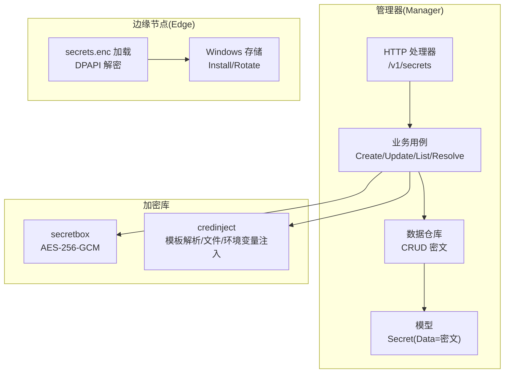
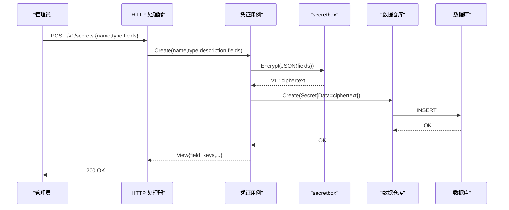
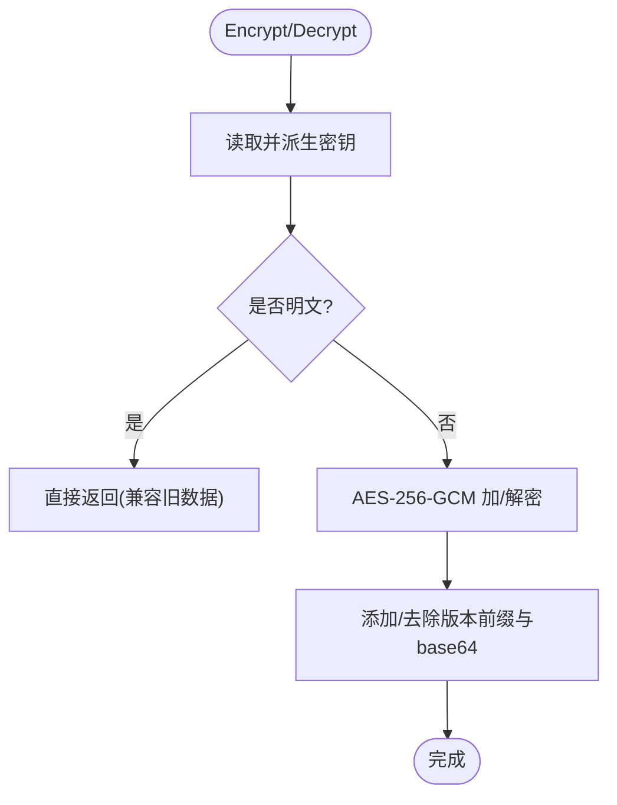
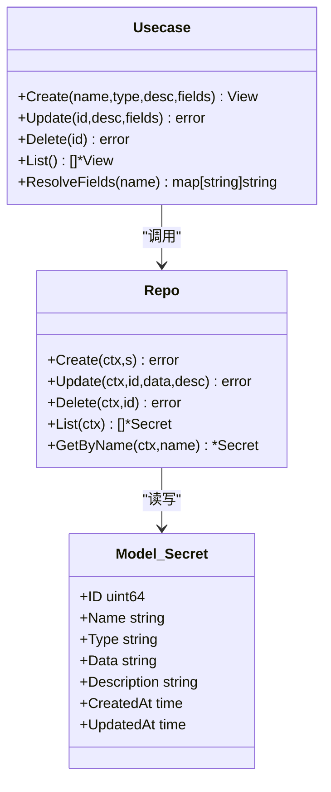
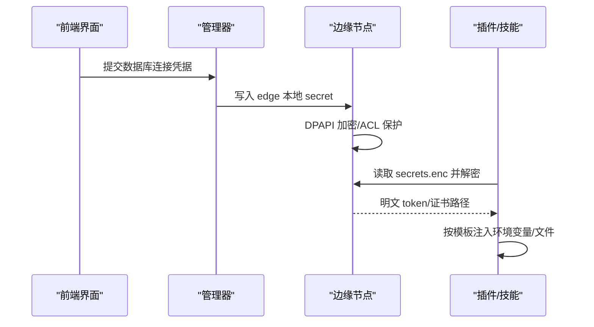
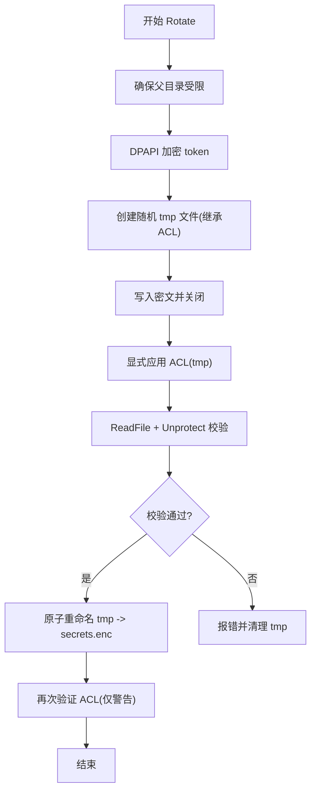
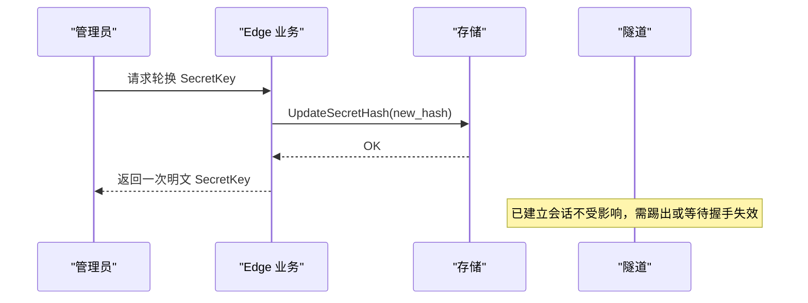
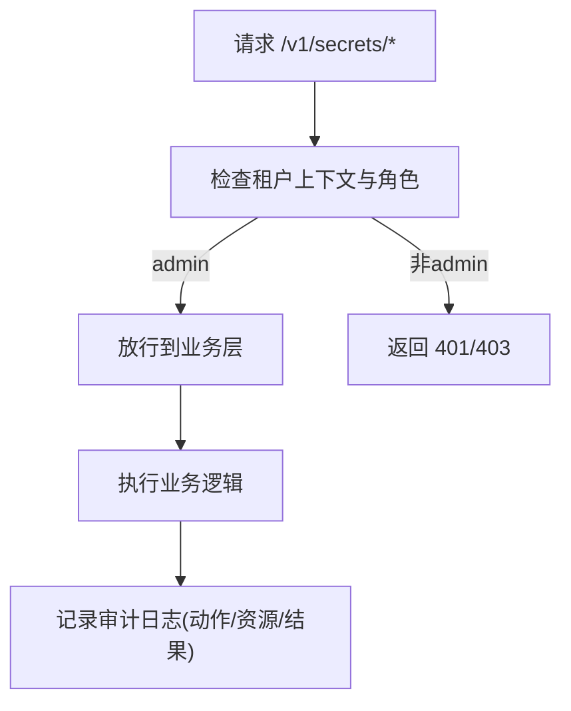
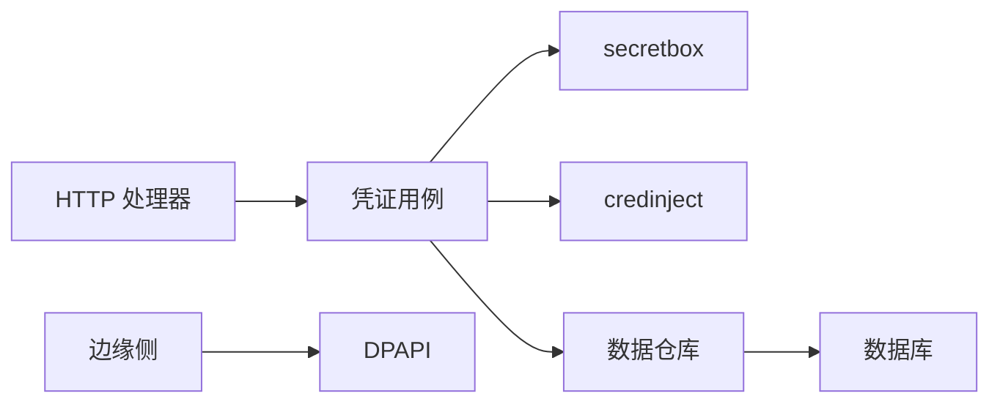

# 密钥管理系统

<cite>
**本文引用的文件**
- [internal/pkg/secretbox/secretbox.go](file://internal/pkg/secretbox/secretbox.go)
- [internal/manager/biz/secret/usecase.go](file://internal/manager/biz/secret/usecase.go)
- [internal/manager/model/secret/model.go](file://internal/manager/model/secret/model.go)
- [internal/manager/data/secret/store/repo.go](file://internal/manager/data/secret/store/repo.go)
- [internal/manager/server/secret/http.go](file://internal/manager/server/secret/http.go)
- [internal/pkg/credinject/credinject.go](file://internal/pkg/credinject/credinject.go)
- [internal/edgeagent/config/secrets.go](file://internal/edgeagent/config/secrets.go)
- [internal/edgeagent/install/secrets_windows.go](file://internal/edgeagent/install/secrets_windows.go)
- [internal/manager/biz/edge/usecase.go](file://internal/manager/biz/edge/usecase.go)
- [internal/manager/biz/edge/enrollment.go](file://internal/manager/biz/edge/enrollment.go)
- [web/src/api/edges.ts](file://web/src/api/edges.ts)
- [web/src/pages/EdgeDetail.tsx](file://web/src/pages/EdgeDetail.tsx)
- [internal/manager/model/audit/log.go](file://internal/manager/model/audit/log.go)
- [internal/manager/biz/audit/usecase.go](file://internal/manager/biz/audit/usecase.go)
- [deploy/install/data-permissions.sh](file://deploy/install/data-permissions.sh)
- [ROADMAP.md](file://ROADMAP.md)
</cite>

## 目录
1. [简介](#简介)
2. [项目结构](#项目结构)
3. [核心组件](#核心组件)
4. [架构总览](#架构总览)
5. [详细组件分析](#详细组件分析)
6. [依赖关系分析](#依赖关系分析)
7. [性能与安全考量](#性能与安全考量)
8. [故障排查指南](#故障排查指南)
9. [结论](#结论)
10. [附录：API 与使用示例](#附录api-与使用示例)

## 简介
本技术文档围绕 Ongrid 的密钥管理系统，系统性说明敏感信息的加密存储、密钥派生、生命周期管理（创建、轮换、撤销、销毁）、多场景使用模式（数据库连接、外部服务认证、API 密钥等）、边缘节点同步与安全传输、访问控制与审计追踪、以及备份恢复与灾难恢复策略。文档以代码级事实为依据，辅以架构图与时序图，帮助读者从整体到细节掌握系统设计与实现。

## 项目结构
密钥管理在系统中分为三层：
- 持久化层：GORM 仓库负责密文存储与查询。
- 业务层：用例封装加解密、字段映射、注入计划生成与视图脱敏。
- 接口层：HTTP 路由暴露管理员 API，仅返回脱敏视图。

图表来源
- [internal/manager/server/secret/http.go:25-33](file://internal/manager/server/secret/http.go#L25-L33)
- [internal/manager/biz/secret/usecase.go:48-145](file://internal/manager/biz/secret/usecase.go#L48-L145)
- [internal/manager/data/secret/store/repo.go:24-88](file://internal/manager/data/secret/store/repo.go#L24-L88)
- [internal/manager/model/secret/model.go:17-45](file://internal/manager/model/secret/model.go#L17-L45)
- [internal/pkg/secretbox/secretbox.go:1-109](file://internal/pkg/secretbox/secretbox.go#L1-L109)
- [internal/pkg/credinject/credinject.go:1-100](file://internal/pkg/credinject/credinject.go#L1-L100)
- [internal/edgeagent/config/secrets.go:12-38](file://internal/edgeagent/config/secrets.go#L12-L38)
- [internal/edgeagent/install/secrets_windows.go:36-169](file://internal/edgeagent/install/secrets_windows.go#L36-L169)

章节来源
- [internal/manager/server/secret/http.go:25-33](file://internal/manager/server/secret/http.go#L25-L33)
- [internal/manager/biz/secret/usecase.go:48-145](file://internal/manager/biz/secret/usecase.go#L48-L145)
- [internal/manager/data/secret/store/repo.go:24-88](file://internal/manager/data/secret/store/repo.go#L24-L88)
- [internal/manager/model/secret/model.go:17-45](file://internal/manager/model/secret/model.go#L17-L45)
- [internal/pkg/secretbox/secretbox.go:1-109](file://internal/pkg/secretbox/secretbox.go#L1-L109)
- [internal/pkg/credinject/credinject.go:1-100](file://internal/pkg/credinject/credinject.go#L1-L100)
- [internal/edgeagent/config/secrets.go:12-38](file://internal/edgeagent/config/secrets.go#L12-L38)
- [internal/edgeagent/install/secrets_windows.go:36-169](file://internal/edgeagent/install/secrets_windows.go#L36-L169)

## 核心组件
- 加密存储库 secretbox：基于 AES-256-GCM，密钥由环境变量派生；支持版本前缀与向后兼容明文读取。
- 凭证用例 secret Usecase：负责字段清洗、JSON 序列化、密封存储、列表脱敏、按名称解析与注入计划生成。
- 数据仓库 store.Repo：GORM 实现的密文持久化，保证唯一性与错误映射。
- 注入器 credinject：将凭证字段按模板展开为环境变量与临时文件，供插件/技能执行时使用。
- 边缘侧 secrets：Windows DPAPI 加密存储与原子轮转；Linux/通用路径通过配置加载并回退到环境变量。
- 边缘接入与令牌：Enrollment Profile 与 Edge SecretKey 的创建、哈希存储与轮换。

章节来源
- [internal/pkg/secretbox/secretbox.go:1-109](file://internal/pkg/secretbox/secretbox.go#L1-L109)
- [internal/manager/biz/secret/usecase.go:48-175](file://internal/manager/biz/secret/usecase.go#L48-L175)
- [internal/manager/data/secret/store/repo.go:24-88](file://internal/manager/data/secret/store/repo.go#L24-L88)
- [internal/pkg/credinject/credinject.go:21-90](file://internal/pkg/credinject/credinject.go#L21-L90)
- [internal/edgeagent/config/secrets.go:12-38](file://internal/edgeagent/config/secrets.go#L12-L38)
- [internal/edgeagent/install/secrets_windows.go:36-169](file://internal/edgeagent/install/secrets_windows.go#L36-L169)
- [internal/manager/biz/edge/enrollment.go:18-59](file://internal/manager/biz/edge/enrollment.go#L18-L59)
- [internal/manager/biz/edge/usecase.go:24-32](file://internal/manager/biz/edge/usecase.go#L24-L32)

## 架构总览
密钥管理贯穿“管理器”和“边缘节点”两端：
- 管理器端：管理员通过 HTTP 接口创建/更新/删除凭证；值以 AES-GCM 密文落库；列表接口仅返回字段名（脱敏）。
- 边缘节点：安装或轮转时写入 DPAPI 加密的 secrets.enc；运行时读取并解密获取 token；也可回退到环境变量。
- 注入阶段：业务用例根据凭证类型与模板，将字段展开为环境变量或临时文件，供下游进程安全使用。

图表来源
- [internal/manager/server/secret/http.go:56-76](file://internal/manager/server/secret/http.go#L56-L76)
- [internal/manager/biz/secret/usecase.go:48-72](file://internal/manager/biz/secret/usecase.go#L48-L72)
- [internal/pkg/secretbox/secretbox.go:53-75](file://internal/pkg/secretbox/secretbox.go#L53-L75)
- [internal/manager/data/secret/store/repo.go:24-36](file://internal/manager/data/secret/store/repo.go#L24-L36)

## 详细组件分析

### 加密存储与密钥派生（secretbox）
- 算法：AES-256-GCM，提供机密性与完整性校验。
- 密钥派生：对环境变量进行 SHA-256 得到 32 字节密钥；若未设置则使用固定默认值并标记为弱密钥，启动时可告警。
- 密文格式：版本前缀 + base64(nonce || ciphertext+tag)，便于未来方案升级。
- 兼容性：无前缀的旧明文可原样透读，便于迁移。

图表来源
- [internal/pkg/secretbox/secretbox.go:31-44](file://internal/pkg/secretbox/secretbox.go#L31-L44)
- [internal/pkg/secretbox/secretbox.go:53-109](file://internal/pkg/secretbox/secretbox.go#L53-L109)

章节来源
- [internal/pkg/secretbox/secretbox.go:1-109](file://internal/pkg/secretbox/secretbox.go#L1-L109)

### 凭证生命周期管理（创建、更新、删除、列表）
- 创建：清洗字段 → JSON 序列化 → 密封存储 → 持久化 → 返回脱敏视图（仅字段名）。
- 更新：可选更新描述与字段；字段为空则仅改描述。
- 删除：按 ID 删除。
- 列表：拉取所有记录，尝试解密以提取字段名；即使解密失败也返回行（无值）。

图表来源
- [internal/manager/biz/secret/usecase.go:21-145](file://internal/manager/biz/secret/usecase.go#L21-L145)
- [internal/manager/data/secret/store/repo.go:18-88](file://internal/manager/data/secret/store/repo.go#L18-L88)
- [internal/manager/model/secret/model.go:17-45](file://internal/manager/model/secret/model.go#L17-L45)

章节来源
- [internal/manager/biz/secret/usecase.go:48-145](file://internal/manager/biz/secret/usecase.go#L48-L145)
- [internal/manager/data/secret/store/repo.go:24-88](file://internal/manager/data/secret/store/repo.go#L24-L88)
- [internal/manager/model/secret/model.go:17-45](file://internal/manager/model/secret/model.go#L17-L45)

### 注入与使用模式（数据库连接、外部服务、API 密钥）
- 注入机制：按凭证类型的注入规则，将字段展开为环境变量或临时文件；缺失字段会报告。
- 数据库连接：UI 中保存连接凭据时会写入 edge 本地 secret；页面仅隐藏密码，其他配置回显。
- 外部服务/API 密钥：通过类型化的凭证实例绑定到技能或 MCP 的 manifest 声明位置，避免硬编码。

图表来源
- [web/src/pages/EdgeDetail.tsx:3493-3523](file://web/src/pages/EdgeDetail.tsx#L3493-L3523)
- [internal/edgeagent/config/secrets.go:12-38](file://internal/edgeagent/config/secrets.go#L12-L38)
- [internal/edgeagent/install/secrets_windows.go:36-86](file://internal/edgeagent/install/secrets_windows.go#L36-L86)
- [internal/pkg/credinject/credinject.go:43-90](file://internal/pkg/credinject/credinject.go#L43-L90)

章节来源
- [internal/pkg/credinject/credinject.go:21-90](file://internal/pkg/credinject/credinject.go#L21-L90)
- [web/src/pages/EdgeDetail.tsx:3493-3523](file://web/src/pages/EdgeDetail.tsx#L3493-L3523)
- [internal/edgeagent/config/secrets.go:12-38](file://internal/edgeagent/config/secrets.go#L12-L38)
- [internal/edgeagent/install/secrets_windows.go:36-86](file://internal/edgeagent/install/secrets_windows.go#L36-L86)

### 边缘节点密钥同步与安全传输
- Windows 平台：使用 DPAPI 加密 secrets.enc，配合严格 ACL（SYSTEM + Administrators），采用临时文件 + 原子替换实现安全轮转。
- 通用加载：优先读取加密文件并解密；失败时回退到环境变量，确保兼容与可用性。
- 安全要点：文件继承父目录 ACL、写后验证 round-trip、失败清理、避免明文窗口。

图表来源
- [internal/edgeagent/install/secrets_windows.go:96-169](file://internal/edgeagent/install/secrets_windows.go#L96-L169)

章节来源
- [internal/edgeagent/install/secrets_windows.go:96-169](file://internal/edgeagent/install/secrets_windows.go#L96-L169)
- [internal/edgeagent/config/secrets.go:12-38](file://internal/edgeagent/config/secrets.go#L12-L38)

### 边缘设备密钥生命周期（创建、轮换、撤销、销毁）
- 创建：生成 AccessKeyID 与 SecretKey（高熵随机），仅存储 SecretKey 的哈希。
- 轮换：生成新 SecretKey，计算哈希并覆盖存储；旧密钥立即失效（运行中的隧道会话需踢出）。
- 撤销：通过 Enrollment Profile 的撤销开关限制后续领取。
- 销毁：删除 Enrollment Profile 或关联记录，使令牌失效。

图表来源
- [internal/manager/biz/edge/usecase.go:311-335](file://internal/manager/biz/edge/usecase.go#L311-L335)
- [web/src/api/edges.ts:325-327](file://web/src/api/edges.ts#L325-L327)

章节来源
- [internal/manager/biz/edge/usecase.go:311-335](file://internal/manager/biz/edge/usecase.go#L311-L335)
- [web/src/api/edges.ts:325-327](file://web/src/api/edges.ts#L325-L327)
- [internal/manager/biz/edge/enrollment.go:18-59](file://internal/manager/biz/edge/enrollment.go#L18-L59)

### 访问控制与审计追踪
- 访问控制：凭证相关接口要求管理员角色；非管理员将被拒绝。
- 审计日志：统一审计模型记录成功、失败、拒绝等状态；变更事件可用于 RCA 与合规审查。

图表来源
- [internal/manager/server/secret/http.go:125-136](file://internal/manager/server/secret/http.go#L125-L136)
- [internal/manager/model/audit/log.go:49-76](file://internal/manager/model/audit/log.go#L49-L76)
- [internal/manager/biz/audit/usecase.go:118-147](file://internal/manager/biz/audit/usecase.go#L118-L147)

章节来源
- [internal/manager/server/secret/http.go:125-136](file://internal/manager/server/secret/http.go#L125-L136)
- [internal/manager/model/audit/log.go:49-76](file://internal/manager/model/audit/log.go#L49-L76)
- [internal/manager/biz/audit/usecase.go:118-147](file://internal/manager/biz/audit/usecase.go#L118-L147)

### 备份恢复与灾难恢复
- 管理器状态快照：规划包含 MySQL、Qdrant、对象存储的统一归档与保留策略。
- 一键恢复：指向快照 tarball，校验 schema 与边缘重握手计划。
- 异地复制：rsync/S3 冷备。
- 演练模式：定时恢复演练并报告 MTTR。
- 边缘侧状态检查点：升级前对工作目录做快照（已有 .previous 部分能力）。
- 安装脚本恢复：当数据目录准备失败时尝试恢复现有栈或回滚 Edge 目录。

章节来源
- [ROADMAP.md:316-358](file://ROADMAP.md#L316-L358)
- [deploy/install/data-permissions.sh:174-230](file://deploy/install/data-permissions.sh#L174-L230)

## 依赖关系分析
- 耦合度：HTTP 层仅依赖用例；用例依赖加密库与仓库；仓库依赖模型与数据库；注入器独立于领域模型，降低耦合。
- 循环依赖：通过接口隔离（如 NodeMirror、EnrollmentClusterAssigner）避免包间循环。
- 外部依赖：数据库（MySQL/GORM）、操作系统 DPAPI（Windows）、环境变量（密钥派生）。

图表来源
- [internal/manager/server/secret/http.go:25-33](file://internal/manager/server/secret/http.go#L25-L33)
- [internal/manager/biz/secret/usecase.go:48-175](file://internal/manager/biz/secret/usecase.go#L48-L175)
- [internal/manager/data/secret/store/repo.go:24-88](file://internal/manager/data/secret/store/repo.go#L24-L88)
- [internal/edgeagent/install/secrets_windows.go:36-86](file://internal/edgeagent/install/secrets_windows.go#L36-L86)

章节来源
- [internal/manager/server/secret/http.go:25-33](file://internal/manager/server/secret/http.go#L25-L33)
- [internal/manager/biz/secret/usecase.go:48-175](file://internal/manager/biz/secret/usecase.go#L48-L175)
- [internal/manager/data/secret/store/repo.go:24-88](file://internal/manager/data/secret/store/repo.go#L24-L88)
- [internal/edgeagent/install/secrets_windows.go:36-86](file://internal/edgeagent/install/secrets_windows.go#L36-L86)

## 性能与安全考量
- 性能
  - 列表接口对每条记录尝试解密以提取字段名，但即使失败也不阻断返回，保证可用性。
  - 注入过程在内存中展开模板，避免额外 IO；临时文件按需创建并在执行后清理。
- 安全
  - 密钥派生依赖环境变量；未设置时使用弱密钥并可在启动时告警。
  - 列表 API 仅返回字段名，不泄露值。
  - 边缘侧 secrets.enc 使用 DPAPI 加密与严格 ACL，原子替换避免竞争条件。
  - 边缘设备 SecretKey 仅存哈希，轮换后立即失效。

[本节为通用指导，无需具体文件引用]

## 故障排查指南
- 无法解密 secrets.enc
  - 检查文件是否存在、权限是否正确（Windows 下需 SYSTEM/Administrators 全控）。
  - 确认 DPAPI 环境可用；必要时回退到环境变量。
- 列表接口返回空字段名
  - 可能是密文损坏或密钥不一致；查看解密错误日志。
- 轮换后连接失败
  - 确认旧会话已被踢出或重新握手；检查后端服务是否使用了新的 SecretKey。
- 注入缺失字段
  - 检查凭证类型与模板声明是否匹配；查看缺失字段列表并补齐。

章节来源
- [internal/edgeagent/install/secrets_windows.go:96-169](file://internal/edgeagent/install/secrets_windows.go#L96-L169)
- [internal/edgeagent/config/secrets.go:12-38](file://internal/edgeagent/config/secrets.go#L12-L38)
- [internal/manager/biz/secret/usecase.go:123-145](file://internal/manager/biz/secret/usecase.go#L123-L145)
- [internal/pkg/credinject/credinject.go:43-90](file://internal/pkg/credinject/credinject.go#L43-L90)

## 结论
本密钥管理系统以“密文落库、最小可见、安全注入、原子轮转”为核心原则，结合管理器与边缘节点的协同设计，实现了从创建、使用到轮换、撤销的全生命周期管理。通过严格的访问控制与审计追踪，满足合规与可观测性需求；同时提供了清晰的备份恢复与灾难恢复路线，保障业务连续性。

[本节为总结，无需具体文件引用]

## 附录：API 与使用示例
- 管理员凭证管理
  - GET /v1/secrets：列出所有凭证（仅字段名）。
  - POST /v1/secrets：创建凭证（name、type、description、fields）。
  - PUT /v1/secrets/{id}：更新凭证（description、fields）。
  - DELETE /v1/secrets/{id}：删除凭证。
  - GET /v1/credential-types：获取可用的凭证类型及注入规则。
- 边缘设备密钥
  - 创建/轮换：通过 edges API 创建或轮换 SecretKey，响应一次性返回明文密钥。
  - 领取配置：通过 enrollment profile 生成令牌，限制有效期与使用次数，支持撤销。
- 使用示例
  - 数据库连接：在 Edge 详情页编辑连接凭据，保存时写入 edge 本地 secret；插件运行时读取并注入。
  - 外部服务认证：定义凭证类型与模板，将字段映射到环境变量或文件，供技能/MCP 使用。

章节来源
- [internal/manager/server/secret/http.go:25-33](file://internal/manager/server/secret/http.go#L25-L33)
- [web/src/api/edges.ts:298-327](file://web/src/api/edges.ts#L298-L327)
- [web/src/pages/EdgeDetail.tsx:3493-3523](file://web/src/pages/EdgeDetail.tsx#L3493-L3523)
- [internal/manager/biz/edge/enrollment.go:18-59](file://internal/manager/biz/edge/enrollment.go#L18-L59)