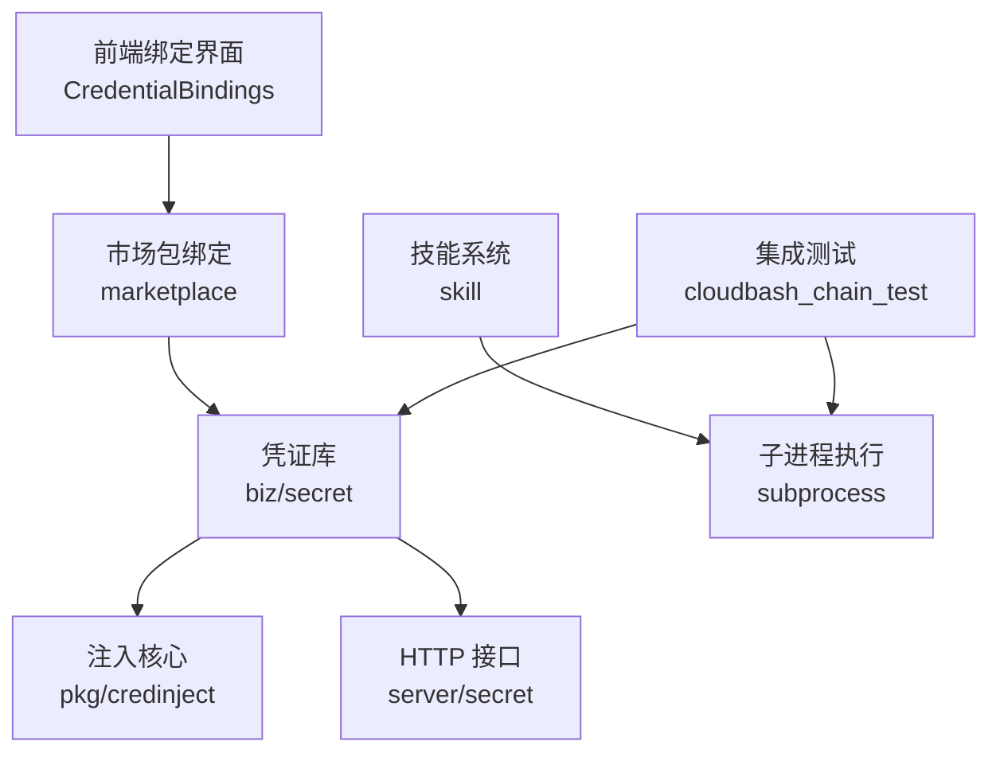
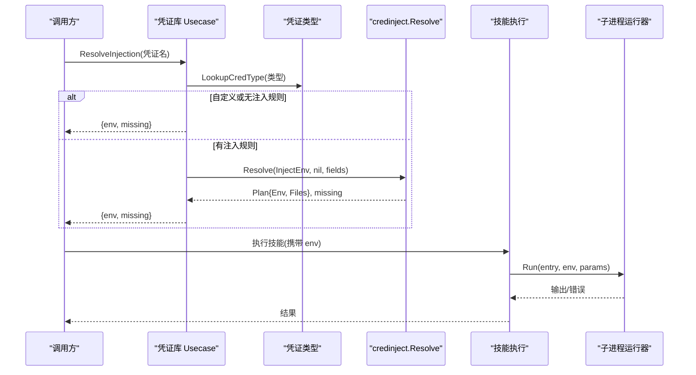
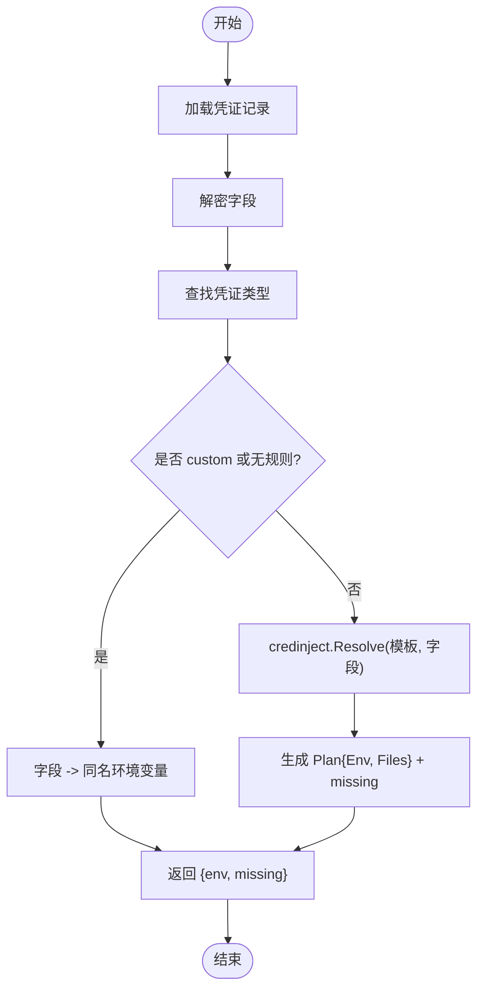
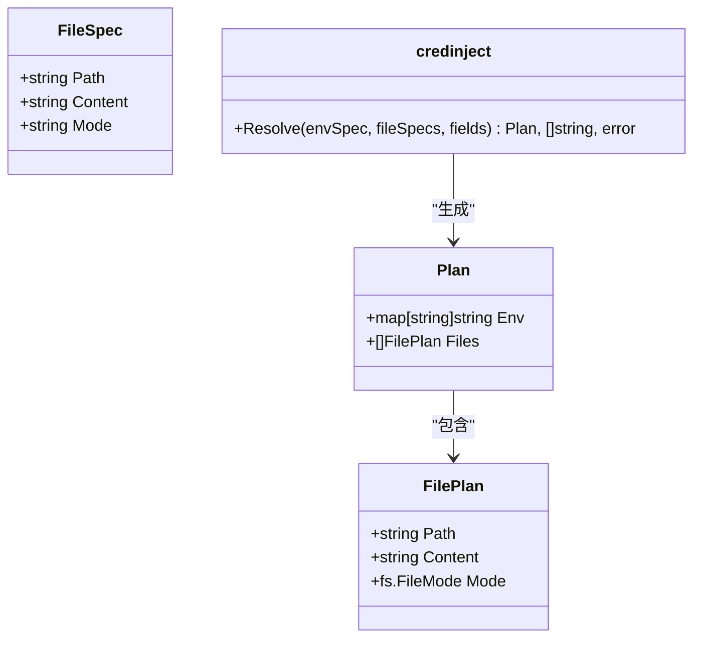
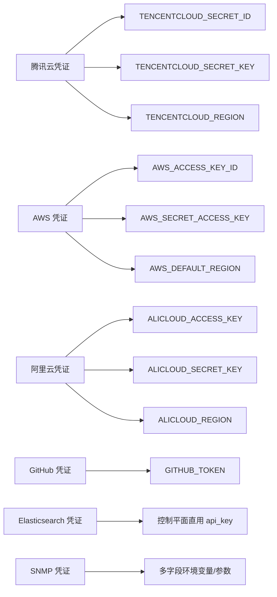
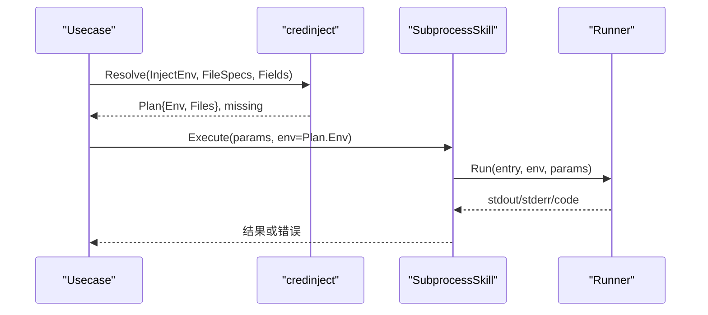
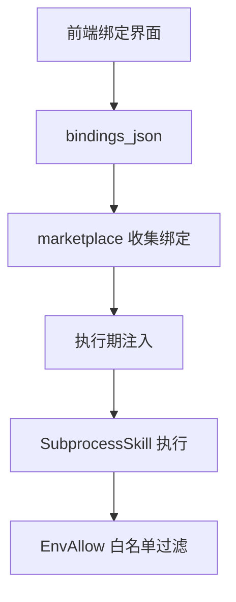
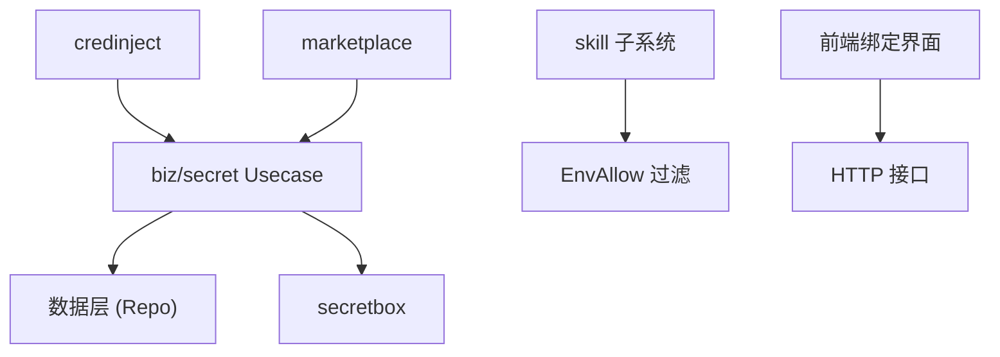

# 环境变量注入机制

<cite>
**本文引用的文件**
- [internal/pkg/credinject/credinject.go](file://internal/pkg/credinject/credinject.go)
- [internal/pkg/credinject/credinject_test.go](file://internal/pkg/credinject/credinject_test.go)
- [internal/manager/biz/secret/usecase.go](file://internal/manager/biz/secret/usecase.go)
- [internal/manager/biz/secret/credtype.go](file://internal/manager/biz/secret/credtype.go)
- [internal/manager/model/secret/model.go](file://internal/manager/model/secret/model.go)
- [internal/manager/server/secret/http.go](file://internal/manager/server/secret/http.go)
- [internal/skill/subprocess.go](file://internal/skill/subprocess.go)
- [internal/skill/loader.go](file://internal/skill/loader.go)
- [internal/manager/biz/marketplace/usecase.go](file://internal/manager/biz/marketplace/usecase.go)
- [tests/integration/cloudbash_chain_test.go](file://tests/integration/cloudbash_chain_test.go)
- [web/src/components/marketplace/CredentialBindings.tsx](file://web/src/components/marketplace/CredentialBindings.tsx)
</cite>

## 目录
1. [简介](#简介)
2. [项目结构](#项目结构)
3. [核心组件](#核心组件)
4. [架构总览](#架构总览)
5. [详细组件分析](#详细组件分析)
6. [依赖关系分析](#依赖关系分析)
7. [性能考量](#性能考量)
8. [故障排查指南](#故障排查指南)
9. [结论](#结论)
10. [附录](#附录)

## 简介
本技术文档围绕“环境变量注入机制”展开，聚焦于 ResolveInjection 方法的工作原理、凭证类型到环境变量的映射规则、n8n 风格的注入配置格式与语法、不同凭证类型的注入策略（数据库连接、API 密钥、服务认证等）、缺失字段的检测与报告、注入计划（plan）的生成与执行、配置示例与最佳实践、失败回滚与补偿机制，以及与技能系统的集成方式和权限控制。该机制遵循 n8n 的设计思想：将“字段如何注入”定义在凭证类型或技能声明中，将“使用哪个凭证实例”定义在绑定层，运行时按模板解析并注入到子进程环境中。

## 项目结构
与注入机制相关的代码主要分布在以下模块：
- 注入核心：internal/pkg/credinject（无领域依赖的纯函数式实现）
- 凭证库与类型：internal/manager/biz/secret（凭证存储、类型注册、ResolveInjection）
- 模型与 HTTP 接口：internal/manager/model/secret、internal/manager/server/secret
- 技能执行：internal/skill（子进程执行、环境变量白名单）
- 市场包绑定：internal/manager/biz/marketplace（设计时绑定收集）
- 前端绑定界面：web/src/components/marketplace/CredentialBindings.tsx
- 端到端验证：tests/integration/cloudbash_chain_test.go

**图表来源**
- [internal/manager/biz/secret/usecase.go:147-175](file://internal/manager/biz/secret/usecase.go#L147-L175)
- [internal/pkg/credinject/credinject.go:43-90](file://internal/pkg/credinject/credinject.go#L43-L90)
- [internal/skill/subprocess.go:152-172](file://internal/skill/subprocess.go#L152-L172)
- [internal/manager/biz/marketplace/usecase.go:425-477](file://internal/manager/biz/marketplace/usecase.go#L425-L477)
- [web/src/components/marketplace/CredentialBindings.tsx:10-24](file://web/src/components/marketplace/CredentialBindings.tsx#L10-L24)
- [tests/integration/cloudbash_chain_test.go:57-81](file://tests/integration/cloudbash_chain_test.go#L57-L81)

**章节来源**
- [internal/manager/biz/secret/usecase.go:147-175](file://internal/manager/biz/secret/usecase.go#L147-L175)
- [internal/pkg/credinject/credinject.go:43-90](file://internal/pkg/credinject/credinject.go#L43-L90)
- [internal/skill/subprocess.go:152-172](file://internal/skill/subprocess.go#L152-L172)
- [internal/manager/biz/marketplace/usecase.go:425-477](file://internal/manager/biz/marketplace/usecase.go#L425-L477)
- [web/src/components/marketplace/CredentialBindings.tsx:10-24](file://web/src/components/marketplace/CredentialBindings.tsx#L10-L24)
- [tests/integration/cloudbash_chain_test.go:57-81](file://tests/integration/cloudbash_chain_test.go#L57-L81)

## 核心组件
- 注入核心 credinject：提供 Resolve(envSpec, fileSpecs, fields) 能力，支持 {{field}} 模板替换、文件计划生成、缺失字段统计。
- 凭证库 usecase：提供 ResolveInjection(name)，根据凭证类型选择注入规则，返回注入后的环境变量和缺失字段列表。
- 凭证类型 credtype：注册内置类型（腾讯云、AWS、阿里云、GitHub、Elasticsearch、SNMP、自定义），定义字段与默认注入规则。
- 技能执行 subprocess：构建子进程环境，基于 EnvAllow 白名单过滤环境变量，确保最小暴露面。
- 市场包绑定 marketplace：收集已安装包中与活跃技能关联的凭证名称，供执行期注入。
- 前端绑定界面 CredentialBindings：允许管理员为技能关联凭证库中的凭证，支持“额外凭证”。

**章节来源**
- [internal/pkg/credinject/credinject.go:21-39](file://internal/pkg/credinject/credinject.go#L21-L39)
- [internal/manager/biz/secret/usecase.go:147-175](file://internal/manager/biz/secret/usecase.go#L147-L175)
- [internal/manager/biz/secret/credtype.go:65-135](file://internal/manager/biz/secret/credtype.go#L65-L135)
- [internal/skill/subprocess.go:152-172](file://internal/skill/subprocess.go#L152-L172)
- [internal/manager/biz/marketplace/usecase.go:425-477](file://internal/manager/biz/marketplace/usecase.go#L425-L477)
- [web/src/components/marketplace/CredentialBindings.tsx:10-24](file://web/src/components/marketplace/CredentialBindings.tsx#L10-L24)

## 架构总览
下图展示了从“凭证库”到“技能执行”的完整注入链路：

**图表来源**
- [internal/manager/biz/secret/usecase.go:147-175](file://internal/manager/biz/secret/usecase.go#L147-L175)
- [internal/pkg/credinject/credinject.go:43-90](file://internal/pkg/credinject/credinject.go#L43-L90)
- [internal/skill/subprocess.go:152-172](file://internal/skill/subprocess.go#L152-L172)

## 详细组件分析

### ResolveInjection 工作原理
- 读取凭证记录并按类型查找注入规则。
- 若类型为 custom 或无注入规则，则将每个字段以同名作为环境变量注入。
- 否则调用 credinject.Resolve，将 InjectEnv 模板与凭证字段进行替换，生成环境变量与环境文件计划，同时统计缺失字段。
- 返回最终的环境变量映射与缺失字段列表（用于告警或拒绝）。

**图表来源**
- [internal/manager/biz/secret/usecase.go:147-175](file://internal/manager/biz/secret/usecase.go#L147-L175)
- [internal/pkg/credinject/credinject.go:43-90](file://internal/pkg/credinject/credinject.go#L43-L90)

**章节来源**
- [internal/manager/biz/secret/usecase.go:147-175](file://internal/manager/biz/secret/usecase.go#L147-L175)

### n8n 风格注入配置格式与语法
- 模板语法：{{field}}，其中 field 为凭证字段键名，支持组合字符串如 "id={{a}};missing={{b}}"。
- 环境变量映射：InjectEnv 为 map[ENV_VAR]template，例如将凭证字段映射到标准 SDK 环境变量。
- 文件映射：FileSpec 支持 Path、Content、Mode（八进制字符串），用于生成临时文件并在执行后清理。
- 缺失字段处理：引用了不存在的字段会扩展为空串，并计入 missing 列表，便于上层告警或拒绝。

**图表来源**
- [internal/pkg/credinject/credinject.go:21-39](file://internal/pkg/credinject/credinject.go#L21-L39)
- [internal/pkg/credinject/credinject.go:43-90](file://internal/pkg/credinject/credinject.go#L43-L90)

**章节来源**
- [internal/pkg/credinject/credinject.go:43-90](file://internal/pkg/credinject/credinject.go#L43-L90)
- [internal/pkg/credinject/credinject_test.go:5-31](file://internal/pkg/credinject/credinject_test.go#L5-L31)

### 凭证类型与注入策略
- 腾讯云：将 secret_id、secret_key、region 映射到 TENCENTCLOUD_* 环境变量。
- AWS：将 access_key_id、secret_access_key、region 映射到 AWS_* 环境变量。
- 阿里云：将 access_key_id、access_key_secret、region 映射到 ALICLOUD_* 环境变量。
- GitHub：将 token 映射到 GITHUB_TOKEN。
- Elasticsearch：api_key 字段不暴露为通用进程环境变量，由控制平面直接消费。
- SNMP：版本、社区、用户名、鉴权协议/隐私协议及对应密钥等字段。
- 自定义：字段名即环境变量名，适合灵活场景。

**图表来源**
- [internal/manager/biz/secret/credtype.go:65-135](file://internal/manager/biz/secret/credtype.go#L65-L135)

**章节来源**
- [internal/manager/biz/secret/credtype.go:65-135](file://internal/manager/biz/secret/credtype.go#L65-L135)

### 缺失字段的检测与报告机制
- 模板解析阶段，若引用字段不存在，则将其标记为缺失，并扩展为空串。
- Resolve 返回 sorted missing 列表，调用方可据此进行告警或拒绝执行。
- 单元测试覆盖了复合模板与缺失字段场景，确保行为可预期。

**章节来源**
- [internal/pkg/credinject/credinject.go:43-90](file://internal/pkg/credinject/credinject.go#L43-L90)
- [internal/pkg/credinject/credinject_test.go:5-31](file://internal/pkg/credinject/credinject_test.go#L5-L31)

### 注入计划（plan）的生成与执行过程
- 生成：根据 InjectEnv 与 FileSpec 模板解析得到 Plan{Env, Files}。
- 执行：技能执行侧通过 subprocess 构建子进程环境，仅注入白名单环境变量；文件计划需在执行前落地并在结束后清理（当前 plan.Files 由调用方负责生命周期管理）。
- 安全：子进程入口必须为绝对路径且位于允许根目录下，非 JSON 输出会被拒绝。

**图表来源**
- [internal/pkg/credinject/credinject.go:43-90](file://internal/pkg/credinject/credinject.go#L43-L90)
- [internal/skill/subprocess.go:152-172](file://internal/skill/subprocess.go#L152-L172)

**章节来源**
- [internal/skill/subprocess.go:152-172](file://internal/skill/subprocess.go#L152-L172)

### 注入配置的示例与最佳实践
- 示例：为腾讯云凭证创建名为 tencent-prod 的实例，字段包括 secret_id、secret_key、region；其 InjectEnv 自动映射到 TENCENTCLOUD_* 环境变量。
- 最佳实践：
  - 优先使用内置类型，避免硬编码环境变量名。
  - 对敏感字段使用 Secret=true 的字段定义，UI 会掩码显示。
  - 使用 EnvAllow 限制子进程可见环境变量，防止泄露。
  - 对于需要文件的场景（如证书），使用 FileSpec 指定路径、内容与权限。
  - 始终检查 missing 列表，缺失字段应视为错误并阻止执行。

**章节来源**
- [internal/manager/biz/secret/credtype.go:65-135](file://internal/manager/biz/secret/credtype.go#L65-L135)
- [internal/skill/loader.go:176-254](file://internal/skill/loader.go#L176-L254)
- [internal/skill/subprocess.go:152-172](file://internal/skill/subprocess.go#L152-L172)

### 注入失败的回滚与补偿机制
- 受管凭证（managed credential）：CreateManaged 用于在配置保存过程中临时创建不可变名称的凭证；若后续步骤失败，可通过 DeleteManaged 进行补偿删除，避免残留。
- 业务上下文：日志后端等场景在创建多个受管密钥时，若失败需回滚已创建的引用。
- 设计要点：名称不可复用，保证旋转时的原子性与可回滚性。

**章节来源**
- [internal/manager/biz/secret/usecase.go:91-118](file://internal/manager/biz/secret/usecase.go#L91-L118)
- [internal/manager/biz/logs/service.go:378-396](file://internal/manager/biz/logs/service.go#L378-L396)

### 与技能系统的集成方式与权限控制
- 设计时绑定：市场包在安装/管理时可关联凭证库中的凭证；bindings_json 记录 key->credential_name，执行时忽略 key，仅注入所有关联凭证。
- 执行时注入：chatruntime 在每个回合收集活跃技能绑定的凭证名，交由 manager 注入环境变量。
- 权限控制：
  - 凭证库 HTTP 接口仅限管理员访问。
  - 技能执行强制 scope=manager，入口路径必须在允许根目录下，环境变量通过 EnvAllow 白名单过滤。
  - 前端 CredentialBindings 仅管理员可编辑绑定。

**图表来源**
- [web/src/components/marketplace/CredentialBindings.tsx:10-24](file://web/src/components/marketplace/CredentialBindings.tsx#L10-L24)
- [internal/manager/biz/marketplace/usecase.go:425-477](file://internal/manager/biz/marketplace/usecase.go#L425-L477)
- [internal/skill/loader.go:176-254](file://internal/skill/loader.go#L176-L254)
- [internal/skill/subprocess.go:152-172](file://internal/skill/subprocess.go#L152-L172)
- [internal/manager/server/secret/http.go:25-42](file://internal/manager/server/secret/http.go#L25-L42)

**章节来源**
- [internal/manager/biz/marketplace/usecase.go:425-477](file://internal/manager/biz/marketplace/usecase.go#L425-L477)
- [internal/skill/loader.go:176-254](file://internal/skill/loader.go#L176-L254)
- [internal/skill/subprocess.go:152-172](file://internal/skill/subprocess.go#L152-L172)
- [internal/manager/server/secret/http.go:25-42](file://internal/manager/server/secret/http.go#L25-L42)
- [web/src/components/marketplace/CredentialBindings.tsx:10-24](file://web/src/components/marketplace/CredentialBindings.tsx#L10-L24)

## 依赖关系分析
- credinject 无外部依赖，保持纯函数式，便于单元测试与跨模块复用。
- biz/secret 依赖 credinject 与 secretbox（加密/解密），并通过 Repo 接口与数据层解耦。
- skill 子系统通过 EnvAllow 控制环境变量传播，确保最小暴露面。
- marketplace 收集设计时绑定，为执行期注入提供凭证名集合。
- 前端通过 HTTP 接口与后端交互，仅管理员可操作凭证与绑定。

**图表来源**
- [internal/pkg/credinject/credinject.go:1-19](file://internal/pkg/credinject/credinject.go#L1-L19)
- [internal/manager/biz/secret/usecase.go:1-28](file://internal/manager/biz/secret/usecase.go#L1-L28)
- [internal/skill/loader.go:176-254](file://internal/skill/loader.go#L176-L254)
- [internal/manager/biz/marketplace/usecase.go:425-477](file://internal/manager/biz/marketplace/usecase.go#L425-L477)
- [internal/manager/server/secret/http.go:25-42](file://internal/manager/server/secret/http.go#L25-L42)

**章节来源**
- [internal/pkg/credinject/credinject.go:1-19](file://internal/pkg/credinject/credinject.go#L1-L19)
- [internal/manager/biz/secret/usecase.go:1-28](file://internal/manager/biz/secret/usecase.go#L1-L28)
- [internal/skill/loader.go:176-254](file://internal/skill/loader.go#L176-L254)
- [internal/manager/biz/marketplace/usecase.go:425-477](file://internal/manager/biz/marketplace/usecase.go#L425-L477)
- [internal/manager/server/secret/http.go:25-42](file://internal/manager/server/secret/http.go#L25-L42)

## 性能考量
- 模板解析复杂度：Resolve 对每个环境变量与文件内容进行正则匹配与替换，时间复杂度近似 O(N+M)，N 为模板数量，M 为字段数；整体开销较小。
- 缺失字段排序：使用插入排序避免引入 sort 包，减少依赖与内存分配。
- 环境变量白名单：通过 EnvAllow 减少子进程环境大小，降低启动与执行开销。
- 文件计划：仅在必要时生成临时文件，注意 I/O 成本与清理策略。

[本节为通用指导，无需特定文件来源]

## 故障排查指南
- 模板解析错误：检查 InjectEnv 与 FileSpec 的模板语法是否正确，字段名是否一致。
- 缺失字段：查看 Resolve 返回的 missing 列表，确认凭证是否缺少必要字段。
- 子进程执行失败：检查入口路径是否为绝对路径且在允许根目录下；确认环境变量通过 EnvAllow 白名单注入；核对 stdout 是否为有效 JSON。
- 权限问题：确认调用者具有管理员权限；确认技能 scope 为 manager。
- 回滚失败：检查 CreateManaged 生成的名称是否唯一；确认 DeleteManaged 能正确删除受管凭证。

**章节来源**
- [internal/pkg/credinject/credinject_test.go:33-37](file://internal/pkg/credinject/credinject_test.go#L33-L37)
- [internal/skill/subprocess.go:125-172](file://internal/skill/subprocess.go#L125-L172)
- [internal/manager/biz/secret/usecase.go:91-118](file://internal/manager/biz/secret/usecase.go#L91-L118)

## 结论
该环境变量注入机制以 n8n 风格为核心，通过“类型定义注入规则 + 绑定选择凭证实例”的方式，实现了安全、可配置、可扩展的凭证注入。ResolveInjection 将凭证字段按模板解析为环境变量与文件计划，结合技能子进程的白名单机制，确保最小暴露面与高安全性。缺失字段检测、回滚补偿、权限控制与前端绑定界面共同构成了完整的工程化方案。建议在生产环境中严格使用内置类型、启用 EnvAllow、校验 missing 列表，并结合审批流与审计日志保障合规。

[本节为总结性内容，无需特定文件来源]

## 附录
- 端到端验证：integration 测试覆盖凭证库→审批→执行链，确保注入在实际执行环境中生效。
- 模型说明：Secret 模型遵循 n8n 设计，字段以 JSON 序列化并加密存储，API 仅暴露字段名，不暴露值。

**章节来源**
- [tests/integration/cloudbash_chain_test.go:57-81](file://tests/integration/cloudbash_chain_test.go#L57-L81)
- [internal/manager/model/secret/model.go:1-13](file://internal/manager/model/secret/model.go#L1-L13)