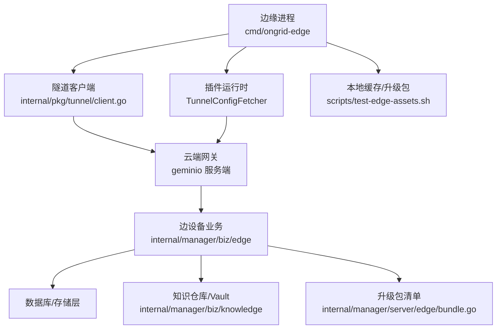
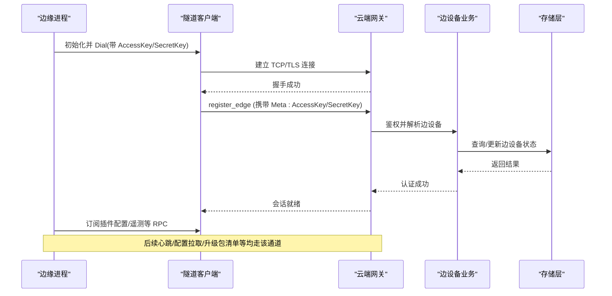
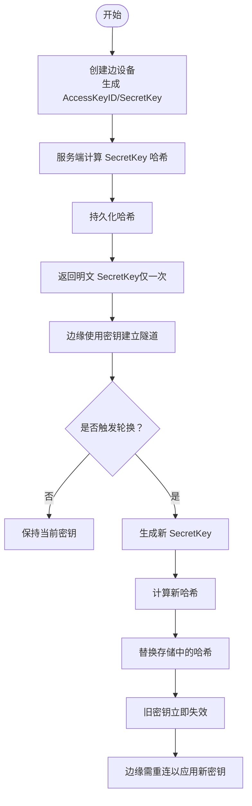
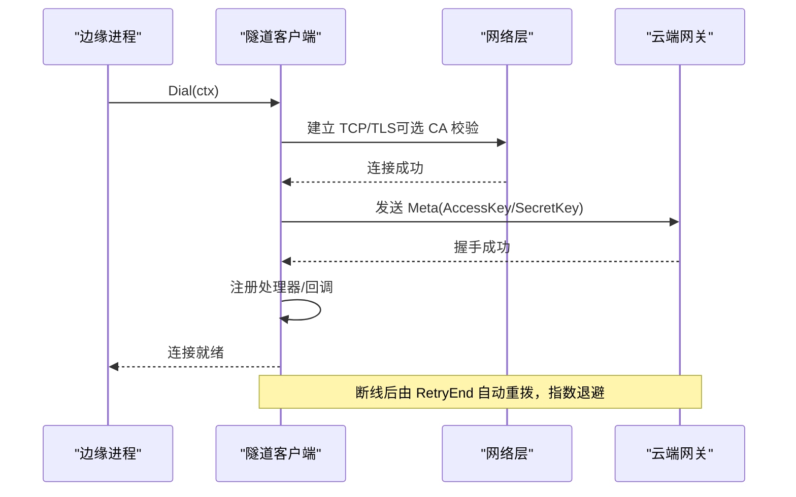
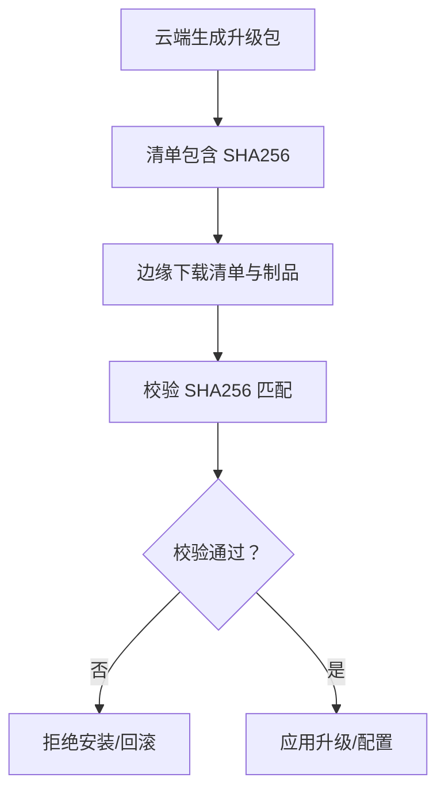
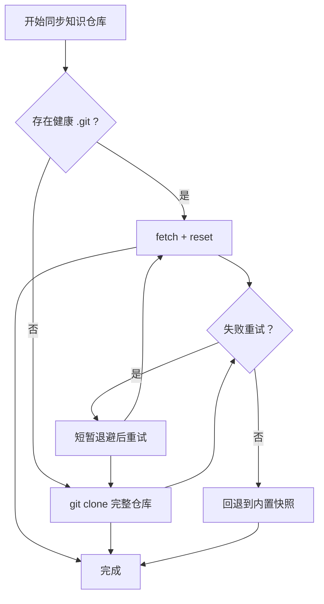
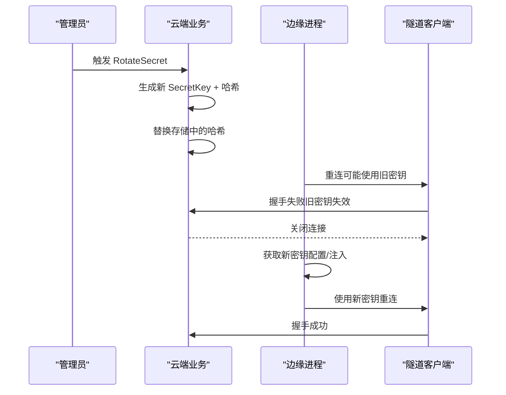
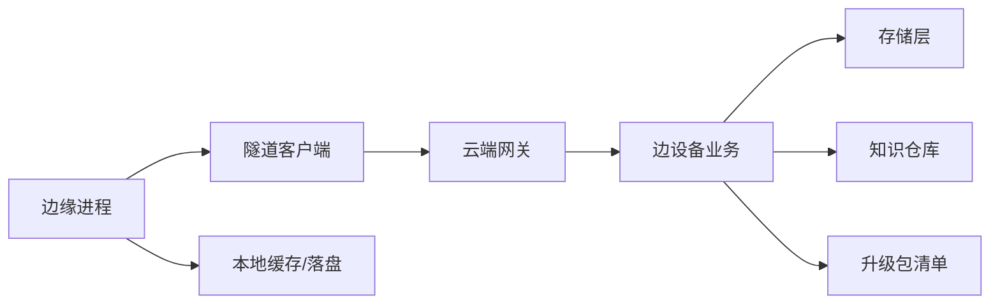

# 边缘节点同步安全

<cite>
**本文引用的文件**
- [internal/pkg/tunnel/client.go](file://internal/pkg/tunnel/client.go)
- [internal/pkg/tunnel/types.go](file://internal/pkg/tunnel/types.go)
- [cmd/ongrid-edge/main.go](file://cmd/ongrid-edge/main.go)
- [internal/manager/biz/edge/usecase.go](file://internal/manager/biz/edge/usecase.go)
- [internal/manager/biz/edge/authcache.go](file://internal/manager/biz/edge/authcache.go)
- [internal/manager/biz/edge/enrollment.go](file://internal/manager/biz/edge/enrollment.go)
- [internal/manager/model/edge/enrollment.go](file://internal/manager/model/edge/enrollment.go)
- [internal/manager/data/edge/store/enrollment.go](file://internal/manager/data/edge/store/enrollment.go)
- [internal/manager/server/edge/bundle.go](file://internal/manager/server/edge/bundle.go)
- [internal/manager/biz/knowledge/usecase.go](file://internal/manager/biz/knowledge/usecase.go)
- [internal/manager/biz/knowledge/builtin_vault.go](file://internal/manager/biz/knowledge/builtin_vault.go)
- [internal/edgeagent/install/secrets_windows.go](file://internal/edgeagent/install/secrets_windows.go)
- [internal/edgeagent/install/acl_windows_test.go](file://internal/edgeagent/install/acl_windows_test.go)
- [scripts/test-edge-assets.sh](file://scripts/test-edge-assets.sh)
- [docs/design/diagnostics/tls-handshake-failure.md](file://docs/design/diagnostics/tls-handshake-failure.md)
</cite>

## 目录
1. [简介](#简介)
2. [项目结构](#项目结构)
3. [核心组件](#核心组件)
4. [架构总览](#架构总览)
5. [详细组件分析](#详细组件分析)
6. [依赖关系分析](#依赖关系分析)
7. [性能考量](#性能考量)
8. [故障排查指南](#故障排查指南)
9. [结论](#结论)
10. [附录](#附录)

## 简介
本技术文档聚焦于边缘节点与云端之间的“密钥同步安全”，覆盖以下关键主题：
- 密钥生成、存储与轮换（AccessKeyID/SecretKey）
- 增量与全量同步策略（以配置与资产分发为主）
- 数据传输安全通道建立（TLS 握手与证书校验）
- 传输中密钥保护与完整性验证
- 本地缓存策略与冲突解决
- 密钥轮换时的同步流程与回滚策略
- 同步失败排查与恢复方案
- 网络异常处理与重试机制配置

## 项目结构
与“边缘节点同步安全”直接相关的代码分布在如下模块：
- 隧道客户端与安全通道：internal/pkg/tunnel/*
- 边缘端启动与插件配置拉取：cmd/ongrid-edge/main.go
- 云端边设备业务与密钥管理：internal/manager/biz/edge/*
- 批量注册与令牌发放：internal/manager/biz/edge/enrollment.go
- 知识仓库与内置 Vault 的原子替换：internal/manager/biz/knowledge/*
- 升级包清单与完整性校验：internal/manager/server/edge/bundle.go
- Windows 本地密钥落盘与权限加固：internal/edgeagent/install/*
- 资源下载与本地缓存脚本：scripts/test-edge-assets.sh
- TLS 诊断参考：docs/design/diagnostics/tls-handshake-failure.md

**图表来源**
- [cmd/ongrid-edge/main.go:136-149](file://cmd/ongrid-edge/main.go#L136-L149)
- [internal/pkg/tunnel/client.go:24-38](file://internal/pkg/tunnel/client.go#L24-L38)
- [internal/manager/biz/edge/usecase.go:111-134](file://internal/manager/biz/edge/usecase.go#L111-L134)
- [internal/manager/server/edge/bundle.go:38-66](file://internal/manager/server/edge/bundle.go#L38-L66)
- [internal/manager/biz/knowledge/usecase.go:1239-1281](file://internal/manager/biz/knowledge/usecase.go#L1239-L1281)

**章节来源**
- [cmd/ongrid-edge/main.go:136-149](file://cmd/ongrid-edge/main.go#L136-L149)
- [internal/pkg/tunnel/client.go:24-38](file://internal/pkg/tunnel/client.go#L24-L38)
- [internal/manager/biz/edge/usecase.go:111-134](file://internal/manager/biz/edge/usecase.go#L111-L134)
- [internal/manager/server/edge/bundle.go:38-66](file://internal/manager/server/edge/bundle.go#L38-L66)
- [internal/manager/biz/knowledge/usecase.go:1239-1281](file://internal/manager/biz/knowledge/usecase.go#L1239-L1281)

## 核心组件
- 隧道客户端：负责建立到云端的加密通道，携带 AccessKey/SecretKey 元数据，实现指数退避重连与断线自动重拨。
- 边设备业务：负责创建边设备身份（AccessKeyID/SecretKey）、哈希存储 SecretKey、心跳与在线状态维护、密钥轮换。
- 认证缓存：对成功的凭据校验进行短期缓存，降低高频鉴权开销。
- 批量注册：通过一次性高熵令牌（enrollment token）完成非 K8s 场景下的批量入网与边设备身份发放。
- 知识仓库与 Vault：支持从云端克隆或回退到内置快照，使用原子替换保证一致性。
- 升级包清单：提供可下载的升级制品清单及 SHA256 校验信息。
- 本地密钥落盘：在 Windows 上采用临时文件 + 原子 rename + ACL 校验的方式写入敏感文件。
- 资源缓存：安装脚本支持本地缓存命中，避免重复网络请求。

**章节来源**
- [internal/pkg/tunnel/client.go:81-165](file://internal/pkg/tunnel/client.go#L81-L165)
- [internal/manager/biz/edge/usecase.go:111-134](file://internal/manager/biz/edge/usecase.go#L111-L134)
- [internal/manager/biz/edge/authcache.go:9-56](file://internal/manager/biz/edge/authcache.go#L9-L56)
- [internal/manager/biz/edge/enrollment.go:61-120](file://internal/manager/biz/edge/enrollment.go#L61-L120)
- [internal/manager/biz/knowledge/usecase.go:1239-1281](file://internal/manager/biz/knowledge/usecase.go#L1239-L1281)
- [internal/manager/server/edge/bundle.go:38-66](file://internal/manager/server/edge/bundle.go#L38-L66)
- [internal/edgeagent/install/secrets_windows.go:158-169](file://internal/edgeagent/install/secrets_windows.go#L158-L169)
- [scripts/test-edge-assets.sh:179-200](file://scripts/test-edge-assets.sh#L179-L200)

## 架构总览
边缘节点通过隧道客户端与云端建立安全连接，所有控制面与数据面通信均在该通道上进行。密钥生命周期由云端统一管理，边缘侧仅持有当前有效的明文密钥用于握手；变更时通过云端下发或主动轮换来生效。

**图表来源**
- [internal/pkg/tunnel/client.go:81-165](file://internal/pkg/tunnel/client.go#L81-L165)
- [cmd/ongrid-edge/main.go:136-149](file://cmd/ongrid-edge/main.go#L136-L149)
- [internal/manager/biz/edge/usecase.go:337-463](file://internal/manager/biz/edge/usecase.go#L337-L463)

## 详细组件分析

### 密钥生成、存储与轮换
- 密钥生成：创建边设备时生成 URL-safe 的 AccessKeyID 与 SecretKey，SecretKey 仅一次明文返回，服务端持久化其 argon2id 哈希。
- 密钥轮换：调用 RotateSecret 生成新 SecretKey，计算哈希并替换存储；旧密钥立即失效，但已建立的会话仍有效直至握手重新验证。
- 认证缓存：对成功的凭据校验进行短期缓存（默认 60 秒），键为 accessKey:secretKey 的 SHA-256，避免每次鉴权都执行高成本哈希。

**图表来源**
- [internal/manager/biz/edge/usecase.go:111-134](file://internal/manager/biz/edge/usecase.go#L111-L134)
- [internal/manager/biz/edge/usecase.go:311-335](file://internal/manager/biz/edge/usecase.go#L311-L335)
- [internal/manager/biz/edge/authcache.go:9-56](file://internal/manager/biz/edge/authcache.go#L9-L56)

**章节来源**
- [internal/manager/biz/edge/usecase.go:111-134](file://internal/manager/biz/edge/usecase.go#L111-L134)
- [internal/manager/biz/edge/usecase.go:311-335](file://internal/manager/biz/edge/usecase.go#L311-L335)
- [internal/manager/biz/edge/authcache.go:9-56](file://internal/manager/biz/edge/authcache.go#L9-L56)

### 数据传输安全通道（TLS 握手与证书校验）
- 通道建立：隧道客户端根据配置选择裸 TCP 或 TLS 连接；若提供 CA 文件，则构建 x509 证书池并设置最小 TLS 版本为 1.2。
- 元数据传递：Dial 时将 AccessKey/SecretKey 序列化为 Meta 随连接发送，供服务端鉴权。
- 重连与退避：首次拨号失败采用指数退避（1s 起，上限 60s）；断线后由底层 RetryEnd 自动重拨。
- 错误处理：无法区分认证错误与网络错误，统一记录告警并重试；遇到路由失效或绑定不匹配会回收旧连接触发重连。

**图表来源**
- [internal/pkg/tunnel/client.go:81-165](file://internal/pkg/tunnel/client.go#L81-L165)
- [internal/pkg/tunnel/client.go:167-206](file://internal/pkg/tunnel/client.go#L167-L206)
- [internal/pkg/tunnel/types.go:33-50](file://internal/pkg/tunnel/types.go#L33-L50)

**章节来源**
- [internal/pkg/tunnel/client.go:81-165](file://internal/pkg/tunnel/client.go#L81-L165)
- [internal/pkg/tunnel/client.go:167-206](file://internal/pkg/tunnel/client.go#L167-L206)
- [internal/pkg/tunnel/types.go:33-50](file://internal/pkg/tunnel/types.go#L33-L50)

### 密钥在传输过程中的保护与完整性
- 传输保护：所有控制面与数据面通信均在隧道通道内传输；若启用 TLS，则基于 CA 校验与最低 TLS 版本保障机密性与完整性。
- 完整性校验：升级包清单包含每个制品的 SHA256 摘要，可用于下载后的完整性校验。
- 本地密钥落盘：Windows 下采用“临时文件 + 原子 rename + 权限校验”的模式，确保写入过程不被中间篡改。

**图表来源**
- [internal/manager/server/edge/bundle.go:38-66](file://internal/manager/server/edge/bundle.go#L38-L66)
- [internal/edgeagent/install/secrets_windows.go:158-169](file://internal/edgeagent/install/secrets_windows.go#L158-L169)

**章节来源**
- [internal/manager/server/edge/bundle.go:38-66](file://internal/manager/server/edge/bundle.go#L38-L66)
- [internal/edgeagent/install/secrets_windows.go:158-169](file://internal/edgeagent/install/secrets_windows.go#L158-L169)

### 增量与全量同步策略
- 全量同步：知识仓库支持从云端 Git 仓库克隆完整快照，并在失败时回退到内置离线快照；采用原子替换避免半写状态。
- 增量同步：若本地已有健康 .git，则优先走“快速路径”进行 fetch + reset，减少带宽与时间；否则执行全新 clone。
- 重试机制：云端克隆失败时进行有限次重试，每次短暂退避，最终失败才回退到内置快照。

**图表来源**
- [internal/manager/biz/knowledge/usecase.go:1239-1281](file://internal/manager/biz/knowledge/usecase.go#L1239-L1281)
- [internal/manager/biz/knowledge/builtin_vault.go:39-77](file://internal/manager/biz/knowledge/builtin_vault.go#L39-L77)

**章节来源**
- [internal/manager/biz/knowledge/usecase.go:1239-1281](file://internal/manager/biz/knowledge/usecase.go#L1239-L1281)
- [internal/manager/biz/knowledge/builtin_vault.go:39-77](file://internal/manager/biz/knowledge/builtin_vault.go#L39-L77)

### 本地缓存策略与冲突解决
- 资源缓存：安装脚本支持本地缓存目录，命中缓存时不再发起网络请求，提升安装效率与稳定性。
- 冲突解决：知识仓库原子替换保证并发读写不会看到半写树；升级包清单与 SHA256 校验防止不一致制品被应用。
- 密钥落盘冲突：Windows 下先写入临时文件，再原子 rename 到目标路径，最后校验 ACL；即使 verify 失败也不影响新 token 生效，避免误判可重试。

**章节来源**
- [scripts/test-edge-assets.sh:179-200](file://scripts/test-edge-assets.sh#L179-L200)
- [internal/manager/biz/knowledge/builtin_vault.go:54-77](file://internal/manager/biz/knowledge/builtin_vault.go#L54-L77)
- [internal/edgeagent/install/secrets_windows.go:158-169](file://internal/edgeagent/install/secrets_windows.go#L158-L169)
- [internal/edgeagent/install/acl_windows_test.go:227-278](file://internal/edgeagent/install/acl_windows_test.go#L227-L278)

### 密钥轮换时的同步流程与回滚策略
- 云端轮换：RotateSecret 生成新密钥并替换哈希；旧密钥立即失效。
- 边缘侧行为：已建立的隧道会话不受影响（握手阶段才鉴权），但后续重连将因旧密钥失效而失败；需要边缘侧获取新密钥并重启/重连。
- 回滚策略：若轮换导致大面积不可用，可通过回滚存储中的哈希至上一版本（外部运维操作）；同时建议配合灰度与观察指标逐步推进。

**图表来源**
- [internal/manager/biz/edge/usecase.go:311-335](file://internal/manager/biz/edge/usecase.go#L311-L335)
- [internal/pkg/tunnel/client.go:81-165](file://internal/pkg/tunnel/client.go#L81-L165)

**章节来源**
- [internal/manager/biz/edge/usecase.go:311-335](file://internal/manager/biz/edge/usecase.go#L311-L335)
- [internal/pkg/tunnel/client.go:81-165](file://internal/pkg/tunnel/client.go#L81-L165)

### 批量注册与令牌机制（非 K8s 场景）
- 令牌创建：生成高熵令牌（前缀 oen_），仅存储其 SHA-256 哈希；限制有效期与最大使用次数。
- 令牌消费：边缘提交令牌与主机指纹，云端校验令牌有效性并创建边设备身份（AccessKeyID/SecretKey）。
- 集群分配：对于集群模式，需在 Finalize 阶段将设备分配到指定集群节点。

**章节来源**
- [internal/manager/biz/edge/enrollment.go:61-120](file://internal/manager/biz/edge/enrollment.go#L61-L120)
- [internal/manager/biz/edge/enrollment.go:197-260](file://internal/manager/biz/edge/enrollment.go#L197-L260)
- [internal/manager/model/edge/enrollment.go:5-29](file://internal/manager/model/edge/enrollment.go#L5-L29)
- [internal/manager/data/edge/store/enrollment.go:23-39](file://internal/manager/data/edge/store/enrollment.go#L23-L39)

## 依赖关系分析
- 边缘进程依赖隧道客户端建立安全通道，并通过 OnReconnect 钩子进行重连后重注册。
- 云端边设备业务依赖存储层持久化边设备信息与密钥哈希。
- 知识仓库同步依赖 Git 客户端与文件系统原子替换能力。
- 升级包清单依赖对象存储/文件服务，并提供 SHA256 校验字段。
- Windows 密钥落盘依赖系统 ACL 能力与文件原子操作。

**图表来源**
- [cmd/ongrid-edge/main.go:136-149](file://cmd/ongrid-edge/main.go#L136-L149)
- [internal/pkg/tunnel/client.go:81-165](file://internal/pkg/tunnel/client.go#L81-L165)
- [internal/manager/biz/edge/usecase.go:111-134](file://internal/manager/biz/edge/usecase.go#L111-L134)
- [internal/manager/biz/knowledge/usecase.go:1239-1281](file://internal/manager/biz/knowledge/usecase.go#L1239-L1281)
- [internal/manager/server/edge/bundle.go:38-66](file://internal/manager/server/edge/bundle.go#L38-L66)

**章节来源**
- [cmd/ongrid-edge/main.go:136-149](file://cmd/ongrid-edge/main.go#L136-L149)
- [internal/pkg/tunnel/client.go:81-165](file://internal/pkg/tunnel/client.go#L81-L165)
- [internal/manager/biz/edge/usecase.go:111-134](file://internal/manager/biz/edge/usecase.go#L111-L134)
- [internal/manager/biz/knowledge/usecase.go:1239-1281](file://internal/manager/biz/knowledge/usecase.go#L1239-L1281)
- [internal/manager/server/edge/bundle.go:38-66](file://internal/manager/server/edge/bundle.go#L38-L66)

## 性能考量
- 认证缓存：60 秒 TTL 的 auth cache 显著降低高频鉴权的哈希计算成本。
- 指数退避：首次拨号失败采用指数退避，避免雪崩式重试。
- 快速路径同步：知识仓库优先走 fetch+reset，减少带宽与时间。
- 本地缓存：安装脚本命中本地缓存可减少网络 IO。

[本节为通用指导，无需特定文件引用]

## 故障排查指南
- TLS 握手失败：检查证书链完整性、SNI/CN/SAN、TLS 版本与密码套件匹配、客户端时钟偏差。
- 认证失败：确认 AccessKey/SecretKey 是否正确、是否已被轮换、是否过期或被撤销。
- 重连频繁：关注网络抖动、路由失效、边界设备绑定不匹配等问题；必要时回收旧连接触发重连。
- 升级失败：核对清单 SHA256，确认本地缓存未污染；如失败应回滚到上一稳定版本。
- 本地密钥落盘失败：Windows 下 verify ACL 失败不影响新 token 生效，需人工介入修复权限。

**章节来源**
- [docs/design/diagnostics/tls-handshake-failure.md:1-87](file://docs/design/diagnostics/tls-handshake-failure.md#L1-L87)
- [internal/pkg/tunnel/client.go:322-361](file://internal/pkg/tunnel/client.go#L322-L361)
- [internal/edgeagent/install/secrets_windows.go:158-169](file://internal/edgeagent/install/secrets_windows.go#L158-L169)

## 结论
本系统通过隧道客户端的安全通道、严格的密钥生命周期管理、原子化的本地落盘与同步策略，以及完善的重试与回退机制，实现了边缘节点与云端之间的高可靠、高安全的密钥同步与配置分发。建议在大规模部署中结合灰度发布、监控告警与演练预案，确保密钥轮换与升级过程的可控与可恢复。

[本节为总结性内容，无需特定文件引用]

## 附录
- 环境变量与配置项（示例）：
  - 隧道客户端：ServerAddr/CloudAddr、AccessKey、SecretKey、TLSCAFile/TLSCA
  - 边缘进程：CollectorMode、Kubernetes 相关环境变量（如 ONGRID_K8S_TELEMETRY_GATEWAY_ENABLED）
  - 安装脚本：ONGRID_EDGE_ARTIFACT_CACHE_DIR、ONGRID_EDGE_DEPS_TAG、ONGRID_EDGE_ARTIFACT_BASE_URL

[本节为补充说明，无需特定文件引用]