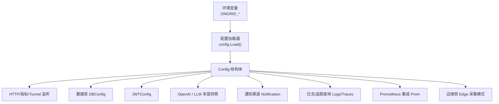
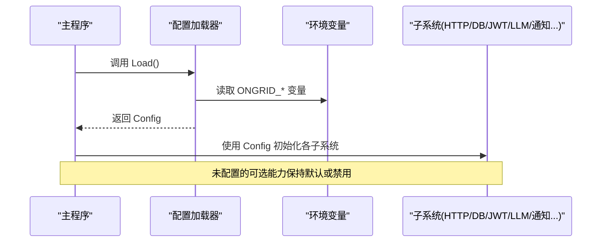
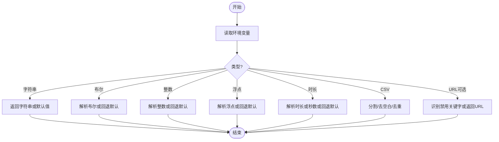
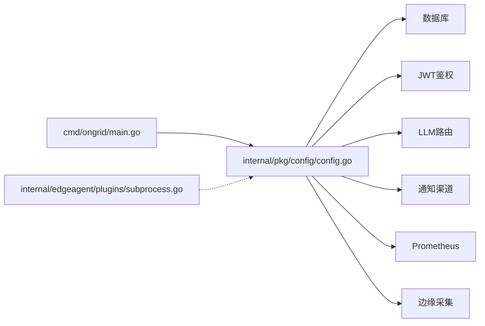
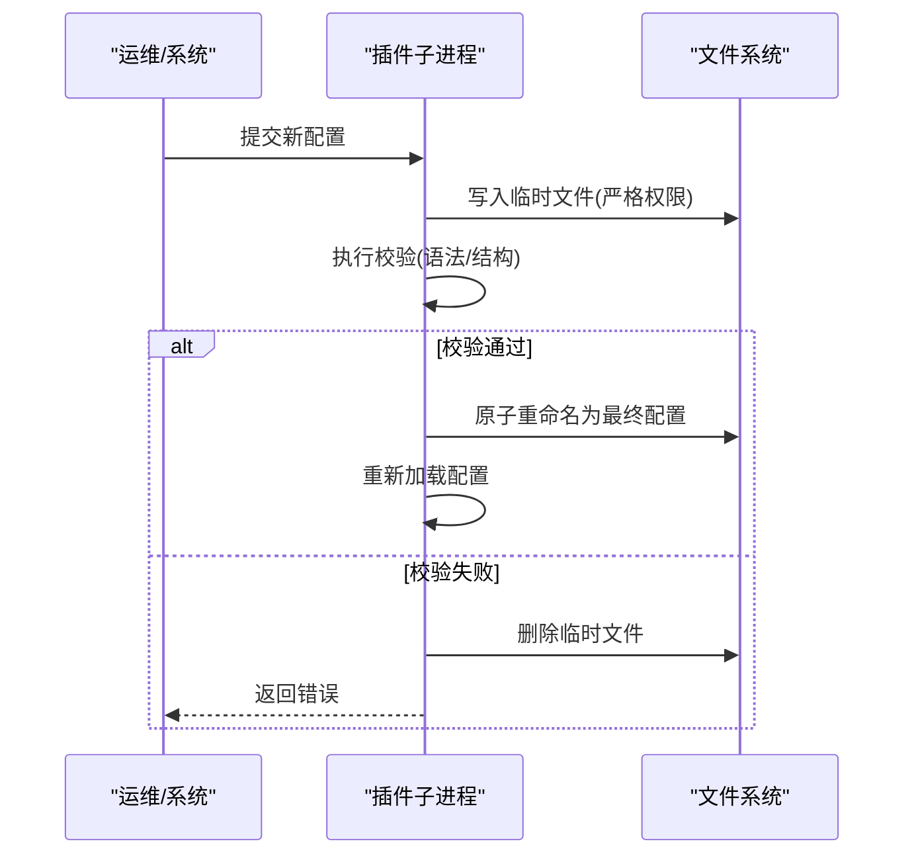

# 配置架构设计

<cite>
**本文引用的文件**
- [internal/pkg/config/config.go](file://internal/pkg/config/config.go)
- [internal/pkg/config/config_test.go](file://internal/pkg/config/config_test.go)
- [cmd/ongrid/main.go](file://cmd/ongrid/main.go)
- [deploy/install/edge/ongrid-edge.env.example](file://deploy/install/edge/ongrid-edge.env.example)
- [tests/e2e/secrets.example.env](file://tests/e2e/secrets.example.env)
- [internal/edgeagent/plugins/subprocess.go](file://internal/edgeagent/plugins/subprocess.go)
- [internal/manager/biz/aiops/tools/config_tools.go](file://internal/manager/biz/aiops/tools/config_tools.go)
</cite>

## 目录
1. [简介](#简介)
2. [项目结构](#项目结构)
3. [核心组件](#核心组件)
4. [架构总览](#架构总览)
5. [详细组件分析](#详细组件分析)
6. [依赖关系分析](#依赖关系分析)
7. [性能考量](#性能考量)
8. [故障排查指南](#故障排查指南)
9. [结论](#结论)
10. [附录](#附录)

## 简介
本技术文档聚焦于系统的配置架构设计，围绕 Config 顶层结构、分层组织与加载机制展开。系统采用“环境变量优先 + 内置默认值”的轻量级配置模型，通过统一的 Load 流程完成类型转换、默认值填充与可选能力开关（如日志/追踪查询、Prometheus、通知渠道等）。文档同时覆盖数据库、JWT、LLM 提供商、HTTP/指标/Tunnel 监听地址、边缘侧采集模式等关键配置项，并说明验证策略、错误处理与热更新边界。

## 项目结构
- 配置定义与加载位于 internal/pkg/config，提供统一的 Config 结构与 Load 函数，所有运行期配置均从环境变量读取并赋予合理默认值。
- 主进程 cmd/ongrid/main.go 在启动时调用 config.Load() 获取配置，并据此初始化 HTTP、指标、数据库、鉴权、LLM、通知、遥测等子系统。
- 边缘侧示例环境文件 deploy/install/edge/ongrid-edge.env.example 展示了 ongrid-edge 的环境变量约定；测试模板 tests/e2e/secrets.example.env 提供了 LLM/通知等外部依赖的密钥占位。
- 插件子进程配置热替换逻辑位于 internal/edgeagent/plugins/subprocess.go，体现原子写入与校验后替换的安全实践。
- AI 工具层提供配置变更草案与应用流程（config_tools.go），用于将运行时配置变更纳入可审计的工作流。

**图示来源**
- [internal/pkg/config/config.go:18-63](file://internal/pkg/config/config.go#L18-L63)
- [internal/pkg/config/config.go:417-549](file://internal/pkg/config/config.go#L417-L549)

**章节来源**
- [internal/pkg/config/config.go:18-63](file://internal/pkg/config/config.go#L18-L63)
- [internal/pkg/config/config.go:417-549](file://internal/pkg/config/config.go#L417-L549)
- [cmd/ongrid/main.go:211-220](file://cmd/ongrid/main.go#L211-L220)

## 核心组件
- Config 顶层结构：集中声明 HTTPAddr、MetricsAddr、TunnelAddr、PublicURL、K8s 事件保留策略、DB、JWT、OpenAI、LLM、Admin、Edge、FrontierClient、Prom、Grafana、Notification、Alert、Logs、Traces、PacketCapture、Skills 等模块配置。
- 各子配置：
  - DBConfig：支持 mysql/sqlite 两种后端，含 DSN/Path/Dialect。
  - JWTConfig：签名密钥与访问/刷新令牌 TTL。
  - OpenAIConfig/LLMConfig：统一的多提供商接入（Anthropic、Zhipu、Gemini、DeepSeek、Kimi）及每日 Token 限额。
  - NotificationConfig：全局开关、默认渠道、超时与各 Webhook 渠道（Webhook/Slack/Feishu/DingTalk）。
  - AlertConfig：主机告警阈值、冷却时间、评估间隔、Prom 写入失败计数等。
  - LogsConfig/TracesConfig：查询代理 URL，空值表示禁用。
  - PromConfig：启用开关、读写端点、查询端点、TLS 选项。
  - EdgeConfig：云端连接、采集模式（off/auto/embedded/scrape）、抓取配置文件路径与周期。
  - PacketCaptureConfig：原始包存储、解析器集成、证书与超时限制等。
  - SkillsConfig：外部技能目录白名单。

**章节来源**
- [internal/pkg/config/config.go:18-63](file://internal/pkg/config/config.go#L18-L63)
- [internal/pkg/config/config.go:81-144](file://internal/pkg/config/config.go#L81-L144)
- [internal/pkg/config/config.go:146-175](file://internal/pkg/config/config.go#L146-L175)
- [internal/pkg/config/config.go:177-252](file://internal/pkg/config/config.go#L177-L252)
- [internal/pkg/config/config.go:254-304](file://internal/pkg/config/config.go#L254-L304)
- [internal/pkg/config/config.go:306-326](file://internal/pkg/config/config.go#L306-L326)
- [internal/pkg/config/config.go:328-367](file://internal/pkg/config/config.go#L328-L367)
- [internal/pkg/config/config.go:369-412](file://internal/pkg/config/config.go#L369-L412)

## 架构总览
配置加载遵循“仅环境变量 + 默认值”的 MVP 策略，无第三方配置库依赖。Load 函数按模块顺序读取环境变量，进行类型转换（字符串、布尔、整数、浮点、时长、CSV 列表），并应用安全默认值。部分功能可通过特殊值显式关闭（如日志/追踪查询设置为 off/disabled 等）。

**图示来源**
- [internal/pkg/config/config.go:417-549](file://internal/pkg/config/config.go#L417-L549)
- [cmd/ongrid/main.go:211-220](file://cmd/ongrid/main.go#L211-L220)

**章节来源**
- [internal/pkg/config/config.go:417-549](file://internal/pkg/config/config.go#L417-L549)
- [cmd/ongrid/main.go:211-220](file://cmd/ongrid/main.go#L211-L220)

## 详细组件分析

### 配置加载与类型转换
- 字符串：直接读取或回退到默认值。
- 布尔：接受标准布尔字符串，非法值回退默认。
- 整数/浮点：解析失败回退默认。
- 时长：支持 Go time.ParseDuration 格式，也兼容纯秒数。
- CSV 列表：支持逗号或分号分隔，自动去空白与去重。
- URL 可选关闭：对日志/追踪查询 URL，支持 off/disabled/disable/none/null 等关键字显式禁用。

**图示来源**
- [internal/pkg/config/config.go:551-666](file://internal/pkg/config/config.go#L551-L666)
- [internal/pkg/config/config.go:571-582](file://internal/pkg/config/config.go#L571-L582)

**章节来源**
- [internal/pkg/config/config.go:551-666](file://internal/pkg/config/config.go#L551-L666)
- [internal/pkg/config/config.go:571-582](file://internal/pkg/config/config.go#L571-L582)

### 分层组织与管理策略
- 顶层 Config 聚合各子系统配置，职责清晰、便于扩展。
- 每个子系统以独立结构体承载相关参数，避免耦合。
- 默认值集中在 Load 中，保证可测试性与一致性。
- 可选能力通过布尔开关或空值控制，便于灰度与降级。

**章节来源**
- [internal/pkg/config/config.go:18-63](file://internal/pkg/config/config.go#L18-L63)
- [internal/pkg/config/config.go:417-549](file://internal/pkg/config/config.go#L417-L549)

### HTTP/指标/Tunnel 监听与公共入口
- HTTPAddr/MetricsAddr/TunnelAddr：分别暴露管理 API、指标与隧道入口。
- PublicURL：对外可达的 HTTPS 根 URL，用于生成数据面端点（如日志推送）。

**章节来源**
- [internal/pkg/config/config.go:18-32](file://internal/pkg/config/config.go#L18-L32)
- [internal/pkg/config/config.go:417-427](file://internal/pkg/config/config.go#L417-L427)

### 数据库配置（DBConfig）
- 支持 MySQL（默认）与 SQLite（测试/嵌入式场景）。
- DSN/Path/Dialect 三字段协同，仅在对应方言下生效。

**章节来源**
- [internal/pkg/config/config.go:306-319](file://internal/pkg/config/config.go#L306-L319)
- [internal/pkg/config/config.go:442-448](file://internal/pkg/config/config.go#L442-L448)

### JWT 认证配置（JWTConfig）
- Secret 用于签发与校验令牌。
- AccessTTL/RefreshTTL 控制访问与刷新令牌生命周期。

**章节来源**
- [internal/pkg/config/config.go:321-326](file://internal/pkg/config/config.go#L321-L326)
- [internal/pkg/config/config.go:449-451](file://internal/pkg/config/config.go#L449-L451)

### LLM 提供商配置（OpenAIConfig/LLMConfig）
- OpenAI 单独字段保留历史兼容性。
- LLMConfig 聚合多提供商（Anthropic、Zhipu、Gemini、DeepSeek、Kimi），每项包含 APIKey、Model、BaseURL、Models 列表。
- Default 指定未选择提供商时的默认目标。
- DailyTokenLimit 提供全局日配额上限。

**章节来源**
- [internal/pkg/config/config.go:328-367](file://internal/pkg/config/config.go#L328-L367)
- [internal/pkg/config/config.go:453-482](file://internal/pkg/config/config.go#L453-L482)

### 通知渠道配置（NotificationConfig）
- Enabled 为总开关，DefaultChannels 指定默认投递渠道。
- Timeout 控制单次发送超时。
- Webhook/Slack/Feishu/DingTalk 各自独立开关与凭据。

**章节来源**
- [internal/pkg/config/config.go:177-212](file://internal/pkg/config/config.go#L177-L212)
- [internal/pkg/config/config.go:509-534](file://internal/pkg/config/config.go#L509-L534)

### 告警配置（AlertConfig）
- 主机指标阈值（CPU/内存/磁盘/负载）与冷却时间。
- 评估间隔与边缘离线阈值。
- Prometheus 写入失败连续次数触发告警。

**章节来源**
- [internal/pkg/config/config.go:214-252](file://internal/pkg/config/config.go#L214-L252)
- [internal/pkg/config/config.go:536-544](file://internal/pkg/config/config.go#L536-L544)

### 日志/追踪查询代理（LogsConfig/TracesConfig）
- URL 为空表示禁用该信号查询页面。
- 支持显式禁用关键字（off/disabled 等）。

**章节来源**
- [internal/pkg/config/config.go:81-103](file://internal/pkg/config/config.go#L81-L103)
- [internal/pkg/config/config.go:426-427](file://internal/pkg/config/config.go#L426-L427)
- [internal/pkg/config/config.go:571-582](file://internal/pkg/config/config.go#L571-L582)

### Prometheus 集成（PromConfig）
- Enabled 控制是否启用。
- URL/RemoteWriteURL/QueryURL 分别用于不同用途。
- TLSInsecure/TLSCAPath 控制证书校验。

**章节来源**
- [internal/pkg/config/config.go:254-286](file://internal/pkg/config/config.go#L254-L286)
- [internal/pkg/config/config.go:498-503](file://internal/pkg/config/config.go#L498-L503)

### 边缘侧采集模式（EdgeConfig）
- CollectorMode：off/auto/embedded/scrape。
- ScrapeConfigFile：scrape 模式下的目标清单文件路径。
- CollectorInterval：嵌入模式采样周期。

**章节来源**
- [internal/pkg/config/config.go:377-412](file://internal/pkg/config/config.go#L377-L412)
- [internal/pkg/config/config.go:487-492](file://internal/pkg/config/config.go#L487-L492)

### 抓包解析配置（PacketCaptureConfig）
- RawDir/ParserURL/ParserArtifactBaseURL/ParserTokenSecret/ParserManagerPrivateKeyFile/ParserCAFile/ParserTimeout/ParserMaxPackets/ParserMaxBytes/ParserIncludeHex。
- 用于私有抓包解析服务集成与安全回调。

**章节来源**
- [internal/pkg/config/config.go:105-144](file://internal/pkg/config/config.go#L105-L144)
- [internal/pkg/config/config.go:428-439](file://internal/pkg/config/config.go#L428-L439)

### 技能加载（SkillsConfig）
- ExternalDirs：允许扫描的外部目录白名单，逗号/分号分隔。

**章节来源**
- [internal/pkg/config/config.go:65-79](file://internal/pkg/config/config.go#L65-L79)
- [internal/pkg/config/config.go:546-547](file://internal/pkg/config/config.go#L546-L547)

### 环境变量示例与最佳实践
- 边缘侧示例：deploy/install/edge/ongrid-edge.env.example 展示云端连接、采集模式、网络发现、插件日志等常用键。
- 测试模板：tests/e2e/secrets.example.env 提供 LLM、通知、代理等外部依赖的占位键，便于本地与 CI 切换。
- 建议：
  - 敏感信息（API Key、Secret）通过环境变量注入，避免硬编码。
  - 使用显式禁用关键字关闭可选能力，降低攻击面。
  - 合理设置超时与阈值，避免资源耗尽与噪声告警。

**章节来源**
- [deploy/install/edge/ongrid-edge.env.example:1-37](file://deploy/install/edge/ongrid-edge.env.example#L1-L37)
- [tests/e2e/secrets.example.env:1-68](file://tests/e2e/secrets.example.env#L1-L68)

## 依赖关系分析
- 主程序依赖配置加载器，再根据配置装配各子系统。
- 配置加载器仅依赖标准库与环境变量，低耦合、易测试。
- 插件子进程通过原子写入与校验实现配置热替换，避免运行时崩溃。

**图示来源**
- [cmd/ongrid/main.go:211-220](file://cmd/ongrid/main.go#L211-L220)
- [internal/pkg/config/config.go:417-549](file://internal/pkg/config/config.go#L417-L549)
- [internal/edgeagent/plugins/subprocess.go:164-206](file://internal/edgeagent/plugins/subprocess.go#L164-L206)

**章节来源**
- [cmd/ongrid/main.go:211-220](file://cmd/ongrid/main.go#L211-L220)
- [internal/pkg/config/config.go:417-549](file://internal/pkg/config/config.go#L417-L549)
- [internal/edgeagent/plugins/subprocess.go:164-206](file://internal/edgeagent/plugins/subprocess.go#L164-L206)

## 性能考量
- 配置加载为一次性操作，复杂度 O(n)（n 为环境变量数量），开销极低。
- 时长解析兼容多种格式，减少运维负担。
- 通知与告警的超时与冷却时间需结合业务规模调优，避免风暴。
- Prometheus 写入失败计数与评估间隔影响存储与 CPU 占用，应谨慎设置。

[本节为通用指导，不直接分析具体文件]

## 故障排查指南
- 配置加载失败：当前 Load 在 MVP 阶段不返回错误，但可通过单元测试断言默认值与覆盖值是否正确。
- 类型解析异常：布尔/整数/浮点/时长解析失败会回退默认值，检查环境变量格式。
- URL 禁用：确认日志/追踪查询 URL 是否误设为 off/disabled 等关键字。
- 插件配置热替换：子进程配置先写入临时文件，校验通过后原子替换，若校验失败不会污染运行配置。

**章节来源**
- [internal/pkg/config/config_test.go:8-155](file://internal/pkg/config/config_test.go#L8-L155)
- [internal/pkg/config/config_test.go:157-171](file://internal/pkg/config/config_test.go#L157-L171)
- [internal/pkg/config/config_test.go:173-196](file://internal/pkg/config/config_test.go#L173-L196)
- [internal/pkg/config/config_test.go:198-218](file://internal/pkg/config/config_test.go#L198-L218)
- [internal/pkg/config/config_test.go:220-238](file://internal/pkg/config/config_test.go#L220-L238)
- [internal/pkg/config/config_test.go:240-294](file://internal/pkg/config/config_test.go#L240-L294)
- [internal/pkg/config/config_test.go:296-326](file://internal/pkg/config/config_test.go#L296-L326)
- [internal/pkg/config/config_test.go:328-363](file://internal/pkg/config/config_test.go#L328-L363)
- [internal/edgeagent/plugins/subprocess.go:164-206](file://internal/edgeagent/plugins/subprocess.go#L164-L206)

## 结论
本项目的配置架构以简洁、可测试、可扩展为目标，通过统一的 Load 流程与环境变量驱动，实现了跨模块的配置管理与默认值保护。多提供商 LLM、通知渠道、告警与遥测等能力均以开关与阈值形式暴露，便于在不同部署环境中灵活裁剪。配合插件子进程的原子配置替换与 AI 工具层的配置变更工作流，系统在安全性与可运维性之间取得平衡。

[本节为总结性内容，不直接分析具体文件]

## 附录

### 配置热更新的实现原理与限制
- 插件子进程配置热替换：
  - 新配置先写入临时文件，设置严格权限。
  - 执行校验钩子（如语法/结构校验），失败则丢弃临时文件。
  - 校验通过后原子重命名为最终配置文件，确保运行时一致性。
- 限制条件：
  - 当前主进程配置加载发生在启动阶段，不支持运行时动态重载主 Config。
  - 插件配置热更新依赖于子进程自身的重新加载机制与校验逻辑。
  - 某些配置（如数据库连接、JWT 密钥）涉及全局状态，重启更安全。

**图示来源**
- [internal/edgeagent/plugins/subprocess.go:164-206](file://internal/edgeagent/plugins/subprocess.go#L164-L206)

**章节来源**
- [internal/edgeagent/plugins/subprocess.go:164-206](file://internal/edgeagent/plugins/subprocess.go#L164-L206)

### 配置变更工作流（AI 工具辅助）
- 草案变更：生成配置变更草案，供审核与预览。
- 应用变更：经确认后执行实际变更，包含哈希校验与默认值填充。
- 作用范围：主要用于运行时可调的配置项，结合审计与回滚策略提升安全性。

**章节来源**
- [internal/manager/biz/aiops/tools/config_tools.go:92-254](file://internal/manager/biz/aiops/tools/config_tools.go#L92-L254)