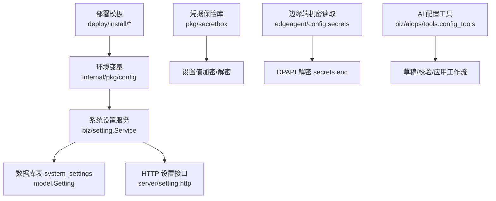
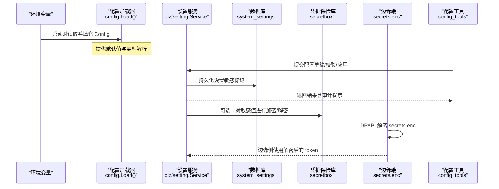
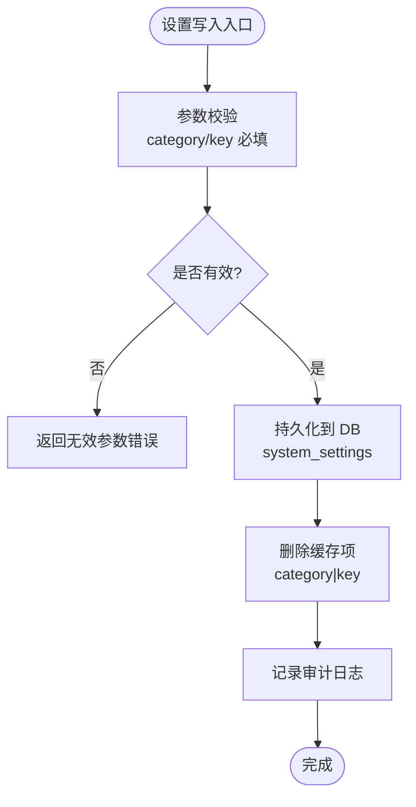
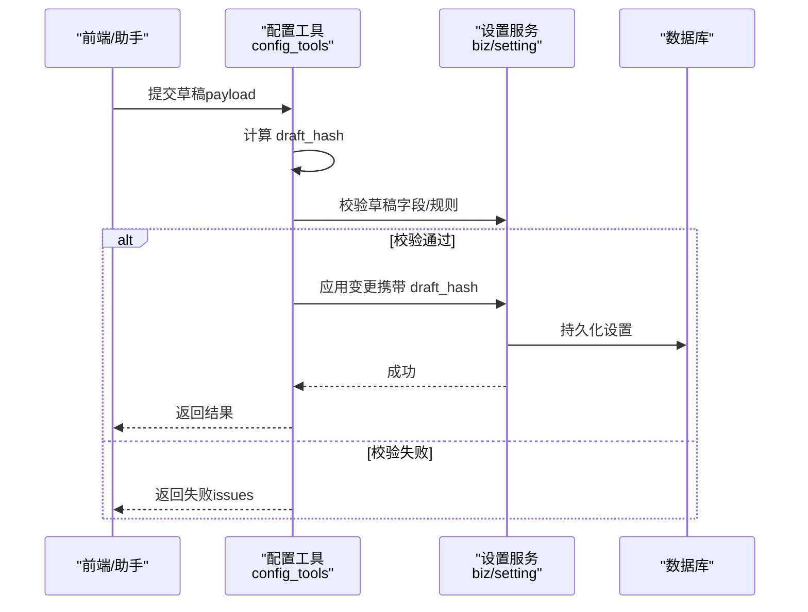
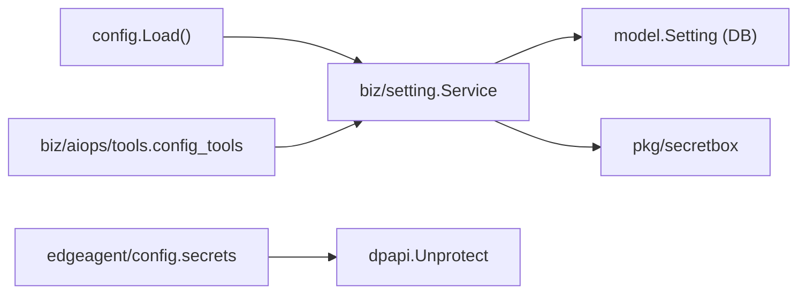

# 配置管理

<cite>
**本文引用的文件**
- [internal/pkg/config/config.go](file://internal/pkg/config/config.go)
- [internal/edgeagent/config/secrets.go](file://internal/edgeagent/config/secrets.go)
- [internal/pkg/secretbox/secretbox.go](file://internal/pkg/secretbox/secretbox.go)
- [internal/manager/biz/setting/service.go](file://internal/manager/biz/setting/service.go)
- [internal/manager/model/setting/model.go](file://internal/manager/model/setting/model.go)
- [internal/manager/server/setting/http.go](file://internal/manager/server/setting/http.go)
- [internal/manager/biz/aiops/tools/config_tools.go](file://internal/manager/biz/aiops/tools/config_tools.go)
- [deploy/install/docker-compose.yml](file://deploy/install/docker-compose.yml)
- [deploy/install/edge/ongrid-edge.env.example](file://deploy/install/edge/ongrid-edge.env.example)
- [tests/e2e/testenv/env.go](file://tests/e2e/testenv/env.go)
- [tests/e2e/testenv/secrets.go](file://tests/e2e/testenv/secrets.go)
</cite>

## 目录
1. [简介](#简介)
2. [项目结构](#项目结构)
3. [核心组件](#核心组件)
4. [架构总览](#架构总览)
5. [详细组件分析](#详细组件分析)
6. [依赖关系分析](#依赖关系分析)
7. [性能考虑](#性能考虑)
8. [故障排查指南](#故障排查指南)
9. [结论](#结论)
10. [附录](#附录)

## 简介
本技术文档围绕配置管理系统展开，覆盖以下主题：
- 环境变量配置、动态配置更新与配置验证机制
- 运行时配置的加载与热更新流程（优先级、冲突解决、回滚策略）
- 密钥管理系统（加密存储、访问控制、轮换）
- 多环境配置管理（开发、测试、生产隔离与同步）
- 具体配置示例与管理操作
- 最佳实践与故障排查

## 项目结构
配置相关代码主要分布在如下模块：
- 运行时配置加载：internal/pkg/config
- 边缘端机密读取：internal/edgeagent/config
- 系统设置服务（DB 驱动的配置中心）：internal/manager/biz/setting 与 internal/manager/model/setting
- 设置 HTTP API：internal/manager/server/setting
- 凭据保险库（加密存储）：internal/pkg/secretbox
- AI 工具链中的配置变更工作流（草稿/校验/应用）：internal/manager/biz/aiops/tools
- 部署与环境变量模板：deploy/install/*, tests/e2e/*

图表来源
- [internal/pkg/config/config.go:417-549](file://internal/pkg/config/config.go#L417-L549)
- [internal/manager/biz/setting/service.go:81-165](file://internal/manager/biz/setting/service.go#L81-L165)
- [internal/manager/model/setting/model.go:14-54](file://internal/manager/model/setting/model.go#L14-L54)
- [internal/manager/server/setting/http.go:81-122](file://internal/manager/server/setting/http.go#L81-L122)
- [internal/pkg/secretbox/secretbox.go:53-109](file://internal/pkg/secretbox/secretbox.go#L53-L109)
- [internal/edgeagent/config/secrets.go:21-38](file://internal/edgeagent/config/secrets.go#L21-L38)
- [internal/manager/biz/aiops/tools/config_tools.go:212-372](file://internal/manager/biz/aiops/tools/config_tools.go#L212-L372)

章节来源
- [internal/pkg/config/config.go:417-549](file://internal/pkg/config/config.go#L417-L549)
- [internal/manager/biz/setting/service.go:81-165](file://internal/manager/biz/setting/service.go#L81-L165)
- [internal/manager/model/setting/model.go:14-54](file://internal/manager/model/setting/model.go#L14-L54)
- [internal/manager/server/setting/http.go:81-122](file://internal/manager/server/setting/http.go#L81-L122)
- [internal/pkg/secretbox/secretbox.go:53-109](file://internal/pkg/secretbox/secretbox.go#L53-L109)
- [internal/edgeagent/config/secrets.go:21-38](file://internal/edgeagent/config/secrets.go#L21-L38)
- [internal/manager/biz/aiops/tools/config_tools.go:212-372](file://internal/manager/biz/aiops/tools/config_tools.go#L212-L372)

## 核心组件
- 运行时配置加载器：从环境变量构建全局 Config，提供默认值与类型解析。
- 系统设置服务：以 DB 为源的键值配置中心，支持缓存、敏感字段掩码、批量写入与失效。
- 凭据保险库：使用 AES-GCM 对敏感数据进行落盘加密，支持版本前缀与向后兼容明文。
- 边缘端机密读取：通过 DPAPI 解密本地 secrets.enc 获取 token，失败时回退到环境变量。
- 配置变更工具：提供“草稿—校验—应用”的原子化配置变更流程，含哈希校验与错误处理。

章节来源
- [internal/pkg/config/config.go:417-549](file://internal/pkg/config/config.go#L417-L549)
- [internal/manager/biz/setting/service.go:81-165](file://internal/manager/biz/setting/service.go#L81-L165)
- [internal/pkg/secretbox/secretbox.go:53-109](file://internal/pkg/secretbox/secretbox.go#L53-L109)
- [internal/edgeagent/config/secrets.go:21-38](file://internal/edgeagent/config/secrets.go#L21-L38)
- [internal/manager/biz/aiops/tools/config_tools.go:212-372](file://internal/manager/biz/aiops/tools/config_tools.go#L212-L372)

## 架构总览
下图展示了配置系统的整体交互：环境变量作为启动期配置；系统设置服务提供运行时可编辑配置；凭据保险库负责敏感数据加密；边缘端通过 DPAPI 解密本地机密文件；AI 工具链提供安全的配置变更工作流。

图表来源
- [internal/pkg/config/config.go:417-549](file://internal/pkg/config/config.go#L417-L549)
- [internal/manager/biz/setting/service.go:81-165](file://internal/manager/biz/setting/service.go#L81-L165)
- [internal/pkg/secretbox/secretbox.go:53-109](file://internal/pkg/secretbox/secretbox.go#L53-L109)
- [internal/edgeagent/config/secrets.go:21-38](file://internal/edgeagent/config/secrets.go#L21-L38)
- [internal/manager/biz/aiops/tools/config_tools.go:212-372](file://internal/manager/biz/aiops/tools/config_tools.go#L212-L372)

## 详细组件分析

### 环境变量配置加载器
- 功能：集中从环境变量加载运行时配置，包含 HTTP/Metrics/Tunnel、数据库、JWT、LLM、通知、告警、Prometheus/Grafana/Loki/Tempo、包捕获等。
- 特性：
  - 提供合理的默认值与类型解析（字符串、布尔、整数、浮点、时长、CSV）。
  - 支持可选 URL 开关（如 off/disabled 等）。
  - 支持多 LLM 提供商模型列表解析与去重。
- 适用场景：容器编排、Compose、Kubernetes 等通过环境变量注入配置。

章节来源
- [internal/pkg/config/config.go:417-549](file://internal/pkg/config/config.go#L417-L549)

### 系统设置服务（DB 驱动的配置中心）
- 功能：提供按分类（category）和键（key）的键值配置读写，支持：
  - 进程内缓存（RWMutex + map），减少热点路径的 DB 往返。
  - 敏感字段掩码（列表响应中隐藏完整值）。
  - 批量写入（SetBatch）保证一组设置的原子性。
  - 不存在即写入（SetIfAbsent）用于首次启动时的种子数据。
  - 网络发现开关等平台级配置读取。
- 设计要点：
  - 缓存键为 category|key，写操作后删除对应缓存项。
  - 列表接口对敏感值采用“首尾各保留4字符+***”的掩码策略。
  - 支持管理员审计事件记录（在 HTTP 层触发）。

图表来源
- [internal/manager/biz/setting/service.go:108-165](file://internal/manager/biz/setting/service.go#L108-L165)
- [internal/manager/server/setting/http.go:81-122](file://internal/manager/server/setting/http.go#L81-L122)

章节来源
- [internal/manager/biz/setting/service.go:81-165](file://internal/manager/biz/setting/service.go#L81-L165)
- [internal/manager/server/setting/http.go:81-122](file://internal/manager/server/setting/http.go#L81-L122)

### 系统设置模型与分类
- 模型：Setting 实体包含 category、key、value、sensitive、时间戳。
- 分类：llm、prom、grafana、loki、tempo、websearch、agent、platform。
- 已知键：
  - platform：network_discovery_enabled
  - agent：write_enabled、llm_timeout_seconds、output_locale
  - llm：openai_*、anthropic_*、zhipu_*、gemini_*、deepseek_*、kimi_*、custom_*、default_provider
  - prom：query_url、remote_write_url、bearer_token、basic_user、basic_password、tls_insecure、tls_ca_pem
  - grafana：root_url、sa_token、api_key、org_id
  - loki/tempo/websearch：各自对应的 URL、认证、TLS 与 provider 选择

章节来源
- [internal/manager/model/setting/model.go:14-54](file://internal/manager/model/setting/model.go#L14-L54)
- [internal/manager/model/setting/model.go:79-246](file://internal/manager/model/setting/model.go#L79-L246)

### 凭据保险库（加密存储）
- 算法：AES-256-GCM，密钥由环境变量 ONGRID_SECRET_KEY 派生（SHA-256）。
- 格式：v1:base64(nonce || ciphertext+tag)，支持版本前缀以便未来升级。
- 行为：
  - 空输入直接返回空（不产生密文噪声）。
  - 无版本前缀视为遗留明文，直接透传（便于迁移）。
  - KeyIsWeak() 可用于检测未设置强密钥的情况。
- 用途：存储敏感字段（如 API Key、Token、Password）的落盘加密。

章节来源
- [internal/pkg/secretbox/secretbox.go:1-109](file://internal/pkg/secretbox/secretbox.go#L1-L109)

### 边缘端机密读取（DPAPI）
- 功能：读取 secrets.enc 并使用 DPAPI 解密 broker token。
- 流程：读取文件 → 解密 → 非空校验 → 返回明文 token。
- 回退：调用方应在失败时回退到环境变量（向后兼容）。

章节来源
- [internal/edgeagent/config/secrets.go:21-38](file://internal/edgeagent/config/secrets.go#L21-L38)

### 配置变更工作流（草稿/校验/应用）
- 目标：确保配置变更安全、可追溯、可回滚。
- 步骤：
  - 草稿生成：构造变更草案（payload），计算哈希（draft_hash）。
  - 校验：检查 payload 完整性、必填字段、规则有效性。
  - 应用：携带 draft_hash 与 payload 执行实际变更，防止篡改。
- 错误处理：
  - 缺少 payload/draft_hash 或哈希不匹配将拒绝应用。
  - 不支持的动作将被拒绝。
- 审计：结合 HTTP 层的审计事件记录，记录变更摘要与敏感值提示。

图表来源
- [internal/manager/biz/aiops/tools/config_tools.go:212-372](file://internal/manager/biz/aiops/tools/config_tools.go#L212-L372)
- [internal/manager/biz/setting/service.go:108-165](file://internal/manager/biz/setting/service.go#L108-L165)

章节来源
- [internal/manager/biz/aiops/tools/config_tools.go:212-372](file://internal/manager/biz/aiops/tools/config_tools.go#L212-L372)
- [internal/manager/biz/setting/service.go:108-165](file://internal/manager/biz/setting/service.go#L108-L165)

### 多环境配置管理方案
- 环境变量优先：所有二进制通过统一的环境变量加载配置，便于在不同环境（开发、测试、生产）间切换。
- 部署模板：
  - docker-compose 与安装脚本提供默认环境变量与端口绑定。
  - 边缘端环境变量模板提供 edge 连接与采集模式配置。
- 测试环境：
  - e2e 测试通过 testenv 加载真实外部服务的密钥，遵循“环境变量 > secrets.local.env”的加载顺序。
  - 缺失密钥时跳过测试，避免泄露与失败。

章节来源
- [internal/pkg/config/config.go:417-549](file://internal/pkg/config/config.go#L417-L549)
- [deploy/install/docker-compose.yml](file://deploy/install/docker-compose.yml)
- [deploy/install/edge/ongrid-edge.env.example](file://deploy/install/edge/ongrid-edge.env.example)
- [tests/e2e/testenv/env.go:29-45](file://tests/e2e/testenv/env.go#L29-L45)
- [tests/e2e/testenv/secrets.go:31-49](file://tests/e2e/testenv/secrets.go#L31-L49)

## 依赖关系分析
- 配置加载器依赖标准库 os/strconv/time，无外部依赖，轻量且稳定。
- 设置服务依赖数据库存储与进程内缓存，读多写少场景下性能良好。
- 凭据保险库依赖 crypto/aes/cipher/rand/sha256/base64，实现简单可靠。
- 边缘端机密读取依赖 dpapi 解密，适用于 Windows 环境。
- 配置工具依赖设置服务与数据库，提供端到端的变更工作流。

图表来源
- [internal/pkg/config/config.go:417-549](file://internal/pkg/config/config.go#L417-L549)
- [internal/manager/biz/setting/service.go:81-165](file://internal/manager/biz/setting/service.go#L81-L165)
- [internal/pkg/secretbox/secretbox.go:53-109](file://internal/pkg/secretbox/secretbox.go#L53-L109)
- [internal/edgeagent/config/secrets.go:21-38](file://internal/edgeagent/config/secrets.go#L21-L38)
- [internal/manager/biz/aiops/tools/config_tools.go:212-372](file://internal/manager/biz/aiops/tools/config_tools.go#L212-L372)

章节来源
- [internal/pkg/config/config.go:417-549](file://internal/pkg/config/config.go#L417-L549)
- [internal/manager/biz/setting/service.go:81-165](file://internal/manager/biz/setting/service.go#L81-L165)
- [internal/pkg/secretbox/secretbox.go:53-109](file://internal/pkg/secretbox/secretbox.go#L53-L109)
- [internal/edgeagent/config/secrets.go:21-38](file://internal/edgeagent/config/secrets.go#L21-L38)
- [internal/manager/biz/aiops/tools/config_tools.go:212-372](file://internal/manager/biz/aiops/tools/config_tools.go#L212-L372)

## 性能考虑
- 设置服务使用进程内缓存（map + RWMutex），适合小表高频读的场景，显著降低 DB 压力。
- 批量写入（SetBatch）减少多次事务开销，提高一致性。
- 敏感字段掩码仅在列表响应时执行，避免影响写入路径。
- 配置加载器仅做环境变量解析，无额外 IO，启动快速。
- 凭据保险库使用 AES-GCM，加解密开销低，适合频繁访问的敏感字段。

[本节为通用性能讨论，无需特定文件引用]

## 故障排查指南
- 环境变量未生效：
  - 检查环境变量名称与大小写是否正确。
  - 确认默认值是否符合预期（例如某些 URL 支持 off/disabled 关闭）。
- 设置未更新：
  - 检查设置服务缓存是否被正确失效（写操作后会删除对应缓存项）。
  - 若手动修改数据库，可使用 InvalidateAll 清空缓存。
- 敏感值泄露风险：
  - 确保敏感字段标记为 sensitive=true，列表接口会自动掩码。
  - 审计事件记录 value_hint，避免记录完整敏感值。
- 凭据解密失败：
  - 检查 ONGRID_SECRET_KEY 是否与加密时一致。
  - 对于遗留明文，Decrypt 会透传，需逐步迁移到加密格式。
- 边缘端 token 为空：
  - 检查 secrets.enc 是否存在且可读取。
  - 确认 DPAPI 解密成功，失败时回退到环境变量。
- 配置变更失败：
  - 检查草稿哈希是否匹配，payload 是否完整。
  - 查看校验错误信息，修正后再应用。

章节来源
- [internal/manager/biz/setting/service.go:205-242](file://internal/manager/biz/setting/service.go#L205-L242)
- [internal/manager/server/setting/http.go:81-122](file://internal/manager/server/setting/http.go#L81-L122)
- [internal/pkg/secretbox/secretbox.go:77-109](file://internal/pkg/secretbox/secretbox.go#L77-L109)
- [internal/edgeagent/config/secrets.go:21-38](file://internal/edgeagent/config/secrets.go#L21-L38)
- [internal/manager/biz/aiops/tools/config_tools.go:334-372](file://internal/manager/biz/aiops/tools/config_tools.go#L334-L372)

## 结论
该配置管理系统通过环境变量与数据库双通道实现灵活、安全的配置管理：
- 环境变量用于启动期配置与默认值。
- 数据库驱动的设置服务提供运行时可编辑配置，支持缓存、掩码与批量写入。
- 凭据保险库确保敏感数据加密存储，支持版本前缀与向后兼容。
- 边缘端通过 DPAPI 解密本地机密文件，保障传输安全。
- 配置变更工作流提供草稿、校验与应用的安全闭环，具备审计与回滚能力。
- 多环境通过环境变量与部署模板实现隔离与同步。

[本节为总结性内容，无需特定文件引用]

## 附录
- 环境变量参考：参见配置加载器中的 Load 函数，涵盖 HTTP、Metrics、Tunnel、DB、JWT、LLM、通知、告警、Prometheus/Grafana/Loki/Tempo、包捕获等。
- 部署模板：docker-compose 与安装脚本提供默认环境变量与端口绑定。
- 测试密钥管理：e2e 测试通过 testenv 加载真实外部服务的密钥，遵循“环境变量 > secrets.local.env”的加载顺序。

章节来源
- [internal/pkg/config/config.go:417-549](file://internal/pkg/config/config.go#L417-L549)
- [deploy/install/docker-compose.yml](file://deploy/install/docker-compose.yml)
- [tests/e2e/testenv/secrets.go:31-49](file://tests/e2e/testenv/secrets.go#L31-L49)