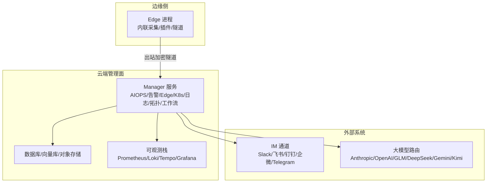
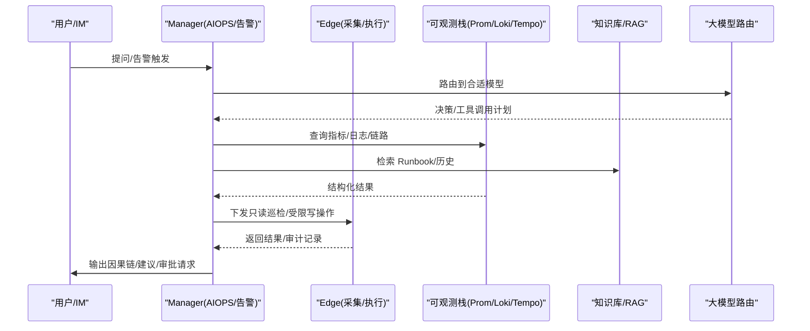
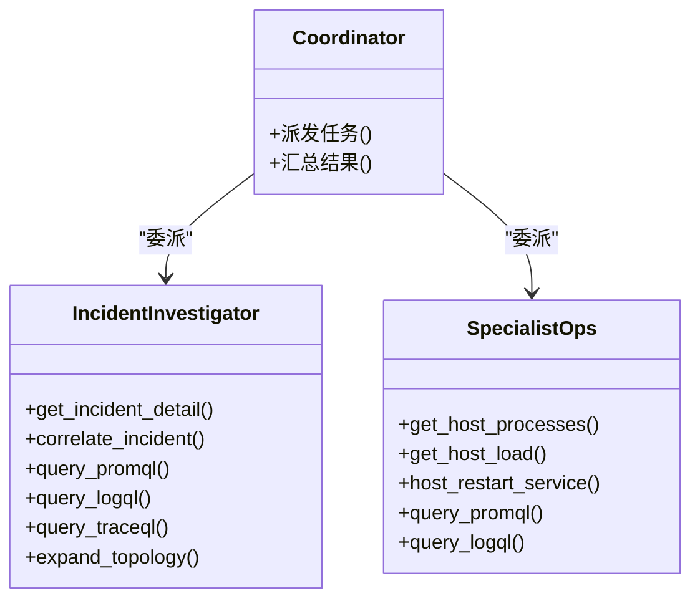
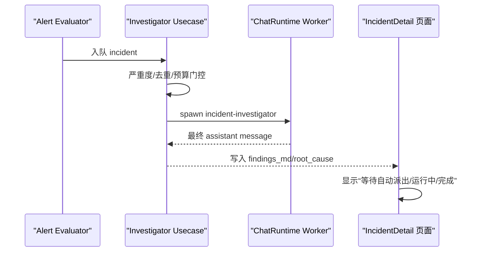
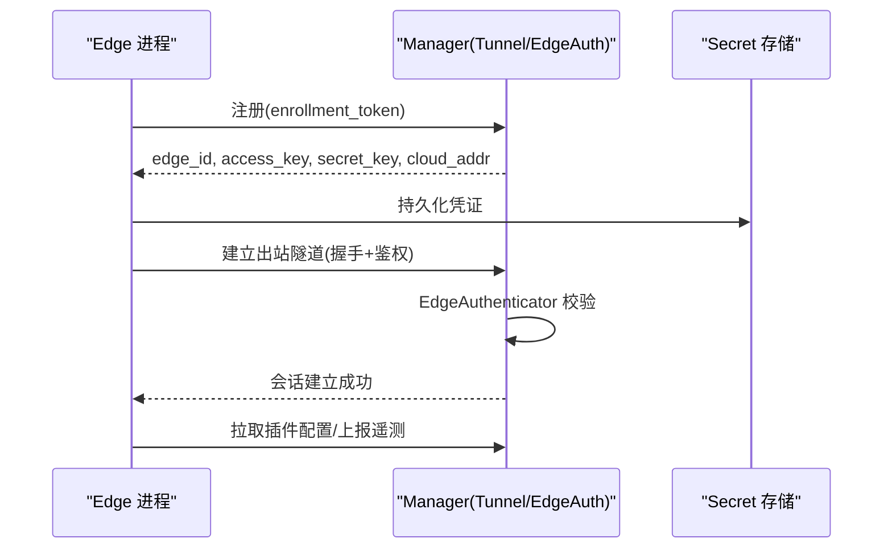
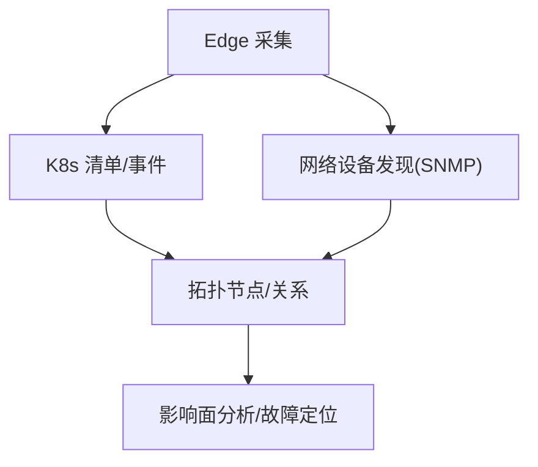
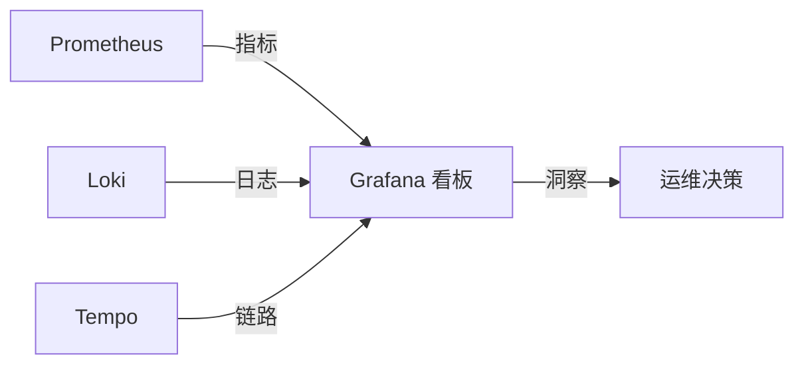
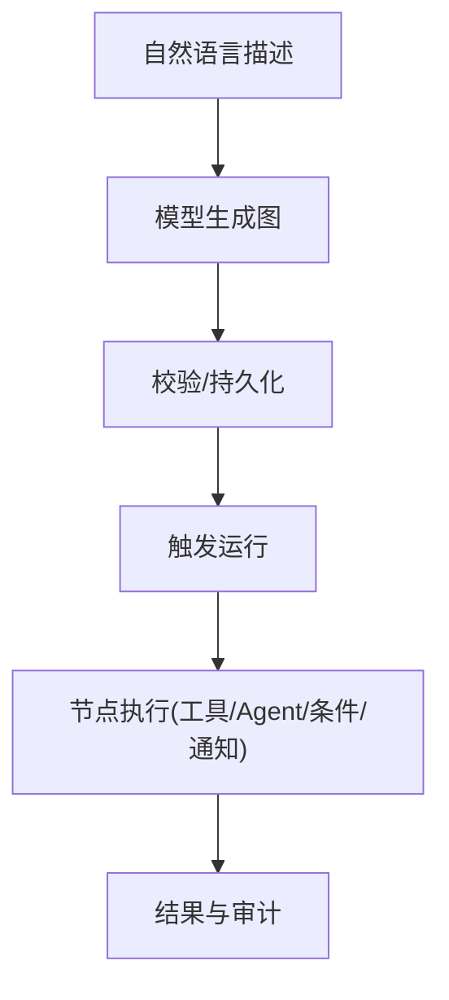
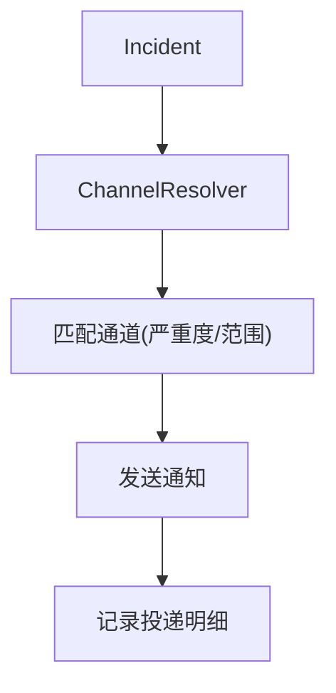
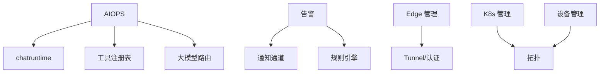

# 产品特性与价值

<cite>
**本文引用的文件**
- [README_ZH.md](file://README_ZH.md)
- [agents/incident-investigator.md](file://agents/incident-investigator.md)
- [agents/specialist-ops.md](file://agents/specialist-ops.md)
- [internal/manager/biz/alert/investigator/usecase.go](file://internal/manager/biz/alert/investigator/usecase.go)
- [internal/manager/server/aiops/http.go](file://internal/manager/server/aiops/http.go)
- [internal/pkg/tunnel/packet_capture.go](file://internal/pkg/tunnel/packet_capture.go)
- [cmd/ongrid-edge/enroll.go](file://cmd/ongrid-edge/enroll.go)
- [internal/edgeagent/plugins/config_tunnel.go](file://internal/edgeagent/plugins/config_tunnel.go)
- [internal/manager/service/frontierbound/handlers.go](file://internal/manager/service/frontierbound/handlers.go)
- [internal/manager/biz/edge/usecase.go](file://internal/manager/biz/edge/usecase.go)
- [internal/manager/service/k8s/service.go](file://internal/manager/service/k8s/service.go)
- [web/src/pages/Kubernetes.tsx](file://web/src/pages/Kubernetes.tsx)
- [web/src/api/traces.ts](file://web/src/api/traces.ts)
- [internal/manager/model/alert/model.go](file://internal/manager/model/alert/model.go)
- [internal/manager/biz/alert/router.go](file://internal/manager/biz/alert/router.go)
- [internal/manager/data/alert/store/seed.go](file://internal/manager/data/alert/store/seed.go)
- [internal/manager/biz/flow/generate.go](file://internal/manager/biz/flow/generate.go)
- [web/src/api/flows.ts](file://web/src/api/flows.ts)
- [docs/workflow-catalog.md](file://docs/workflow-catalog.md)
- [internal/manager/biz/knowledge/builtin_vault/concepts/observability.md](file://internal/manager/biz/knowledge/builtin_vault/concepts/observability.md)
</cite>

## 目录
1. [简介](#简介)
2. [项目结构](#项目结构)
3. [核心组件](#核心组件)
4. [架构总览](#架构总览)
5. [详细组件分析](#详细组件分析)
6. [依赖关系分析](#依赖关系分析)
7. [性能考量](#性能考量)
8. [故障排查指南](#故障排查指南)
9. [结论](#结论)
10. [附录](#附录)

## 简介
Ongrid 智能运维平台以 AI Agent 为核心，提供“懂系统、能定位根因、可自动修复”的自动化运维能力。平台通过零信任安全架构实现 Edge 端主动连接云端的安全通信模式，支持多云环境下的 Kubernetes 集群与网络设备统一管理，并提供实时监控、日志聚合、分布式追踪等全栈可观测性能力。借助告警驱动的自动调查、RCA 根因分析、工作流编排与审批闸门，Ongrid 有效解决传统运维中的故障定位困难、告警风暴、批量操作效率低等痛点，带来显著的业务价值与投资回报。

## 项目结构
仓库采用分层模块化组织：
- agents：Agent 角色定义与提示词（如 incident-investigator、specialist-ops）
- api：API 契约（proto），统一对外接口规范
- cmd：服务端与 Edge 端入口程序
- internal：核心业务逻辑（AIOPS、告警、Edge、K8s、日志、拓扑、工作流等）
- web：前端 SPA（React + TypeScript）
- deploy：部署脚本与 Helm Chart
- docs：产品与工作流文档

图表来源
- [internal/pkg/tunnel/packet_capture.go:5-22](file://internal/pkg/tunnel/packet_capture.go#L5-L22)
- [internal/manager/service/k8s/service.go:1-43](file://internal/manager/service/k8s/service.go#L1-L43)
- [internal/manager/biz/alert/router.go:1-37](file://internal/manager/biz/alert/router.go#L1-L37)
- [internal/manager/biz/flow/generate.go:1-22](file://internal/manager/biz/flow/generate.go#L1-L22)

章节来源
- [README_ZH.md:43-56](file://README_ZH.md#L43-L56)

## 核心组件
- AI Agent 体系：Coordinator + Specialist（SRE/网络/DB/运维）双层协作，基于工具调用与知识库进行多轮推理与证据收集。
- 告警驱动自动调查：告警触发后自动派生 RCA worker，产出因果链与下一步建议。
- 零信任安全通信：Edge 主动外联建立隧道，主机无需暴露入站端口。
- 多云 K8s 与网络设备管理：通过 Edge 注册集群，拉取资源与事件，映射到拓扑；SNMP 探测与邻居发现构建主机-设备关系。
- 可观测性：指标、日志、链路三信号统一接入，Agent 自动生成查询并关联上下文。
- 工作流编排：可视化 DAG，支持自然语言生成流程，串联触发器、Agent、工具、条件与通知。

章节来源
- [agents/incident-investigator.md:1-121](file://agents/incident-investigator.md#L1-L121)
- [agents/specialist-ops.md:1-72](file://agents/specialist-ops.md#L1-L72)
- [internal/manager/biz/alert/investigator/usecase.go:1-32](file://internal/manager/biz/alert/investigator/usecase.go#L1-L32)
- [internal/manager/biz/knowledge/builtin_vault/concepts/observability.md:1-53](file://internal/manager/biz/knowledge/builtin_vault/concepts/observability.md#L1-L53)
- [docs/workflow-catalog.md:1-30](file://docs/workflow-catalog.md#L1-L30)

## 架构总览
Ongrid 由“云端 Manager + 边缘 Edge + 可观测栈 + 外部集成”构成。Edge 负责数据采集、命令执行与本地调试，并通过出站隧道与 Manager 安全通信；Manager 提供 AIOPS、告警、Edge/K8s/日志/拓扑/工作流等服务，结合知识库与大模型完成智能诊断与自动化处置。

图表来源
- [internal/manager/server/aiops/http.go:85-115](file://internal/manager/server/aiops/http.go#L85-L115)
- [internal/manager/biz/alert/investigator/usecase.go:1-32](file://internal/manager/biz/alert/investigator/usecase.go#L1-L32)
- [internal/manager/biz/knowledge/builtin_vault/concepts/observability.md:1-53](file://internal/manager/biz/knowledge/builtin_vault/concepts/observability.md#L1-L53)

## 详细组件分析

### AI Agent 驱动的自动化运维
- 角色分工：incident-investigator 专注根因溯源，specialist-ops 聚焦单点服务状态与恢复建议，coordinator 负责任务派发与综合回复。
- 工具边界：RCA 仅读取数据，任何变更需经 reviewer 审批；运维专家重启服务会触发二审。
- 预算控制：限制工具调用次数与迭代轮次，避免空转与死循环。

图表来源
- [agents/incident-investigator.md:14-51](file://agents/incident-investigator.md#L14-L51)
- [agents/specialist-ops.md:18-35](file://agents/specialist-ops.md#L18-L35)

章节来源
- [agents/incident-investigator.md:1-121](file://agents/incident-investigator.md#L1-L121)
- [agents/specialist-ops.md:1-72](file://agents/specialist-ops.md#L1-L72)
- [internal/manager/server/aiops/http.go:85-115](file://internal/manager/server/aiops/http.go#L85-L115)

### 告警驱动的自动调查与根因分析
- 触发机制：PipelineEvaluator 在告警发生时将事件入队，investigator usecase 根据严重度/去重/预算门控决定是否启动 RCA worker。
- 产出物：RCA 报告写入 investigation_reports，前端 IncidentDetail 页面渲染运行中/完成态。
- 容错设计：缺失 chatruntime、租户超预算或 LLM 崩溃均不会阻塞原始告警流水线。

图表来源
- [internal/manager/biz/alert/investigator/usecase.go:1-32](file://internal/manager/biz/alert/investigator/usecase.go#L1-L32)
- [web/src/pages/IncidentDetail.tsx:502-529](file://web/src/pages/IncidentDetail.tsx#L502-L529)

章节来源
- [internal/manager/biz/alert/investigator/usecase.go:1-32](file://internal/manager/biz/alert/investigator/usecase.go#L1-L32)
- [web/src/pages/IncidentDetail.tsx:502-529](file://web/src/pages/IncidentDetail.tsx#L502-L529)

### 零信任安全架构与 Edge 主动连接
- 出站隧道：Edge 主动拨号至云端，主机不开放 22/80/443 等入站端口，降低攻击面。
- 认证与会话：enrollment 获取 access_key/secret_key，tunnel 握手后建立会话；支持密钥轮换。
- 配置下发：插件通过 tunnel 动态拉取配置（如日志推送目标），支持环境变量回退。

图表来源
- [cmd/ongrid-edge/enroll.go:25-38](file://cmd/ongrid-edge/enroll.go#L25-L38)
- [internal/edgeagent/plugins/config_tunnel.go:68-91](file://internal/edgeagent/plugins/config_tunnel.go#L68-L91)
- [internal/manager/service/frontierbound/handlers.go:55-67](file://internal/manager/service/frontierbound/handlers.go#L55-L67)
- [internal/manager/biz/edge/usecase.go:311-335](file://internal/manager/biz/edge/usecase.go#L311-L335)

章节来源
- [README_ZH.md:48-49](file://README_ZH.md#L48-L49)
- [internal/pkg/tunnel/packet_capture.go:5-22](file://internal/pkg/tunnel/packet_capture.go#L5-L22)
- [internal/manager/biz/edge/usecase.go:311-335](file://internal/manager/biz/edge/usecase.go#L311-L335)

### 多云环境与 K8s/网络设备统一管理
- K8s 生命周期：通过 Edge 注册集群，查看工作负载与事件，管理升级，并将资源映射到拓扑。
- 网络设备：从 Edge 主机发现邻居，经 SNMP 校验与轮询接口状态，建立主机到网络设备的拓扑关系。
- 前端能力：集群列表、在线统计、创建/删除/升级等操作。

图表来源
- [internal/manager/service/k8s/service.go:1-43](file://internal/manager/service/k8s/service.go#L1-L43)
- [web/src/pages/Kubernetes.tsx:83-140](file://web/src/pages/Kubernetes.tsx#L83-L140)

章节来源
- [README_ZH.md:55-56](file://README_ZH.md#L55-L56)
- [web/src/pages/Kubernetes.tsx:83-140](file://web/src/pages/Kubernetes.tsx#L83-L140)

### 可观测性：监控、日志、分布式追踪
- 三信号策略：指标用于趋势与告警，日志用于取证与归因，链路用于跨服务延迟与依赖分析。
- 成本权衡：指标关注基数，日志关注索引基数，链路关注采样率。
- 前端集成：Trace 搜索与详情展示，便于快速定位慢调用与异常分支。

图表来源
- [internal/manager/biz/knowledge/builtin_vault/concepts/observability.md:1-53](file://internal/manager/biz/knowledge/builtin_vault/concepts/observability.md#L1-L53)
- [web/src/api/traces.ts:81-112](file://web/src/api/traces.ts#L81-L112)

章节来源
- [internal/manager/biz/knowledge/builtin_vault/concepts/observability.md:1-53](file://internal/manager/biz/knowledge/builtin_vault/concepts/observability.md#L1-L53)
- [web/src/api/traces.ts:81-112](file://web/src/api/traces.ts#L81-L112)

### 工作流编排与自然语言生成
- 节点类型：触发器（手动/定时/告警）、工具、Agent、条件、转换、通知、HTTP 请求等。
- 自然语言生成：输入一句话描述，模型基于工具目录生成可执行的图结构，支持后续运行与钻取。
- 前端 API：封装 flows CRUD、运行与结果查询。

图表来源
- [internal/manager/biz/flow/generate.go:1-22](file://internal/manager/biz/flow/generate.go#L1-L22)
- [web/src/api/flows.ts:1-55](file://web/src/api/flows.ts#L1-L55)
- [docs/workflow-catalog.md:1-30](file://docs/workflow-catalog.md#L1-L30)

章节来源
- [docs/workflow-catalog.md:1-30](file://docs/workflow-catalog.md#L1-L30)
- [web/src/api/flows.ts:1-55](file://web/src/api/flows.ts#L1-L55)
- [internal/manager/biz/flow/generate.go:1-22](file://internal/manager/biz/flow/generate.go#L1-L22)

### 告警通道与防风暴
- 通道选择：按严重度与范围过滤匹配的通知渠道（Slack/飞书/钉钉/企微/Telegram/Webhook）。
- 投递追踪：记录每次投递的状态、尝试次数与响应，便于排障。
- 配置同步：启动时从环境变量注入通道配置，幂等更新数据库。

图表来源
- [internal/manager/biz/alert/router.go:1-37](file://internal/manager/biz/alert/router.go#L1-L37)
- [internal/manager/model/alert/model.go:345-388](file://internal/manager/model/alert/model.go#L345-L388)
- [internal/manager/data/alert/store/seed.go:1-37](file://internal/manager/data/alert/store/seed.go#L1-L37)

章节来源
- [internal/manager/biz/alert/router.go:1-37](file://internal/manager/biz/alert/router.go#L1-L37)
- [internal/manager/model/alert/model.go:345-388](file://internal/manager/model/alert/model.go#L345-L388)
- [internal/manager/data/alert/store/seed.go:1-37](file://internal/manager/data/alert/store/seed.go#L1-L37)

## 依赖关系分析
- 组件耦合：AIOPS 依赖 chatruntime、tool 注册表与 LLM 路由；告警模块依赖通知通道与规则引擎；Edge 管理依赖 tunnel 与认证；K8s/设备管理依赖拓扑与采集。
- 外部依赖：IM 通道、大模型、可观测栈（Prom/Loki/Tempo/Grafana）、向量库（Qdrant）。
- 风险点：LLM 不可用、通道失败、Edge 离线、K8s 集群不可达时需有降级与重试策略。

图表来源
- [internal/manager/server/aiops/http.go:85-115](file://internal/manager/server/aiops/http.go#L85-L115)
- [internal/manager/biz/alert/router.go:1-37](file://internal/manager/biz/alert/router.go#L1-L37)
- [internal/manager/service/frontierbound/handlers.go:55-67](file://internal/manager/service/frontierbound/handlers.go#L55-L67)

章节来源
- [internal/manager/server/aiops/http.go:85-115](file://internal/manager/server/aiops/http.go#L85-L115)
- [internal/manager/biz/alert/router.go:1-37](file://internal/manager/biz/alert/router.go#L1-L37)
- [internal/manager/service/frontierbound/handlers.go:55-67](file://internal/manager/service/frontierbound/handlers.go#L55-L67)

## 性能考量
- 指标基数控制：避免高基数字段（如 user_id）导致时间序列爆炸。
- 日志索引基数：控制标签基数，正文全文检索成本低但索引成本高。
- 链路采样：生产环境通常使用尾采样，仅在错误/高延迟时保留完整链路。
- 工具调用预算：RCA 与专家 Agent 限制最大调用次数与轮次，防止空转与超时。
- 通道投递重试：对失败通知进行重试与限流，避免雪崩。

章节来源
- [internal/manager/biz/knowledge/builtin_vault/concepts/observability.md:1-53](file://internal/manager/biz/knowledge/builtin_vault/concepts/observability.md#L1-L53)
- [agents/incident-investigator.md:46-51](file://agents/incident-investigator.md#L46-L51)
- [agents/specialist-ops.md:21-35](file://agents/specialist-ops.md#L21-L35)

## 故障排查指南
- 告警未触发调查：检查严重度阈值、去重策略、租户预算与 chatruntime 可用性。
- 通道未送达：核对通道配置、严重度/范围匹配、投递重试与错误日志。
- Edge 离线：确认 enrollment 凭证、出站网络连通性与隧道握手状态。
- K8s 集群不可达：检查 Edge 权限、集群证书与网络策略。
- Trace 查询无结果：确认采样策略、时间范围与服务名标签。

章节来源
- [internal/manager/biz/alert/investigator/usecase.go:1-32](file://internal/manager/biz/alert/investigator/usecase.go#L1-L32)
- [internal/manager/model/alert/model.go:345-388](file://internal/manager/model/alert/model.go#L345-L388)
- [cmd/ongrid-edge/enroll.go:25-38](file://cmd/ongrid-edge/enroll.go#L25-L38)
- [web/src/api/traces.ts:81-112](file://web/src/api/traces.ts#L81-L112)

## 结论
Ongrid 通过 AI Agent 驱动的智能诊断、根因分析与自动修复，结合零信任安全通信与多云环境管理能力，为现代复杂基础设施提供了高效、安全、可扩展的运维解决方案。平台内置的可观测性、工作流编排与审批闸门，帮助团队快速定位问题、抑制告警风暴、提升批量操作效率，从而显著降低 MTTR 与运维成本，提升业务连续性与投资回报。

## 附录
- 安装与快速开始：参考 README 与官方文档链接。
- 集成清单：可观测、IM 通道、大模型均可即插即用。
- 工作流示例：见工作流能力目录，可直接复用已验证的流程模板。

章节来源
- [README_ZH.md:58-86](file://README_ZH.md#L58-L86)
- [docs/workflow-catalog.md:1-30](file://docs/workflow-catalog.md#L1-L30)