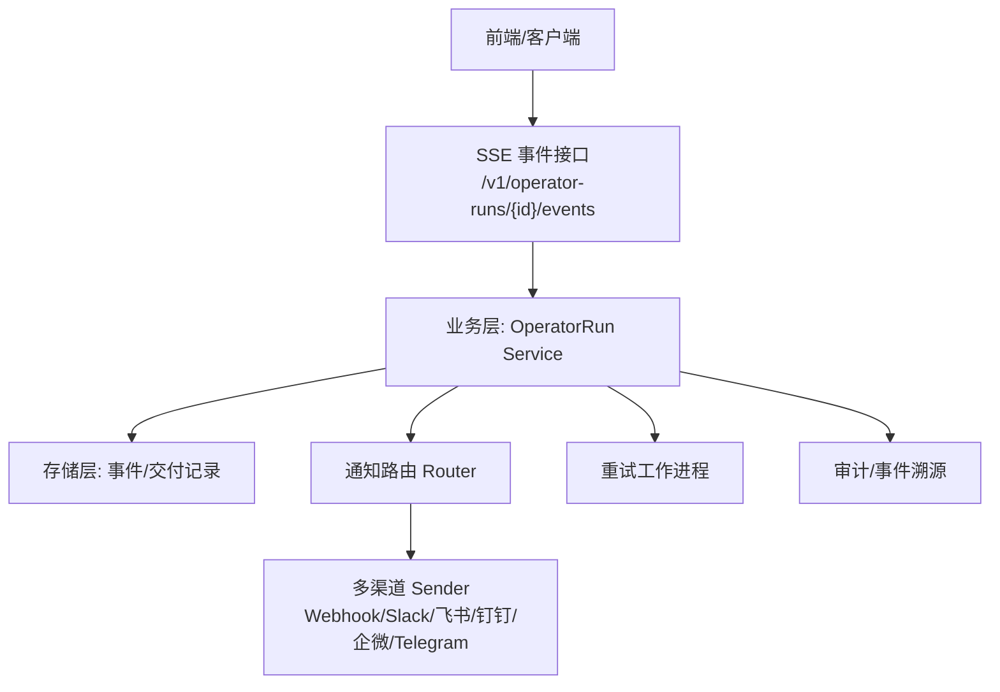
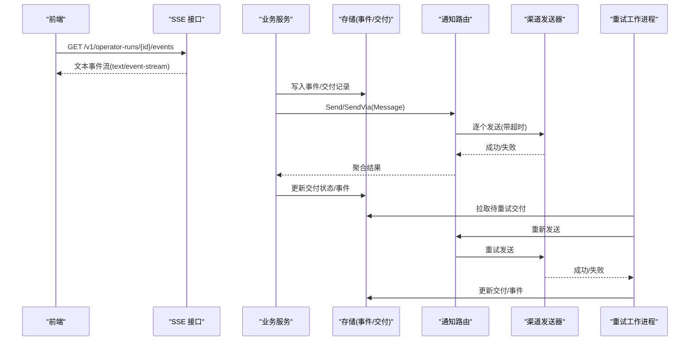
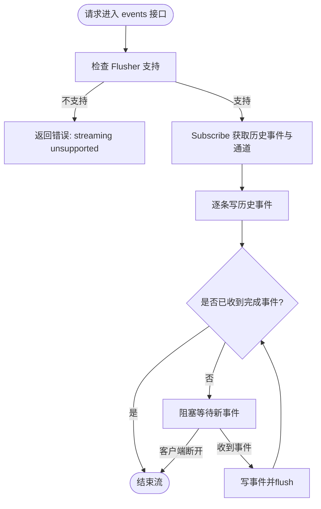
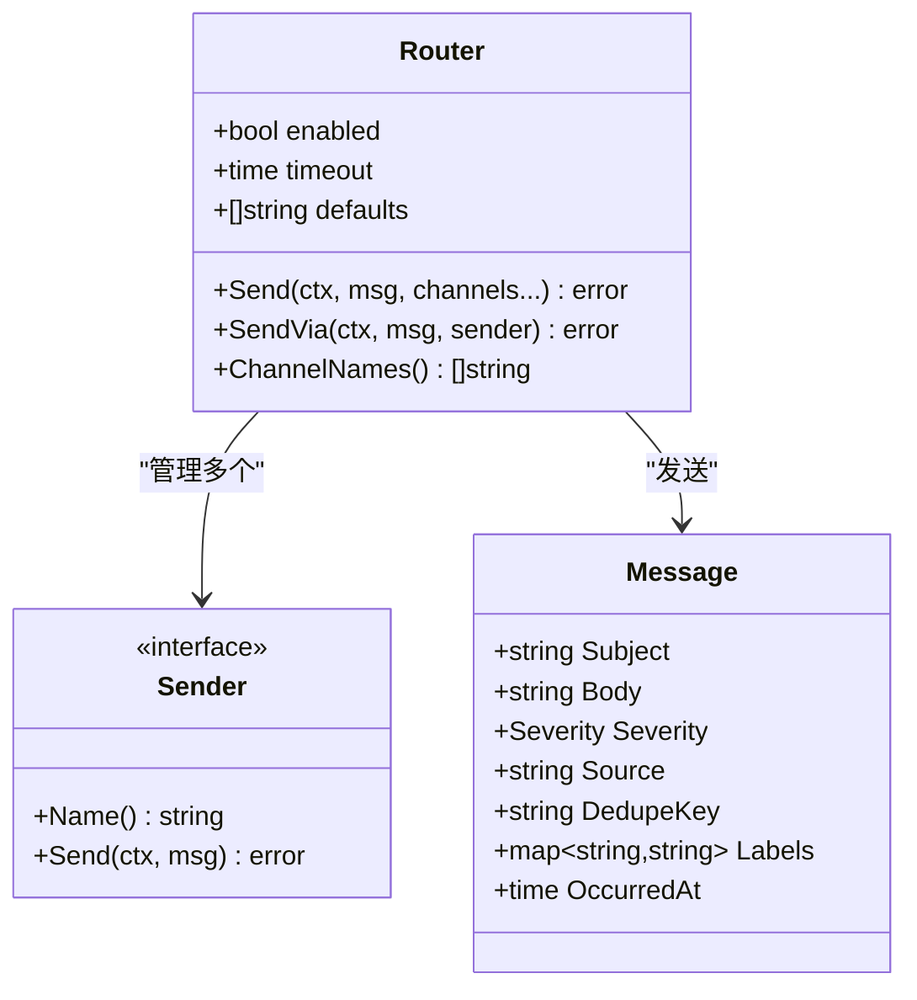
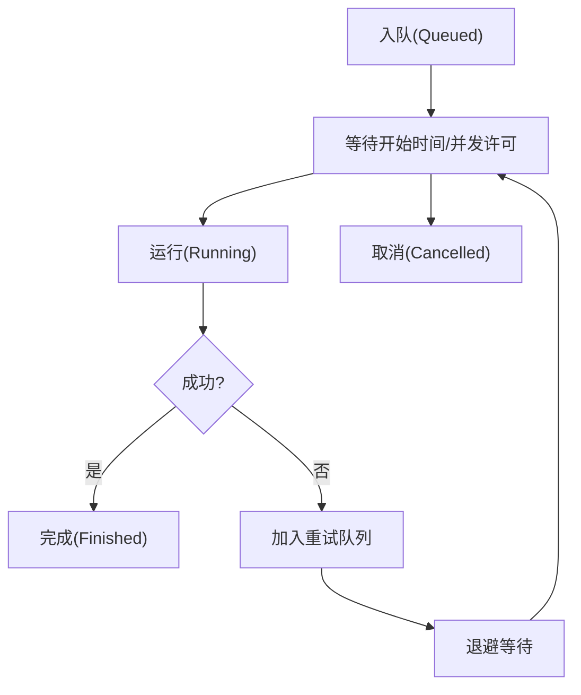
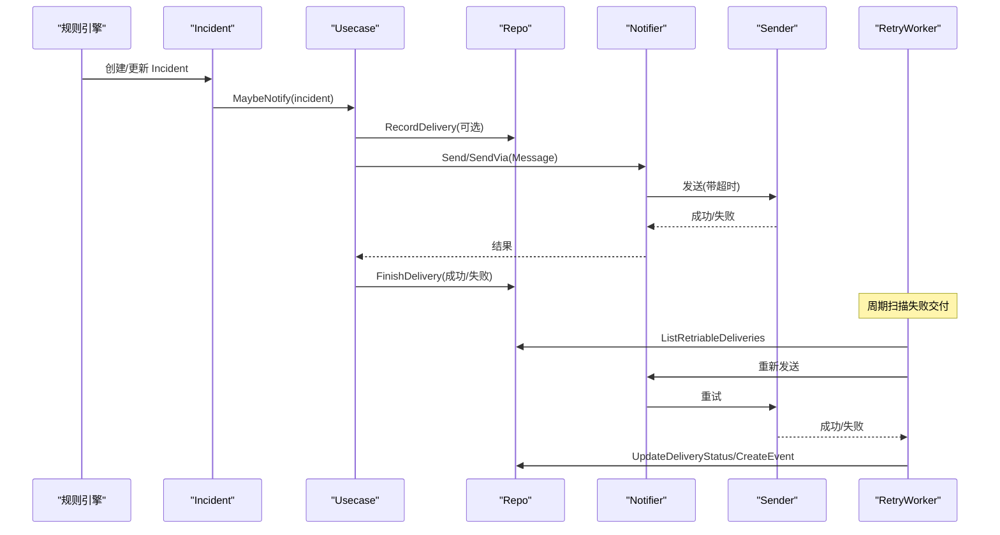
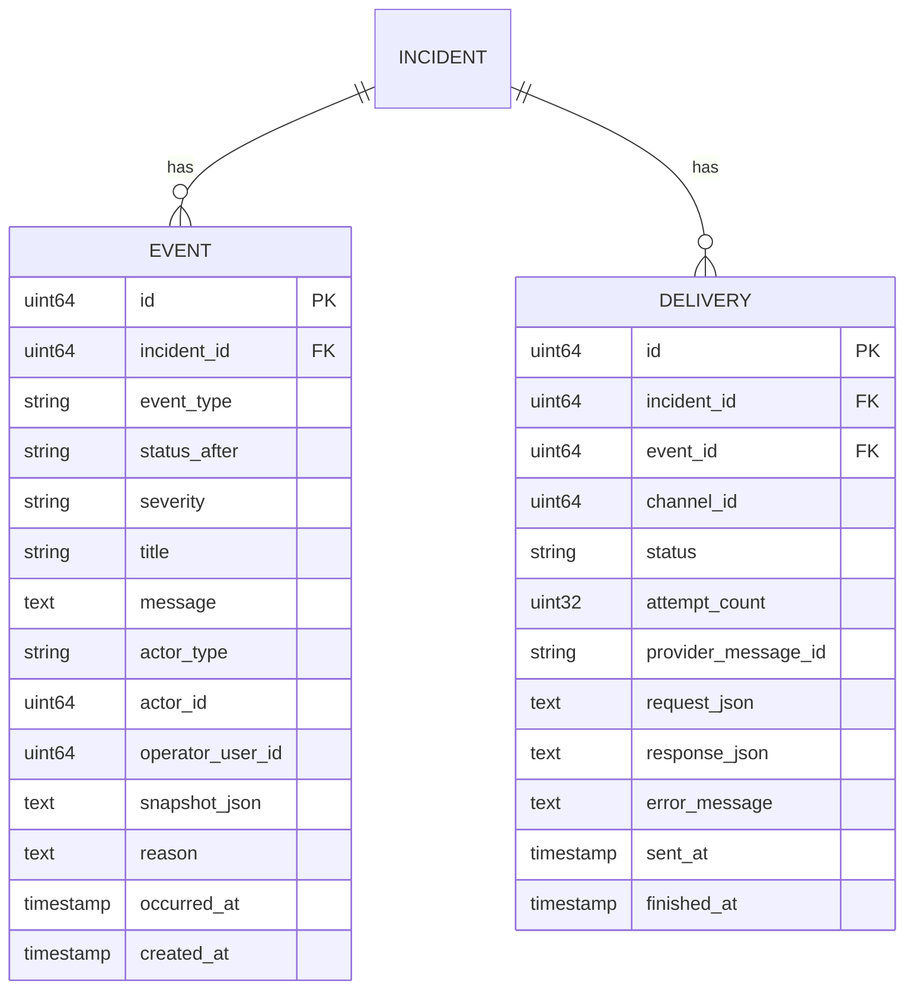
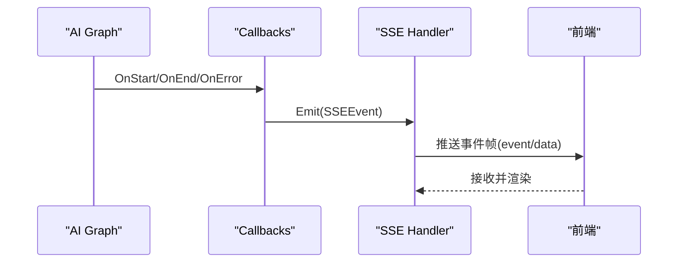
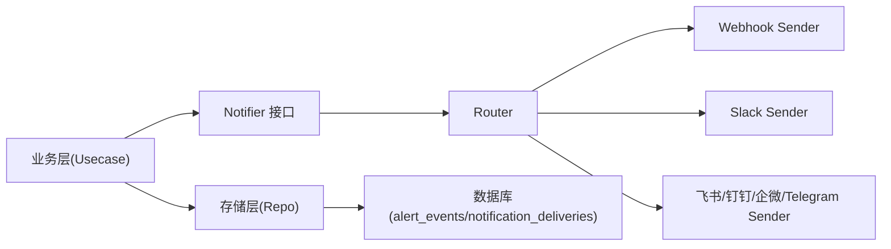

# 事件驱动架构

<cite>
**本文引用的文件**
- [internal/manager/server/operatorrun/http.go](file://internal/manager/server/operatorrun/http.go)
- [internal/manager/biz/alert/retry.go](file://internal/manager/biz/alert/retry.go)
- [internal/manager/model/alert/model.go](file://internal/manager/model/alert/model.go)
- [internal/pkg/notify/notify.go](file://internal/pkg/notify/notify.go)
- [internal/manager/biz/aiops/graph/callbacks/sse.go](file://internal/manager/biz/aiops/graph/callbacks/sse.go)
- [internal/manager/biz/aiops/chatruntime/runtime.go](file://internal/manager/biz/aiops/chatruntime/runtime.go)
- [internal/edgeagent/packetcapture/service_linux.go](file://internal/edgeagent/packetcapture/service_linux.go)
- [internal/manager/data/alert/store/repo.go](file://internal/manager/data/alert/store/repo.go)
- [internal/manager/biz/audit/usecase.go](file://internal/manager/biz/audit/usecase.go)
</cite>

## 目录
1. [简介](#简介)
2. [项目结构](#项目结构)
3. [核心组件](#核心组件)
4. [架构总览](#架构总览)
5. [详细组件分析](#详细组件分析)
6. [依赖关系分析](#依赖关系分析)
7. [性能考量](#性能考量)
8. [故障排查指南](#故障排查指南)
9. [结论](#结论)
10. [附录](#附录)

## 简介
本设计文档面向 Ongrid 平台的事件驱动架构，重点说明：
- 基于 SSE（Server-Sent Events）的实时通信机制：连接建立、消息推送与断线重连处理。
- 事件总线与发布订阅模式：解耦事件生产者与消费者，支撑告警、任务状态等事件流转。
- 异步任务处理架构：任务队列、工作进程与失败重试策略。
- 实时告警通知的事件流：从告警产生到多渠道通知、重试与审计的全链路。
- 事件溯源与审计日志：以事件表记录不可变事实，支持可追溯与可回放。
- 事件格式规范、版本兼容性与错误处理策略。
- 事件驱动编程最佳实践与性能优化建议。

## 项目结构
Ongrid 在多个子域实现了事件驱动能力：
- 操作工具运行（Operator Run）通过 HTTP SSE 接口向客户端持续推送运行事件。
- 告警子系统将告警事件持久化并触发通知，具备重试与抑制/去重机制。
- AI 运行时通过回调机制将模型/工具执行过程以 SSE 帧形式输出。
- 边缘抓包任务采用内存队列与调度器实现并发控制与顺序执行。
- 通知路由抽象多种渠道（Webhook、Slack、飞书、钉钉、企业微信、Telegram），统一发送与超时控制。
- 审计模块提供变更查询能力，支撑根因分析。

**图示来源**
- [internal/manager/server/operatorrun/http.go:104-150](file://internal/manager/server/operatorrun/http.go#L104-L150)
- [internal/manager/biz/alert/retry.go:75-108](file://internal/manager/biz/alert/retry.go#L75-L108)
- [internal/pkg/notify/notify.go:92-130](file://internal/pkg/notify/notify.go#L92-L130)
- [internal/manager/model/alert/model.go:255-274](file://internal/manager/model/alert/model.go#L255-L274)

**章节来源**
- [internal/manager/server/operatorrun/http.go:104-150](file://internal/manager/server/operatorrun/http.go#L104-L150)
- [internal/manager/biz/alert/retry.go:75-108](file://internal/manager/biz/alert/retry.go#L75-L108)
- [internal/pkg/notify/notify.go:92-130](file://internal/pkg/notify/notify.go#L92-L130)
- [internal/manager/model/alert/model.go:255-274](file://internal/manager/model/alert/model.go#L255-L274)

## 核心组件
- SSE 事件接口：提供 text/event-stream 响应，按事件类型与 JSON 数据推送，支持历史事件回放与完成信号。
- 通知路由与发送器：统一消息体 Message，支持多通道配置、超时、默认通道与开关控制。
- 告警事件与交付追踪：incident、event、delivery 三张表构成事件溯源基础；retry worker 负责失败重试。
- AI 运行时 SSE 回调：将模型/工具生命周期事件转换为 SSE 帧，供前端渲染。
- 任务队列与调度：边缘抓包任务使用内存任务表与并发控制，保证有序与限流。
- 审计查询：提供变更记录查询，辅助 RCA。

**章节来源**
- [internal/manager/server/operatorrun/http.go:104-150](file://internal/manager/server/operatorrun/http.go#L104-L150)
- [internal/pkg/notify/notify.go:22-37](file://internal/pkg/notify/notify.go#L22-L37)
- [internal/manager/model/alert/model.go:255-386](file://internal/manager/model/alert/model.go#L255-L386)
- [internal/manager/biz/aiops/graph/callbacks/sse.go:196-233](file://internal/manager/biz/aiops/graph/callbacks/sse.go#L196-L233)
- [internal/edgeagent/packetcapture/service_linux.go:112-167](file://internal/edgeagent/packetcapture/service_linux.go#L112-L167)
- [internal/manager/biz/audit/usecase.go:118-147](file://internal/manager/biz/audit/usecase.go#L118-L147)

## 架构总览
下图展示了事件驱动的核心流程：事件生产（告警/任务/AI 运行）、事件总线（通知路由/事件表）、事件消费（前端 SSE/重试 worker/审计）。

**图示来源**
- [internal/manager/server/operatorrun/http.go:104-150](file://internal/manager/server/operatorrun/http.go#L104-L150)
- [internal/manager/biz/alert/retry.go:98-201](file://internal/manager/biz/alert/retry.go#L98-L201)
- [internal/pkg/notify/notify.go:92-156](file://internal/pkg/notify/notify.go#L92-L156)
- [internal/manager/model/alert/model.go:368-386](file://internal/manager/model/alert/model.go#L368-L386)

## 详细组件分析

### SSE 实时通信机制
- 连接建立：HTTP 接口设置 Content-Type 为 text/event-stream，启用 keep-alive，返回历史事件后进入实时推送循环。
- 消息推送：每个事件包含 event 名称与 JSON data，使用 flush 确保即时送达。
- 断线重连：前端基于 EventSource 自动重连；服务端通过历史事件回放补齐缺失数据。
- 完成信号：当业务事件类型为“完成”时，服务端结束流，前端停止监听。

**图示来源**
- [internal/manager/server/operatorrun/http.go:104-150](file://internal/manager/server/operatorrun/http.go#L104-L150)
- [internal/manager/server/operatorrun/http.go:210-224](file://internal/manager/server/operatorrun/http.go#L210-L224)

**章节来源**
- [internal/manager/server/operatorrun/http.go:104-150](file://internal/manager/server/operatorrun/http.go#L104-L150)
- [internal/manager/server/operatorrun/http.go:210-224](file://internal/manager/server/operatorrun/http.go#L210-L224)

### 事件总线与发布订阅
- 通知路由 Router：维护多个 Sender（Webhook、Slack、飞书、钉钉、企业微信、Telegram），支持默认通道、超时、开关。
- 消息体 Message：标准化 subject、severity、source、dedupe_key、labels、occurred_at，便于去重与过滤。
- 构建发送器：根据 ChannelType + ConfigJSON 动态构造 Sender，支持 endpoint/url、secret 等字段。
- 解耦机制：业务层仅依赖 Notifier 接口，不关心具体渠道实现；测试可通过注入 fake sender。

**图示来源**
- [internal/pkg/notify/notify.go:22-37](file://internal/pkg/notify/notify.go#L22-L37)
- [internal/pkg/notify/notify.go:39-65](file://internal/pkg/notify/notify.go#L39-L65)
- [internal/pkg/notify/notify.go:92-156](file://internal/pkg/notify/notify.go#L92-L156)

**章节来源**
- [internal/pkg/notify/notify.go:22-37](file://internal/pkg/notify/notify.go#L22-L37)
- [internal/pkg/notify/notify.go:92-156](file://internal/pkg/notify/notify.go#L92-L156)
- [internal/manager/biz/alert/usecase.go:1520-1558](file://internal/manager/biz/alert/usecase.go#L1520-L1558)

### 异步任务处理架构
- 任务队列：边缘抓包任务使用内存 map 保存任务状态，支持延迟启动与排队顺序。
- 工作进程：Service 持有 runner 与 progressRunner，按优先级与并发限制调度任务。
- 失败重试：告警通知失败通过 retry worker 周期性扫描 delivery 表，按退避策略重试，直至成功或达到最大尝试次数。
- 状态机：任务状态包括 queued、running、cancelled、finished 等，状态转换受并发与时间约束。

**图示来源**
- [internal/edgeagent/packetcapture/service_linux.go:112-167](file://internal/edgeagent/packetcapture/service_linux.go#L112-L167)
- [internal/edgeagent/packetcapture/service_linux.go:230-267](file://internal/edgeagent/packetcapture/service_linux.go#L230-L267)
- [internal/manager/biz/alert/retry.go:98-201](file://internal/manager/biz/alert/retry.go#L98-L201)

**章节来源**
- [internal/edgeagent/packetcapture/service_linux.go:112-167](file://internal/edgeagent/packetcapture/service_linux.go#L112-L167)
- [internal/edgeagent/packetcapture/service_linux.go:230-267](file://internal/edgeagent/packetcapture/service_linux.go#L230-L267)
- [internal/manager/biz/alert/retry.go:98-201](file://internal/manager/biz/alert/retry.go#L98-L201)

### 实时告警通知的事件流转
- 事件产生：规则匹配生成 incident，写入 alert_incidents，同时记录 firing 事件。
- 抑制与去重：高优先级 incident 抑制低优先级通知，重复触发被抑制并记录 repeat_suppressed。
- 通知路由：根据规则与通道配置选择目标 channel，构造 Message 并通过 Router 发送。
- 交付追踪：每条通知创建 delivery 记录，记录请求/响应/错误信息，用于审计与重试。
- 重试策略：retry worker 按 attempt_count * backoffPerAttempt 线性退避，达到最大尝试次数停止。

**图示来源**
- [internal/manager/biz/alert/usecase.go:1387-1484](file://internal/manager/biz/alert/usecase.go#L1387-L1484)
- [internal/manager/biz/alert/retry.go:98-201](file://internal/manager/biz/alert/retry.go#L98-L201)
- [internal/manager/data/alert/store/repo.go:318-352](file://internal/manager/data/alert/store/repo.go#L318-L352)

**章节来源**
- [internal/manager/biz/alert/usecase.go:1387-1484](file://internal/manager/biz/alert/usecase.go#L1387-L1484)
- [internal/manager/biz/alert/retry.go:98-201](file://internal/manager/biz/alert/retry.go#L98-L201)
- [internal/manager/data/alert/store/repo.go:318-352](file://internal/manager/data/alert/store/repo.go#L318-L352)

### 事件溯源与审计日志
- 事件表：alert_events 记录每次状态变化、严重级别、标题、原因、快照与发生时间，形成不可变事实链。
- 交付记录：notification_deliveries 记录每次通知的请求/响应/错误，支撑可观测与重试。
- 审计查询：audit usecase 提供变更记录查询，支持资源类型与动作过滤，辅助 RCA。

**图示来源**
- [internal/manager/model/alert/model.go:255-386](file://internal/manager/model/alert/model.go#L255-L386)

**章节来源**
- [internal/manager/model/alert/model.go:255-386](file://internal/manager/model/alert/model.go#L255-L386)
- [internal/manager/biz/audit/usecase.go:118-147](file://internal/manager/biz/audit/usecase.go#L118-L147)

### AI 运行时 SSE 回调
- 回调事件：AI 图执行过程中，模型/工具的开始、结束、错误等事件通过回调发射。
- SSE 适配：运行时将回调事件转换为 SSE 帧，供前端渲染工具调用与助手回复。
- 迭代计数：跟踪 assistant/tool 调用次数，便于统计与展示。

**图示来源**
- [internal/manager/biz/aiops/graph/callbacks/sse.go:196-233](file://internal/manager/biz/aiops/graph/callbacks/sse.go#L196-L233)
- [internal/manager/biz/aiops/chatruntime/runtime.go:1046-1054](file://internal/manager/biz/aiops/chatruntime/runtime.go#L1046-L1054)

**章节来源**
- [internal/manager/biz/aiops/graph/callbacks/sse.go:196-233](file://internal/manager/biz/aiops/graph/callbacks/sse.go#L196-L233)
- [internal/manager/biz/aiops/chatruntime/runtime.go:1046-1054](file://internal/manager/biz/aiops/chatruntime/runtime.go#L1046-L1054)

## 依赖关系分析
- 低耦合：业务层通过 Notifier 接口与存储层交互，不直接依赖具体渠道实现。
- 可插拔：通知渠道通过 Sender 接口扩展，新增渠道只需实现 Name/Send。
- 可测试性：Router 支持注入 senders，测试可使用 fake sender 验证逻辑。
- 可观测性：事件与交付记录提供完整审计轨迹，配合 Prometheus 指标可监控事件总量。

**图示来源**
- [internal/pkg/notify/notify.go:39-65](file://internal/pkg/notify/notify.go#L39-L65)
- [internal/manager/biz/alert/usecase.go:1520-1558](file://internal/manager/biz/alert/usecase.go#L1520-L1558)
- [internal/manager/data/alert/store/repo.go:318-352](file://internal/manager/data/alert/store/repo.go#L318-L352)

**章节来源**
- [internal/pkg/notify/notify.go:39-65](file://internal/pkg/notify/notify.go#L39-L65)
- [internal/manager/biz/alert/usecase.go:1520-1558](file://internal/manager/biz/alert/usecase.go#L1520-L1558)
- [internal/manager/data/alert/store/repo.go:318-352](file://internal/manager/data/alert/store/repo.go#L318-L352)

## 性能考量
- SSE 推送：使用 http.Flusher 及时刷新，避免缓冲导致延迟；合理设置历史事件数量，防止首屏过大。
- 通知超时：Router 对每个渠道发送设置超时，避免慢下游拖垮主流程。
- 重试退避：线性退避降低瞬时压力，批量拉取限制（如 200）避免单次扫描过多。
- 并发控制：边缘抓包任务通过内存状态与定时器控制并发，避免资源争用。
- 指标与日志：事件类型与严重级别打点，结合 slog 记录关键路径错误，便于定位瓶颈。

[本节为通用性能指导，无需特定文件引用]

## 故障排查指南
- SSE 连接问题：确认服务端支持 Flusher，前端使用 EventSource 并处理 onerror/onclose 进行重连。
- 通知失败：检查渠道配置（endpoint/url/secret），查看 notification_deliveries 的错误信息与重试次数。
- 告警未通知：核查抑制与去重逻辑，确认规则窗口与最小触发次数；查看 alert_events 中的 inhibited/repeat_suppressed。
- 任务卡住：检查边缘抓包任务状态与并发限制，确认是否有任务处于 queued 且无法调度。
- 审计缺失：确认事件写入是否成功，必要时通过 audit usecase 查询变更记录。

**章节来源**
- [internal/manager/server/operatorrun/http.go:104-150](file://internal/manager/server/operatorrun/http.go#L104-L150)
- [internal/manager/biz/alert/retry.go:98-201](file://internal/manager/biz/alert/retry.go#L98-L201)
- [internal/manager/model/alert/model.go:255-386](file://internal/manager/model/alert/model.go#L255-L386)
- [internal/edgeagent/packetcapture/service_linux.go:112-167](file://internal/edgeagent/packetcapture/service_linux.go#L112-L167)
- [internal/manager/biz/audit/usecase.go:118-147](file://internal/manager/biz/audit/usecase.go#L118-L147)

## 结论
Ongrid 平台通过 SSE 实时通信、通知路由与事件溯源构建了稳健的事件驱动架构。SSE 提供低延迟的前端反馈，通知路由解耦多渠道发送，事件表与交付记录保障可观测与可重试。结合退避重试与并发控制，系统在可靠性与性能之间取得平衡。未来可进一步引入更丰富的指标与分布式队列，以支撑更大规模的事件处理。

[本节为总结性内容，无需特定文件引用]

## 附录

### 事件格式规范
- SSE 事件：event 名称 + JSON data，data 需可序列化；完成事件用于结束流。
- 通知消息：Message 包含 subject、severity、source、dedupe_key、labels、occurred_at；subject 必填，severity 默认 info，occurred_at 默认当前 UTC 时间。
- 事件表：alert_events 记录事件类型、状态、严重级别、标题、原因、快照与时间戳。
- 交付记录：notification_deliveries 记录渠道、状态、尝试次数、请求/响应、错误信息与时间。

**章节来源**
- [internal/manager/server/operatorrun/http.go:210-224](file://internal/manager/server/operatorrun/http.go#L210-L224)
- [internal/pkg/notify/notify.go:22-37](file://internal/pkg/notify/notify.go#L22-L37)
- [internal/manager/model/alert/model.go:255-386](file://internal/manager/model/alert/model.go#L255-L386)

### 版本兼容性
- 字段演进：如 DeviceID 从 EdgeID 重命名，保留旧键兼容读取。
- 规则迁移：kind 字段默认 metric_raw，数据迁移脚本回填 legacy NULL/'' 行。
- 通道配置：endpoint/url 双键兼容，secret 携带敏感信息；未知 ChannelType 返回错误。

**章节来源**
- [internal/manager/model/alert/model.go:276-297](file://internal/manager/model/alert/model.go#L276-L297)
- [internal/manager/model/alert/model.go:299-343](file://internal/manager/model/alert/model.go#L299-L343)
- [internal/manager/biz/alert/usecase.go:1520-1558](file://internal/manager/biz/alert/usecase.go#L1520-L1558)

### 错误处理策略
- SSE 错误：streaming unsupported 时返回 invalid；认证失败返回 unauthorized/forbidden/not-found。
- 通知错误：Router 聚合各渠道错误，返回 errors.Join；超时与未配置渠道分别处理。
- 重试策略：按 attempt_count * backoffPerAttempt 线性退避，达到 MaxAttempts 停止；通道禁用直接标记失败。
- 审计记录：每次通知尝试写入 alert_events，区分 notification_sent/notification_failed。

**章节来源**
- [internal/manager/server/operatorrun/http.go:240-260](file://internal/manager/server/operatorrun/http.go#L240-L260)
- [internal/pkg/notify/notify.go:92-156](file://internal/pkg/notify/notify.go#L92-L156)
- [internal/manager/biz/alert/retry.go:98-201](file://internal/manager/biz/alert/retry.go#L98-L201)

### 最佳实践与性能优化建议
- 使用事件溯源：所有关键状态变更写入事件表，保持不可变事实链。
- 解耦生产与消费：通过 Notifier 接口与 Router 管理多渠道，避免硬编码。
- 控制推送频率：SSE 历史事件适度限制，避免首屏过大；完成事件及时结束流。
- 合理重试：退避策略与最大尝试次数保护下游系统；记录失败原因以便分析。
- 指标与日志：对事件类型与严重级别打点，结合 slog 记录关键路径错误。
- 并发与限流：任务调度器限制并发，避免资源争用；边缘任务使用定时器与状态机保证顺序。

[本节为通用最佳实践，无需特定文件引用]