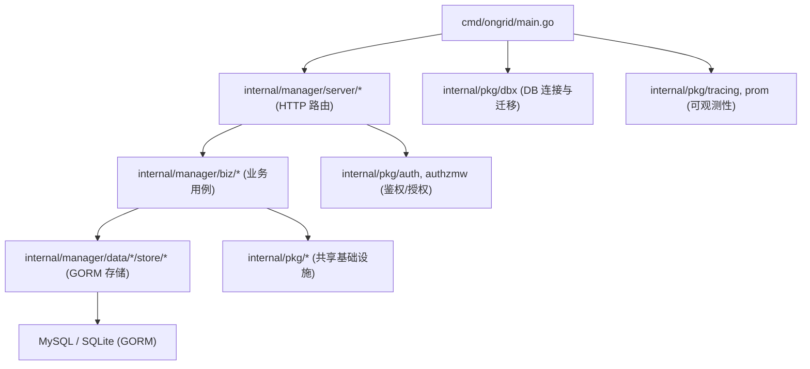
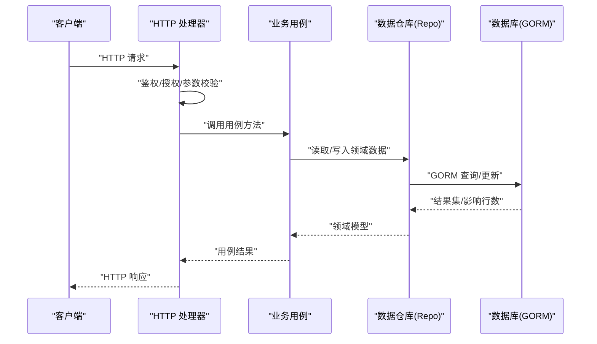
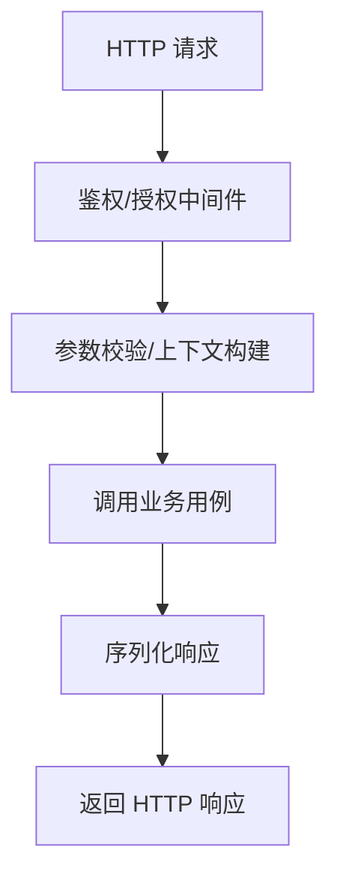
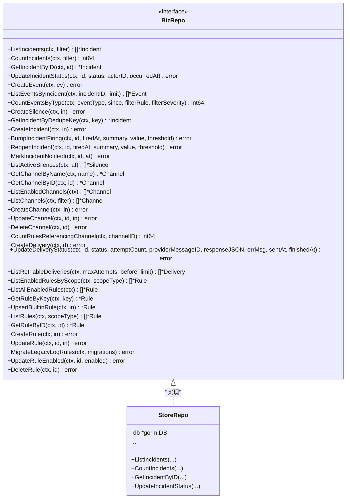
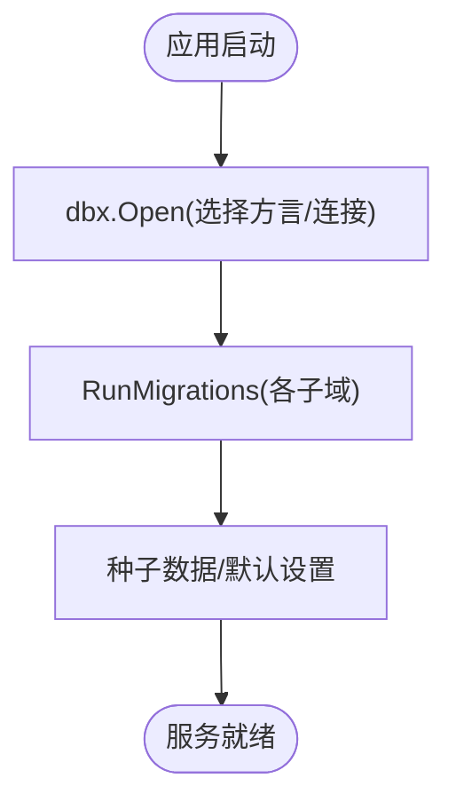
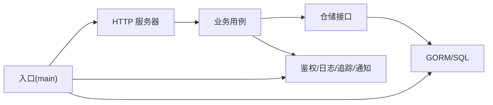

# 分层架构设计

<cite>
**本文引用的文件**
- [main.go](file://cmd/ongrid/main.go)
- [go.mod](file://go.mod)
- [README.md](file://api/README.md)
- [dbx.go](file://internal/pkg/dbx/dbx.go)
- [repo.go（biz层）](file://internal/manager/biz/alert/repo.go)
- [repo.go（数据访问层）](file://internal/manager/data/alert/store/repo.go)
</cite>

## 目录
1. [简介](#简介)
2. [项目结构](#项目结构)
3. [核心组件](#核心组件)
4. [架构总览](#架构总览)
5. [详细组件分析](#详细组件分析)
6. [依赖关系分析](#依赖关系分析)
7. [性能考虑](#性能考虑)
8. [故障排查指南](#故障排查指南)
9. [结论](#结论)
10. [附录](#附录)

## 简介
本文件面向 Ongrid 平台的分层架构设计与实现，聚焦三层职责与边界：表示层（Web API）、业务层（领域逻辑）、数据访问层（持久化）。文档说明各层依赖方向、解耦原则、RESTful API 契约管理方式、领域驱动设计在实体/值对象/聚合根上的体现、ORM 抽象与使用模式，以及前后端分离的接口契约管理与最佳实践。

## 项目结构
Ongrid 采用“按领域划分 + 分层”的组织方式：
- 入口与装配：cmd/ongrid/main.go 负责启动、配置加载、依赖注入、服务注册与迁移执行。
- 领域与能力：internal/manager 下按子域组织 biz（业务用例）、data（数据访问）、model（领域模型）、server（HTTP 路由与处理器）、service（跨域服务编排）。
- 公共基础设施：internal/pkg 提供数据库、认证、日志、遥测、通知等通用能力。
- API 契约：api 目录以 proto 定义作为单一事实来源，REST 路由由 Go 手写实现并消费生成的类型。
- 前端：web 目录为独立的前端工程，通过 REST 与后端交互。

图表来源
- [main.go:208-300](file://cmd/ongrid/main.go#L208-L300)
- [dbx.go:34-49](file://internal/pkg/dbx/dbx.go#L34-L49)

章节来源
- [main.go:208-300](file://cmd/ongrid/main.go#L208-L300)
- [go.mod:1-44](file://go.mod#L1-L44)

## 核心组件
- 入口与装配器：main.go 完成配置加载、数据库打开与迁移、IAM 初始化、LLM 客户端与多提供者路由、设置项种子数据、监控与通知通道、各子域 Biz/Service/Server 组装与 HTTP 路由挂载。
- 领域用例（Biz）：以子域为单位封装业务流程与规则，如告警、设备、边缘节点、AIOPS、知识、市场等；通过 Repo 接口屏蔽存储细节。
- 数据访问（Data Store）：基于 GORM 的实现，遵循 biz.Repo 接口，提供事务、分页、软删除、条件查询等能力。
- 表示层（Server）：基于 chi 的路由与处理器，将请求解析为用例输入，调用 Biz，返回响应。
- 基础设施：dbx 统一数据库连接与方言选择；auth/authzmw 提供 JWT 与 RBAC；tracing/prom 提供可观测性；notify 提供多渠道通知。

章节来源
- [main.go:208-300](file://cmd/ongrid/main.go#L208-L300)
- [repo.go（biz层）:37-113](file://internal/manager/biz/alert/repo.go#L37-L113)
- [repo.go（数据访问层）:16-23](file://internal/manager/data/alert/store/repo.go#L16-L23)

## 架构总览
Ongrid 采用清晰的三层架构与领域边界：
- 表示层（Web API）：仅做协议适配、参数校验、权限检查、调用业务层、序列化响应。
- 业务层（Domain Logic）：承载领域规则、流程编排、状态机、跨系统协调；不感知 HTTP 与存储细节。
- 数据访问层（Data Access）：实现 biz.Repo 接口，封装 SQL/GORM 操作、事务、分页、错误映射。

依赖方向：表示层 → 业务层 → 数据访问层 → 外部系统（数据库、消息、第三方 API）。业务层不反向依赖表示层或数据访问层的具体实现。

图表来源
- [main.go:208-300](file://cmd/ongrid/main.go#L208-L300)
- [repo.go（biz层）:37-113](file://internal/manager/biz/alert/repo.go#L37-L113)
- [repo.go（数据访问层）:25-75](file://internal/manager/data/alert/store/repo.go#L25-L75)

## 详细组件分析

### 表示层（Web API）
- 路由与处理器：位于 internal/manager/server/*，每个子域一个包，暴露 REST 路由。
- 鉴权与授权：通过 internal/pkg/auth 与 internal/pkg/authzmw 中间件，从 JWT 提取 org_id 并执行 RBAC 决策。
- 契约管理：API 契约以 api/*.proto 为单一事实来源，REST 路由手写实现并消费生成的 Go 类型，避免运行时漂移。

图表来源
- [main.go:415-420](file://cmd/ongrid/main.go#L415-L420)
- [README.md（API 约定）:1-42](file://api/README.md#L1-L42)

章节来源
- [README.md（API 约定）:1-42](file://api/README.md#L1-L42)
- [main.go:415-420](file://cmd/ongrid/main.go#L415-L420)

### 业务层（领域逻辑）
- 用例与仓储：每个子域定义 biz.Repo 接口，隔离存储实现；用例组合多个仓储与外部服务完成复杂流程。
- 领域模型：model/* 存放领域实体与值对象，承载不变式与行为。
- 编排与服务：service/* 用于跨子域编排（如 AIOPS、Prometheus、K8s 等），对外暴露稳定接口。

示例：告警子域
- biz/alert/repo.go 定义了 IncidentFilter、ChannelFilter、LegacyLogRuleMigration 及 Repo 接口，覆盖事件生命周期、静默、通知投递、规则管理等。
- data/alert/store/repo.go 实现该接口，使用 GORM 进行查询、更新、计数、分页、软删除与事务迁移。

图表来源
- [repo.go（biz层）:37-113](file://internal/manager/biz/alert/repo.go#L37-L113)
- [repo.go（数据访问层）:16-23](file://internal/manager/data/alert/store/repo.go#L16-L23)

章节来源
- [repo.go（biz层）:37-113](file://internal/manager/biz/alert/repo.go#L37-L113)
- [repo.go（数据访问层）:25-75](file://internal/manager/data/alert/store/repo.go#L25-L75)

### 数据访问层（ORM 抽象与模式）
- 统一入口：internal/pkg/dbx.Open 根据配置选择 MySQL 或 SQLite，开启必要 PRAGMA（SQLite）或 Ping（MySQL）以确保连通性。
- 迁移管理：启动时集中执行各子域的 Migrate，保证 schema 一致。
- 仓储实现：每个子域 data/*/store/* 实现对应 biz.Repo，使用 GORM 进行 CRUD、分页、软删除、事务与批量迁移。
- 错误映射：将 gorm.ErrRecordNotFound 等转换为统一的 errs.* 错误，便于上层处理。

图表来源
- [main.go:256-300](file://cmd/ongrid/main.go#L256-L300)
- [dbx.go:34-49](file://internal/pkg/dbx/dbx.go#L34-L49)

章节来源
- [dbx.go:34-49](file://internal/pkg/dbx/dbx.go#L34-L49)
- [main.go:256-300](file://cmd/ongrid/main.go#L256-L300)

### 领域驱动设计（实体、值对象、聚合根）
- 实体：如 Incident、Rule、Channel、Edge、Device 等，具有唯一标识与生命周期。
- 值对象：如过滤器（IncidentFilter、ChannelFilter）、时间窗口、标签集合等不可变数据。
- 聚合根：例如“告警”聚合以 Incident 为中心，关联 Event、Silence、Delivery，变更通过用例原子提交。
- 不变式：状态转换（Ack/Silence/Resolve）在仓储层校验；规则更新保留只读字段（RuleKey、CreatedAt 等）。

章节来源
- [repo.go（biz层）:10-35](file://internal/manager/biz/alert/repo.go#L10-L35)
- [repo.go（数据访问层）:147-173](file://internal/manager/data/alert/store/repo.go#L147-L173)

### 前后端分离与接口契约管理
- 契约优先：api/*.proto 是单一事实来源，定义包名、命名规范、字段类型与 org_id 来源策略。
- 代码生成：通过 buf 生成 Go 类型，REST 路由手写实现并消费这些类型，确保前后端契约一致。
- 版本控制：proto 包名包含 major 版本，配合 CI 的 breaking-change 检测保障演进安全。

章节来源
- [README.md（API 约定）:1-42](file://api/README.md#L1-L42)

## 依赖关系分析
- 表示层依赖业务层与基础设施（鉴权、日志、追踪），不直接访问数据库。
- 业务层依赖仓储接口与外部服务（LLM、通知、Grafana、Prom/Loki/Tempo），不感知 HTTP 与具体存储。
- 数据访问层依赖 GORM 与 dbx，实现 biz.Repo 接口，向上提供稳定的领域数据访问能力。
- 入口 main.go 负责装配所有依赖，形成完整的运行期图。

图表来源
- [main.go:208-300](file://cmd/ongrid/main.go#L208-L300)
- [repo.go（biz层）:37-113](file://internal/manager/biz/alert/repo.go#L37-L113)
- [repo.go（数据访问层）:16-23](file://internal/manager/data/alert/store/repo.go#L16-L23)

章节来源
- [main.go:208-300](file://cmd/ongrid/main.go#L208-L300)
- [go.mod:1-44](file://go.mod#L1-L44)

## 性能考虑
- 数据库连接与迁移：dbx.Open 对 MySQL 进行 Ping 快速失败；SQLite 启用 WAL、busy_timeout 与外键约束，提升并发与稳定性。
- 查询优化：仓储层使用分页、精确过滤、索引友好条件（如按 last_fired_at、id 排序）；计数与列表保持谓词一致，避免不一致。
- 缓存与重试：通知投递记录支持重试队列与预算限制；LLM 设置通过 Resolver 带 TTL 缓存，减少频繁 DB 访问。
- 可观测性：全局 Prometheus 注册表与 OTel 追踪，便于定位热点与异常。

章节来源
- [dbx.go:79-128](file://internal/pkg/dbx/dbx.go#L79-L128)
- [repo.go（数据访问层）:25-75](file://internal/manager/data/alert/store/repo.go#L25-L75)
- [main.go:231-254](file://cmd/ongrid/main.go#L231-L254)

## 故障排查指南
- 数据库连接失败：检查 dbx.Open 的错误信息（DSN、Ping、路径权限），确认 MySQL 可达或 SQLite 目录存在。
- 迁移失败：查看 RunMigrations 的错误输出，确认各子域 Migrate 顺序与幂等性。
- 未找到资源：仓储层将 gorm.ErrRecordNotFound 映射为 errs.ErrNotFound，上层应区分 404 与 5xx。
- 通知投递失败：通过 delivery 记录的状态与尝试次数定位问题，调整重试预算与超时。
- 鉴权/授权问题：确认 JWT 密钥与 RBAC 策略已正确初始化，org_id 来自中间件而非请求体。

章节来源
- [dbx.go:51-77](file://internal/pkg/dbx/dbx.go#L51-L77)
- [main.go:256-300](file://cmd/ongrid/main.go#L256-L300)
- [repo.go（数据访问层）:77-86](file://internal/manager/data/alert/store/repo.go#L77-L86)

## 结论
Ongrid 的分层架构清晰、职责明确：表示层专注协议与交互，业务层承载领域规则与编排，数据访问层通过仓储接口屏蔽存储细节。通过 proto 契约与 GORM 抽象，实现了前后端解耦与可扩展的数据层。结合可观测性与健壮的错误处理，平台具备良好的可维护性与演进能力。

## 附录
- 最佳实践
  - 契约优先：以 proto 为唯一事实来源，REST 实现严格消费生成类型。
  - 依赖倒置：业务层仅依赖仓储接口，便于替换存储与测试。
  - 错误归一：统一错误类型与语义，便于上层处理与监控。
  - 幂等迁移：所有迁移需幂等，支持重复执行与回滚。
  - 可观测性：关键路径埋点与指标，便于定位瓶颈与异常。
- 常见陷阱
  - 在业务层直接依赖 HTTP 或存储细节，导致耦合与难以测试。
  - 忽略 org_id 的来源一致性，造成越权风险。
  - 迁移非幂等导致升级失败或数据不一致。
  - 未对敏感信息进行脱敏（如 DSN 密码），造成日志泄露。