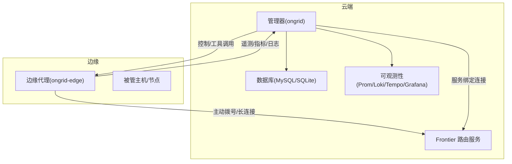
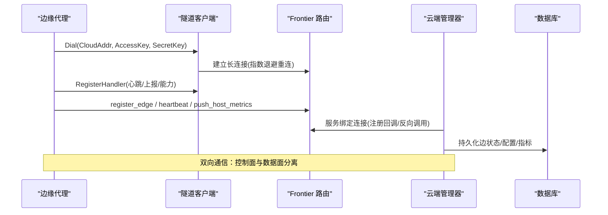
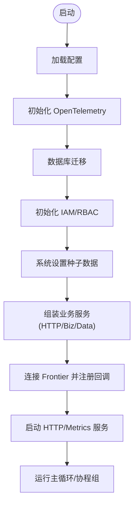
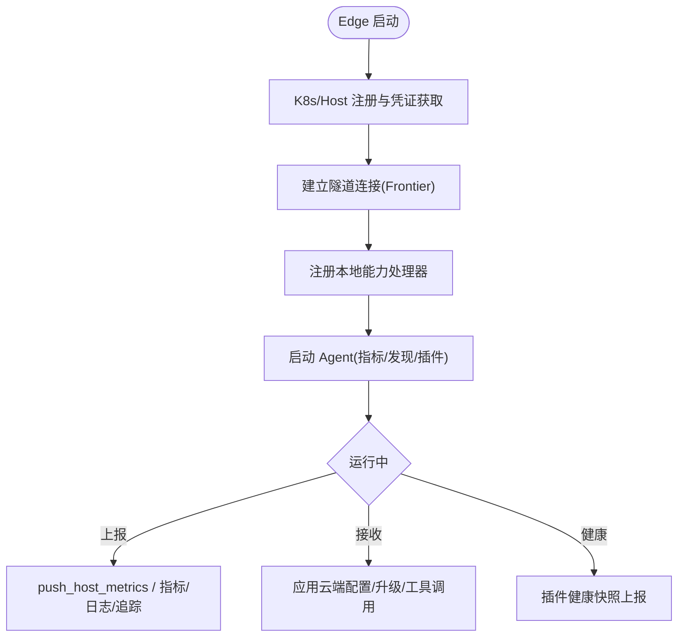
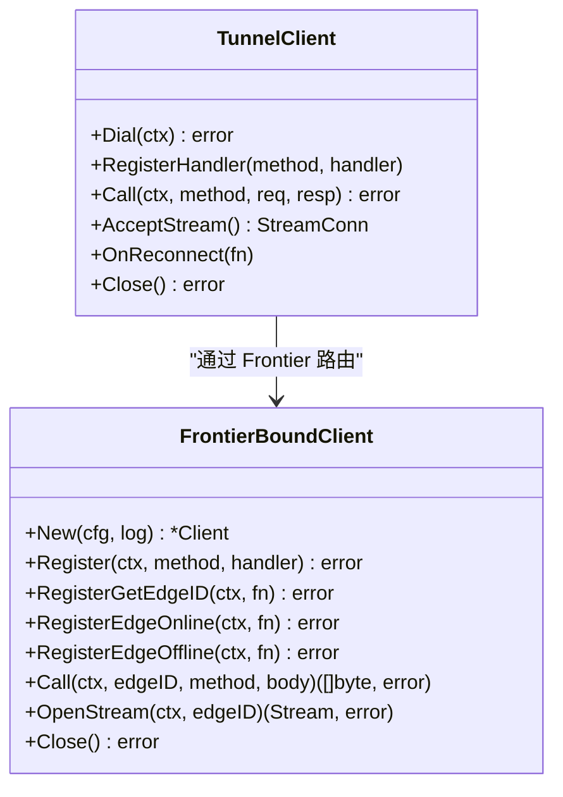
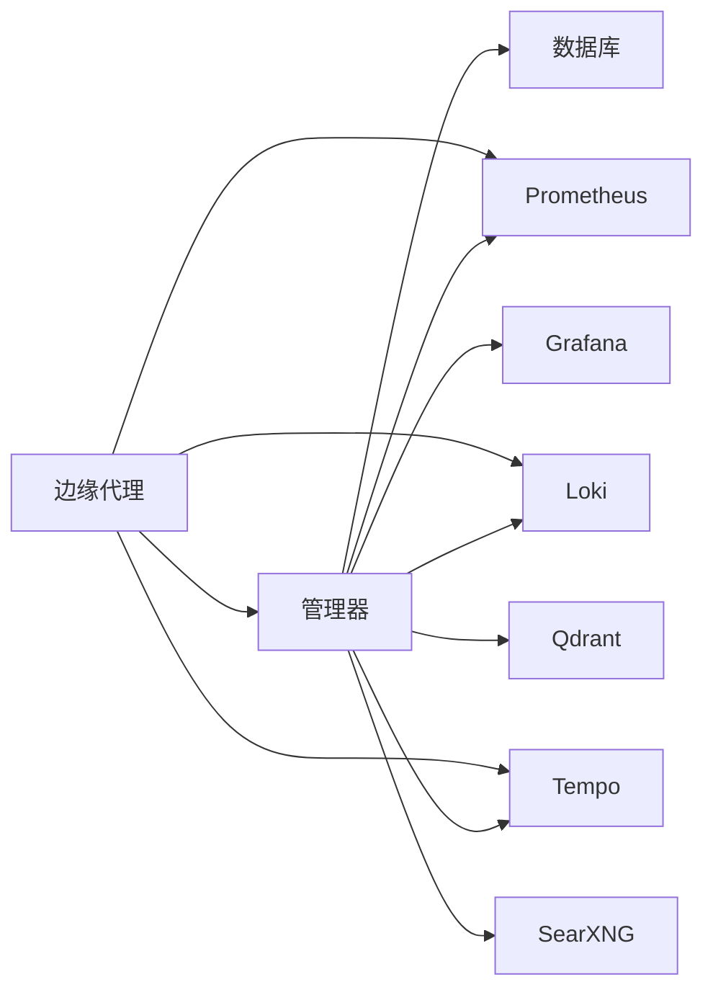
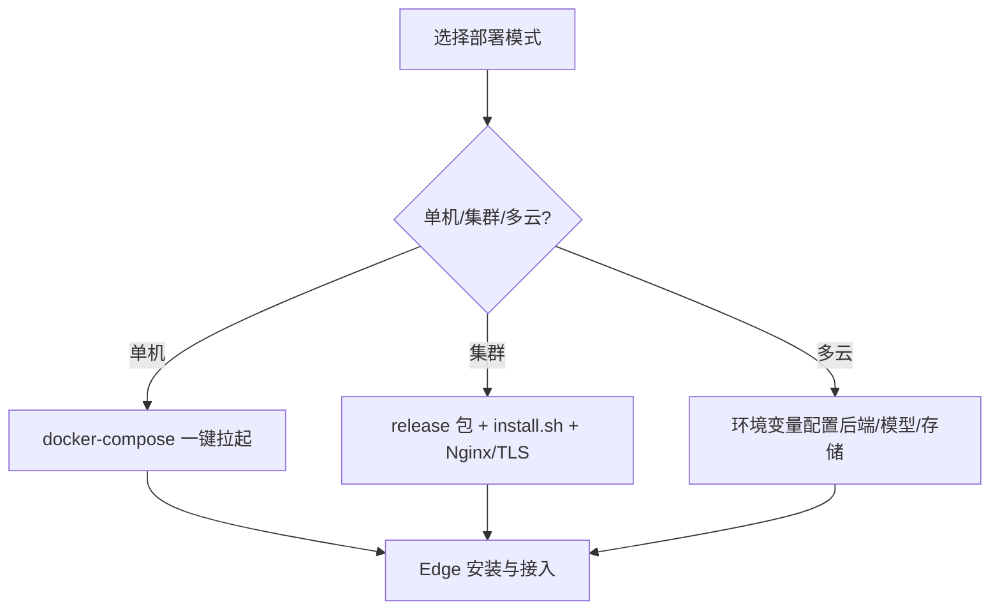

# 分布式架构设计

<cite>
**本文引用的文件**
- [README.md](file://README.md)
- [cmd/ongrid/main.go](file://cmd/ongrid/main.go)
- [cmd/ongrid-edge/main.go](file://cmd/ongrid-edge/main.go)
- [internal/pkg/tunnel/client.go](file://internal/pkg/tunnel/client.go)
- [internal/manager/service/frontierbound/client.go](file://internal/manager/service/frontierbound/client.go)
- [api/README.md](file://api/README.md)
- [deploy/docker-compose.yml](file://deploy/docker-compose.yml)
- [docs/install/edge.md](file://docs/install/edge.md)
</cite>

## 目录
1. [简介](#简介)
2. [项目结构](#项目结构)
3. [核心组件](#核心组件)
4. [架构总览](#架构总览)
5. [详细组件分析](#详细组件分析)
6. [依赖关系分析](#依赖关系分析)
7. [性能与一致性](#性能与一致性)
8. [故障恢复与可观测性](#故障恢复与可观测性)
9. [部署适配方案](#部署适配方案)
10. [结论](#结论)

## 简介
本设计文档面向 Ongrid 平台的分布式架构，围绕“云端管理器 + 边缘代理”的解耦部署模式展开。系统采用零信任网络拓扑：Edge 端主动外连云端，不暴露入站端口；通过隧道与消息路由实现双向通信、数据上报与控制下发。微服务边界清晰，按领域上下文拆分（IAM、设备/边缘、Kubernetes、日志、指标、告警、工作流等），支持独立部署与弹性扩展。本文同时给出系统边界、组件交互图、数据流向、分布式一致性与故障恢复机制，以及单机、集群、多云环境的适配策略。

## 项目结构
仓库以“命令入口 + 内部模块 + API 契约 + 部署制品”组织：
- 命令入口
  - 云端管理器进程：cmd/ongrid/main.go
  - 边缘代理进程：cmd/ongrid-edge/main.go
- 内部模块
  - internal/pkg/tunnel：Edge 侧隧道客户端封装（geminio 重试、重连、注册处理器）
  - internal/manager/service/frontierbound：Manager 侧到上游 Frontier 路由服务的绑定客户端
  - internal/manager/*：按业务域划分的 biz/service/server/data/model
  - internal/edgeagent/*：Edge 侧采集、插件、能力注册
- API 契约
  - api/*：gRPC/proto 定义，作为公共接口唯一事实来源
- 部署
  - deploy/docker-compose.yml：本地开发栈（MySQL、Frontier、Prometheus、Loki、Tempo、Grafana、Nginx）
  - docs/install/edge.md：Edge 安装与批量接入指南

图表来源
- [cmd/ongrid/main.go:1-13](file://cmd/ongrid/main.go#L1-L13)
- [cmd/ongrid-edge/main.go:1-3](file://cmd/ongrid-edge/main.go#L1-L3)
- [internal/pkg/tunnel/client.go:24-27](file://internal/pkg/tunnel/client.go#L24-L27)
- [internal/manager/service/frontierbound/client.go:19-26](file://internal/manager/service/frontierbound/client.go#L19-L26)
- [deploy/docker-compose.yml:9-11](file://deploy/docker-compose.yml#L9-L11)

章节来源
- [README.md:43-57](file://README.md#L43-L57)
- [api/README.md:1-42](file://api/README.md#L1-L42)
- [deploy/docker-compose.yml:1-12](file://deploy/docker-compose.yml#L1-L12)

## 核心组件
- 云端管理器（ongrid）
  - 启动时加载配置、初始化数据库迁移、构建 IAM/RBAC、设置系统设置、LLM 路由、各业务域服务与 HTTP 路由
  - 通过 frontierbound.Client 与上游 Frontier 建立服务绑定连接，注册 Edge 生命周期回调与反向调用处理器
  - 提供对外 HTTP API、/metrics、以及与 Prometheus/Loki/Tempo/Grafana 的集成
- 边缘代理（ongrid-edge）
  - 负责在受管主机上运行，主动外连云端 Frontier，建立隧道并注册本地能力（host files、bash、operator、webshell、插件等）
  - 周期性或按需上报主机指标、网络发现、K8s 清单/指标，接收云端下发的升级、配置变更等指令
- 隧道与路由
  - 基于 geminio 的可靠传输层，Edge 侧使用 tunnel.Client 管理连接、重连、处理器注册；Manager 侧使用 frontierbound.Client 进行 edgeID 路由、流式通道打开
- 可观测性与存储
  - 指标写入 Prometheus，日志推送到 Loki，追踪数据发送到 Tempo，Grafana 统一展示；数据库默认 MySQL，支持 SQLite 用于本地调试

章节来源
- [cmd/ongrid/main.go:208-300](file://cmd/ongrid/main.go#L208-L300)
- [cmd/ongrid-edge/main.go:66-159](file://cmd/ongrid-edge/main.go#L66-L159)
- [internal/pkg/tunnel/client.go:81-165](file://internal/pkg/tunnel/client.go#L81-L165)
- [internal/manager/service/frontierbound/client.go:64-95](file://internal/manager/service/frontierbound/client.go#L64-L95)
- [deploy/docker-compose.yml:39-185](file://deploy/docker-compose.yml#L39-L185)

## 架构总览
Ongrid 采用“云端集中管控 + 边缘就地执行”的分布式架构。Edge 始终主动发起连接，避免在受管主机开放入站端口，满足零信任安全模型。Manager 通过 Frontier 路由服务对 Edge 进行寻址与转发，支持 RPC 与双向流式通道（如 WebSSH）。数据面（指标、日志、追踪）由 Edge 推送至云端，控制面（配置下发、工具调用、升级）由 Manager 经隧道下发至 Edge。

图表来源
- [internal/pkg/tunnel/client.go:81-165](file://internal/pkg/tunnel/client.go#L81-L165)
- [internal/manager/service/frontierbound/client.go:138-200](file://internal/manager/service/frontierbound/client.go#L138-L200)
- [cmd/ongrid/main.go:1-13](file://cmd/ongrid/main.go#L1-L13)

## 详细组件分析

### 云端管理器（ongrid）
- 职责
  - 编排 IAM、设备/边缘、Kubernetes、日志、指标、告警、工作流、市场、技能等子域
  - 暴露 HTTP API 与 /metrics，集成 LLM 多提供商路由
  - 通过 frontierbound 与 Edge 通信，维护 Edge 在线状态、反向调用与流式通道
- 关键流程
  - 启动阶段：加载配置、OpenTelemetry 初始化、数据库迁移、IAM/RBAC 初始化、系统设置种子数据、LLM 路由、各服务装配
  - 运行时：注册 Edge 生命周期回调（GetEdgeID/EdgeOnline/EdgeOffline）、处理 Edge 反向调用（register_edge/heartbeat/push_host_metrics）
  - 可观测性：指标注册、Prom/Loki/Tempo/Grafana 集成

图表来源
- [cmd/ongrid/main.go:208-300](file://cmd/ongrid/main.go#L208-L300)
- [cmd/ongrid/main.go:421-520](file://cmd/ongrid/main.go#L421-L520)
- [internal/manager/service/frontierbound/client.go:64-95](file://internal/manager/service/frontierbound/client.go#L64-L95)

章节来源
- [cmd/ongrid/main.go:208-300](file://cmd/ongrid/main.go#L208-L300)
- [cmd/ongrid/main.go:421-520](file://cmd/ongrid/main.go#L421-L520)

### 边缘代理（ongrid-edge）
- 职责
  - 主动外连云端，建立隧道并注册本地能力（host_files、bash、operator、webshell、插件等）
  - 采集并上报主机指标、网络发现、K8s 清单/指标，接收云端下发的升级与配置变更
  - 提供本地 /metrics 与 healthz 便于调试
- 关键流程
  - 启动阶段：解析参数、加载配置、K8s 环境探测与注册、构建 Collector、注册能力、启动 Agent 主循环
  - 运行时：周期上报指标、监听云端配置变更、插件生命周期管理、健康快照上报

图表来源
- [cmd/ongrid-edge/main.go:66-159](file://cmd/ongrid-edge/main.go#L66-L159)
- [cmd/ongrid-edge/main.go:222-300](file://cmd/ongrid-edge/main.go#L222-L300)
- [internal/pkg/tunnel/client.go:208-239](file://internal/pkg/tunnel/client.go#L208-L239)

章节来源
- [cmd/ongrid-edge/main.go:66-159](file://cmd/ongrid-edge/main.go#L66-L159)
- [cmd/ongrid-edge/main.go:222-300](file://cmd/ongrid-edge/main.go#L222-L300)

### 隧道与路由（tunnel & frontierbound）
- Edge 侧 tunnel.Client
  - 基于 geminio 的 RetryEnd，自动重连与指数退避
  - 支持注册云→边的 RPC 处理器，Call 方法封装 JSON 编解码与错误传播
  - 连接生命周期管理：Dial、RegisterHandler、AcceptStream、Close、OnReconnect
- Manager 侧 frontierbound.Client
  - 连接上游 Frontier 服务，注册 GetEdgeID/EdgeOnline/EdgeOffline 回调
  - 将 edgeID 映射到具体 transport，提供 Call/OpenStream 等能力
  - 支持禁用模式（测试/降级场景）

图表来源
- [internal/pkg/tunnel/client.go:24-67](file://internal/pkg/tunnel/client.go#L24-L67)
- [internal/pkg/tunnel/client.go:81-165](file://internal/pkg/tunnel/client.go#L81-L165)
- [internal/manager/service/frontierbound/client.go:19-62](file://internal/manager/service/frontierbound/client.go#L19-L62)
- [internal/manager/service/frontierbound/client.go:138-200](file://internal/manager/service/frontierbound/client.go#L138-L200)

章节来源
- [internal/pkg/tunnel/client.go:81-165](file://internal/pkg/tunnel/client.go#L81-L165)
- [internal/manager/service/frontierbound/client.go:64-95](file://internal/manager/service/frontierbound/client.go#L64-L95)

### 数据同步与协议
- 协议契约
  - 所有公开 API 契约集中在 api/* 的 proto 文件中，作为单一事实来源；HTTP 路由手写实现，不依赖 grpc-gateway
- 数据流向
  - 指标：Edge 通过 push_host_metrics 等 RPC 上报，Manager 侧写入 Prometheus
  - 日志/追踪：Edge 插件推送至 Loki/Tempo，Manager 提供查询与鉴权
  - 配置/升级：Manager 通过隧道下发配置变更与升级包，Edge 应用并上报健康状态

章节来源
- [api/README.md:1-42](file://api/README.md#L1-L42)
- [cmd/ongrid/main.go:1-13](file://cmd/ongrid/main.go#L1-L13)
- [cmd/ongrid-edge/main.go:309-417](file://cmd/ongrid-edge/main.go#L309-L417)

## 依赖关系分析
- 组件耦合
  - Manager 与 Edge 通过 Frontier 路由解耦，避免直接 TCP 依赖
  - 各业务域通过 service/biz/data/model 分层，降低横向耦合
  - 插件体系使 Edge 能力可扩展且可独立启停
- 外部依赖
  - 数据库：MySQL（生产）/ SQLite（本地调试）
  - 可观测性：Prometheus/Loki/Tempo/Grafana
  - 向量检索：Qdrant（知识检索）
  - 搜索：SearXNG（Web 搜索）

图表来源
- [deploy/docker-compose.yml:39-185](file://deploy/docker-compose.yml#L39-L185)
- [deploy/docker-compose.yml:214-367](file://deploy/docker-compose.yml#L214-L367)

章节来源
- [deploy/docker-compose.yml:1-12](file://deploy/docker-compose.yml#L1-L12)
- [deploy/docker-compose.yml:39-185](file://deploy/docker-compose.yml#L39-L185)

## 性能与一致性
- 连接与重连
  - Edge 侧 tunnel.Client 使用指数退避（1s 起，上限 60s）与 RetryEnd 自动重连，保证在网络抖动下的稳定性
  - 连接失败时记录警告日志，便于运维定位
- 数据一致性
  - Manager 侧数据库迁移幂等执行，首次启动创建必要表结构与种子数据
  - Edge 状态通过心跳与最后可见时间判定在线/离线，启动时修复“假在线”状态
- 资源与吞吐
  - 指标采集支持多种模式（off/auto/embedded/scrape），可按需启用以减少开销
  - 插件子系统支持进程内与子进程两种形态，按需启停，避免不必要的资源占用

章节来源
- [internal/pkg/tunnel/client.go:81-165](file://internal/pkg/tunnel/client.go#L81-L165)
- [cmd/ongrid/main.go:256-300](file://cmd/ongrid/main.go#L256-L300)
- [cmd/ongrid-edge/main.go:428-488](file://cmd/ongrid-edge/main.go#L428-L488)

## 故障恢复与可观测性
- 故障恢复
  - 连接丢失：RetryEnd 自动重连；Manager 侧通过 EdgeOnline/EdgeOffline 回调更新状态
  - 认证失败：持续重试并记录警告，提示检查密钥
  - 插件异常：Supervisor 监控健康快照，触发重载或重启
- 可观测性
  - 指标：/metrics 暴露 Prometheus 指标，支持远程写入
  - 日志：Loki 接收 Edge 推送日志，Manager 提供查询与鉴权
  - 追踪：Tempo 接收 OTLP 追踪数据，辅助链路分析
  - 可视化：Grafana 统一仪表盘，支持嵌入与单面板模式

章节来源
- [internal/pkg/tunnel/client.go:145-165](file://internal/pkg/tunnel/client.go#L145-L165)
- [internal/manager/service/frontierbound/client.go:212-226](file://internal/manager/service/frontierbound/client.go#L212-L226)
- [cmd/ongrid-edge/main.go:282-290](file://cmd/ongrid-edge/main.go#L282-L290)
- [deploy/docker-compose.yml:228-367](file://deploy/docker-compose.yml#L228-L367)

## 部署适配方案
- 单机部署
  - 使用 docker-compose 快速拉起 MySQL、Frontier、Prometheus、Loki、Tempo、Grafana、Nginx 与 ongrid 服务
  - 可通过环境变量切换为 SQLite 后端，适合本地调试
- 集群部署
  - 生产建议使用 release 安装包与 install.sh，配合 nginx 终止 TLS、托管 MySQL、备份策略
  - Edge 通过安装脚本生成命令，批量接入并绑定到集群
- 多云环境部署
  - 通过环境变量配置不同后端（数据库、向量库、搜索引擎、LLM 提供商）
  - 利用插件与配置中心动态下发，保持 Edge 能力一致性与可演进性

图表来源
- [deploy/docker-compose.yml:1-12](file://deploy/docker-compose.yml#L1-L12)
- [deploy/docker-compose.yml:100-129](file://deploy/docker-compose.yml#L100-L129)
- [docs/install/edge.md:1-38](file://docs/install/edge.md#L1-L38)

章节来源
- [deploy/docker-compose.yml:100-129](file://deploy/docker-compose.yml#L100-L129)
- [docs/install/edge.md:1-38](file://docs/install/edge.md#L1-L38)

## 结论
Ongrid 的分布式架构以“零信任 + 主动外连”为核心，通过 Frontier 路由实现云端与边缘的解耦通信；以微服务边界划分业务域，支持独立部署与弹性扩展。Edge 侧具备丰富的采集与插件能力，Manager 侧提供统一的 API、可观测性与治理能力。系统在连接可靠性、数据一致性、故障恢复方面具备完善机制，并适配单机、集群与多云等多种部署场景。未来可继续强化跨云路由、多活与灰度升级能力，进一步提升平台韧性与可运维性。