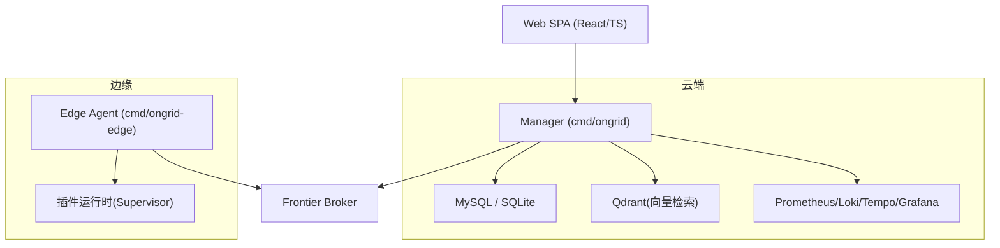
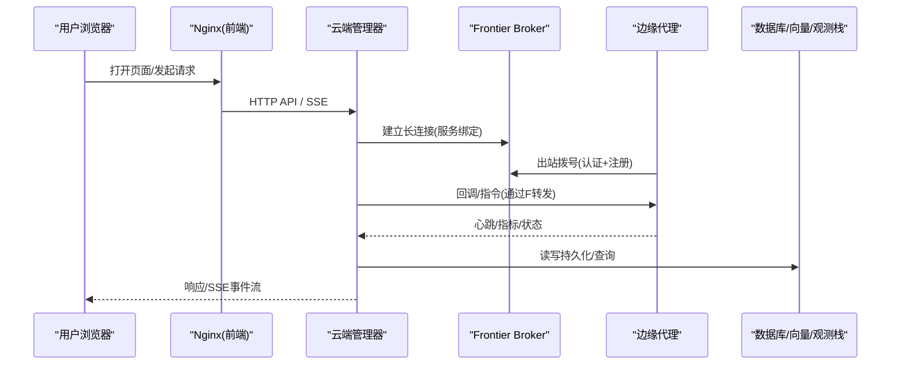
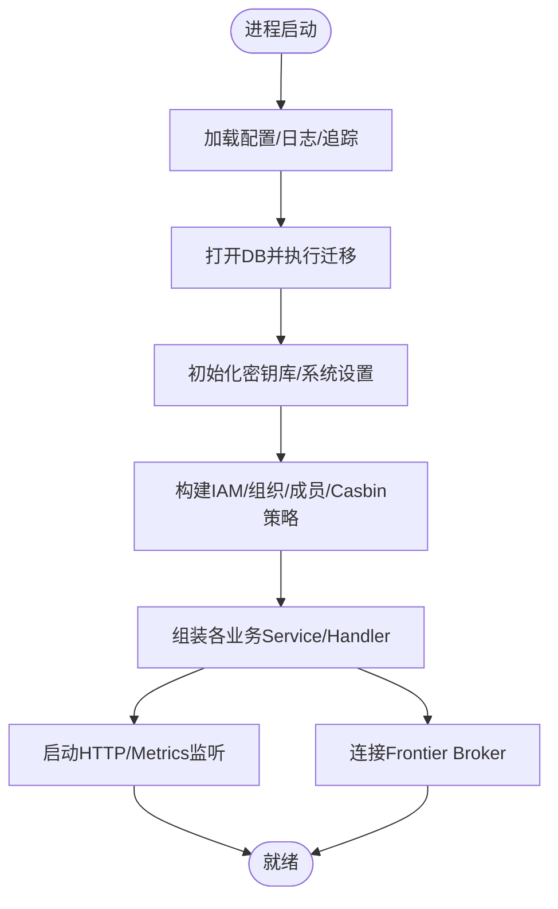
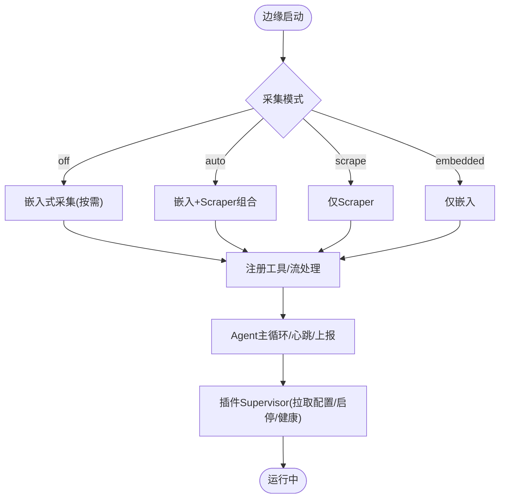
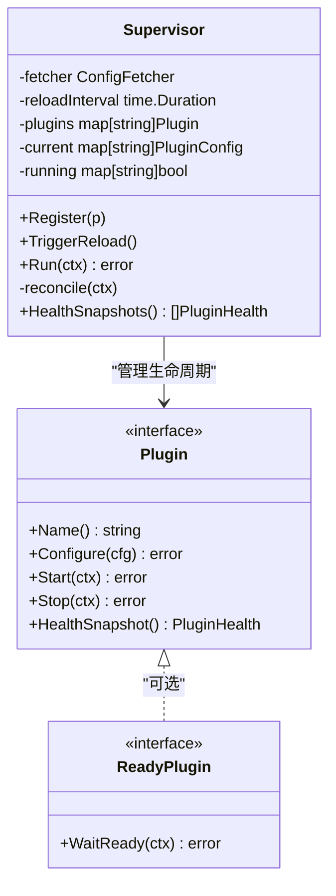
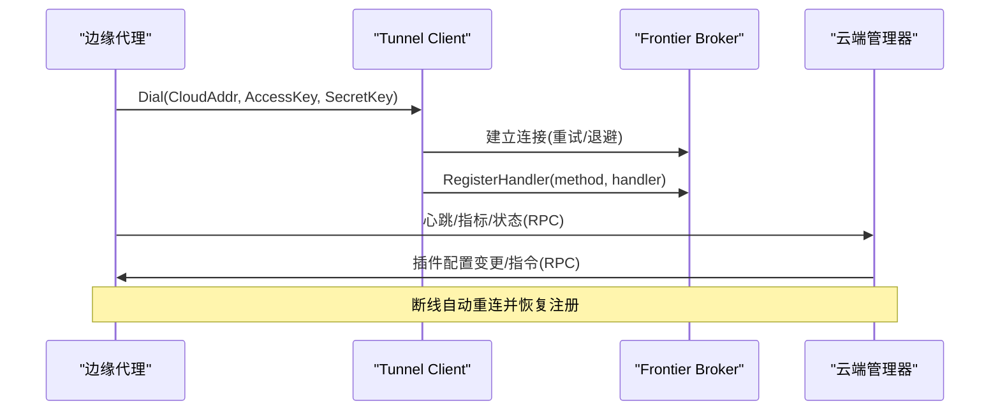
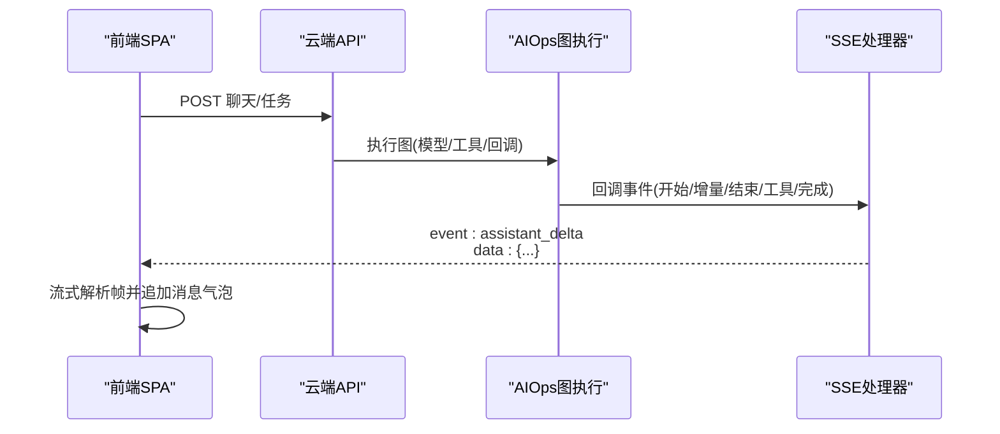
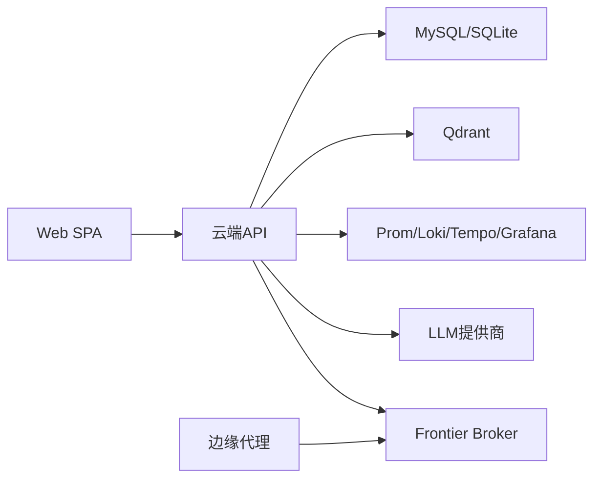

# 技术架构概览

<cite>
**本文引用的文件**   
- [README.md](file://README.md)
- [cmd/ongrid/main.go](file://cmd/ongrid/main.go)
- [cmd/ongrid-edge/main.go](file://cmd/ongrid-edge/main.go)
- [internal/pkg/tunnel/client.go](file://internal/pkg/tunnel/client.go)
- [internal/edgeagent/plugins/supervisor.go](file://internal/edgeagent/plugins/supervisor.go)
- [internal/manager/biz/aiops/graph/callbacks/sse.go](file://internal/manager/biz/aiops/graph/callbacks/sse.go)
- [internal/manager/server/operatorrun/http.go](file://internal/manager/server/operatorrun/http.go)
- [web/src/api/chat.ts](file://web/src/api/chat.ts)
- [deploy/docker-compose.yml](file://deploy/docker-compose.yml)
- [web/package.json](file://web/package.json)
- [web/vite.config.ts](file://web/vite.config.ts)
- [web/src/main.tsx](file://web/src/main.tsx)
- [internal/manager/service/metric/service.go](file://internal/manager/service/metric/service.go)
</cite>

## 目录
1. [简介](#简介)
2. [项目结构](#项目结构)
3. [核心组件](#核心组件)
4. [架构总览](#架构总览)
5. [详细组件分析](#详细组件分析)
6. [依赖关系分析](#依赖关系分析)
7. [性能考量](#性能考量)
8. [故障排查指南](#故障排查指南)
9. [结论](#结论)
10. [附录](#附录)

## 简介
Ongrid 是一个面向基础设施运维的 AI Agent 平台，提供“云端管理器 + 边缘代理”的分布式架构。云端负责编排、策略下发、数据聚合与可视化；边缘侧负责采集、执行与上报，并通过出站隧道与云端通信，避免在目标主机暴露入站端口。平台采用微服务分层设计（表示层/业务层/数据访问层），通过插件化机制实现能力的动态扩展与热插拔，并基于 SSE 的事件驱动实时通信提升交互体验。前端使用 React + TypeScript，后端以 Go 构建高并发服务。

## 项目结构
仓库采用按领域与层次划分的模块化组织：
- cmd：可执行程序入口（云端 ongrid、边缘 ongrid-edge）
- internal：核心代码，包含 manager（云端）、edgeagent（边缘）、pkg（通用能力）、iam（身份与权限）、skill（技能注册与调度）
- api：gRPC/Protobuf 接口定义
- web：React + TypeScript 前端应用
- deploy：部署配置（Docker Compose、Kubernetes Helm、安装脚本等）
- db：数据库迁移脚本
- docs：设计文档、RFC、测试计划等

**图表来源**
- [cmd/ongrid/main.go:1-12](file://cmd/ongrid/main.go#L1-L12)
- [cmd/ongrid-edge/main.go:1-57](file://cmd/ongrid-edge/main.go#L1-L57)
- [deploy/docker-compose.yml:39-185](file://deploy/docker-compose.yml#L39-L185)
- [deploy/docker-compose.yml:214-367](file://deploy/docker-compose.yml#L214-L367)

**章节来源**
- [README.md:43-56](file://README.md#L43-L56)
- [deploy/docker-compose.yml:1-12](file://deploy/docker-compose.yml#L1-L12)

## 核心组件
- 云端管理器（Manager）：对外暴露 HTTP API、指标端点，连接上游 Frontier Broker 建立长连接，管理设备/告警/工作流/AIOps/知识库等业务能力，维护系统设置与密钥库，启动数据库迁移与默认数据。
- 边缘代理（Edge Agent）：出站连接至云端，周期性上报主机指标、网络发现结果，提供工具 RPC（如 bash 沙箱、文件检查、重启服务等），运行插件（日志、追踪、指标抓取、数据库导出等）。
- 插件系统（Supervisor）：从云端拉取插件配置快照，对比当前状态进行启停/重载，支持进程内或子进程插件，健康汇报与就绪检测。
- 隧道客户端（Tunnel Client）：封装与 Frontier 的可靠连接、自动重连、RPC 注册与调用、流式通道接受。
- 事件驱动与 SSE：AIOps 图执行过程中通过 SSE 推送 assistant_start/delta/end、tool_start/end、done/error/task_notification 等事件，前端流式解析渲染。
- 微服务分层：HTTP Server（表示层）→ Service（服务层）→ Biz（业务用例）→ Data（存储实现），严格解耦便于测试与替换。

**章节来源**
- [cmd/ongrid/main.go:208-300](file://cmd/ongrid/main.go#L208-L300)
- [cmd/ongrid-edge/main.go:136-417](file://cmd/ongrid-edge/main.go#L136-L417)
- [internal/edgeagent/plugins/supervisor.go:12-35](file://internal/edgeagent/plugins/supervisor.go#L12-L35)
- [internal/pkg/tunnel/client.go:24-38](file://internal/pkg/tunnel/client.go#L24-L38)
- [internal/manager/biz/aiops/graph/callbacks/sse.go:22-50](file://internal/manager/biz/aiops/graph/callbacks/sse.go#L22-L50)
- [internal/manager/service/metric/service.go:1-8](file://internal/manager/service/metric/service.go#L1-L8)

## 架构总览
Ongrid 采用“云端管理器 + 边缘代理 + 消息总线（Frontier）”的分布式架构。边缘侧仅出站连接，避免在目标主机开放入站端口；云端通过 Manager 暴露统一 API，结合 Prometheus/Loki/Tempo/Grafana 完成观测能力闭环。前端 SPA 通过 Nginx 反向代理访问后端 API，SSE 用于实时协作与调试。

**图表来源**
- [cmd/ongrid/main.go:1-12](file://cmd/ongrid/main.go#L1-L12)
- [cmd/ongrid-edge/main.go:136-160](file://cmd/ongrid-edge/main.go#L136-L160)
- [internal/pkg/tunnel/client.go:81-165](file://internal/pkg/tunnel/client.go#L81-L165)
- [deploy/docker-compose.yml:39-185](file://deploy/docker-compose.yml#L39-L185)

## 详细组件分析

### 云端管理器（Manager）
- 职责：加载配置、初始化日志/追踪、执行数据库迁移、构建 IAM/RBAC、设置系统默认值、启动各业务模块（设备/边缘/告警/日志/拓扑/指标/AIOps/市场/技能/设置/审批/报告/流量/抓包等）、暴露 HTTP API 与指标端点。
- 关键流程：启动时创建 SecretBox、Setting 服务、LLM 多提供商路由、Grafana 集成、Monitor 面板同步、审计日志、通知路由等。
- 分层：server（HTTP 处理器）→ service（薄包装）→ biz（用例）→ data（存储实现）。

**图表来源**
- [cmd/ongrid/main.go:208-300](file://cmd/ongrid/main.go#L208-L300)
- [cmd/ongrid/main.go:415-520](file://cmd/ongrid/main.go#L415-L520)
- [cmd/ongrid/main.go:574-773](file://cmd/ongrid/main.go#L574-L773)

**章节来源**
- [cmd/ongrid/main.go:208-300](file://cmd/ongrid/main.go#L208-L300)
- [cmd/ongrid/main.go:415-520](file://cmd/ongrid/main.go#L415-L520)
- [cmd/ongrid/main.go:574-773](file://cmd/ongrid/main.go#L574-L773)

### 边缘代理（Edge Agent）
- 职责：出站连接云端、采集主机指标/网络发现、注册工具 RPC（bash 沙箱、文件检查、重启服务、WebShell 流转发）、运行插件（日志/追踪/指标抓取/数据库导出/主机指标/进程指标）、上报插件健康与配置变更。
- 关键流程：根据模式选择采集器（off/auto/embedded/scrape），构建 Collector，注册 host_files/bash/operator/webshell/streamrouter，启动 Agent 主循环，按需启用 K8s 控制器能力（清单/指标推送），启动插件 Supervisor。

**图表来源**
- [cmd/ongrid-edge/main.go:136-160](file://cmd/ongrid-edge/main.go#L136-L160)
- [cmd/ongrid-edge/main.go:161-213](file://cmd/ongrid-edge/main.go#L161-L213)
- [cmd/ongrid-edge/main.go:222-280](file://cmd/ongrid-edge/main.go#L222-L280)
- [cmd/ongrid-edge/main.go:302-417](file://cmd/ongrid-edge/main.go#L302-L417)
- [cmd/ongrid-edge/main.go:428-488](file://cmd/ongrid-edge/main.go#L428-L488)

**章节来源**
- [cmd/ongrid-edge/main.go:136-417](file://cmd/ongrid-edge/main.go#L136-L417)
- [cmd/ongrid-edge/main.go:428-488](file://cmd/ongrid-edge/main.go#L428-L488)

### 插件化架构（Supervisor）
- 职责：维护插件注册表，周期或信号触发拉取云端下发的插件配置快照，比较期望态与当前态，对新增/禁用/变更的插件执行 Configure/Start/Stop，支持 ReadyPlugin 就绪检测，汇总健康快照上报。
- 特性：单插件失败不影响整体；安全网轮询（默认 60s）；支持 SIGHUP 重载（若插件支持）；配置变更确认回传云端。

**图表来源**
- [internal/edgeagent/plugins/supervisor.go:12-35](file://internal/edgeagent/plugins/supervisor.go#L12-L35)
- [internal/edgeagent/plugins/supervisor.go:75-133](file://internal/edgeagent/plugins/supervisor.go#L75-L133)
- [internal/edgeagent/plugins/supervisor.go:135-243](file://internal/edgeagent/plugins/supervisor.go#L135-L243)

**章节来源**
- [internal/edgeagent/plugins/supervisor.go:12-35](file://internal/edgeagent/plugins/supervisor.go#L12-L35)
- [internal/edgeagent/plugins/supervisor.go:75-133](file://internal/edgeagent/plugins/supervisor.go#L75-L133)
- [internal/edgeagent/plugins/supervisor.go:135-243](file://internal/edgeagent/plugins/supervisor.go#L135-L243)

### 隧道通信与数据同步
- 边缘侧通过 Tunnel Client 使用 geminio 建立到 Frontier Broker 的长连接，带指数退避重连、连接代际切换、断线恢复后重新注册处理器。
- 云端 Manager 作为服务端绑定到 Frontier，接收边缘的 register_edge/heartbeat/push_host_metrics 等 RPC，并支持反向调用（如 AIOps 工具）。
- 数据同步策略：边缘周期性上报指标/清单/健康；云端持久化并聚合；插件配置由云端下发，边缘拉取并应用，健康状态回传。

**图表来源**
- [internal/pkg/tunnel/client.go:81-165](file://internal/pkg/tunnel/client.go#L81-L165)
- [internal/pkg/tunnel/client.go:208-270](file://internal/pkg/tunnel/client.go#L208-L270)
- [cmd/ongrid/main.go:1-12](file://cmd/ongrid/main.go#L1-L12)

**章节来源**
- [internal/pkg/tunnel/client.go:81-165](file://internal/pkg/tunnel/client.go#L81-L165)
- [internal/pkg/tunnel/client.go:208-270](file://internal/pkg/tunnel/client.go#L208-L270)
- [cmd/ongrid/main.go:1-12](file://cmd/ongrid/main.go#L1-L12)

### 事件驱动与 SSE 实时通信
- AIOps 图执行期间，通过 SSE 推送 assistant_start/delta/end、tool_start/end、done/error/task_notification 等事件类型，前端流式读取并按帧拼接展示。
- 服务端写事件函数将 event/data 行写入响应并 flush，确保低延迟推送到浏览器。

**图表来源**
- [internal/manager/biz/aiops/graph/callbacks/sse.go:22-50](file://internal/manager/biz/aiops/graph/callbacks/sse.go#L22-L50)
- [internal/manager/server/operatorrun/http.go:210-224](file://internal/manager/server/operatorrun/http.go#L210-L224)
- [web/src/api/chat.ts:275-318](file://web/src/api/chat.ts#L275-L318)

**章节来源**
- [internal/manager/biz/aiops/graph/callbacks/sse.go:22-50](file://internal/manager/biz/aiops/graph/callbacks/sse.go#L22-L50)
- [internal/manager/server/operatorrun/http.go:210-224](file://internal/manager/server/operatorrun/http.go#L210-L224)
- [web/src/api/chat.ts:275-318](file://web/src/api/chat.ts#L275-L318)

### 微服务分层设计
- 表示层（Server/Handler）：HTTP 路由、鉴权中间件、参数校验、错误码映射。
- 服务层（Service）：薄包装，协调多个 Biz 用例，不直接访问数据层。
- 业务层（Biz/Usecase）：领域逻辑、规则、编排、外部系统集成。
- 数据访问层（Data/Store）：具体存储实现（SQL/缓存/对象存储等），暴露接口供 Biz 调用。

示例：指标服务（metric）即遵循该分层，Service 仅委托给 Biz.IngestService 与 QueryUsecase，禁止直接导入 data/**。

**章节来源**
- [internal/manager/service/metric/service.go:1-8](file://internal/manager/service/metric/service.go#L1-L8)
- [internal/manager/service/metric/service.go:18-48](file://internal/manager/service/metric/service.go#L18-L48)

### 前端架构（React + TypeScript）
- 技术选型：React 18 + TypeScript + Vite + Tailwind + Zustand 状态管理，Playwright/Vitest 测试。
- 构建优化：手动拆分重型依赖（charts/xterm）为独立 chunk，减少首屏体积；开发环境通过 Vite 代理 /api 到后端。
- 实时交互：SSE 流式读取，逐帧解析并更新消息气泡，提升响应式体验。

**章节来源**
- [web/package.json:17-31](file://web/package.json#L17-L31)
- [web/vite.config.ts:13-53](file://web/vite.config.ts#L13-L53)
- [web/src/main.tsx:1-25](file://web/src/main.tsx#L1-L25)
- [web/src/api/chat.ts:275-318](file://web/src/api/chat.ts#L275-L318)

## 依赖关系分析
- 云端依赖：MySQL/SQLite（持久化）、Qdrant（向量检索）、Prometheus/Loki/Tempo/Grafana（观测）、Frontier Broker（边缘通信）、LLM 提供商（OpenAI/Anthropic/Gemini/DeepSeek/Kimi/智谱等）。
- 边缘依赖：Frontier Broker（出站）、宿主系统（gopsutil/命令执行/文件系统）、可选 K8s 元数据（集群/节点信息）。
- 前端依赖：浏览器、Nginx（反向代理/TLS终止）、后端 API。

**图表来源**
- [deploy/docker-compose.yml:39-185](file://deploy/docker-compose.yml#L39-L185)
- [deploy/docker-compose.yml:214-367](file://deploy/docker-compose.yml#L214-L367)
- [cmd/ongrid/main.go:574-773](file://cmd/ongrid/main.go#L574-L773)

**章节来源**
- [deploy/docker-compose.yml:39-185](file://deploy/docker-compose.yml#L39-L185)
- [deploy/docker-compose.yml:214-367](file://deploy/docker-compose.yml#L214-L367)
- [cmd/ongrid/main.go:574-773](file://cmd/ongrid/main.go#L574-L773)

## 性能考量
- Go 高并发：goroutine + channel + errgroup 管理生命周期与并发控制；批量 fan-out 保持顺序与并发上限；指标上报与插件健康快照异步化。
- 连接与重连：Tunnel Client 指数退避重连，连接代际切换避免竞态；断线自动恢复并重新注册处理器。
- 前端性能：Vite 手动拆分重型依赖，减少首屏体积；SSE 流式传输降低首字节延迟；Zustand 轻量状态管理。
- 观测与可观测性：内置 Prometheus 指标、Loki 日志、Tempo 链路追踪，便于定位瓶颈与异常。

[本节为通用性能讨论，无需特定文件引用]

## 故障排查指南
- 连接问题：检查 Frontier 地址与证书、AccessKey/SecretKey 是否正确；查看 Tunnel Client 日志中的 dial/retry/backoff 记录。
- 插件异常：Supervisor 会记录每个插件的配置拉取/启停/就绪失败；可通过 HealthSnapshots 获取插件健康快照；配置变更失败会回传云端。
- SSE 中断：前端流式解析遇到空帧或关闭时会停止；检查服务端 writeSSE 是否 flush；确认事件类型与 payload 格式。
- 数据库/存储：启动阶段执行迁移失败会导致进程退出；检查 MySQL/SQLite 可达性与权限；观察迁移日志。
- 前端代理：开发环境 Vite 代理 /api 指向后端；生产通过 Nginx 反代；确认端口与 TLS 配置。

**章节来源**
- [internal/pkg/tunnel/client.go:81-165](file://internal/pkg/tunnel/client.go#L81-L165)
- [internal/edgeagent/plugins/supervisor.go:135-243](file://internal/edgeagent/plugins/supervisor.go#L135-L243)
- [internal/manager/server/operatorrun/http.go:210-224](file://internal/manager/server/operatorrun/http.go#L210-L224)
- [cmd/ongrid/main.go:256-300](file://cmd/ongrid/main.go#L256-L300)
- [web/vite.config.ts:54-63](file://web/vite.config.ts#L54-L63)

## 结论
Ongrid 通过“云端管理器 + 边缘代理 + Frontier 消息总线”的分布式架构，实现了零入站端口、高可扩展、可观测与智能化的运维平台。微服务分层清晰，插件化机制支持动态扩展与热插拔，SSE 事件驱动保障实时交互体验。Go 的高并发能力与 React 的前端响应式体验共同提升了系统的性能与可用性。部署拓扑灵活，支持 Docker Compose 与 Kubernetes，适配多种基础设施依赖。

[本节为总结性内容，无需特定文件引用]

## 附录

### 部署拓扑与基础设施依赖
- 云端容器：MySQL、Qdrant、Prometheus、Loki、Tempo、Grafana、Nginx、Frontier Broker、Ongrid Manager。
- 边缘容器/进程：Ongrid Edge Agent，运行于目标主机或 K8s Node/Controller，仅出站连接。
- 网络：Nginx 对外暴露 80/443，内部转发至 Manager；Frontier 暴露 40012 供边缘拨号；Manager 通过 40011 与 Frontier 通信。

**章节来源**
- [deploy/docker-compose.yml:39-185](file://deploy/docker-compose.yml#L39-L185)
- [deploy/docker-compose.yml:214-367](file://deploy/docker-compose.yml#L214-L367)