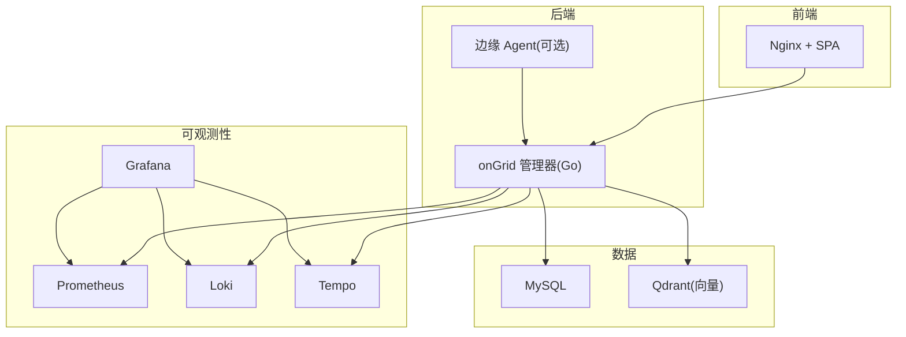
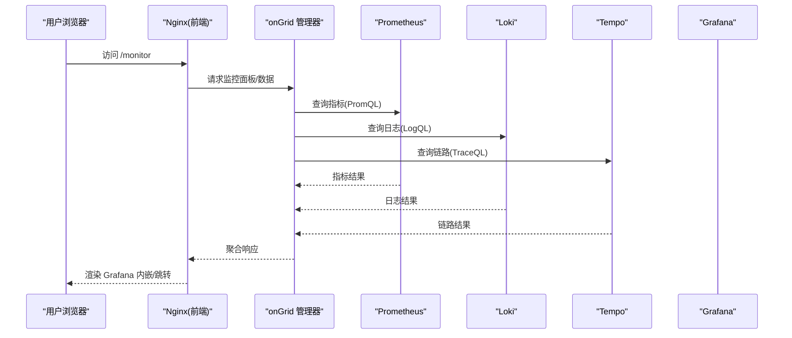
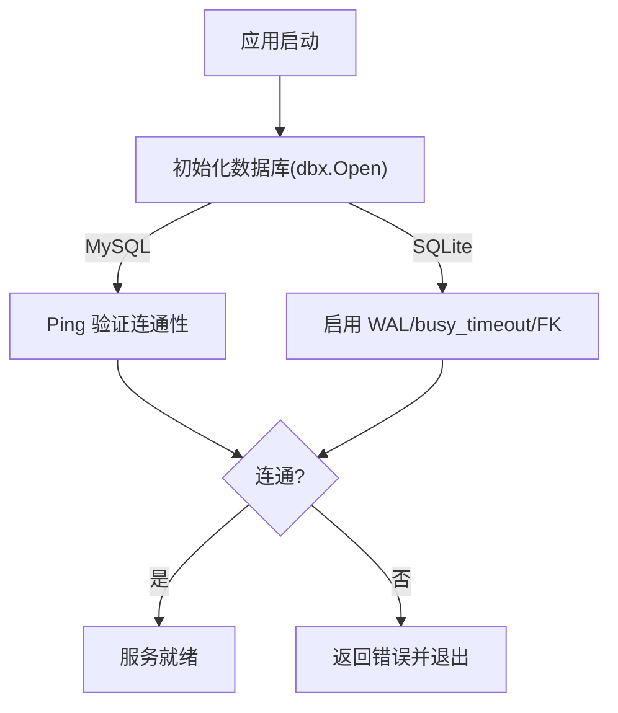
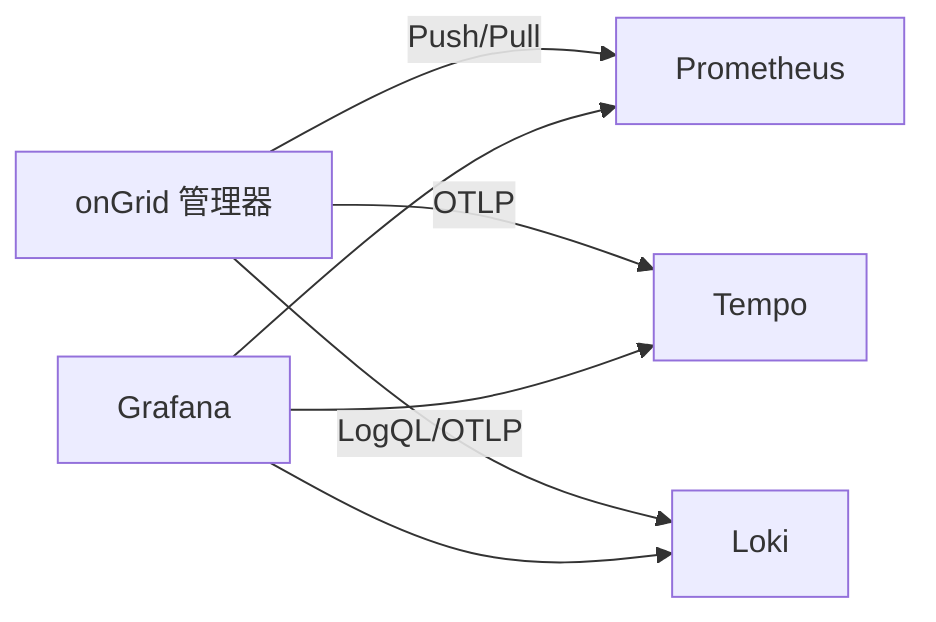
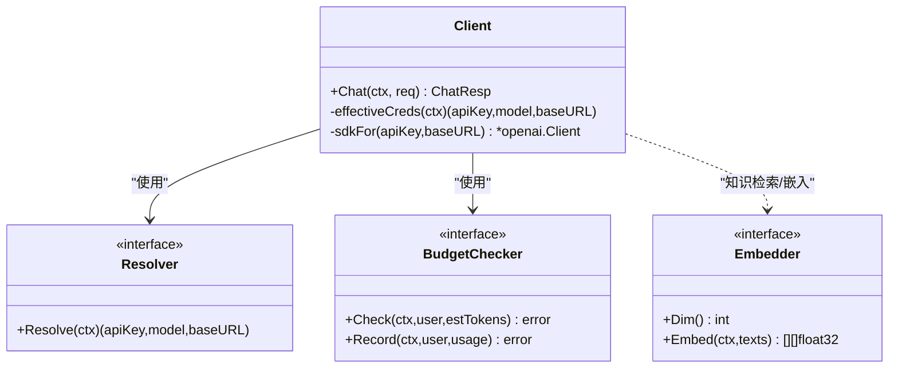
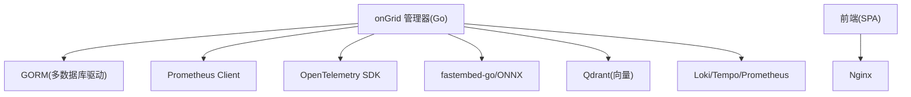

# 技术栈选型

<cite>
**本文引用的文件**
- [go.mod](file://go.mod)
- [web/package.json](file://web/package.json)
- [deploy/Dockerfile.ongrid](file://deploy/Dockerfile.ongrid)
- [deploy/Dockerfile.web](file://deploy/Dockerfile.web)
- [deploy/docker-compose.yml](file://deploy/docker-compose.yml)
- [internal/pkg/dbx/dbx.go](file://internal/pkg/dbx/dbx.go)
- [deploy/install/prometheus.yml](file://deploy/install/prometheus.yml)
- [deploy/install/loki-config.yaml](file://deploy/install/loki-config.yaml)
- [deploy/install/tempo-config.yaml](file://deploy/install/tempo-config.yaml)
- [internal/pkg/llm/client.go](file://internal/pkg/llm/client.go)
- [internal/pkg/embedding/embedding.go](file://internal/pkg/embedding/embedding.go)
- [cmd/ongrid/main.go](file://cmd/ongrid/main.go)
- [internal/manager/server/aiops/http.go](file://internal/manager/server/aiops/http.go)
- [internal/manager/biz/setting/telemetry.go](file://internal/manager/biz/setting/telemetry.go)
- [scripts/publish-helm-chart.sh](file://scripts/publish-helm-chart.sh)
</cite>

## 目录
1. [引言](#引言)
2. [项目结构](#项目结构)
3. [核心组件](#核心组件)
4. [架构总览](#架构总览)
5. [详细组件分析](#详细组件分析)
6. [依赖关系分析](#依赖关系分析)
7. [性能考量](#性能考量)
8. [故障排查指南](#故障排查指南)
9. [结论](#结论)
10. [附录：版本兼容与升级策略](#附录版本兼容与升级策略)

## 引言
本文件为 Ongrid 平台的技术栈选型说明，覆盖后端 Go、前端 React + TypeScript、数据库（MySQL/SQLite）、可观测性（Prometheus/Grafana/Loki/Tempo）、容器化与编排（Docker/Kubernetes），以及 AI/ML 多模型支持架构。文档基于仓库中的实际代码与部署配置进行梳理，并给出兼容性矩阵与升级建议，帮助团队在演进中保持稳定性与可维护性。

## 项目结构
Ongrid 采用前后端分离与微服务化部署形态：
- 后端：Go 语言实现，提供 HTTP API、Agent/AIOps 能力、插件体系、遥测采集与写入等。
- 前端：React + TypeScript + Vite，构建静态 SPA，由 Nginx 托管并通过反向代理访问后端。
- 数据层：默认 MySQL，开发可选 SQLite；向量检索使用 Qdrant。
- 可观测性：Prometheus 指标、Loki 日志、Tempo 链路追踪，Grafana 统一可视化。
- 容器化：多阶段 Docker 镜像；本地开发通过 docker-compose 一键拉起；生产可通过 Helm 部署到 Kubernetes。

图表来源
- [deploy/docker-compose.yml:13-367](file://deploy/docker-compose.yml#L13-L367)
- [deploy/Dockerfile.ongrid:1-159](file://deploy/Dockerfile.ongrid#L1-L159)
- [deploy/Dockerfile.web:1-44](file://deploy/Dockerfile.web#L1-L44)

章节来源
- [deploy/docker-compose.yml:1-405](file://deploy/docker-compose.yml#L1-L405)
- [deploy/Dockerfile.ongrid:1-159](file://deploy/Dockerfile.ongrid#L1-L159)
- [deploy/Dockerfile.web:1-44](file://deploy/Dockerfile.web#L1-L44)

## 核心组件
- 后端 Go：以 gRPC/HTTP 暴露能力，集成 Prometheus 指标导出、OpenTelemetry 链路、LLM 客户端与嵌入模型、插件与技能注册中心、Kubernetes/Edge 集成等。
- 前端 React + TypeScript：组件化页面、状态管理、图表与终端交互，Vite 构建，Tailwind CSS 样式。
- 数据库：默认 MySQL（生产级事务、并发、生态完善）；SQLite（单用户/本地调试）。
- 可观测性：Prometheus 采集与远写、Loki 日志聚合、Tempo 链路追踪、Grafana 统一视图。
- 容器化与编排：多阶段镜像、健康检查、环境变量驱动配置；Helm Chart 发布脚本与 K8s 资源模板。
- AI/ML：多 LLM 提供商接入（OpenAI 兼容、智谱、Gemini、DeepSeek、Kimi 等），本地/云端嵌入模型切换，向量库 Qdrant。

章节来源
- [go.mod:1-180](file://go.mod#L1-L180)
- [web/package.json:1-56](file://web/package.json#L1-L56)
- [internal/pkg/dbx/dbx.go:1-77](file://internal/pkg/dbx/dbx.go#L1-L77)
- [deploy/install/prometheus.yml:1-36](file://deploy/install/prometheus.yml#L1-L36)
- [deploy/install/loki-config.yaml:1-76](file://deploy/install/loki-config.yaml#L1-L76)
- [deploy/install/tempo-config.yaml:1-77](file://deploy/install/tempo-config.yaml#L1-L77)
- [internal/pkg/llm/client.go:1-732](file://internal/pkg/llm/client.go#L1-L732)
- [internal/pkg/embedding/embedding.go:1-253](file://internal/pkg/embedding/embedding.go#L1-L253)

## 架构总览
Ongrid 的运行时由“管理器 + 边缘 Agent”组成，管理器负责业务编排、AIOps、设置与集成、遥测汇聚与查询；边缘侧负责数据采集、命令执行、遥测上报。可观测性栈通过 OTLP/HTTP 或 Push/Pull 方式接入 Prometheus/Loki/Tempo，并在 Grafana 中统一展示。

图表来源
- [deploy/docker-compose.yml:228-367](file://deploy/docker-compose.yml#L228-L367)
- [deploy/install/prometheus.yml:16-25](file://deploy/install/prometheus.yml#L16-L25)
- [deploy/install/loki-config.yaml:1-76](file://deploy/install/loki-config.yaml#L1-L76)
- [deploy/install/tempo-config.yaml:1-77](file://deploy/install/tempo-config.yaml#L1-L77)

## 详细组件分析

### 后端 Go 技术优势与实现要点
- 高并发与内存安全：Go 原生 goroutine 与 GC 机制，配合标准库与成熟第三方库（如 chi、gorm、prometheus client_golang）实现高吞吐 API 与稳定运行。
- 可观测性内置：通过 prometheus client_golang 暴露 /metrics，结合 OpenTelemetry SDK 输出链路；管理器启动时暴露 9100 端口供 Prometheus 抓取。
- 插件与技能：内部插件体系支持 metrics/logs/traces 等采集器，通过子进程与沙箱隔离执行，提升扩展性与安全性。
- 数据库抽象：dbx 封装 MySQL/SQLite 选择，默认 MySQL，开启连接 Ping 校验失败快速失败；SQLite 启用 WAL、busy_timeout、外键约束等优化。

图表来源
- [internal/pkg/dbx/dbx.go:34-77](file://internal/pkg/dbx/dbx.go#L34-L77)

章节来源
- [go.mod:1-180](file://go.mod#L1-L180)
- [internal/pkg/dbx/dbx.go:1-77](file://internal/pkg/dbx/dbx.go#L1-L77)
- [deploy/docker-compose.yml:39-185](file://deploy/docker-compose.yml#L39-L185)

### 前端 React + TypeScript 选型理由
- 组件化与生态：React 18 + Vite + TypeScript，配合 Zustand 状态管理、Recharts 图表、Xterm 终端、Tailwind CSS 样式，形成高效的前端工程化方案。
- 类型安全：TypeScript 编译期类型检查，减少运行时错误；ESLint/Vitest/Playwright 保障质量与 E2E。
- 构建与部署：多阶段构建 SPA 产物至 Nginx，便于独立部署与灰度发布。

章节来源
- [web/package.json:1-56](file://web/package.json#L1-L56)
- [deploy/Dockerfile.web:1-44](file://deploy/Dockerfile.web#L1-L44)

### 数据库选型策略（MySQL 与 SQLite）
- MySQL：生产默认，具备成熟的 ACID、高可用生态、丰富的工具链；docker-compose 中以 healthcheck 确保服务就绪后再启动 ongrid。
- SQLite：开发/单机场景可选，启用 WAL、busy_timeout、外键约束，适合轻量调试与演示。

章节来源
- [deploy/docker-compose.yml:13-38](file://deploy/docker-compose.yml#L13-L38)
- [internal/pkg/dbx/dbx.go:1-77](file://internal/pkg/dbx/dbx.go#L1-L77)

### 监控技术栈（Prometheus/Grafana/Loki/Tempo）
- Prometheus：作为指标采集与查询后端，启用远程写入接收器，抓取 ongrid 管理器指标；规则文件挂载支持热加载。
- Loki：单二进制日志后端，文件系统存储，限制流基数与摄入速率，保留 30 天；通过 nginx 反向代理对外暴露推送接口。
- Tempo：单二进制链路后端，OTLP gRPC/HTTP 接收，SpanMetrics 与 Service Graph 生成指标并远写到 Prometheus，便于复用现有告警与查询路径。
- Grafana：统一可视化，预置数据源与仪表盘，支持 iframe 嵌入与匿名编辑模式用于开发环境。

图表来源
- [deploy/docker-compose.yml:228-367](file://deploy/docker-compose.yml#L228-L367)
- [deploy/install/prometheus.yml:1-36](file://deploy/install/prometheus.yml#L1-L36)
- [deploy/install/loki-config.yaml:1-76](file://deploy/install/loki-config.yaml#L1-L76)
- [deploy/install/tempo-config.yaml:1-77](file://deploy/install/tempo-config.yaml#L1-L77)

章节来源
- [deploy/install/prometheus.yml:1-36](file://deploy/install/prometheus.yml#L1-L36)
- [deploy/install/loki-config.yaml:1-76](file://deploy/install/loki-config.yaml#L1-L76)
- [deploy/install/tempo-config.yaml:1-77](file://deploy/install/tempo-config.yaml#L1-L77)
- [deploy/docker-compose.yml:228-367](file://deploy/docker-compose.yml#L228-L367)

### 容器化与编排（Docker 与 Kubernetes）
- Docker：管理器镜像使用多阶段构建，CGO 启用以支持本地嵌入模型（ONNX Runtime）；最终镜像精简，非 root 运行，暴露 8080/9100。
- Nginx：前端 SPA 构建后注入镜像，默认配置可被 bind-mount 覆盖，便于 TLS 与路由定制。
- Kubernetes：提供 Helm Chart 发布脚本与 values 示例，支持 telemetry gateway 横向扩缩容、资源配额与 HPA 策略。

章节来源
- [deploy/Dockerfile.ongrid:1-159](file://deploy/Dockerfile.ongrid#L1-L159)
- [deploy/Dockerfile.web:1-44](file://deploy/Dockerfile.web#L1-L44)
- [scripts/publish-helm-chart.sh:1-39](file://scripts/publish-helm-chart.sh#L1-L39)

### AI/ML 多模型支持架构
- LLM 客户端：遵循 OpenAI 协议形状，支持多提供商（OpenAI、智谱、Gemini、DeepSeek、Kimi、自定义），动态解析凭据（环境变量/设置表），内置预算控制、超时保护、重试与自修复（推理模型采样参数自动剥离）。
- 嵌入模型：支持云端 OpenAI 兼容 API 与本地 fastembed-go（BGE/E5 ONNX），通过 Embedder 接口切换；维度与缓存目录可配置。
- 模型目录与默认值：启动时按提供商注入默认模型列表与默认模型，前端通过 /v1/aiops/models 获取并提供选择。

图表来源
- [internal/pkg/llm/client.go:1-732](file://internal/pkg/llm/client.go#L1-L732)
- [internal/pkg/embedding/embedding.go:1-253](file://internal/pkg/embedding/embedding.go#L1-L253)
- [cmd/ongrid/main.go:649-677](file://cmd/ongrid/main.go#L649-L677)
- [internal/manager/server/aiops/http.go:961-1000](file://internal/manager/server/aiops/http.go#L961-L1000)

章节来源
- [internal/pkg/llm/client.go:1-732](file://internal/pkg/llm/client.go#L1-L732)
- [internal/pkg/embedding/embedding.go:1-253](file://internal/pkg/embedding/embedding.go#L1-L253)
- [cmd/ongrid/main.go:649-677](file://cmd/ongrid/main.go#L649-L677)
- [internal/manager/server/aiops/http.go:961-1000](file://internal/manager/server/aiops/http.go#L961-L1000)

## 依赖关系分析
- 后端依赖：Go 1.25 模块管理；ORM 使用 GORM（MySQL/SQLite/Postgres/SQLServer 驱动）；指标使用 Prometheus client_golang；OpenTelemetry SDK 输出链路；fastembed-go 与 ONNX Runtime 支持本地嵌入。
- 前端依赖：React 18、TypeScript、Vite、Tailwind、Zustand、Recharts、Xterm。
- 部署依赖：MySQL、Qdrant、Prometheus、Loki、Tempo、Grafana、Frontier（隧道）。

图表来源
- [go.mod:1-180](file://go.mod#L1-L180)
- [deploy/docker-compose.yml:13-367](file://deploy/docker-compose.yml#L13-L367)

章节来源
- [go.mod:1-180](file://go.mod#L1-L180)
- [deploy/docker-compose.yml:13-367](file://deploy/docker-compose.yml#L13-L367)

## 性能考量
- 数据库：MySQL 默认开启 utf8mb4 与合适的 collation；SQLite 启用 WAL 与 busy_timeout 提升并发读取与避免忙锁。
- 指标与日志：Prometheus 抓取间隔 15-30s；Loki 限制全局流数与摄入速率，防止基数爆炸；Tempo 压缩块大小与保留时间平衡存储与查询性能。
- 容器：多阶段构建与缓存挂载显著缩短构建时间；非 root 运行与最小基础镜像降低攻击面与体积。
- AI/ML：LLM 客户端内置默认超时与预算控制；推理模型自动剥离采样参数以避免 400 错误；嵌入模型支持本地缓存以减少网络开销。

[本节为通用指导，不直接分析具体文件]

## 故障排查指南
- 数据库连接失败：检查 MySQL 健康检查与 DSN；SQLite 模式确认路径与权限；dbx 会在打开时 Ping 验证并快速失败。
- 指标不可见：确认 ongrid 暴露 9100，Prometheus 抓取目标可达；规则文件挂载生效需重启或触发重载。
- 日志无法查询：检查 Loki 配置与 nginx 反向代理；确认 ingestion 速率与保留策略未超限。
- 链路不可查：确认 Tempo OTLP 端口未被外部暴露，仅通过 nginx 转发；SpanMetrics 远写 Prometheus 是否成功。
- AI 调用失败：检查提供商密钥与 BaseURL；若出现采样参数错误，客户端会自动剥离并重试；查看预算检查与日志记录。

章节来源
- [internal/pkg/dbx/dbx.go:34-77](file://internal/pkg/dbx/dbx.go#L34-L77)
- [deploy/install/prometheus.yml:16-25](file://deploy/install/prometheus.yml#L16-L25)
- [deploy/install/loki-config.yaml:31-59](file://deploy/install/loki-config.yaml#L31-L59)
- [deploy/install/tempo-config.yaml:30-51](file://deploy/install/tempo-config.yaml#L30-L51)
- [internal/pkg/llm/client.go:402-461](file://internal/pkg/llm/client.go#L402-L461)

## 结论
Ongrid 的技术栈以 Go 为核心，结合 React + TypeScript 前端、MySQL/SQLite 数据层、Prometheus/Loki/Tempo/Grafana 可观测性体系，以及 Docker/Kubernetes 容器化与编排，形成了高并发、可扩展、易运维的平台。AI/ML 部分通过多模型支持与本地/云端嵌入模型切换，满足多样化智能需求。建议在演进中持续关注版本兼容与升级策略，确保系统长期稳定与安全。

[本节为总结，不直接分析具体文件]

## 附录：版本兼容与升级策略
- Go 与依赖：
  - Go 版本：1.25（go.mod 指定）
  - 关键依赖：GORM v1.31.1、MySQL 驱动 v1.6.0、Prometheus client_golang v1.20.5、OpenTelemetry SDK v1.43.0、fastembed-go v1.0.0、ONNX Runtime 1.20.1（镜像内固定）
- 前端：
  - React 18、TypeScript 5.6、Vite 5.4、Tailwind 3.4、Zustand 5.0
- 数据库：
  - MySQL 8.0（docker-compose 默认镜像）
  - SQLite 通过 modernc/sqlite 与 gorm 驱动
- 可观测性：
  - Prometheus 2.54.0
  - Loki 3.4.0
  - Tempo 2.10.0
  - Grafana 11.1.4
  - Qdrant 1.11.3
- 编排：
  - Docker 多阶段构建（golang:1.25-bookworm、node:20-alpine、nginx:1.27-alpine）
  - Kubernetes：Helm Chart 发布脚本与 values 示例；telemetry gateway 支持 HPA 与资源配额

升级策略建议：
- 小版本升级优先：对 Go、Node、依赖库采用语义化版本的小版本升级，先在 dev/staging 验证。
- 数据库升级：MySQL 大版本升级前备份与演练；SQLite 迁移注意 WAL 与外键约束。
- 可观测性升级：Prometheus/Loki/Tempo 升级需评估 retention、schema 变更与远写兼容性；Grafana 数据源与仪表盘需回归。
- AI/ML 升级：LLM 提供商 API 变更需适配；嵌入模型版本与维度需与 Qdrant 集合一致；本地 ONNX Runtime 版本锁定避免 ABI 漂移。
- 容器与编排：镜像基础版本升级后进行端到端测试；Helm values 变更需版本化与回滚预案。

章节来源
- [go.mod:1-180](file://go.mod#L1-L180)
- [web/package.json:1-56](file://web/package.json#L1-L56)
- [deploy/docker-compose.yml:13-367](file://deploy/docker-compose.yml#L13-L367)
- [deploy/Dockerfile.ongrid:1-159](file://deploy/Dockerfile.ongrid#L1-L159)
- [deploy/Dockerfile.web:1-44](file://deploy/Dockerfile.web#L1-L44)
- [scripts/publish-helm-chart.sh:1-39](file://scripts/publish-helm-chart.sh#L1-L39)