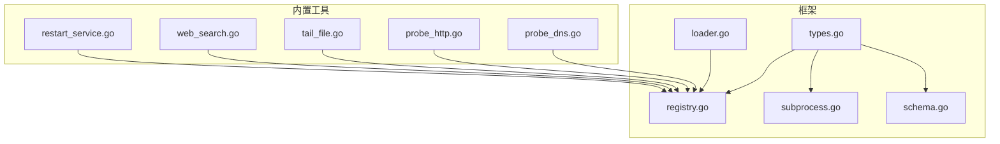
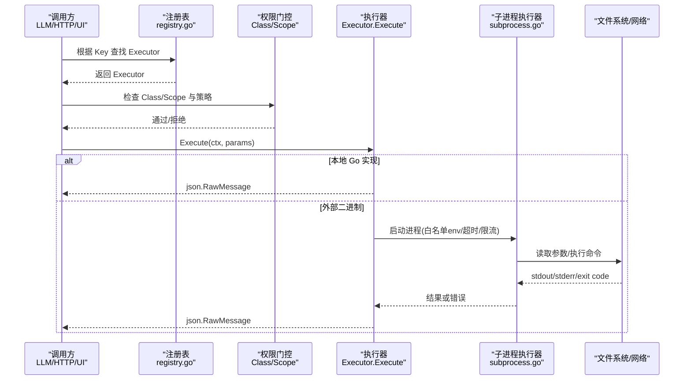
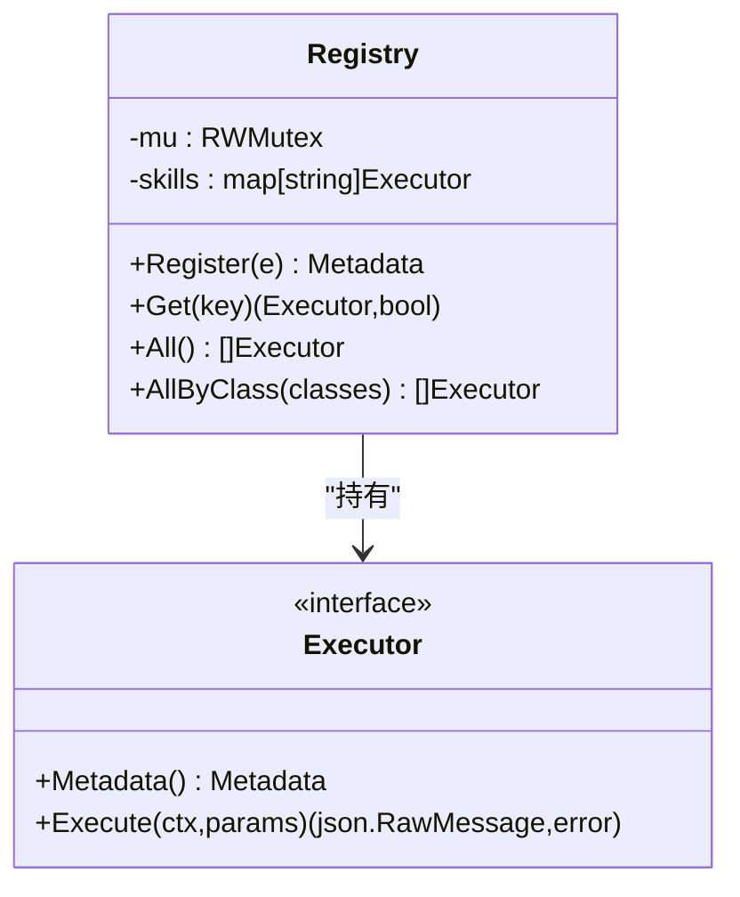
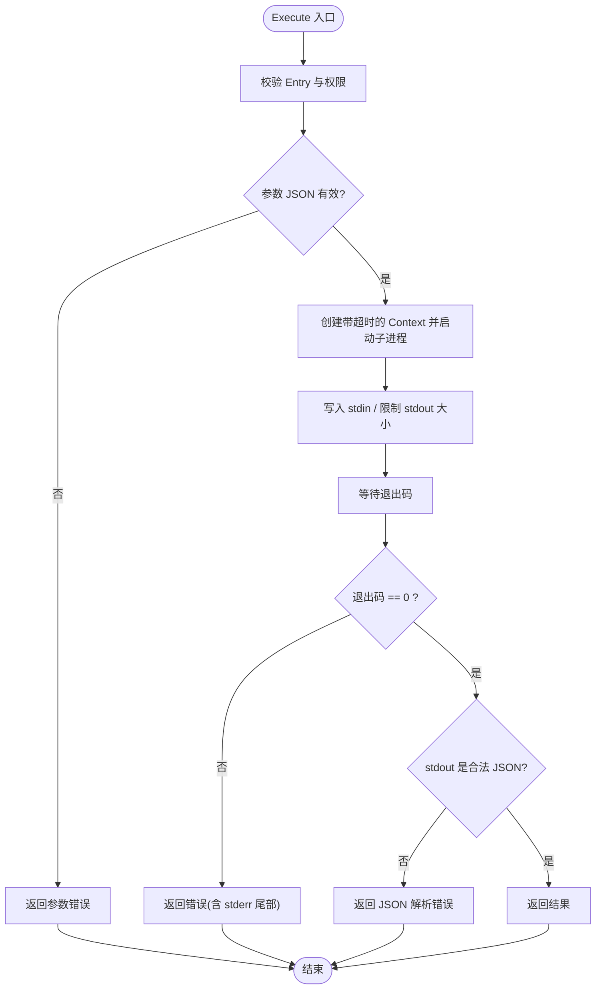
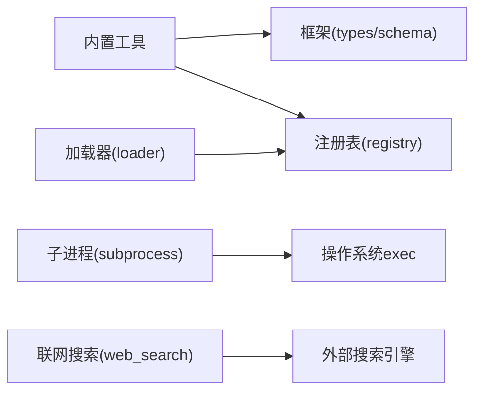

# 工具插件系统

<cite>
**本文引用的文件**
- [internal/skill/types.go](file://internal/skill/types.go)
- [internal/skill/registry.go](file://internal/skill/registry.go)
- [internal/skill/loader.go](file://internal/skill/loader.go)
- [internal/skill/subprocess.go](file://internal/skill/subprocess.go)
- [internal/skill/schema.go](file://internal/skill/schema.go)
- [internal/skill/builtin/probe_dns.go](file://internal/skill/builtin/probe_dns.go)
- [internal/skill/builtin/probe_http.go](file://internal/skill/builtin/probe_http.go)
- [internal/skill/builtin/tail_file.go](file://internal/skill/builtin/tail_file.go)
- [internal/skill/builtin/web_search.go](file://internal/skill/builtin/web_search.go)
- [internal/skill/builtin/restart_service/restart_service.go](file://internal/skill/builtin/restart_service/restart_service.go)
- [internal/skill/builtin/probe_dns_test.go](file://internal/skill/builtin/probe_dns_test.go)
</cite>

## 目录
1. [简介](#简介)
2. [项目结构](#项目结构)
3. [核心组件](#核心组件)
4. [架构总览](#架构总览)
5. [详细组件分析](#详细组件分析)
6. [依赖关系分析](#依赖关系分析)
7. [性能考量](#性能考量)
8. [故障排查指南](#故障排查指南)
9. [结论](#结论)
10. [附录：开发指南与最佳实践](#附录开发指南与最佳实践)

## 简介
本文件系统性阐述 Ongrid 平台的“工具插件系统”（内部称为 Skill），覆盖注册表、调用路由、执行上下文管理、基础工具设计模式、内置工具生态、安全机制、版本兼容、开发与测试策略，以及使用最佳实践与性能优化建议。该体系将设备侧能力以统一接口暴露给 LLM 工具、HTTP API 和 UI，自动派生参数校验、权限门控、审计日志与界面表单。

## 项目结构
- 框架层
  - types.go：定义 Executor 接口、Metadata、ParamSchema、Class/Scope 等核心类型与校验逻辑。
  - registry.go：进程级全局注册表，提供 Register/Get/All/AllByClass 并发安全的访问。
  - loader.go：外部技能包加载器，扫描指定目录下的 skill.json 并构建 SubprocessSkill。
  - subprocess.go：子进程执行器，负责安全地启动外部可执行程序，限制超时、环境变量白名单、输出大小上限。
  - schema.go：将 ParamSchema 或自定义 JSON Schema 转换为 LLM 可用的函数调用 Schema。
- 内置工具
  - builtin/*：网络探测（DNS/HTTP/TCP/PING）、文件读取（tail/journal）、联网搜索（SearXNG/Tavily/Brave）等。
  - restart_service：首个“变更类”工具，强制走审批流（ReviewGate），禁止直接 Execute。
- 测试
  - 各工具附带单元测试，覆盖元数据校验、正常路径、异常路径与边界条件。

**图表来源**
- [internal/skill/types.go:1-241](file://internal/skill/types.go#L1-L241)
- [internal/skill/registry.go:1-127](file://internal/skill/registry.go#L1-L127)
- [internal/skill/loader.go:1-274](file://internal/skill/loader.go#L1-L274)
- [internal/skill/subprocess.go:1-268](file://internal/skill/subprocess.go#L1-L268)
- [internal/skill/schema.go:1-96](file://internal/skill/schema.go#L1-L96)
- [internal/skill/builtin/probe_dns.go:1-85](file://internal/skill/builtin/probe_dns.go#L1-L85)
- [internal/skill/builtin/probe_http.go:1-120](file://internal/skill/builtin/probe_http.go#L1-L120)
- [internal/skill/builtin/tail_file.go:1-133](file://internal/skill/builtin/tail_file.go#L1-L133)
- [internal/skill/builtin/web_search.go:1-593](file://internal/skill/builtin/web_search.go#L1-L593)
- [internal/skill/builtin/restart_service/restart_service.go:1-114](file://internal/skill/builtin/restart_service/restart_service.go#L1-L114)

**章节来源**
- [internal/skill/types.go:1-241](file://internal/skill/types.go#L1-L241)
- [internal/skill/registry.go:1-127](file://internal/skill/registry.go#L1-L127)
- [internal/skill/loader.go:1-274](file://internal/skill/loader.go#L1-L274)
- [internal/skill/subprocess.go:1-268](file://internal/skill/subprocess.go#L1-L268)
- [internal/skill/schema.go:1-96](file://internal/skill/schema.go#L1-L96)

## 核心组件
- 工具接口与元数据
  - Executor：每个工具实现 Metadata() 与 Execute(ctx, params)。
  - Metadata：包含 Key、Name、Description、Class、Scope、Category、Params、ResultPreview。
  - Class：safe/mutating/dangerous 三类权限等级。
  - Scope：host（在边缘设备执行）或 manager（在管理器进程执行）。
  - ParamSchema：声明式参数描述，自动生成 LLM 函数调用 Schema 与 UI 表单。
- 注册表
  - 全局 Registry 维护 key->Executor 映射，支持按 Class 过滤。
  - Register 时进行元数据校验，重复 Key 会 panic（作者错误应在编译/启动期发现）。
- 外部技能加载器
  - 扫描配置目录中的 skill.json，构建 SubprocessSkill 并注册到全局注册表。
  - 严格校验 entry 路径位于允许根目录下，防止逃逸。
- 子进程执行器
  - 每次调用启动一个独立进程，stdin 传入 JSON 参数，stdout 为 JSON 结果。
  - 默认超时、环境变量白名单、输出大小上限、非零退出码处理。
- Schema 生成
  - 优先使用 RawSchemaProvider 提供的 JSON Schema；否则从 ParamSchema 推导。

**章节来源**
- [internal/skill/types.go:63-203](file://internal/skill/types.go#L63-L203)
- [internal/skill/registry.go:10-127](file://internal/skill/registry.go#L10-L127)
- [internal/skill/loader.go:13-274](file://internal/skill/loader.go#L13-L274)
- [internal/skill/subprocess.go:17-172](file://internal/skill/subprocess.go#L17-L172)
- [internal/skill/schema.go:5-96](file://internal/skill/schema.go#L5-L96)

## 架构总览
下图展示了从调用方到工具执行的端到端流程，涵盖注册、路由、权限与执行上下文。

**图表来源**
- [internal/skill/registry.go:31-82](file://internal/skill/registry.go#L31-L82)
- [internal/skill/types.go:190-203](file://internal/skill/types.go#L190-L203)
- [internal/skill/subprocess.go:99-172](file://internal/skill/subprocess.go#L99-L172)

## 详细组件分析

### 工具注册表（Registry）
- 职责
  - 进程内唯一注册表，保存所有已注册的 Executor。
  - 提供 Get/All/AllByClass 查询，支持按权限类别筛选。
- 并发模型
  - 注册阶段单线程（init），运行期读多写少，使用读写锁保护。
- 关键行为
  - Register 对元数据进行强校验，重复 Key 立即 panic。
  - AllByClass 用于 LLM 工具注册与 UI 展示时的分类过滤。

**图表来源**
- [internal/skill/registry.go:17-116](file://internal/skill/registry.go#L17-L116)
- [internal/skill/types.go:190-203](file://internal/skill/types.go#L190-L203)

**章节来源**
- [internal/skill/registry.go:10-127](file://internal/skill/registry.go#L10-L127)

### 子进程执行器（SubprocessSkill）
- 职责
  - 以独立进程方式运行外部可执行程序，实现“即插即用”的外部技能包。
- 安全与资源限制
  - 环境变量白名单：仅放行配置的变量名，默认不继承 PATH。
  - 超时控制：默认 30s，可通过 manifest 配置。
  - 输出限制：stdout 最大 16MiB，stderr 尾部保留 4KiB 用于诊断。
  - 入口校验：必须为绝对路径且位于允许根目录下（由 Loader 保证）。
- 错误处理
  - 非零退出码视为错误，附带 stderr 尾部信息。
  - 超时返回 context.DeadlineExceeded 包装错误。

**图表来源**
- [internal/skill/subprocess.go:99-172](file://internal/skill/subprocess.go#L99-L172)
- [internal/skill/subprocess.go:174-205](file://internal/skill/subprocess.go#L174-L205)
- [internal/skill/subprocess.go:207-268](file://internal/skill/subprocess.go#L207-L268)

**章节来源**
- [internal/skill/subprocess.go:17-268](file://internal/skill/subprocess.go#L17-L268)

### 外部技能加载器（Loader）
- 职责
  - 扫描配置目录，解析 skill.json，构建 SubprocessSkill 并注册到全局注册表。
- 安全策略
  - 仅接受绝对路径，并通过 EvalSymlinks 验证 entry 位于允许根目录之下。
  - 跳过重复注册，避免部署期间的竞态导致崩溃。
- 容错
  - 单个 manifest 解析失败不会阻塞其他技能加载。

**章节来源**
- [internal/skill/loader.go:69-161](file://internal/skill/loader.go#L69-L161)
- [internal/skill/loader.go:176-254](file://internal/skill/loader.go#L176-L254)

### Schema 生成（BuildSchema）
- 规则
  - 若 Executor 实现 RawSchemaProvider，则直接使用其 JSON Schema。
  - 否则基于 Metadata.Params 推导 OpenAI function-calling 所需的 object schema。
- 用途
  - 为 LLM 工具注册、UI 表单渲染提供统一的参数描述。

**章节来源**
- [internal/skill/schema.go:5-96](file://internal/skill/schema.go#L5-L96)

### 内置工具示例

#### DNS 探测（ProbeDNS）
- 功能：解析主机名为 A/AAAA 记录，返回地址列表与延迟。
- 权限：safe，无副作用。
- 上下文：使用带超时的 context 避免阻塞调度器。

**章节来源**
- [internal/skill/builtin/probe_dns.go:13-85](file://internal/skill/builtin/probe_dns.go#L13-L85)

#### HTTP 探测（ProbeHTTP）
- 功能：对 URL 发起 HEAD/GET 请求，返回状态码、延迟与内容长度。
- 权限：safe，只读方法；TLS 校验关闭以适配内网自签证书场景。

**章节来源**
- [internal/skill/builtin/probe_http.go:15-120](file://internal/skill/builtin/probe_http.go#L15-L120)

#### 文件尾部读取（TailFile）
- 功能：类似 tail -n，读取文件最后 N 行，支持最大字节预算与截断标记。
- 安全：强制绝对路径、禁止 .. 穿越。

**章节来源**
- [internal/skill/builtin/tail_file.go:15-133](file://internal/skill/builtin/tail_file.go#L15-L133)

#### 联网搜索（WebSearch）
- 功能：聚合多个搜索引擎（SearXNG/Tavily/Brave），返回标题、URL、摘要与可选答案。
- 权限：manager 范围，safe。
- 配置：通过 WebSearchConfigResolver 注入运行时配置（provider、API Key、SearXNG URL）。
- 健壮性：不可达或未配置时返回 skipped_reason，便于 LLM 提示用户修复。

**章节来源**
- [internal/skill/builtin/web_search.go:19-283](file://internal/skill/builtin/web_search.go#L19-L283)
- [internal/skill/builtin/web_search.go:285-593](file://internal/skill/builtin/web_search.go#L285-L593)

#### 重启服务（RestartService）
- 定位：首个“变更类”工具，强制走 ReviewGate 审批流程，禁止直接 Execute。
- 权限：mutating，scope=host（实际动作在边缘执行）。
- 保护：Execute 直接返回错误，确保只能通过 BaseTool + ReviewGate 触发。

**章节来源**
- [internal/skill/builtin/restart_service/restart_service.go:1-114](file://internal/skill/builtin/restart_service/restart_service.go#L1-L114)

## 依赖关系分析
- 模块耦合
  - 内置工具均依赖 framework 的 Executor/Metadata/ParamSchema，并通过 init() 注册到全局注册表。
  - 子进程执行器依赖操作系统 exec 能力，并通过 runner 接口便于测试替换。
  - 加载器依赖文件系统与 JSON 解析，并对路径做严格校验。
- 外部依赖
  - WebSearch 依赖外部搜索引擎 API（SearXNG/Tavily/Brave），通过配置注入与 HTTP Client 可测。
- 潜在循环
  - 框架层与内置工具之间为单向依赖（工具 -> 框架），无循环引用。

**图表来源**
- [internal/skill/builtin/probe_dns.go:13-13](file://internal/skill/builtin/probe_dns.go#L13-L13)
- [internal/skill/builtin/probe_http.go:15-15](file://internal/skill/builtin/probe_http.go#L15-L15)
- [internal/skill/builtin/tail_file.go:15-15](file://internal/skill/builtin/tail_file.go#L15-L15)
- [internal/skill/builtin/web_search.go:19-19](file://internal/skill/builtin/web_search.go#L19-L19)
- [internal/skill/loader.go:69-161](file://internal/skill/loader.go#L69-L161)
- [internal/skill/subprocess.go:207-238](file://internal/skill/subprocess.go#L207-L238)

**章节来源**
- [internal/skill/loader.go:69-161](file://internal/skill/loader.go#L69-L161)
- [internal/skill/subprocess.go:207-238](file://internal/skill/subprocess.go#L207-L238)
- [internal/skill/builtin/web_search.go:150-283](file://internal/skill/builtin/web_search.go#L150-L283)

## 性能考量
- 超时与取消
  - 子进程执行默认 30s 超时；网络探测工具使用带超时的 context，避免阻塞。
- I/O 限制
  - 子进程 stdout 限制 16MiB，stderr 尾部保留 4KiB，防止内存膨胀。
- 并发与锁
  - 注册表使用读写锁，读多写少场景下高并发查询开销低。
- 资源隔离
  - 子进程隔离执行环境，环境变量白名单最小化泄露面。
- 缓存与复用
  - WebSearch 的配置解析器应缓存后端配置，减少每次调用的远程/存储访问。

[本节为通用指导，无需特定文件来源]

## 故障排查指南
- 常见错误与定位
  - 参数无效：检查 ParamSchema 与实际传入 JSON 是否匹配。
  - 子进程未找到或不可执行：确认 entry 路径存在且可执行。
  - 超时：检查外部依赖响应时间，适当调整超时。
  - 非零退出码：查看 stderr 尾部信息，定位外部程序错误。
  - 联网搜索不可用：检查 provider 配置与网络可达性，关注 skipped_reason。
- 调试技巧
  - 使用单元测试模拟 HTTP 客户端与子进程 runner，快速验证边界情况。
  - 通过 All/AllByClass 枚举已注册工具，确认注册成功与分类正确。

**章节来源**
- [internal/skill/subprocess.go:99-172](file://internal/skill/subprocess.go#L99-L172)
- [internal/skill/builtin/web_search.go:225-283](file://internal/skill/builtin/web_search.go#L225-L283)
- [internal/skill/builtin/probe_dns_test.go:12-78](file://internal/skill/builtin/probe_dns_test.go#L12-L78)

## 结论
Ongrid 的工具插件系统以 Executor 为核心抽象，结合强约束的元数据与注册表，实现了跨 LLM、HTTP、UI 的统一工具能力。通过 Class/Scope 权限模型、子进程沙箱与环境白名单、严格的 Schema 生成与校验，系统在可扩展性与安全性之间取得平衡。内置工具覆盖了网络诊断、文件操作与联网搜索等高频场景，并提供变更类工具的审批流程保障。配合完善的测试与文档，开发者可快速扩展新的工具能力。

[本节为总结性内容，无需特定文件来源]

## 附录：开发指南与最佳实践

### 开发框架与步骤
- 定义工具
  - 实现 Executor 接口，提供 Metadata（Key/Name/Description/Class/Scope/Category/Params/ResultPreview）。
  - 实现 Execute(ctx, params)，对参数进行防御性解析与校验。
- 注册工具
  - 在 init() 中调用 skill.Register，或使用外部技能包（skill.json）由 Loader 自动注册。
- 参数与 Schema
  - 优先使用 ParamSchema；复杂参数可实现 RawSchemaProvider 提供 JSON Schema。
- 权限与安全
  - 明确设置 Class（safe/mutating/dangerous）与 Scope（host/manager）。
  - 对外部二进制使用 Loader 的 allowlist 目录与环境白名单。
- 测试策略
  - 针对 Metadata.Validate 编写用例，确保元数据合法。
  - 使用单元测试覆盖正常路径、参数非法、网络/IO 异常与超时。
  - 对子进程执行器使用 runner 接口注入 mock，验证超时、退出码与输出限制。

**章节来源**
- [internal/skill/types.go:99-175](file://internal/skill/types.go#L99-L175)
- [internal/skill/loader.go:176-254](file://internal/skill/loader.go#L176-L254)
- [internal/skill/subprocess.go:174-205](file://internal/skill/subprocess.go#L174-L205)
- [internal/skill/builtin/probe_dns_test.go:12-78](file://internal/skill/builtin/probe_dns_test.go#L12-L78)

### 使用最佳实践
- 选择合适 Class/Scope
  - 只读能力使用 safe；可能改变状态的使用 mutating；不可逆或集群影响大的使用 dangerous。
  - 设备侧能力使用 host；云端能力使用 manager。
- 参数设计
  - 尽量使用简单类型与 enum；数组元素类型需显式声明。
  - 为必填参数提供清晰描述，为可选参数提供合理默认值。
- 错误与结果
  - 将可恢复问题以结构化字段返回（如 error/skipped_reason），而非直接抛错。
  - 控制结果体积，避免大对象传输。
- 性能优化
  - 为网络调用设置合理超时；对大文件读取使用预算与截断。
  - 复用 HTTP Client 与配置解析器，减少连接与配置开销。

**章节来源**
- [internal/skill/types.go:63-175](file://internal/skill/types.go#L63-L175)
- [internal/skill/builtin/tail_file.go:62-133](file://internal/skill/builtin/tail_file.go#L62-L133)
- [internal/skill/builtin/web_search.go:225-283](file://internal/skill/builtin/web_search.go#L225-L283)