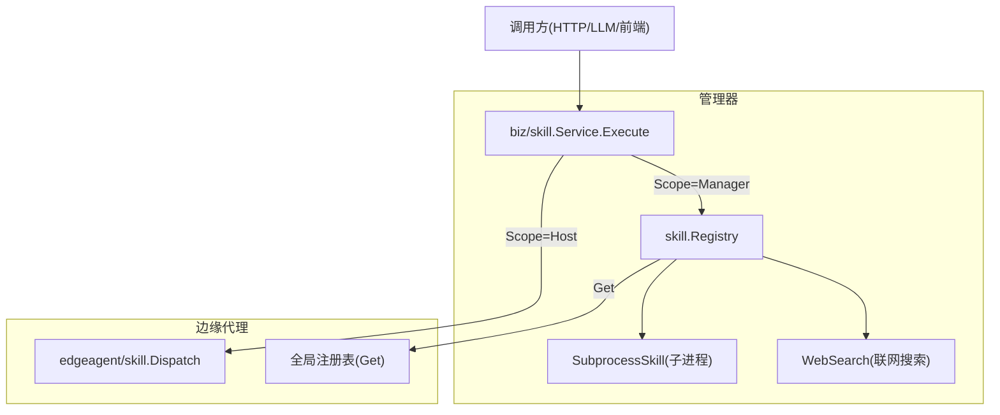
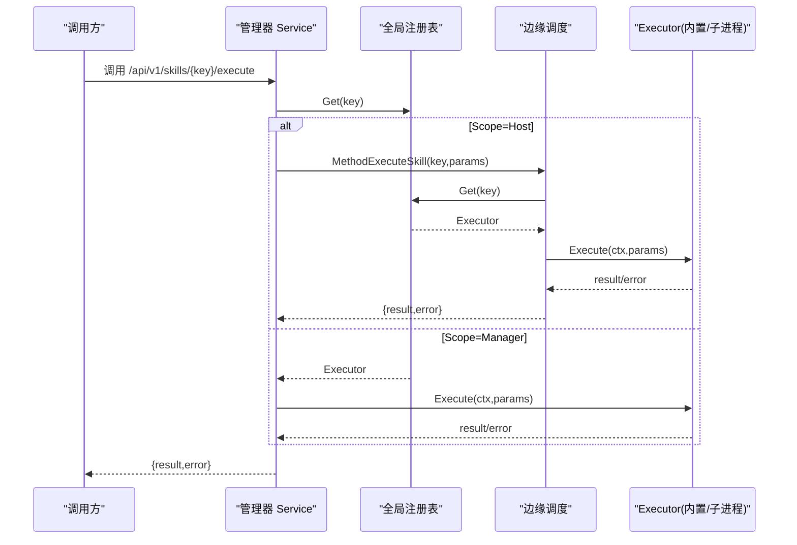
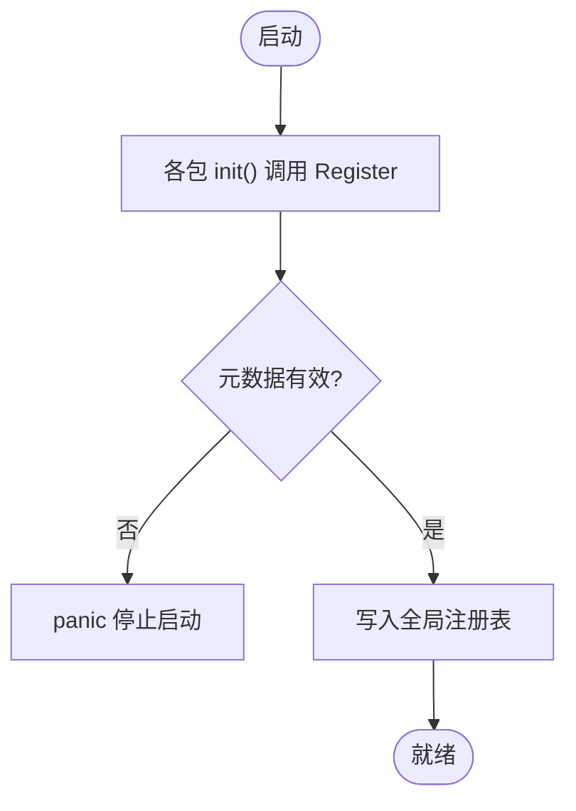
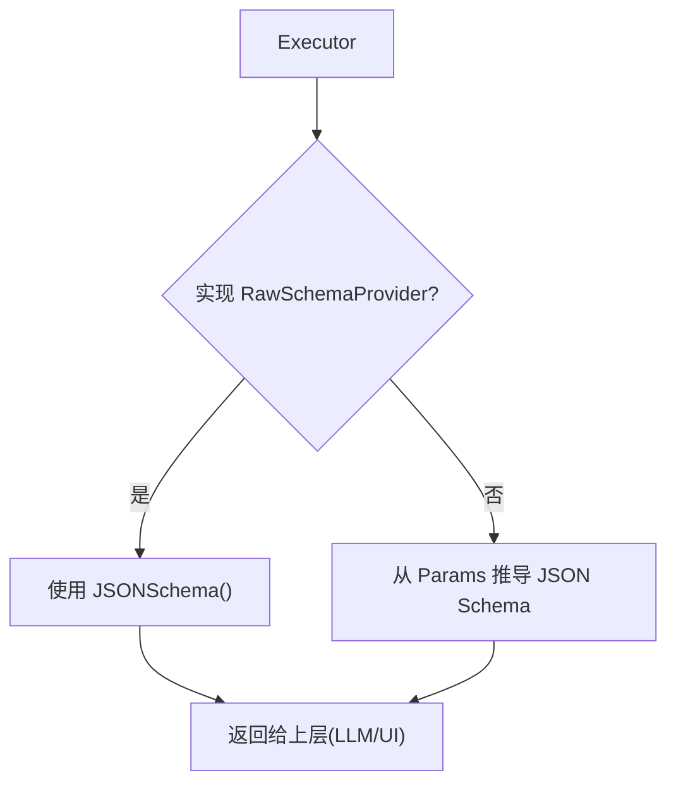
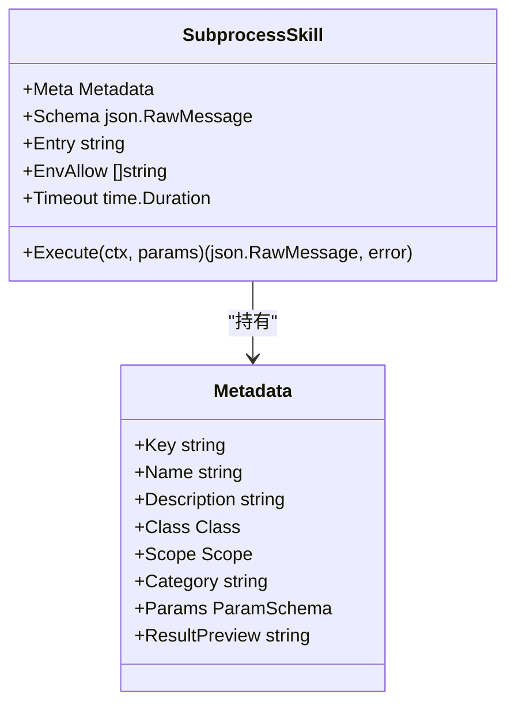
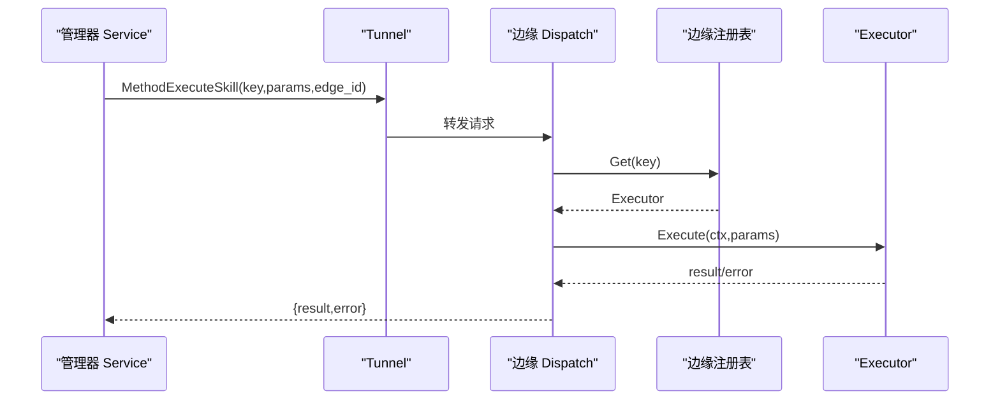
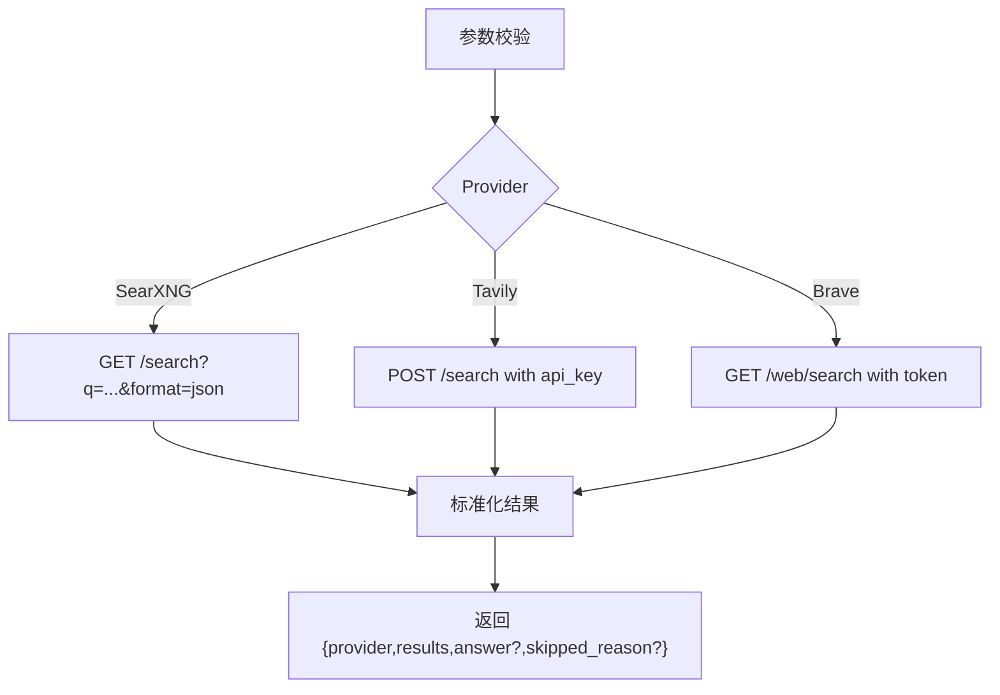
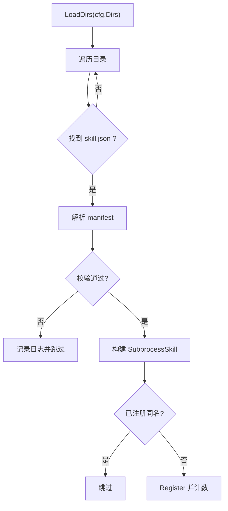

# 技能插件系统

<cite>
**本文引用的文件**
- [internal/skill/types.go](file://internal/skill/types.go)
- [internal/skill/registry.go](file://internal/skill/registry.go)
- [internal/skill/loader.go](file://internal/skill/loader.go)
- [internal/skill/subprocess.go](file://internal/skill/subprocess.go)
- [internal/skill/schema.go](file://internal/skill/schema.go)
- [internal/skill/builtin/probe_dns.go](file://internal/skill/builtin/probe_dns.go)
- [internal/skill/builtin/probe_http.go](file://internal/skill/builtin/probe_http.go)
- [internal/skill/builtin/probe_ping.go](file://internal/skill/builtin/probe_ping.go)
- [internal/skill/builtin/tail_file.go](file://internal/skill/builtin/tail_file.go)
- [internal/skill/builtin/web_search.go](file://internal/skill/builtin/web_search.go)
- [internal/edgeagent/skill/dispatcher.go](file://internal/edgeagent/skill/dispatcher.go)
- [internal/pkg/tunnel/messages.go](file://internal/pkg/tunnel/messages.go)
- [cmd/ongrid-edge/main.go](file://cmd/ongrid-edge/main.go)
- [internal/manager/biz/skill/service.go](file://internal/manager/biz/skill/service.go)
- [tests/e2e/skills_registry_test.go](file://tests/e2e/skills_registry_test.go)
- [web/src/api/skills.test.ts](file://web/src/api/skills.test.ts)
- [ROADMAP.md](file://ROADMAP.md)
</cite>

## 目录
1. [简介](#简介)
2. [项目结构](#项目结构)
3. [核心组件](#核心组件)
4. [架构总览](#架构总览)
5. [详细组件分析](#详细组件分析)
6. [依赖关系分析](#依赖关系分析)
7. [性能与资源限制](#性能与资源限制)
8. [故障排查指南](#故障排查指南)
9. [结论](#结论)
10. [附录：开发指南与最佳实践](#附录：开发指南与最佳实践)

## 简介
本文件系统化阐述 Ongrid 平台的“技能插件系统”（Skill Plugin System）。技能是设备侧或管理端的自包含能力单元，例如网络探测、文件读取、服务重启、联网搜索等。框架通过统一的注册机制、元数据驱动的工具描述、以及执行环境隔离，将“声明式接口 + 可插拔实现”组合起来，自动派生 LLM 工具定义、HTTP API、UI 表单、权限门控与审计日志。

## 项目结构
技能系统由“核心框架 + 内置技能 + 边缘调度 + 管理器路由 + 外部子进程加载器”组成：
- 核心框架：类型定义、注册表、参数 Schema 生成、子进程执行器
- 内置技能：DNS/HTTP/Ping/TailFile/WebSearch 等
- 边缘侧：统一 execute_skill RPC 分发到本地注册表
- 管理器侧：按 Scope 决定在本地执行还是下发到边缘执行；并做权限校验
- 外部加载器：扫描 skill.json 并注册为子进程技能

**图表来源**
- [internal/manager/biz/skill/service.go:187-223](file://internal/manager/biz/skill/service.go#L187-L223)
- [internal/edgeagent/skill/dispatcher.go:16-44](file://internal/edgeagent/skill/dispatcher.go#L16-L44)
- [internal/skill/registry.go:10-47](file://internal/skill/registry.go#L10-L47)
- [internal/skill/subprocess.go:30-78](file://internal/skill/subprocess.go#L30-L78)
- [internal/skill/builtin/web_search.go:150-195](file://internal/skill/builtin/web_search.go#L150-L195)

**章节来源**
- [internal/skill/types.go:1-27](file://internal/skill/types.go#L1-L27)
- [internal/skill/registry.go:10-47](file://internal/skill/registry.go#L10-L47)
- [internal/edgeagent/skill/dispatcher.go:1-23](file://internal/edgeagent/skill/dispatcher.go#L1-L23)
- [internal/manager/biz/skill/service.go:187-223](file://internal/manager/biz/skill/service.go#L187-L223)

## 核心组件
- 元数据与执行器接口
  - Metadata：Key/Name/Description/Class/Scope/Category/Params/ResultPreview
  - Executor：Metadata() + Execute(ctx, params) -> (result, error)
  - Class：safe/mutating/dangerous，用于权限策略
  - Scope：host（在边缘执行）/ manager（在管理器本地执行）
- 注册表
  - 全局注册表提供 Register/Get/All/AllByClass
  - 并发安全：init 阶段单线程注册，运行时并发读
- 参数 Schema
  - ParamSchema 转 JSON Schema，兼容 LLM function-calling
  - RawSchemaProvider 允许自定义复杂 schema
- 子进程技能
  - 以独立进程运行，stdin/stdout 交换 JSON
  - 强制 ScopeManager，白名单目录、环境变量白名单、超时与输出大小限制
- 边缘调度
  - 统一 MethodExecuteSkill RPC，按 key 查找 Executor 并执行
- 管理器路由
  - 根据 Skill 的 Scope 选择本地执行或下发到边缘
  - 基于 Class 进行权限控制

**章节来源**
- [internal/skill/types.go:35-125](file://internal/skill/types.go#L35-L125)
- [internal/skill/types.go:127-175](file://internal/skill/types.go#L127-L175)
- [internal/skill/types.go:177-203](file://internal/skill/types.go#L177-L203)
- [internal/skill/registry.go:10-47](file://internal/skill/registry.go#L10-L47)
- [internal/skill/schema.go:5-20](file://internal/skill/schema.go#L5-L20)
- [internal/skill/subprocess.go:30-78](file://internal/skill/subprocess.go#L30-L78)
- [internal/edgeagent/skill/dispatcher.go:16-44](file://internal/edgeagent/skill/dispatcher.go#L16-L44)
- [internal/manager/biz/skill/service.go:187-223](file://internal/manager/biz/skill/service.go#L187-L223)

## 架构总览
技能从“注册 -> 暴露 -> 调用 -> 执行 -> 返回”的完整生命周期如下：

**图表来源**
- [internal/manager/biz/skill/service.go:187-223](file://internal/manager/biz/skill/service.go#L187-L223)
- [internal/edgeagent/skill/dispatcher.go:16-44](file://internal/edgeagent/skill/dispatcher.go#L16-L44)
- [internal/skill/registry.go:35-47](file://internal/skill/registry.go#L35-L47)

## 详细组件分析

### 注册与发现
- 注册时机：各内置技能在 init() 中调用 Register，将自身加入全局注册表
- 并发模型：注册发生在初始化阶段（单线程），运行时只读访问使用读写锁保护
- 去重与校验：重复 Key 会 panic；无效元数据也会 panic，便于启动期发现问题
- 列表与过滤：All/AllByClass 支持按权限类筛选，供 LLM 工具注册和 UI 展示

**图表来源**
- [internal/skill/registry.go:26-74](file://internal/skill/registry.go#L26-L74)
- [internal/skill/builtin/probe_dns.go:13-13](file://internal/skill/builtin/probe_dns.go#L13-L13)

**章节来源**
- [internal/skill/registry.go:10-74](file://internal/skill/registry.go#L10-L74)
- [internal/skill/builtin/probe_dns.go:13-13](file://internal/skill/builtin/probe_dns.go#L13-L13)

### 参数与 Schema
- 声明式 ParamSchema 自动生成 JSON Schema，适配 LLM 函数调用
- 支持 string/int/float/bool/duration/enum/array 及数组元素类型
- RawSchemaProvider 允许更复杂的 schema（如 oneOf、嵌套对象）
- 构建流程：优先使用 RawSchemaProvider 提供的 schema，否则从 Metadata.Params 推导

**图表来源**
- [internal/skill/schema.go:5-20](file://internal/skill/schema.go#L5-L20)
- [internal/skill/schema.go:22-96](file://internal/skill/schema.go#L22-L96)

**章节来源**
- [internal/skill/types.go:63-97](file://internal/skill/types.go#L63-L97)
- [internal/skill/schema.go:5-96](file://internal/skill/schema.go#L5-L96)

### 执行环境与隔离
- 子进程技能
  - 强制 ScopeManager，避免在边缘执行不可信二进制
  - 入口路径必须绝对且位于白名单目录（Loader 校验）
  - 环境变量白名单（EnvAllow），默认不继承任何环境
  - 超时控制（默认 30s）、stdout/stderr 大小限制
  - 非零退出码视为错误，stderr 尾部保留用于诊断
- 内置 Go 技能
  - 通过 context.WithTimeout 控制耗时操作
  - 严格输入校验与资源限制（如 tail_file 最大字节数、ping 次数上限）

**图表来源**
- [internal/skill/subprocess.go:30-78](file://internal/skill/subprocess.go#L30-L78)
- [internal/skill/types.go:99-125](file://internal/skill/types.go#L99-L125)

**章节来源**
- [internal/skill/subprocess.go:99-172](file://internal/skill/subprocess.go#L99-L172)
- [internal/skill/loader.go:176-254](file://internal/skill/loader.go#L176-L254)
- [internal/skill/builtin/tail_file.go:64-132](file://internal/skill/builtin/tail_file.go#L64-L132)
- [internal/skill/builtin/probe_ping.go:60-124](file://internal/skill/builtin/probe_ping.go#L60-L124)

### 边缘调度与管理器路由
- 边缘侧：统一 receive MethodExecuteSkill，解析 key 与 params，查找 Executor 并执行，结果封装为 {result,error}
- 管理器侧：根据 Skill 的 Scope 决定本地执行或下发到边缘；对 Class 进行权限校验（safe/mutating/dangerous）

**图表来源**
- [internal/pkg/tunnel/messages.go:18-44](file://internal/pkg/tunnel/messages.go#L18-L44)
- [internal/edgeagent/skill/dispatcher.go:16-44](file://internal/edgeagent/skill/dispatcher.go#L16-L44)
- [internal/manager/biz/skill/service.go:187-223](file://internal/manager/biz/skill/service.go#L187-L223)

**章节来源**
- [internal/edgeagent/skill/dispatcher.go:16-44](file://internal/edgeagent/skill/dispatcher.go#L16-L44)
- [internal/pkg/tunnel/messages.go:18-44](file://internal/pkg/tunnel/messages.go#L18-L44)
- [internal/manager/biz/skill/service.go:187-223](file://internal/manager/biz/skill/service.go#L187-L223)

### 内置技能实现原理
- DNS 探测：使用系统解析器查询 A/AAAA，带超时控制，返回地址与延迟
- HTTP 探测：HEAD/GET 请求，跳过 TLS 验证（面向内网自签证书场景），统计状态码、延迟、内容长度
- Ping 探测：调用系统 ping 命令，限制包数与超时，返回 ok、exit_code、duration_ms、原始输出
- 文件尾部读取：仅读，强制绝对路径且禁止 ..，限制最大读取字节数，返回最后 N 行
- 联网搜索：多后端（SearXNG/Tavily/Brave），按配置选择 provider，统一结果格式；未配置时返回 skipped_reason 而非错误

**图表来源**
- [internal/skill/builtin/web_search.go:225-283](file://internal/skill/builtin/web_search.go#L225-L283)
- [internal/skill/builtin/web_search.go:285-374](file://internal/skill/builtin/web_search.go#L285-L374)
- [internal/skill/builtin/web_search.go:391-455](file://internal/skill/builtin/web_search.go#L391-L455)
- [internal/skill/builtin/web_search.go:485-543](file://internal/skill/builtin/web_search.go#L485-L543)

**章节来源**
- [internal/skill/builtin/probe_dns.go:15-84](file://internal/skill/builtin/probe_dns.go#L15-L84)
- [internal/skill/builtin/probe_http.go:17-119](file://internal/skill/builtin/probe_http.go#L17-L119)
- [internal/skill/builtin/probe_ping.go:16-124](file://internal/skill/builtin/probe_ping.go#L16-L124)
- [internal/skill/builtin/tail_file.go:17-132](file://internal/skill/builtin/tail_file.go#L17-L132)
- [internal/skill/builtin/web_search.go:150-195](file://internal/skill/builtin/web_search.go#L150-L195)

### 外部技能加载器
- 扫描配置的目录树，寻找 skill.json 清单
- 校验 name/description/entry/class/category，并强制 ScopeManager
- 入口路径必须位于白名单根目录下（解析符号链接后校验）
- 构建 SubprocessSkill 并注册到全局注册表；重复名称直接跳过

**图表来源**
- [internal/skill/loader.go:69-160](file://internal/skill/loader.go#L69-L160)
- [internal/skill/loader.go:176-254](file://internal/skill/loader.go#L176-L254)

**章节来源**
- [internal/skill/loader.go:69-160](file://internal/skill/loader.go#L69-L160)
- [internal/skill/loader.go:176-254](file://internal/skill/loader.go#L176-L254)

## 依赖关系分析
- 管理器 Service 依赖全局注册表获取 Executor，并根据 Scope 选择执行位置
- 边缘调度依赖全局注册表进行 key 查找
- 子进程技能依赖 Loader 的路径与环境白名单约束
- 前端测试表明：host-scoped 技能调用会附带 edge_id，manager-scoped 则不带

**图表来源**
- [internal/manager/biz/skill/service.go:187-223](file://internal/manager/biz/skill/service.go#L187-L223)
- [internal/edgeagent/skill/dispatcher.go:16-44](file://internal/edgeagent/skill/dispatcher.go#L16-L44)
- [web/src/api/skills.test.ts:8-38](file://web/src/api/skills.test.ts#L8-L38)

**章节来源**
- [internal/manager/biz/skill/service.go:187-223](file://internal/manager/biz/skill/service.go#L187-L223)
- [web/src/api/skills.test.ts:8-38](file://web/src/api/skills.test.ts#L8-L38)

## 性能与资源限制
- 子进程技能
  - stdout 最大 16 MiB，stderr 尾部保留 4 KiB，防止内存膨胀
  - 默认超时 30s，可通过 manifest 指定
  - 环境变量白名单，避免泄露敏感信息
- 内置技能
  - DNS/HTTP/Ping 均设置合理超时与参数上限
  - TailFile 限制最大读取字节数，避免大文件导致内存压力
- 注册表
  - 读路径无锁竞争（RWMutex），适合高并发枚举

**章节来源**
- [internal/skill/subprocess.go:17-28](file://internal/skill/subprocess.go#L17-L28)
- [internal/skill/subprocess.go:145-172](file://internal/skill/subprocess.go#L145-L172)
- [internal/skill/builtin/probe_http.go:62-119](file://internal/skill/builtin/probe_http.go#L62-L119)
- [internal/skill/builtin/probe_ping.go:60-124](file://internal/skill/builtin/probe_ping.go#L60-L124)
- [internal/skill/builtin/tail_file.go:64-132](file://internal/skill/builtin/tail_file.go#L64-L132)

## 故障排查指南
- 未知技能 key
  - 现象：返回 unknown skill
  - 原因：未注册或 key 拼写错误
  - 定位：检查 init() 是否调用 Register；确认 key 一致
- 子进程技能失败
  - 现象：非零退出码或 stderr 输出
  - 原因：脚本错误、缺少依赖、路径不在白名单、环境变量未注入
  - 定位：查看错误消息中的 stderr 尾部；检查 EnvAllow 与 Entry 路径
- 超时
  - 现象：context deadline exceeded
  - 原因：子进程或网络请求过慢
  - 定位：调整 TimeoutSeconds 或优化下游依赖
- 权限拒绝
  - 现象：mutating/dangerous 被拒绝
  - 原因：调用者角色不足
  - 定位：提升权限或通过审批流程（dangerous 需 SOP 签名，当前尚未完全接入）

**章节来源**
- [internal/edgeagent/skill/dispatcher.go:24-44](file://internal/edgeagent/skill/dispatcher.go#L24-L44)
- [internal/skill/subprocess.go:112-172](file://internal/skill/subprocess.go#L112-L172)
- [internal/manager/biz/skill/service.go:187-223](file://internal/manager/biz/skill/service.go#L187-L223)

## 结论
Ongrid 的技能插件系统通过“元数据驱动 + 统一注册表 + 执行环境隔离”，实现了可扩展、可审计、可治理的设备/云端能力编排。内置技能覆盖了常见运维场景，子进程加载器支持第三方扩展。未来路线图进一步规划了沙箱与微隔离能力，以增强危险操作的执行安全性。

## 附录：开发指南与最佳实践

### 开发环境搭建
- 在管理器或边缘进程中引入内置技能包，使其 init() 完成注册
- 对于外部技能，准备 skill.json 清单与可执行入口，放入白名单目录并由 Loader 扫描注册

**章节来源**
- [cmd/ongrid-edge/main.go:51-57](file://cmd/ongrid-edge/main.go#L51-L57)
- [internal/skill/loader.go:69-160](file://internal/skill/loader.go#L69-L160)

### 接口定义与参数验证
- 实现 Executor 接口，提供 Metadata() 与 Execute()
- 使用 ParamSchema 声明参数类型、必填项、默认值与枚举；或使用 RawSchemaProvider 提供复杂 schema
- 在 Execute 中对参数进行防御性解析与校验

**章节来源**
- [internal/skill/types.go:190-203](file://internal/skill/types.go#L190-L203)
- [internal/skill/schema.go:5-20](file://internal/skill/schema.go#L5-L20)

### 错误处理模式
- 子进程技能：非零退出码视为错误，stderr 尾部保留用于诊断
- 内置技能：将错误信息序列化到结果字段或返回 error，由上层统一包装
- 联网搜索：未配置或不可达时返回 skipped_reason，便于 LLM 提示用户修复

**章节来源**
- [internal/skill/subprocess.go:112-172](file://internal/skill/subprocess.go#L112-L172)
- [internal/skill/builtin/web_search.go:225-283](file://internal/skill/builtin/web_search.go#L225-L283)

### 资源限制与安全
- 子进程技能：强制 ScopeManager、白名单目录、环境变量白名单、超时与输出大小限制
- 内置技能：上下文超时、参数上限、路径白名单（如 tail_file）
- 权限策略：safe 可直接调用；mutating 需要管理员；dangerous 需要 SOP 签名（待完善）

**章节来源**
- [internal/skill/subprocess.go:30-78](file://internal/skill/subprocess.go#L30-L78)
- [internal/skill/builtin/tail_file.go:64-132](file://internal/skill/builtin/tail_file.go#L64-L132)
- [internal/manager/biz/skill/service.go:187-223](file://internal/manager/biz/skill/service.go#L187-L223)

### 调试技巧
- 使用单元测试覆盖子进程技能的 stdin/stdout、超时、环境变量过滤与非 JSON 输出等边界情况
- 通过 e2e 测试校验 /skills 列表的 DTO 结构与字段完整性

**章节来源**
- [internal/skill/subprocess_test.go:29-200](file://internal/skill/subprocess_test.go#L29-L200)
- [tests/e2e/skills_registry_test.go:118-144](file://tests/e2e/skills_registry_test.go#L118-L144)

### 测试策略
- 单元测试：参数校验、Schema 生成、子进程执行、超时与错误路径
- 集成测试：管理器路由、边缘调度、HTTP 接口契约
- 前端测试：host-scoped 技能携带 edge_id，manager-scoped 不携带

**章节来源**
- [web/src/api/skills.test.ts:8-38](file://web/src/api/skills.test.ts#L8-L38)
- [tests/e2e/skills_registry_test.go:118-144](file://tests/e2e/skills_registry_test.go#L118-L144)

### 性能优化建议
- 合理设置超时与参数上限，避免长尾请求拖垮调度器
- 子进程 stdout/stderr 限制，防止异常输出占用内存
- 批量与缓存：对频繁调用的上游服务（如搜索）增加客户端连接复用与响应缓存

[本节为通用指导，无需特定文件引用]

### 沙箱与安全演进
- 当前：子进程隔离、白名单目录、环境变量白名单、超时与输出限制
- 规划：微沙箱运行时、seccomp 能力集、危险操作容器化执行、每租户计算预算与速率限制

**章节来源**
- [ROADMAP.md:427-464](file://ROADMAP.md#L427-L464)