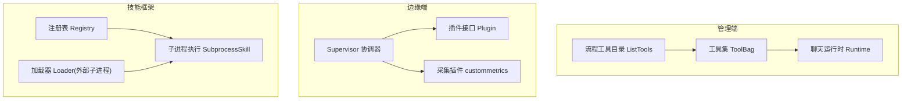
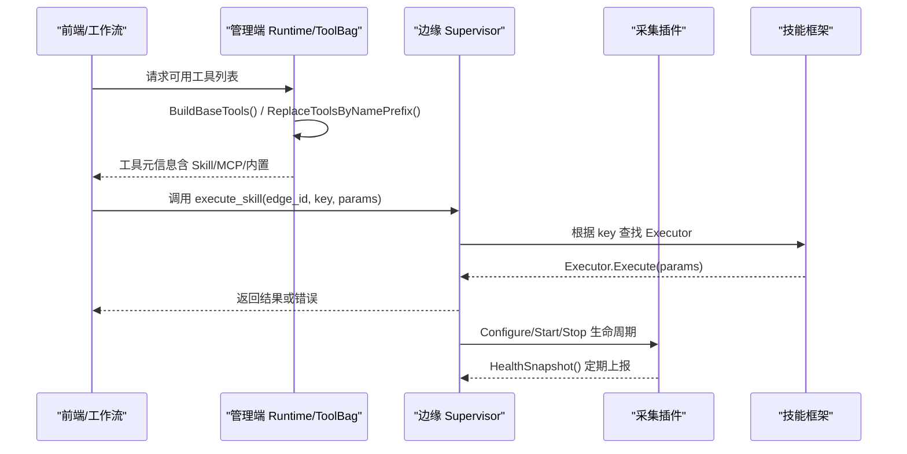
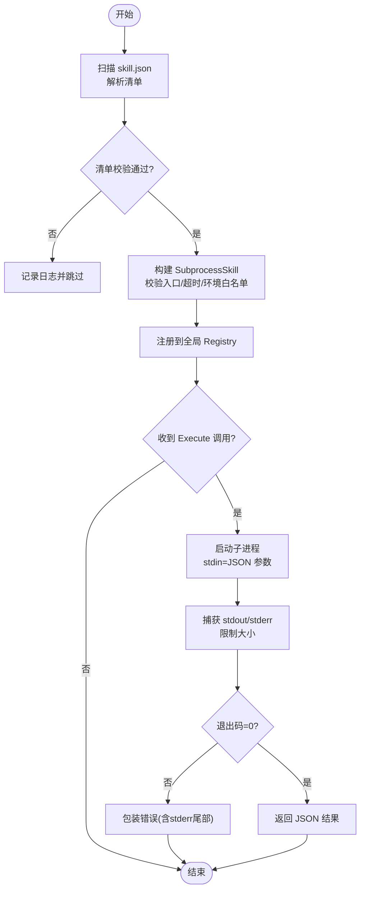
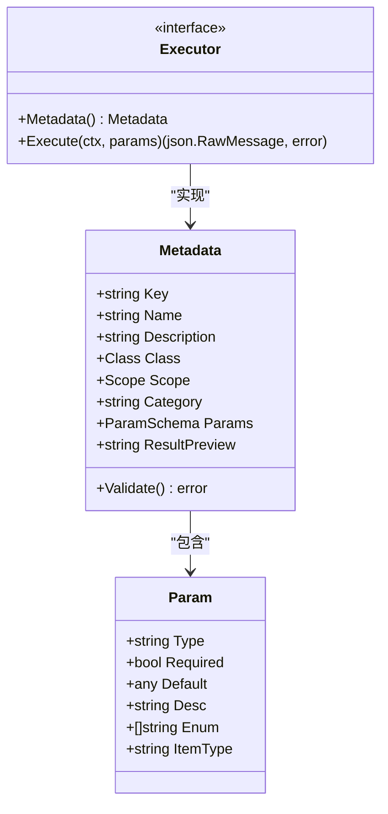
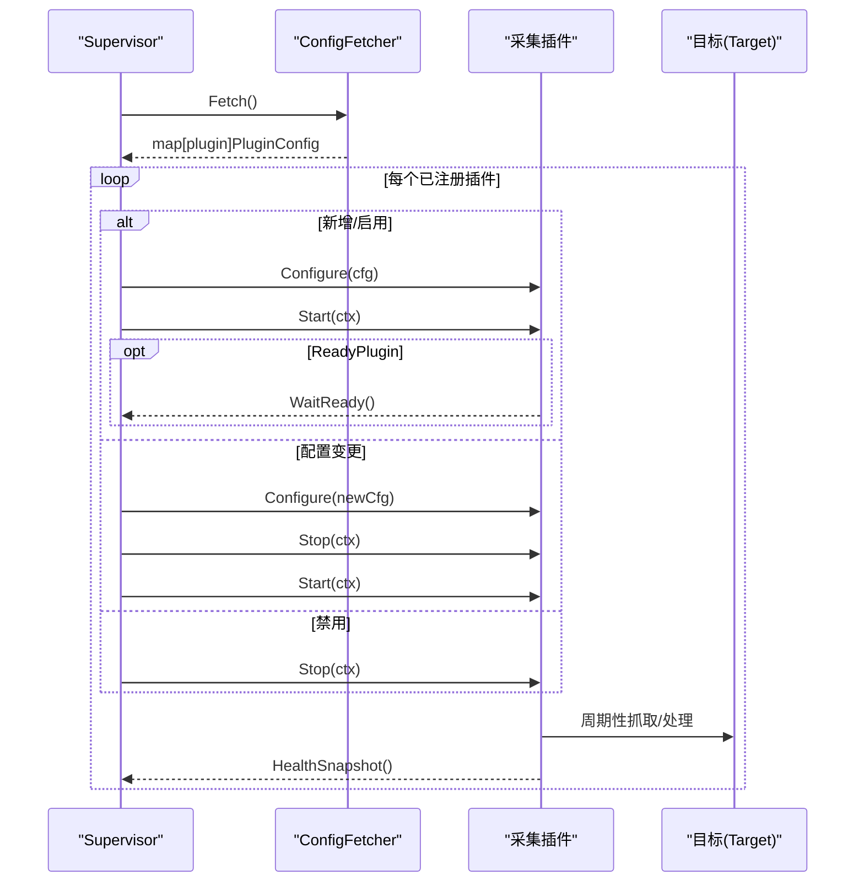
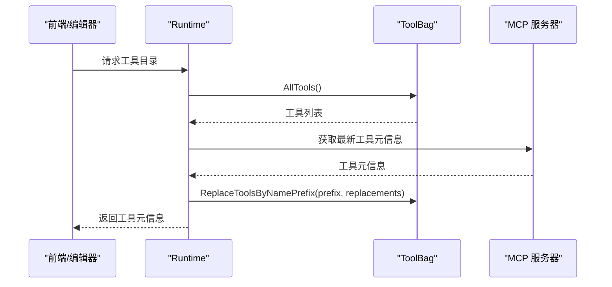
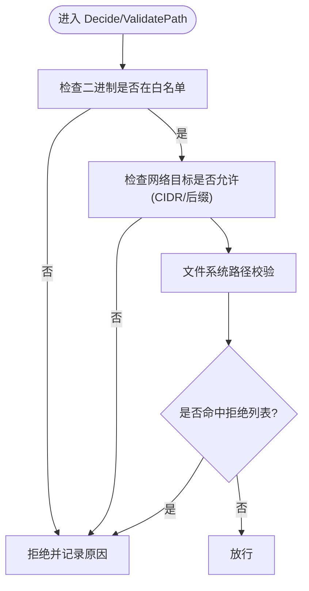
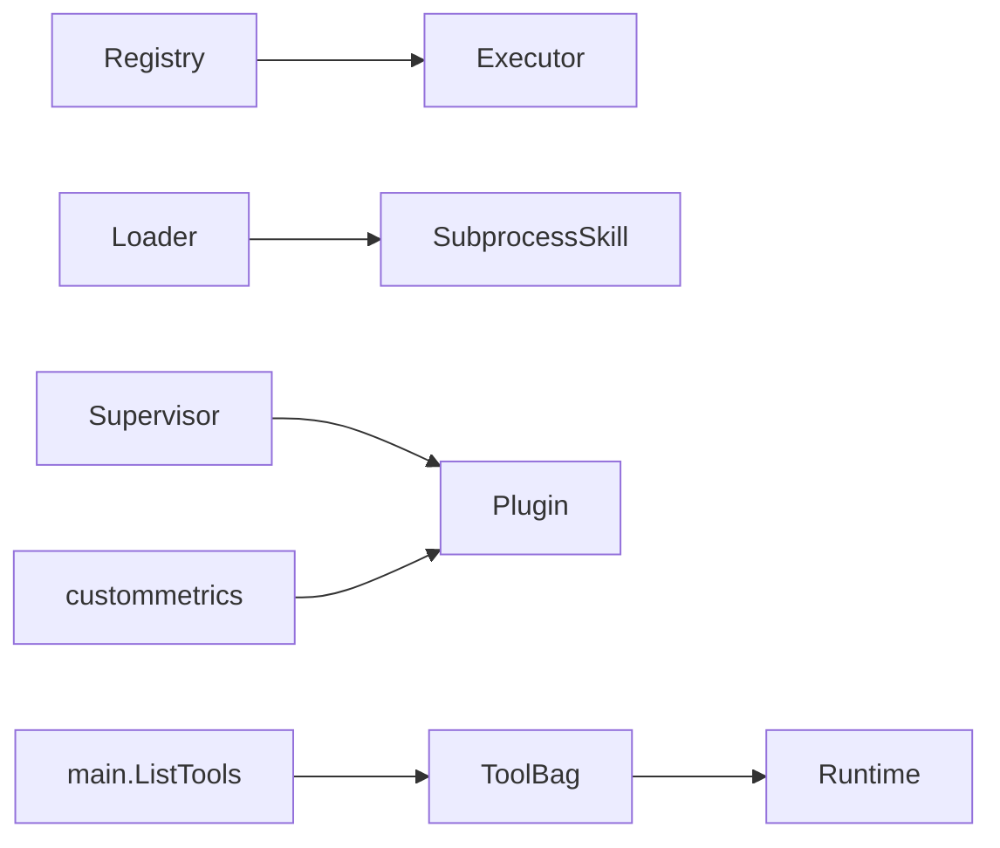

# 插件化架构

<cite>
**本文引用的文件**
- [internal/skill/registry.go](file://internal/skill/registry.go)
- [internal/skill/types.go](file://internal/skill/types.go)
- [internal/skill/loader.go](file://internal/skill/loader.go)
- [internal/skill/subprocess.go](file://internal/skill/subprocess.go)
- [internal/skill/builtin/probe_http.go](file://internal/skill/builtin/probe_http.go)
- [internal/edgeagent/plugins/plugin.go](file://internal/edgeagent/plugins/plugin.go)
- [internal/edgeagent/plugins/supervisor.go](file://internal/edgeagent/plugins/supervisor.go)
- [internal/edgeagent/plugins/custommetrics/plugin.go](file://internal/edgeagent/plugins/custommetrics/plugin.go)
- [internal/manager/biz/aiops/tools/toolbag.go](file://internal/manager/biz/aiops/tools/toolbag.go)
- [internal/manager/biz/aiops/chatruntime/runtime.go](file://internal/manager/biz/aiops/chatruntime/runtime.go)
- [cmd/ongrid/main.go](file://cmd/ongrid/main.go)
- [web/src/pages/SkillRun.tsx](file://web/src/pages/SkillRun.tsx)
- [web/src/pages/Agents.tsx](file://web/src/pages/Agents.tsx)
- [internal/edgeagent/cmdpolicy/sandbox_test.go](file://internal/edgeagent/cmdpolicy/sandbox_test.go)
- [internal/edgeagent/host_files/sandbox.go](file://internal/edgeagent/host_files/sandbox.go)
</cite>

## 目录
1. [简介](#简介)
2. [项目结构](#项目结构)
3. [核心组件](#核心组件)
4. [架构总览](#架构总览)
5. [详细组件分析](#详细组件分析)
6. [依赖关系分析](#依赖关系分析)
7. [性能考量](#性能考量)
8. [故障排查指南](#故障排查指南)
9. [结论](#结论)
10. [附录](#附录)

## 简介
本文件面向 Ongrid 平台的插件化架构，系统性阐述技能（Skill）与采集插件（Edge Plugin）两大体系的设计与实现：
- 技能插件：以“可执行能力”为单元，统一注册、参数校验、权限分级、UI/LLM 工具自动装配，支持本地 Go 实现与外部子进程两种形态。
- 数据采集插件：在边缘侧以 Supervisor 统一管理生命周期，支持多目标采集、健康上报、热重载与崩溃恢复。
- 工具插件：在管理端通过 ToolBag 聚合内置工具、MCP 动态工具与 Skill 工具，提供按前缀替换的热插拔能力。
- 沙箱隔离：对命令执行、网络访问、文件系统读取进行白名单/黑名单策略控制，保障最小权限运行。
- 版本兼容与安全：清单校验、路径安全、环境变量白名单、超时与输出大小限制等。

## 项目结构
围绕插件化的关键目录与职责：
- internal/skill：技能框架（注册表、类型定义、外部子进程加载器、内置技能示例）。
- internal/edgeagent/plugins：边缘侧插件运行时（接口、Supervisor、具体采集插件如 custommetrics）。
- internal/manager/biz/aiops/tools：管理端工具集合（ToolBag、运行时工具替换）。
- cmd/ongrid/main.go：流程编排工具目录构建与过滤。
- web：前端技能运行界面与工具选项聚合。

图表来源
- [internal/manager/biz/aiops/tools/toolbag.go:310-348](file://internal/manager/biz/aiops/tools/toolbag.go#L310-L348)
- [internal/manager/biz/aiops/chatruntime/runtime.go:416-454](file://internal/manager/biz/aiops/chatruntime/runtime.go#L416-L454)
- [cmd/ongrid/main.go:5581-5666](file://cmd/ongrid/main.go#L5581-L5666)
- [internal/edgeagent/plugins/plugin.go:18-135](file://internal/edgeagent/plugins/plugin.go#L18-L135)
- [internal/edgeagent/plugins/supervisor.go:112-243](file://internal/edgeagent/plugins/supervisor.go#L112-L243)
- [internal/edgeagent/plugins/custommetrics/plugin.go:65-133](file://internal/edgeagent/plugins/custommetrics/plugin.go#L65-L133)
- [internal/skill/registry.go:10-47](file://internal/skill/registry.go#L10-L47)
- [internal/skill/loader.go:69-160](file://internal/skill/loader.go#L69-L160)
- [internal/skill/subprocess.go:30-78](file://internal/skill/subprocess.go#L30-L78)

章节来源
- [internal/skill/registry.go:10-47](file://internal/skill/registry.go#L10-L47)
- [internal/edgeagent/plugins/plugin.go:18-135](file://internal/edgeagent/plugins/plugin.go#L18-L135)
- [internal/manager/biz/aiops/tools/toolbag.go:310-348](file://internal/manager/biz/aiops/tools/toolbag.go#L310-L348)

## 核心组件
- 技能注册表（Registry）：进程级全局注册表，启动时完成注册，运行时并发只读；提供按 Key 查找、按 Class 过滤、全量枚举。
- 技能元数据与执行器（Metadata/Executor）：声明式参数 Schema、权限等级（safe/mutating/dangerous）、作用域（host/manager），Execute 接收 JSON 参数并返回 JSON 结果。
- 外部技能加载器（Loader/SubprocessSkill）：扫描 skill.json 清单，校验入口路径、类名、超时与环境变量白名单，封装为子进程执行器。
- 边缘插件接口与协调器（Plugin/Supervisor）：统一 Configure/Start/Stop/HealthSnapshot 生命周期；周期性拉取配置并 reconcile，支持 Ready 门控与崩溃恢复。
- 管理端工具集（ToolBag/Runtime）：聚合内置工具、MCP 动态工具与 Skill 工具；支持按名称前缀替换以实现热插拔。
- 流程工具目录（ListTools）：从 ToolBag 生成工作流可用的工具元信息，并排除控制面或暂不支持的工具。

章节来源
- [internal/skill/types.go:99-203](file://internal/skill/types.go#L99-L203)
- [internal/skill/loader.go:13-67](file://internal/skill/loader.go#L13-L67)
- [internal/skill/subprocess.go:30-78](file://internal/skill/subprocess.go#L30-L78)
- [internal/edgeagent/plugins/plugin.go:18-135](file://internal/edgeagent/plugins/plugin.go#L18-L135)
- [internal/edgeagent/plugins/supervisor.go:112-243](file://internal/edgeagent/plugins/supervisor.go#L112-L243)
- [internal/manager/biz/aiops/tools/toolbag.go:310-348](file://internal/manager/biz/aiops/tools/toolbag.go#L310-L348)
- [cmd/ongrid/main.go:5581-5666](file://cmd/ongrid/main.go#L5581-L5666)

## 架构总览
Ongrid 的插件化由“技能”和“采集插件”两条主线构成，并通过“工具集”在管理端统一暴露给 LLM/工作流/前端。

图表来源
- [internal/manager/biz/aiops/chatruntime/runtime.go:416-454](file://internal/manager/biz/aiops/chatruntime/runtime.go#L416-L454)
- [internal/manager/biz/aiops/tools/toolbag.go:310-348](file://internal/manager/biz/aiops/tools/toolbag.go#L310-L348)
- [internal/skill/registry.go:35-47](file://internal/skill/registry.go#L35-L47)
- [internal/edgeagent/plugins/supervisor.go:112-243](file://internal/edgeagent/plugins/supervisor.go#L112-L243)

## 详细组件分析

### 技能插件：注册机制与生命周期
- 注册机制：
  - 进程级全局注册表在 init 阶段完成注册，重复 Key 会 panic，确保作者期错误尽早暴露。
  - 支持按 Class 过滤（safe/mutating/dangerous），用于 LLM 自动调用与工作流审批策略。
- 生命周期：
  - 外部子进程技能：Loader 扫描 skill.json，校验入口路径、类名、超时与环境白名单，封装为 SubprocessSkill。
  - 执行期：Execute 将 JSON 参数写入子进程 stdin，捕获 stdout 作为 JSON 结果；非零退出码与 stderr 尾部作为错误上下文。
  - 资源限制：默认超时、stdout/stderr 上限、环境变量白名单、入口路径必须在允许目录下。

图表来源
- [internal/skill/loader.go:69-160](file://internal/skill/loader.go#L69-L160)
- [internal/skill/loader.go:176-254](file://internal/skill/loader.go#L176-L254)
- [internal/skill/subprocess.go:99-172](file://internal/skill/subprocess.go#L99-L172)

章节来源
- [internal/skill/registry.go:26-74](file://internal/skill/registry.go#L26-L74)
- [internal/skill/loader.go:69-160](file://internal/skill/loader.go#L69-L160)
- [internal/skill/subprocess.go:99-172](file://internal/skill/subprocess.go#L99-L172)

### 技能插件：开发规范与接口定义
- 元数据字段：Key（lower_snake）、Name、Description、Class（safe/mutating/dangerous）、Scope（host/manager）、Category、Params（ParamSchema）、ResultPreview。
- 参数 Schema：支持 string/int/float/bool/duration/enum/array（需指定 ItemType），Required 与 Default 互斥。
- 执行器接口：Execute(ctx, json.RawMessage) -> (json.RawMessage, error)。
- 自定义 Schema：可实现 RawSchemaProvider 以提供复杂 JSON Schema。
- 示例：内置 HTTP 探测技能展示完整元数据与执行逻辑。

图表来源
- [internal/skill/types.go:99-203](file://internal/skill/types.go#L99-L203)
- [internal/skill/types.go:63-97](file://internal/skill/types.go#L63-L97)

章节来源
- [internal/skill/types.go:63-203](file://internal/skill/types.go#L63-L203)
- [internal/skill/builtin/probe_http.go:15-47](file://internal/skill/builtin/probe_http.go#L15-L47)
- [internal/skill/builtin/probe_http.go:62-119](file://internal/skill/builtin/probe_http.go#L62-L119)

### 数据采集插件：扩展机制与动态接入
- 插件接口：Name/Configure/Start/Stop/HealthSnapshot，支持可选 ReadyPlugin 等待就绪。
- 协调器 Supervisor：周期拉取配置（ConfigFetcher），对比差异后按需 Configure/Start/Stop；支持 TriggerReload 即时重载。
- 健康上报：每插件及多目标（TargetHealth）状态、样本数、最近成功时间、错误信息。
- 示例：custommetrics 插件按目标间隔抓取 Prometheus 指标并通过隧道推送至管理端。

图表来源
- [internal/edgeagent/plugins/plugin.go:18-135](file://internal/edgeagent/plugins/plugin.go#L18-L135)
- [internal/edgeagent/plugins/supervisor.go:112-243](file://internal/edgeagent/plugins/supervisor.go#L112-L243)
- [internal/edgeagent/plugins/custommetrics/plugin.go:65-133](file://internal/edgeagent/plugins/custommetrics/plugin.go#L65-L133)

章节来源
- [internal/edgeagent/plugins/plugin.go:18-135](file://internal/edgeagent/plugins/plugin.go#L18-L135)
- [internal/edgeagent/plugins/supervisor.go:112-243](file://internal/edgeagent/plugins/supervisor.go#L112-L243)
- [internal/edgeagent/plugins/custommetrics/plugin.go:65-133](file://internal/edgeagent/plugins/custommetrics/plugin.go#L65-L133)

### 工具插件：注册与管理（内置与自定义）
- ToolBag：维护 core 与 deferred 两类工具，支持 Append 追加与 ReplaceToolsByNamePrefix 按前缀替换，避免不同 MCP 服务器间相互影响。
- Runtime：提供 ReplaceToolsByNamePrefix 与 ReplaceCatalogToolsByNamePrefix，使工具集可热更新。
- 流程工具目录：从 ToolBag 构建工具元信息，过滤控制面与暂不支持的工具，并按类别排序。

图表来源
- [internal/manager/biz/aiops/tools/toolbag.go:310-348](file://internal/manager/biz/aiops/tools/toolbag.go#L310-L348)
- [internal/manager/biz/aiops/chatruntime/runtime.go:416-454](file://internal/manager/biz/aiops/chatruntime/runtime.go#L416-L454)
- [cmd/ongrid/main.go:5581-5666](file://cmd/ongrid/main.go#L5581-L5666)

章节来源
- [internal/manager/biz/aiops/tools/toolbag.go:310-348](file://internal/manager/biz/aiops/tools/toolbag.go#L310-L348)
- [internal/manager/biz/aiops/chatruntime/runtime.go:416-454](file://internal/manager/biz/aiops/chatruntime/runtime.go#L416-L454)
- [cmd/ongrid/main.go:5581-5666](file://cmd/ongrid/main.go#L5581-L5666)

### 沙箱隔离与权限控制
- 命令执行沙箱：二进制白名单、网络主机白名单（支持 CIDR/后缀匹配）、管道组合命令支持。
- 文件系统沙箱：拒绝敏感路径（如 /proc、用户 .ssh/.gnupg），支持额外允许路径白名单，严格路径规范化与穿越检测。
- 子进程技能隔离：入口路径必须在允许目录内，环境变量仅转发白名单项，输出大小限制与超时保护。

图表来源
- [internal/edgeagent/cmdpolicy/sandbox_test.go:60-102](file://internal/edgeagent/cmdpolicy/sandbox_test.go#L60-L102)
- [internal/edgeagent/host_files/sandbox.go:195-244](file://internal/edgeagent/host_files/sandbox.go#L195-L244)
- [internal/skill/loader.go:176-254](file://internal/skill/loader.go#L176-L254)
- [internal/skill/subprocess.go:174-193](file://internal/skill/subprocess.go#L174-L193)

章节来源
- [internal/edgeagent/cmdpolicy/sandbox_test.go:60-102](file://internal/edgeagent/cmdpolicy/sandbox_test.go#L60-L102)
- [internal/edgeagent/host_files/sandbox.go:195-244](file://internal/edgeagent/host_files/sandbox.go#L195-L244)
- [internal/skill/loader.go:176-254](file://internal/skill/loader.go#L176-L254)
- [internal/skill/subprocess.go:174-193](file://internal/skill/subprocess.go#L174-L193)

### 热插拔与版本兼容性
- 技能清单：skill.json 中 name/description/schema/entry/env_allow/timeout_seconds/class/category 等字段，Loader 强制校验并拒绝逃逸路径。
- 工具热插拔：按名称前缀替换工具集合，支持运行时刷新而不重启服务。
- 插件热重载：Supervisor 支持 TriggerReload，周期 reconcile 保证配置一致性与健壮性。

章节来源
- [internal/skill/loader.go:13-67](file://internal/skill/loader.go#L13-L67)
- [internal/skill/loader.go:176-254](file://internal/skill/loader.go#L176-L254)
- [internal/manager/biz/aiops/chatruntime/runtime.go:416-454](file://internal/manager/biz/aiops/chatruntime/runtime.go#L416-L454)
- [internal/edgeagent/plugins/supervisor.go:84-92](file://internal/edgeagent/plugins/supervisor.go#L84-L92)

### 最佳实践与安全考虑
- 权限分级：明确设置 Class（safe/mutating/dangerous），危险操作需审批与签名 SOP。
- 输入输出：使用 ParamSchema 描述参数，必要时用 RawSchemaProvider 表达复杂结构；对 Execute 的参数做防御性反序列化。
- 资源限制：子进程技能设置合理 timeout_seconds，限制 stdout/stderr 大小，仅转发必要环境变量。
- 路径与环境安全：入口必须位于允许目录，禁止路径穿越；文件系统访问遵循白/黑名单；网络访问限定目标。
- 可观测性：插件与健康快照、错误信息、样本计数上报，便于定位问题。

章节来源
- [internal/skill/types.go:99-203](file://internal/skill/types.go#L99-L203)
- [internal/skill/subprocess.go:17-28](file://internal/skill/subprocess.go#L17-L28)
- [internal/skill/subprocess.go:99-172](file://internal/skill/subprocess.go#L99-L172)
- [internal/edgeagent/plugins/plugin.go:83-108](file://internal/edgeagent/plugins/plugin.go#L83-L108)

### 开发示例与调试指南
- 示例：HTTP 探测技能展示了完整的元数据声明与执行逻辑，可作为新技能模板参考。
- 调试要点：
  - 子进程技能：关注 stderr 尾部、退出码、超时与 JSON 格式校验。
  - 采集插件：查看 HealthSnapshot 与 TargetHealth，确认抓取与推送链路。
  - 工具集：通过 ReplaceToolsByNamePrefix 验证热更新效果，检查 ToolSearch 目录一致性。
  - 沙箱：通过白/黑名单规则验证命令与网络访问是否符合预期。

章节来源
- [internal/skill/builtin/probe_http.go:15-119](file://internal/skill/builtin/probe_http.go#L15-L119)
- [internal/skill/subprocess.go:99-172](file://internal/skill/subprocess.go#L99-L172)
- [internal/edgeagent/plugins/custommetrics/plugin.go:122-211](file://internal/edgeagent/plugins/custommetrics/plugin.go#L122-L211)
- [internal/manager/biz/aiops/chatruntime/runtime.go:416-454](file://internal/manager/biz/aiops/chatruntime/runtime.go#L416-L454)

## 依赖关系分析
- 低耦合：技能框架与边缘插件通过标准接口解耦；管理端工具集通过 ToolBag 聚合，避免强依赖。
- 直接依赖：
  - 技能框架：Registry 依赖 Executor 与 Metadata；Loader 依赖 SubprocessSkill。
  - 边缘插件：Supervisor 依赖 ConfigFetcher 与 Plugin；custommetrics 依赖 metricscommon 与隧道推送。
  - 管理端：Runtime 依赖 ToolBag；main 流程工具目录依赖 ToolBag 与 MCP。
- 潜在循环：无直接循环依赖；各层通过接口与消息传递协作。

图表来源
- [internal/skill/registry.go:10-47](file://internal/skill/registry.go#L10-L47)
- [internal/skill/loader.go:69-160](file://internal/skill/loader.go#L69-L160)
- [internal/edgeagent/plugins/supervisor.go:112-243](file://internal/edgeagent/plugins/supervisor.go#L112-L243)
- [internal/edgeagent/plugins/custommetrics/plugin.go:65-133](file://internal/edgeagent/plugins/custommetrics/plugin.go#L65-L133)
- [internal/manager/biz/aiops/tools/toolbag.go:310-348](file://internal/manager/biz/aiops/tools/toolbag.go#L310-L348)
- [cmd/ongrid/main.go:5581-5666](file://cmd/ongrid/main.go#L5581-L5666)

章节来源
- [internal/skill/registry.go:10-47](file://internal/skill/registry.go#L10-L47)
- [internal/edgeagent/plugins/supervisor.go:112-243](file://internal/edgeagent/plugins/supervisor.go#L112-L243)
- [internal/manager/biz/aiops/tools/toolbag.go:310-348](file://internal/manager/biz/aiops/tools/toolbag.go#L310-L348)

## 性能考量
- 子进程技能：默认超时与输出上限防止内存与 CPU 占用失控；stderr 仅保留尾部以减少日志体积。
- 采集插件：按目标并行抓取，独立健康状态与样本计数；推送失败不影响其他目标。
- 工具集：延迟加载与分区（core/deferred）减少初始开销；按前缀替换避免重建整个工具集。
- 前端：工具选项聚合与搜索提升交互效率；技能运行界面支持参数校验与结果格式化。

章节来源
- [internal/skill/subprocess.go:17-28](file://internal/skill/subprocess.go#L17-L28)
- [internal/edgeagent/plugins/custommetrics/plugin.go:135-211](file://internal/edgeagent/plugins/custommetrics/plugin.go#L135-L211)
- [internal/manager/biz/aiops/tools/toolbag.go:310-348](file://internal/manager/biz/aiops/tools/toolbag.go#L310-L348)
- [web/src/pages/SkillRun.tsx:188-518](file://web/src/pages/SkillRun.tsx#L188-L518)
- [web/src/pages/Agents.tsx:617-643](file://web/src/pages/Agents.tsx#L617-L643)

## 故障排查指南
- 技能执行失败：
  - 检查子进程退出码与 stderr 尾部；确认参数 JSON 合法与必填字段存在。
  - 核对超时设置与输出大小限制；确认入口路径在允许目录且可执行。
- 采集插件异常：
  - 查看 HealthSnapshot 与 TargetHealth 的 state/last_error/samples；确认抓取与推送链路。
  - 若配置变更未生效，触发 Reload 并观察 reconcile 日志。
- 工具集不更新：
  - 确认 ReplaceToolsByNamePrefix 调用是否正确；检查 ToolSearch 目录是否同步更新。
- 沙箱拦截：
  - 检查二进制白名单、网络目标白名单（CIDR/后缀）、文件系统拒绝列表与允许路径。

章节来源
- [internal/skill/subprocess.go:99-172](file://internal/skill/subprocess.go#L99-L172)
- [internal/edgeagent/plugins/custommetrics/plugin.go:122-211](file://internal/edgeagent/plugins/custommetrics/plugin.go#L122-L211)
- [internal/manager/biz/aiops/chatruntime/runtime.go:416-454](file://internal/manager/biz/aiops/chatruntime/runtime.go#L416-L454)
- [internal/edgeagent/cmdpolicy/sandbox_test.go:60-102](file://internal/edgeagent/cmdpolicy/sandbox_test.go#L60-L102)
- [internal/edgeagent/host_files/sandbox.go:195-244](file://internal/edgeagent/host_files/sandbox.go#L195-L244)

## 结论
Ongrid 的插件化架构通过清晰的接口与严格的约束，实现了技能与采集插件的可插拔、可扩展与高可靠运行。技能框架提供统一的元数据与执行模型，边缘插件协调器保障生命周期管理与健康可见性，管理端工具集支持热插拔与动态更新。配合沙箱隔离与资源限制，平台在安全性与性能之间取得平衡，并为后续扩展预留了充足空间。

## 附录
- 前端集成：
  - 技能运行界面：自动生成表单、参数校验、结果格式化与危险提示。
  - 工具选项聚合：合并内置技能与 MCP 工具，支持搜索与分类。
- 参考实现：
  - 内置技能示例：HTTP 探测。
  - 采集插件示例：custommetrics。

章节来源
- [web/src/pages/SkillRun.tsx:188-518](file://web/src/pages/SkillRun.tsx#L188-L518)
- [web/src/pages/Agents.tsx:617-643](file://web/src/pages/Agents.tsx#L617-L643)
- [internal/skill/builtin/probe_http.go:15-119](file://internal/skill/builtin/probe_http.go#L15-L119)
- [internal/edgeagent/plugins/custommetrics/plugin.go:65-211](file://internal/edgeagent/plugins/custommetrics/plugin.go#L65-L211)