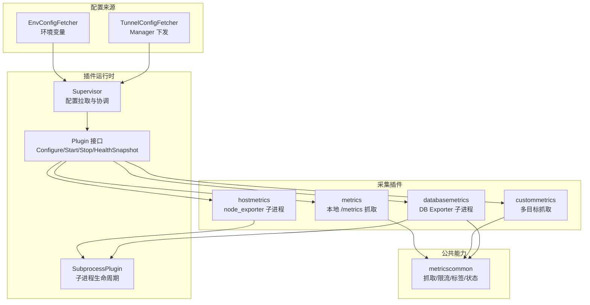
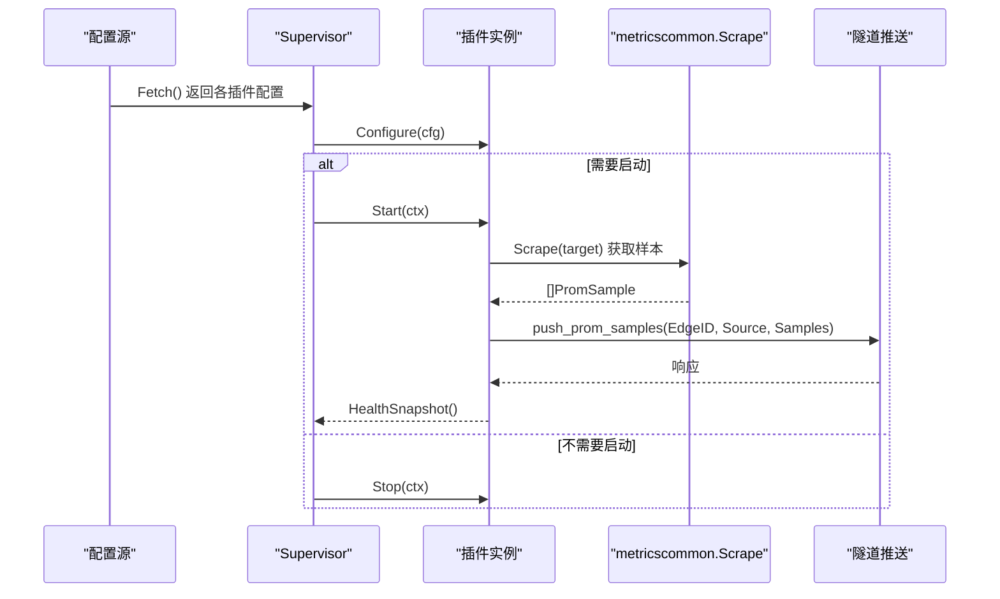
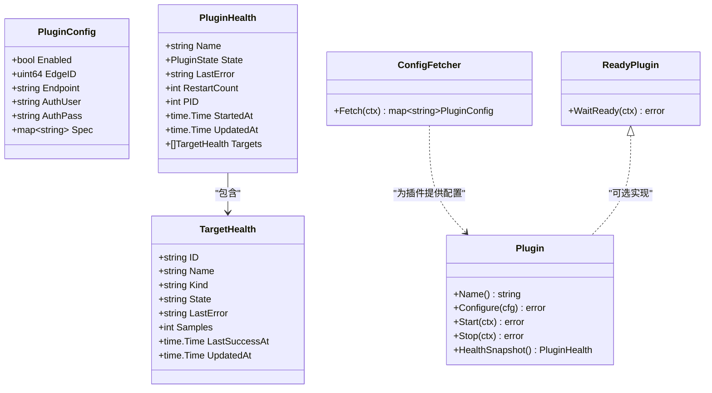
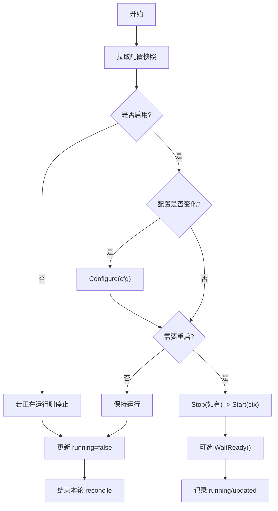
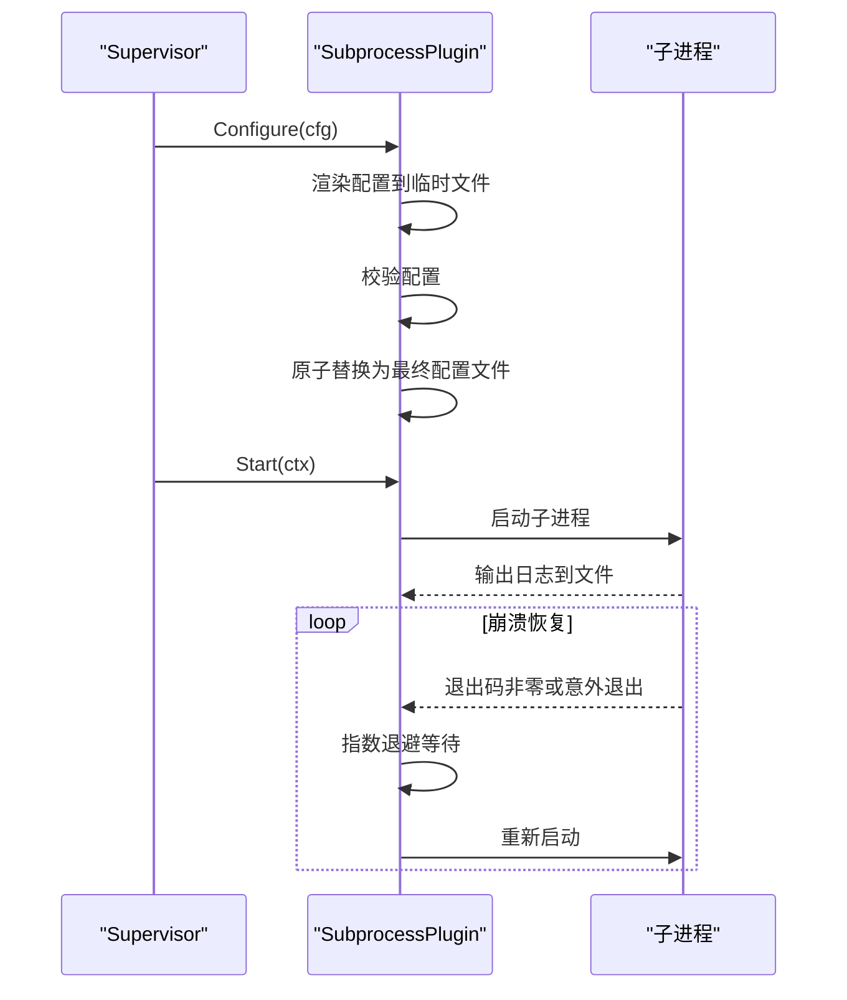
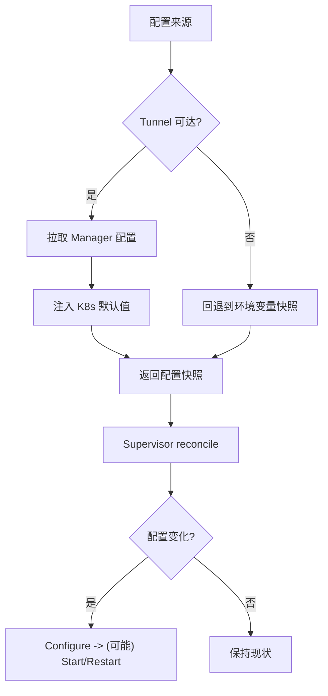
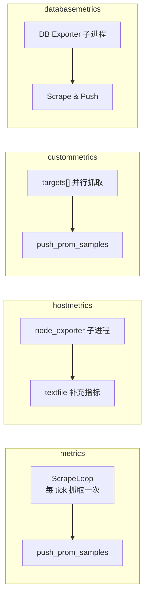
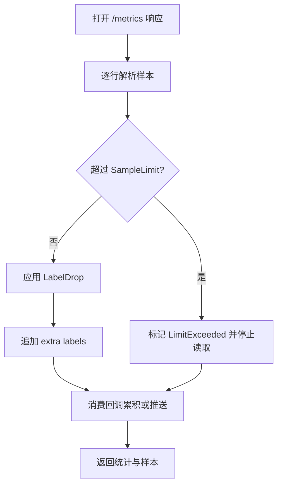
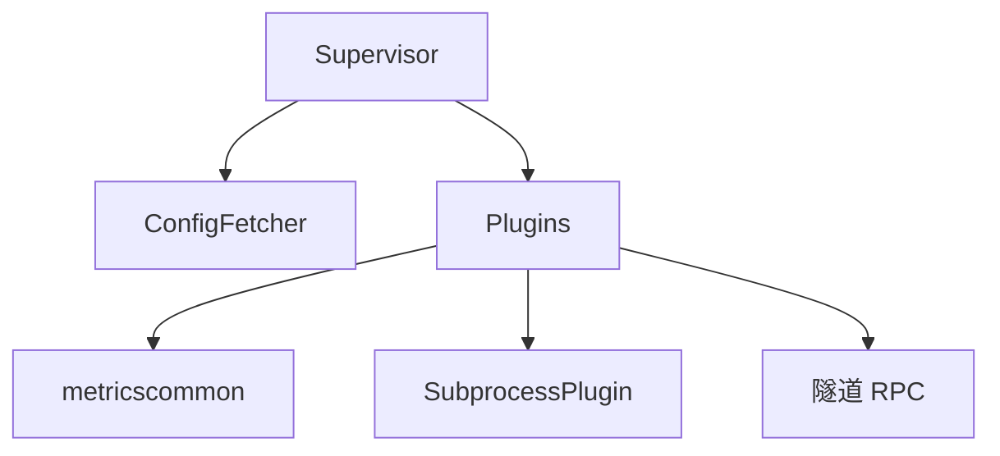

# 数据采集插件

<cite>
**本文引用的文件**
- [internal/edgeagent/plugins/plugin.go](file://internal/edgeagent/plugins/plugin.go)
- [internal/edgeagent/plugins/supervisor.go](file://internal/edgeagent/plugins/supervisor.go)
- [internal/edgeagent/plugins/subprocess.go](file://internal/edgeagent/plugins/subprocess.go)
- [internal/edgeagent/plugins/config_env.go](file://internal/edgeagent/plugins/config_env.go)
- [internal/edgeagent/plugins/config_tunnel.go](file://internal/edgeagent/plugins/config_tunnel.go)
- [internal/edgeagent/plugins/metrics/plugin.go](file://internal/edgeagent/plugins/metrics/plugin.go)
- [internal/edgeagent/plugins/hostmetrics/plugin.go](file://internal/edgeagent/plugins/hostmetrics/plugin.go)
- [internal/edgeagent/plugins/custommetrics/plugin.go](file://internal/edgeagent/plugins/custommetrics/plugin.go)
- [internal/edgeagent/plugins/custommetrics/spec.go](file://internal/edgeagent/plugins/custommetrics/spec.go)
- [internal/edgeagent/plugins/databasemetrics/plugin.go](file://internal/edgeagent/plugins/databasemetrics/plugin.go)
- [internal/edgeagent/plugins/databasemetrics/spec.go](file://internal/edgeagent/plugins/databasemetrics/spec.go)
- [internal/edgeagent/plugins/metricscommon/scrape.go](file://internal/edgeagent/plugins/metricscommon/scrape.go)
</cite>

## 目录
1. [简介](#简介)
2. [项目结构](#项目结构)
3. [核心组件](#核心组件)
4. [架构总览](#架构总览)
5. [详细组件分析](#详细组件分析)
6. [依赖关系分析](#依赖关系分析)
7. [性能考虑](#性能考虑)
8. [故障排查指南](#故障排查指南)
9. [结论](#结论)
10. [附录：开发指南与部署流程](#附录：开发指南与部署流程)

## 简介
本文件面向 Ongrid 平台的数据采集插件系统，系统性阐述插件发现、配置加载、调度执行、结果聚合、错误处理与重试机制，以及性能优化策略。文档覆盖内置指标采集（metrics）、主机指标采集（hostmetrics）、自定义指标采集（custommetrics）、数据库指标采集（databasemetrics）等关键插件的实现与使用方式，并提供开发接口规范、测试方法与部署流程建议。

## 项目结构
数据采集插件位于 edgeagent 的 plugins 子系统中，采用“统一接口 + 多实现”的设计：
- 统一接口与生命周期管理：Plugin、Supervisor、SubprocessPlugin
- 配置来源：环境变量（EnvConfigFetcher）与隧道（TunnelConfigFetcher）
- 采集插件实现：metrics、hostmetrics、custommetrics、databasemetrics
- 公共能力：metricscommon（Prometheus 文本格式抓取、限流、标签过滤、状态上报）

**图表来源**
- [internal/edgeagent/plugins/supervisor.go:112-243](file://internal/edgeagent/plugins/supervisor.go#L112-L243)
- [internal/edgeagent/plugins/config_env.go:48-76](file://internal/edgeagent/plugins/config_env.go#L48-L76)
- [internal/edgeagent/plugins/config_tunnel.go:104-186](file://internal/edgeagent/plugins/config_tunnel.go#L104-L186)
- [internal/edgeagent/plugins/metrics/plugin.go:181-282](file://internal/edgeagent/plugins/metrics/plugin.go#L181-L282)
- [internal/edgeagent/plugins/hostmetrics/plugin.go:62-134](file://internal/edgeagent/plugins/hostmetrics/plugin.go#L62-L134)
- [internal/edgeagent/plugins/custommetrics/plugin.go:135-211](file://internal/edgeagent/plugins/custommetrics/plugin.go#L135-L211)
- [internal/edgeagent/plugins/databasemetrics/plugin.go:145-296](file://internal/edgeagent/plugins/databasemetrics/plugin.go#L145-L296)
- [internal/edgeagent/plugins/metricscommon/scrape.go:74-115](file://internal/edgeagent/plugins/metricscommon/scrape.go#L74-L115)

**章节来源**
- [internal/edgeagent/plugins/supervisor.go:112-243](file://internal/edgeagent/plugins/supervisor.go#L112-L243)
- [internal/edgeagent/plugins/config_env.go:48-76](file://internal/edgeagent/plugins/config_env.go#L48-L76)
- [internal/edgeagent/plugins/config_tunnel.go:104-186](file://internal/edgeagent/plugins/config_tunnel.go#L104-L186)

## 核心组件
- 插件接口与状态
  - Plugin 统一生命周期：Name、Configure、Start、Stop、HealthSnapshot
  - 健康快照包含名称、状态、最近错误、重启次数、PID、启动时间、更新时间及目标级健康
- 插件管理器（Supervisor）
  - 周期拉取配置并 reconcile：启用则 Configure+Start；禁用则 Stop；配置变更触发重新配置或重启
  - 支持 ReadyPlugin 就绪门控（如子进程稳定运行后上报）
  - 提供 HealthSnapshots 汇总上报
- 子进程插件封装（SubprocessPlugin）
  - 负责渲染配置、校验、原子替换、启动子进程、捕获日志、崩溃指数退避重启、优雅停止
- 配置获取器
  - EnvConfigFetcher：从环境变量读取每个插件的配置片段
  - TunnelConfigFetcher：通过 Manager 下发的配置，结合环境默认值与 K8s 模式注入默认项，失败时回退到环境变量快照

**章节来源**
- [internal/edgeagent/plugins/plugin.go:18-135](file://internal/edgeagent/plugins/plugin.go#L18-L135)
- [internal/edgeagent/plugins/supervisor.go:112-243](file://internal/edgeagent/plugins/supervisor.go#L112-L243)
- [internal/edgeagent/plugins/subprocess.go:17-84](file://internal/edgeagent/plugins/subprocess.go#L17-L84)
- [internal/edgeagent/plugins/config_env.go:48-76](file://internal/edgeagent/plugins/config_env.go#L48-L76)
- [internal/edgeagent/plugins/config_tunnel.go:104-186](file://internal/edgeagent/plugins/config_tunnel.go#L104-L186)

## 架构总览
插件系统以 Supervisor 为中心，周期性从配置源拉取配置并对已注册插件进行 reconcile。各插件实现统一的 Plugin 接口，内部可运行在进程内（如 metrics）或通过 SubprocessPlugin 管理外部二进制（如 hostmetrics、databasemetrics）。采集到的样本经 metricscommon 标准化后，通过隧道 RPC 推送到后端存储。

**图表来源**
- [internal/edgeagent/plugins/supervisor.go:135-243](file://internal/edgeagent/plugins/supervisor.go#L135-L243)
- [internal/edgeagent/plugins/metricscommon/scrape.go:74-115](file://internal/edgeagent/plugins/metricscommon/scrape.go#L74-L115)
- [internal/edgeagent/plugins/metrics/plugin.go:214-282](file://internal/edgeagent/plugins/metrics/plugin.go#L214-L282)

## 详细组件分析

### 插件接口与生命周期
- 统一接口定义：Name、Configure、Start、Stop、HealthSnapshot
- 健康模型：PluginHealth、TargetHealth，用于上报插件与目标级状态
- 配置获取抽象：ConfigFetcher、ConfigApplyReporter、ReadyPlugin

**图表来源**
- [internal/edgeagent/plugins/plugin.go:18-135](file://internal/edgeagent/plugins/plugin.go#L18-L135)

**章节来源**
- [internal/edgeagent/plugins/plugin.go:18-135](file://internal/edgeagent/plugins/plugin.go#L18-L135)

### 插件管理器（Supervisor）
- 职责：注册插件、周期 reconcile、按配置启停插件、收集健康快照、上报配置应用结果
- 并发安全：对插件集合、当前配置、运行状态加锁保护
- 重载机制：支持信号触发与定时轮询，避免频繁重拉取

**图表来源**
- [internal/edgeagent/plugins/supervisor.go:135-243](file://internal/edgeagent/plugins/supervisor.go#L135-L243)

**章节来源**
- [internal/edgeagent/plugins/supervisor.go:112-243](file://internal/edgeagent/plugins/supervisor.go#L112-L243)

### 子进程插件封装（SubprocessPlugin）
- 配置渲染与校验：写入临时文件，校验通过后原子替换
- 子进程管理：启动、SIGTERM 优雅停止、日志落盘、崩溃指数退避重启
- 就绪检测：WaitReady 确保子进程稳定运行一段时间

**图表来源**
- [internal/edgeagent/plugins/subprocess.go:140-206](file://internal/edgeagent/plugins/subprocess.go#L140-L206)
- [internal/edgeagent/plugins/subprocess.go:208-308](file://internal/edgeagent/plugins/subprocess.go#L208-L308)

**章节来源**
- [internal/edgeagent/plugins/subprocess.go:17-84](file://internal/edgeagent/plugins/subprocess.go#L17-L84)
- [internal/edgeagent/plugins/subprocess.go:140-206](file://internal/edgeagent/plugins/subprocess.go#L140-L206)
- [internal/edgeagent/plugins/subprocess.go:208-308](file://internal/edgeagent/plugins/subprocess.go#L208-L308)

### 配置管理（动态加载、参数验证、运行时更新）
- 环境变量配置（EnvConfigFetcher）
  - 按插件名前缀读取 ENABLED、ENDPOINT、AUTH_USER/AUTH_PASS、SPEC_JSON
  - 自动回退到全局 ACCESS_KEY/SECRET_KEY
- 隧道配置（TunnelConfigFetcher）
  - 从 Manager 拉取配置，注入 K8s 模式默认值（如 logs/traces/metrics/hostmetrics/procmetrics）
  - 失败时回退到环境变量快照，保证冷启动可用
  - 支持将 logs 运行时凭据落地为本地文件后再注入
- 运行时更新
  - Supervisor 周期 reconcile，检测到配置变化会调用 Configure，必要时 Stop+Start 或子进程热重载

**图表来源**
- [internal/edgeagent/plugins/config_tunnel.go:104-186](file://internal/edgeagent/plugins/config_tunnel.go#L104-L186)
- [internal/edgeagent/plugins/config_env.go:48-76](file://internal/edgeagent/plugins/config_env.go#L48-L76)
- [internal/edgeagent/plugins/supervisor.go:175-243](file://internal/edgeagent/plugins/supervisor.go#L175-L243)

**章节来源**
- [internal/edgeagent/plugins/config_env.go:48-76](file://internal/edgeagent/plugins/config_env.go#L48-L76)
- [internal/edgeagent/plugins/config_tunnel.go:104-186](file://internal/edgeagent/plugins/config_tunnel.go#L104-L186)
- [internal/edgeagent/plugins/supervisor.go:175-243](file://internal/edgeagent/plugins/supervisor.go#L175-L243)

### 指标采集插件
- metrics（进程内抓取）
  - 定期抓取本地 /metrics（默认 node_exporter），解析 Prometheus 文本格式，通过隧道推送
  - 支持 target_url、interval、timeout、tls_insecure、bearer_token、extra_labels
- hostmetrics（子进程 node_exporter）
  - 管理 node_exporter 子进程，附加 textfile 补充指标（如 conntrack）
  - 支持 collectors_enabled/disabled、extra_args、listen_address
- custommetrics（多目标抓取）
  - 支持 targets 数组，每个目标独立 interval/timeout/auth/labels/sample_limit
  - 资源分类（database）自动注入 resource_category/db_type 标签
- databasemetrics（数据库 Exporter）
  - 为每种数据库类型启动对应 exporter 子进程（MySQL/PostgreSQL/Redis/MongoDB）
  - 连接凭据通过本地受管秘密文件注入，严格权限校验
  - 支持 TLS、collectors、各种 exporter 参数映射

**图表来源**
- [internal/edgeagent/plugins/metrics/plugin.go:181-282](file://internal/edgeagent/plugins/metrics/plugin.go#L181-L282)
- [internal/edgeagent/plugins/hostmetrics/plugin.go:62-134](file://internal/edgeagent/plugins/hostmetrics/plugin.go#L62-L134)
- [internal/edgeagent/plugins/custommetrics/plugin.go:135-211](file://internal/edgeagent/plugins/custommetrics/plugin.go#L135-L211)
- [internal/edgeagent/plugins/databasemetrics/plugin.go:145-296](file://internal/edgeagent/plugins/databasemetrics/plugin.go#L145-L296)

**章节来源**
- [internal/edgeagent/plugins/metrics/plugin.go:181-282](file://internal/edgeagent/plugins/metrics/plugin.go#L181-L282)
- [internal/edgeagent/plugins/hostmetrics/plugin.go:62-134](file://internal/edgeagent/plugins/hostmetrics/plugin.go#L62-L134)
- [internal/edgeagent/plugins/custommetrics/plugin.go:135-211](file://internal/edgeagent/plugins/custommetrics/plugin.go#L135-L211)
- [internal/edgeagent/plugins/databasemetrics/plugin.go:145-296](file://internal/edgeagent/plugins/databasemetrics/plugin.go#L145-L296)

### 数据抓取与聚合（metricscommon）
- 增量式抓取：逐行解析 Prometheus 文本，限制内存占用
- 限流与丢弃：SampleLimit 控制上限，LabelDrop 移除高基数字段
- 状态上报：生成 up、partial、accepted 指标，便于远端判断抓取质量
- HTTP 客户端：最小化连接池、TLS 最低版本、超时与重试由上层控制

**图表来源**
- [internal/edgeagent/plugins/metricscommon/scrape.go:74-115](file://internal/edgeagent/plugins/metricscommon/scrape.go#L74-L115)
- [internal/edgeagent/plugins/metricscommon/scrape.go:150-190](file://internal/edgeagent/plugins/metricscommon/scrape.go#L150-L190)
- [internal/edgeagent/plugins/metricscommon/scrape.go:230-270](file://internal/edgeagent/plugins/metricscommon/scrape.go#L230-L270)

**章节来源**
- [internal/edgeagent/plugins/metricscommon/scrape.go:74-115](file://internal/edgeagent/plugins/metricscommon/scrape.go#L74-L115)
- [internal/edgeagent/plugins/metricscommon/scrape.go:150-190](file://internal/edgeagent/plugins/metricscommon/scrape.go#L150-L190)
- [internal/edgeagent/plugins/metricscommon/scrape.go:230-270](file://internal/edgeagent/plugins/metricscommon/scrape.go#L230-L270)

## 依赖关系分析
- Supervisor 依赖 ConfigFetcher（Env/Tunnel）提供配置
- 各插件依赖 metricscommon 完成抓取与标准化
- 子进程插件依赖 SubprocessPlugin 管理外部二进制
- 插件通过隧道 RPC 推送样本，不直接暴露 remote_write 端口

**图表来源**
- [internal/edgeagent/plugins/supervisor.go:112-243](file://internal/edgeagent/plugins/supervisor.go#L112-L243)
- [internal/edgeagent/plugins/config_env.go:48-76](file://internal/edgeagent/plugins/config_env.go#L48-L76)
- [internal/edgeagent/plugins/config_tunnel.go:104-186](file://internal/edgeagent/plugins/config_tunnel.go#L104-L186)
- [internal/edgeagent/plugins/metricscommon/scrape.go:74-115](file://internal/edgeagent/plugins/metricscommon/scrape.go#L74-L115)
- [internal/edgeagent/plugins/subprocess.go:140-206](file://internal/edgeagent/plugins/subprocess.go#L140-L206)

**章节来源**
- [internal/edgeagent/plugins/supervisor.go:112-243](file://internal/edgeagent/plugins/supervisor.go#L112-L243)
- [internal/edgeagent/plugins/config_env.go:48-76](file://internal/edgeagent/plugins/config_env.go#L48-L76)
- [internal/edgeagent/plugins/config_tunnel.go:104-186](file://internal/edgeagent/plugins/config_tunnel.go#L104-L186)
- [internal/edgeagent/plugins/metricscommon/scrape.go:74-115](file://internal/edgeagent/plugins/metricscommon/scrape.go#L74-L115)
- [internal/edgeagent/plugins/subprocess.go:140-206](file://internal/edgeagent/plugins/subprocess.go#L140-L206)

## 性能考虑
- 批量与增量抓取
  - metricscommon 逐行解析，避免一次性加载大响应
  - 支持 SampleLimit 防止内存膨胀
- 缓存与复用
  - HTTP 客户端复用连接，设置空闲超时与最小连接数
  - TunnelConfigFetcher 缓存上次成功快照，网络不可用时回退
- 内存管理
  - 限制响应体读取长度，及时关闭连接
  - 子进程日志落盘，避免内存堆积
- 调度与并发
  - custommetrics 对多个目标并发抓取，但单目标串行
  - 合理设置 scrape_interval/timeout，避免过载

[本节为通用性能指导，无需特定文件引用]

## 故障排查指南
- 插件未启动或频繁重启
  - 检查 Supervisor reconcile 日志，确认配置是否生效
  - 查看子进程日志文件（workDir 下 <plugin>.log）
  - 关注 HealthSnapshot 中的 LastError 与 RestartCount
- 抓取失败或无数据
  - 检查目标 URL、鉴权信息、TLS 设置
  - 确认 SampleLimit 与 LabelDrop 配置是否过严
  - 查看 up/partial/accepted 指标判断抓取质量
- 配置未生效
  - 确认 ConfigFetcher 是否成功拉取（Tunnel 可达性）
  - 检查环境变量键名与 JSON 格式是否正确
  - 观察 Supervisor 是否触发 Reload 并 Apply

**章节来源**
- [internal/edgeagent/plugins/supervisor.go:135-243](file://internal/edgeagent/plugins/supervisor.go#L135-L243)
- [internal/edgeagent/plugins/subprocess.go:267-308](file://internal/edgeagent/plugins/subprocess.go#L267-L308)
- [internal/edgeagent/plugins/metricscommon/scrape.go:150-190](file://internal/edgeagent/plugins/metricscommon/scrape.go#L150-L190)
- [internal/edgeagent/plugins/config_tunnel.go:104-186](file://internal/edgeagent/plugins/config_tunnel.go#L104-L186)

## 结论
Ongrid 数据采集插件系统通过统一接口与集中式管理器实现了插件的可插拔、可观测与高可靠运行。配置来源灵活（环境变量与 Manager 下发），调度与生命周期管理健壮（指数退避重启、就绪门控），采集链路高效（增量解析、限流与标签过滤）。该设计既满足多种采集场景（主机、数据库、自定义目标），又具备良好的扩展性与运维可观测性。

[本节为总结性内容，无需特定文件引用]

## 附录：开发指南与部署流程

### 插件接口规范
- 必须实现：Name、Configure、Start、Stop、HealthSnapshot
- 可选实现：ReadyPlugin（WaitReady）
- 配置结构：PluginConfig（Enabled、Endpoint、AuthUser/AuthPass、Spec）
- 健康上报：PluginHealth、TargetHealth（目标级状态）

**章节来源**
- [internal/edgeagent/plugins/plugin.go:18-135](file://internal/edgeagent/plugins/plugin.go#L18-L135)

### 开发步骤
- 选择实现方式
  - 进程内抓取：参考 metrics 插件
  - 子进程管理：参考 hostmetrics/databasemetrics 插件
- 编写配置解析与校验
  - 参考 custommetrics/spec.go、databasemetrics/spec.go
- 集成抓取与推送
  - 使用 metricscommon.Scrape 与 ScrapeUpSample/StatusSamples
  - 通过隧道 RPC 推送样本
- 注册与配置
  - 向 Supervisor 注册插件
  - 通过环境变量或 Manager 下发配置

**章节来源**
- [internal/edgeagent/plugins/custommetrics/spec.go:13-112](file://internal/edgeagent/plugins/custommetrics/spec.go#L13-L112)
- [internal/edgeagent/plugins/databasemetrics/spec.go:54-166](file://internal/edgeagent/plugins/databasemetrics/spec.go#L54-L166)
- [internal/edgeagent/plugins/metricscommon/scrape.go:74-115](file://internal/edgeagent/plugins/metricscommon/scrape.go#L74-L115)

### 测试方法
- 单元测试
  - 针对配置解析函数（spec.go）进行边界与异常用例测试
  - 模拟 Pusher 接口验证推送路径
- 集成测试
  - 启动 Supervisor 与插件，验证配置加载、启停与健康上报
  - 使用 mock 目标服务验证抓取与限流行为

**章节来源**
- [internal/edgeagent/plugins/custommetrics/plugin.go:135-211](file://internal/edgeagent/plugins/custommetrics/plugin.go#L135-L211)
- [internal/edgeagent/plugins/databasemetrics/plugin.go:145-296](file://internal/edgeagent/plugins/databasemetrics/plugin.go#L145-L296)

### 部署流程
- 环境变量配置
  - 设置 ONGRID_EDGE_PLUGIN_<NAME>_ENABLED、ENDPOINT、AUTH_*、SPEC_JSON
- Manager 下发配置
  - 通过 TunnelConfigFetcher 拉取，自动注入 K8s 默认值
- 运行与监控
  - 启动 ongrid-edge，观察 Supervisor 日志与健康快照
  - 查看插件工作目录下的日志文件与 textfile 指标

**章节来源**
- [internal/edgeagent/plugins/config_env.go:48-76](file://internal/edgeagent/plugins/config_env.go#L48-L76)
- [internal/edgeagent/plugins/config_tunnel.go:104-186](file://internal/edgeagent/plugins/config_tunnel.go#L104-L186)
- [internal/edgeagent/plugins/hostmetrics/plugin.go:62-134](file://internal/edgeagent/plugins/hostmetrics/plugin.go#L62-L134)