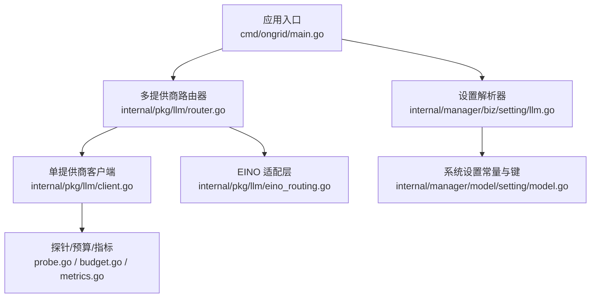
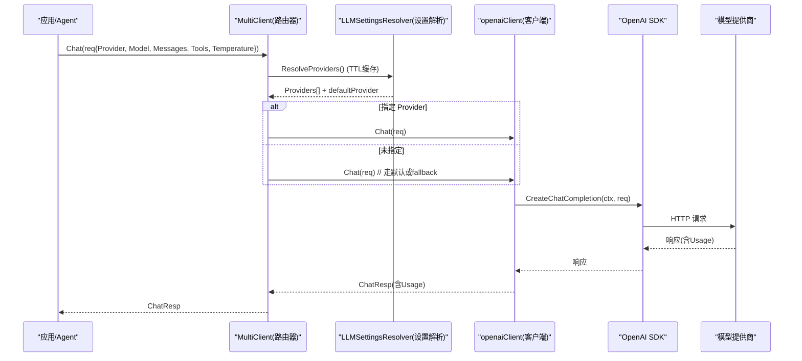
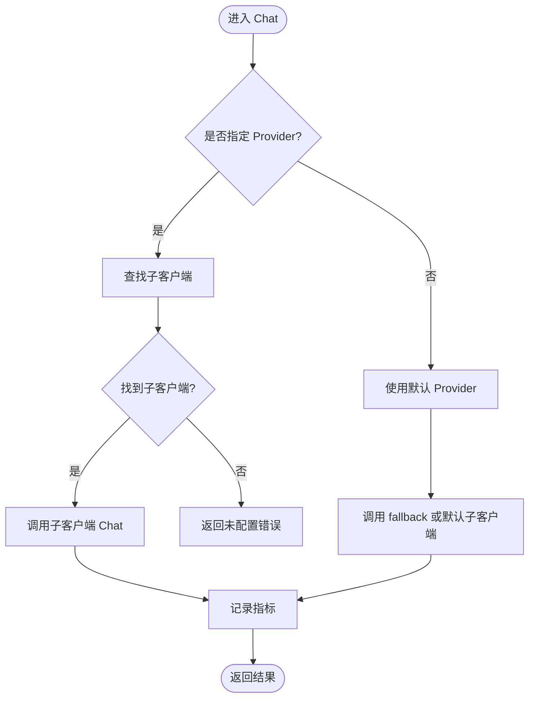
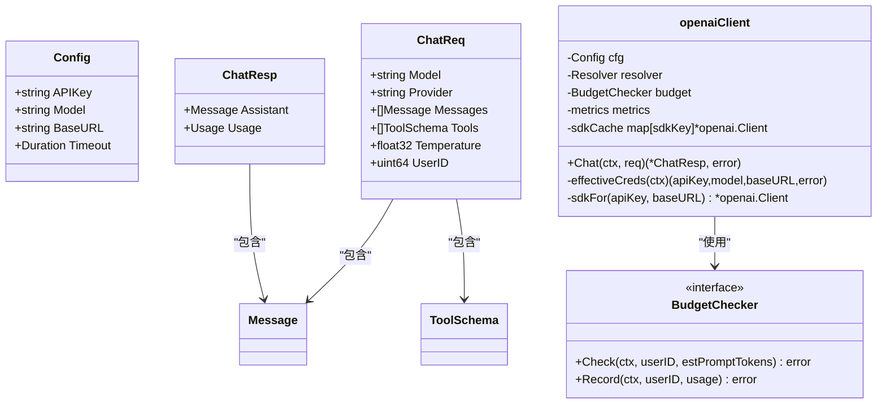
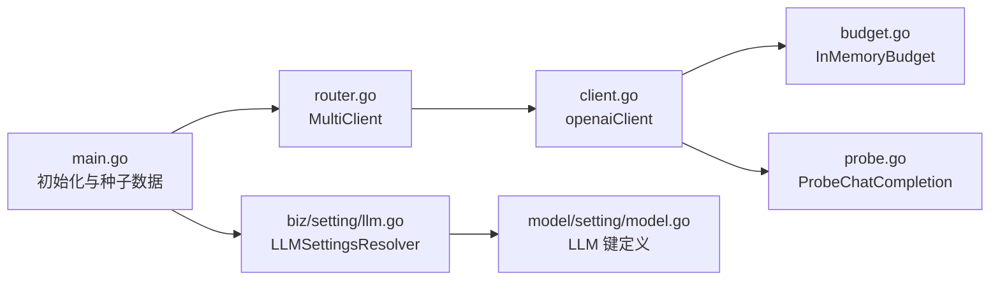

# AI 模型提供商集成

<cite>
**本文引用的文件**
- [internal/pkg/llm/client.go](file://internal/pkg/llm/client.go)
- [internal/pkg/llm/router.go](file://internal/pkg/llm/router.go)
- [internal/pkg/llm/eino_routing.go](file://internal/pkg/llm/eino_routing.go)
- [internal/pkg/llm/budget.go](file://internal/pkg/llm/budget.go)
- [internal/pkg/llm/probe.go](file://internal/pkg/llm/probe.go)
- [internal/manager/biz/setting/llm.go](file://internal/manager/biz/setting/llm.go)
- [internal/manager/model/setting/model.go](file://internal/manager/model/setting/model.go)
- [cmd/ongrid/main.go](file://cmd/ongrid/main.go)
</cite>

## 目录
1. [简介](#简介)
2. [项目结构](#项目结构)
3. [核心组件](#核心组件)
4. [架构总览](#架构总览)
5. [详细组件分析](#详细组件分析)
6. [依赖关系分析](#依赖关系分析)
7. [性能与可用性](#性能与可用性)
8. [故障排查指南](#故障排查指南)
9. [结论](#结论)
10. [附录：配置与使用清单](#附录：配置与使用清单)

## 简介
本文件面向 Ongrid 平台的 AI 模型提供商集成，系统性说明如何接入 OpenAI、Anthropic Claude、Google Gemini、DeepSeek、Kimi 等主流大模型，并覆盖以下主题：
- 支持的模型服务与统一接入方式（OpenAI 兼容接口）
- 多模型路由与负载均衡机制（按 Provider 分发、默认 Provider、动态刷新）
- 请求参数控制（温度、最大令牌数、超时、工具调用）
- API 密钥与 Base URL 配置、使用限制与成本优化建议
- 模型选择指南与性能对比思路
- 预算控制与可观测性指标

## 项目结构
Ongrid 的 LLM 能力集中在 internal/pkg/llm 包中，并通过 manager 层的设置服务将运行时配置注入到路由器。启动时 main.go 会初始化各 Provider 的配置，并建立动态解析器，使管理员在 UI 中的修改能在约 60 秒内生效。

**图表来源**
- [cmd/ongrid/main.go:574-769](file://cmd/ongrid/main.go#L574-L769)
- [internal/pkg/llm/router.go:1-129](file://internal/pkg/llm/router.go#L1-L129)
- [internal/pkg/llm/client.go:176-220](file://internal/pkg/llm/client.go#L176-L220)
- [internal/pkg/llm/eino_routing.go:1-51](file://internal/pkg/llm/eino_routing.go#L1-L51)
- [internal/manager/biz/setting/llm.go:12-53](file://internal/manager/biz/setting/llm.go#L12-L53)
- [internal/manager/model/setting/model.go:79-149](file://internal/manager/model/setting/model.go#L79-L149)

**章节来源**
- [cmd/ongrid/main.go:574-769](file://cmd/ongrid/main.go#L574-L769)
- [internal/pkg/llm/router.go:1-129](file://internal/pkg/llm/router.go#L1-L129)
- [internal/pkg/llm/client.go:176-220](file://internal/pkg/llm/client.go#L176-L220)
- [internal/manager/biz/setting/llm.go:12-53](file://internal/manager/biz/setting/llm.go#L12-L53)
- [internal/manager/model/setting/model.go:79-149](file://internal/manager/model/setting/model.go#L79-L149)

## 核心组件
- 多提供商路由器 MultiClient：根据 ChatReq.Provider 将请求分发到对应子客户端；支持默认 Provider 与动态刷新；对错误进行分类统计。
- 单提供商客户端 openaiClient：封装 OpenAI SDK，统一处理鉴权、BaseURL 规范化、超时、采样参数、工具调用、预算检查、指标记录。
- 设置解析器 LLMSettingsResolver：从 system_settings.llm.* 读取每 Provider 的 API Key、BaseURL、模型列表与默认模型，并返回给路由器。
- EINO 适配层 RoutingChatModel：将现有 llm.Client 适配为 eino 的 ChatModel，支持 per-call Provider 选择与工具绑定。
- 预算控制器 InMemoryBudget：按日统计 token 用量，达到阈值后拒绝新请求。
- 健康探针 ProbeChatCompletion：以最小请求验证 Provider 连通性与鉴权。

**章节来源**
- [internal/pkg/llm/router.go:30-129](file://internal/pkg/llm/router.go#L30-L129)
- [internal/pkg/llm/client.go:46-128](file://internal/pkg/llm/client.go#L46-L128)
- [internal/manager/biz/setting/llm.go:12-53](file://internal/manager/biz/setting/llm.go#L12-L53)
- [internal/pkg/llm/eino_routing.go:78-142](file://internal/pkg/llm/eino_routing.go#L78-L142)
- [internal/pkg/llm/budget.go:9-33](file://internal/pkg/llm/budget.go#L9-L33)
- [internal/pkg/llm/probe.go:15-31](file://internal/pkg/llm/probe.go#L15-L31)

## 架构总览
下图展示了从应用入口到具体模型调用的完整链路，包括动态配置注入、路由分发、客户端执行与指标上报。

**图表来源**
- [internal/pkg/llm/router.go:155-225](file://internal/pkg/llm/router.go#L155-L225)
- [internal/pkg/llm/router.go:274-329](file://internal/pkg/llm/router.go#L274-L329)
- [internal/pkg/llm/client.go:387-507](file://internal/pkg/llm/client.go#L387-L507)
- [internal/manager/biz/setting/llm.go:126-224](file://internal/manager/biz/setting/llm.go#L126-L224)

## 详细组件分析

### 多提供商路由器（MultiClient）
- 功能要点
  - 支持按 Provider ID 分发：openai、anthropic、zhipu、gemini、deepseek、kimi、custom。
  - 支持默认 Provider：当 ChatReq.Provider 为空时，优先使用动态解析得到的默认 Provider，否则回退到构造时传入的 fallback。
  - 动态刷新：通过 SetProvidersResolver 注入设置解析器，每次调用前会按 TTL（默认 60s）拉取最新 Provider 列表；解析失败则软回退到静态配置。
  - 指标统计：对成功、超时、限流、错误进行区分标记，便于监控面板观察。
- 关键行为
  - 空 APIKey 的 Provider 会被跳过，不会出现在 UI 可选列表中。
  - 模型列表去重，保证 UI 下拉不重复。
  - 提供 AsWire 用于前端展示可用 Provider 与模型。

**图表来源**
- [internal/pkg/llm/router.go:274-329](file://internal/pkg/llm/router.go#L274-L329)
- [internal/pkg/llm/router.go:155-225](file://internal/pkg/llm/router.go#L155-L225)

**章节来源**
- [internal/pkg/llm/router.go:30-129](file://internal/pkg/llm/router.go#L30-L129)
- [internal/pkg/llm/router.go:155-225](file://internal/pkg/llm/router.go#L155-L225)
- [internal/pkg/llm/router.go:274-329](file://internal/pkg/llm/router.go#L274-L329)

### 单提供商客户端（openaiClient）
- 功能要点
  - 统一封装 OpenAI SDK，支持自定义 BaseURL（自动补全 /v1），适配智谱 JWT 认证。
  - 超时控制：若调用方上下文无截止时间，则使用默认超时（默认 120s）。
  - 采样参数：对推理模型（如 o-series、gpt-5.x、kimi-k2/k3、包含 reasoner/reasoning 的模型）自动移除 temperature/top_p/n 等参数，避免 400 错误；同时具备“学习”机制，遇到 400 后将该模型加入黑名单，后续不再发送采样参数。
  - 预算检查：在发起网络请求前估算 prompt tokens 并进行预算拦截；成功后记录实际 usage。
  - 指标与日志：记录请求耗时、token 用量、工具调用次数等，不包含用户消息内容。
- 关键数据结构
  - Config：APIKey、Model、BaseURL、Timeout。
  - ChatReq/ChatResp：消息、工具、温度、用户标识、用量。
  - BudgetChecker：Check/Record 接口。

**图表来源**
- [internal/pkg/llm/client.go:46-128](file://internal/pkg/llm/client.go#L46-L128)
- [internal/pkg/llm/client.go:222-261](file://internal/pkg/llm/client.go#L222-L261)
- [internal/pkg/llm/client.go:387-507](file://internal/pkg/llm/client.go#L387-L507)

**章节来源**
- [internal/pkg/llm/client.go:46-128](file://internal/pkg/llm/client.go#L46-L128)
- [internal/pkg/llm/client.go:387-507](file://internal/pkg/llm/client.go#L387-L507)
- [internal/pkg/llm/client.go:617-713](file://internal/pkg/llm/client.go#L617-L713)

### 设置解析器（LLMSettingsResolver）
- 功能要点
  - 从 system_settings.llm.* 读取每个 Provider 的 API Key、BaseURL、模型列表 JSON、默认模型。
  - 支持环境默认值回退：当 DB 行不存在时，使用构建时传入的环境默认值。
  - 特殊处理：Custom 提供商若无 BaseURL 将被跳过；模型列表去重；默认模型不在列表时自动前置。
  - 默认 Provider：优先读 DB 的 default_provider，其次回退到环境变量。
- 输出
  - 返回 ProviderConfig 列表与默认 Provider ID，供路由器构建子客户端。

**章节来源**
- [internal/manager/biz/setting/llm.go:12-53](file://internal/manager/biz/setting/llm.go#L12-L53)
- [internal/manager/biz/setting/llm.go:126-224](file://internal/manager/biz/setting/llm.go#L126-L224)
- [internal/manager/model/setting/model.go:79-149](file://internal/manager/model/setting/model.go#L79-L149)

### EINO 适配层（RoutingChatModel）
- 功能要点
  - 将现有 llm.Client 适配为 eino 的 ChatModel，支持 per-call Provider 选择（WithProvider）。
  - 支持默认 Provider 的动态解析：当未显式指定 Provider 时，可从运行时配置获取默认 Provider 与模型。
  - 工具绑定：支持 WithTools 与 BindTools 两种风格，内部会尽量派生不可变实例。
- 适用场景
  - 与 Agent 框架集成，统一暴露 ChatModel 接口，屏蔽底层 Provider 差异。

**章节来源**
- [internal/pkg/llm/eino_routing.go:78-142](file://internal/pkg/llm/eino_routing.go#L78-L142)
- [internal/pkg/llm/eino_routing.go:144-184](file://internal/pkg/llm/eino_routing.go#L144-L184)
- [internal/pkg/llm/eino_routing.go:303-394](file://internal/pkg/llm/eino_routing.go#L303-L394)

### 预算控制（InMemoryBudget）
- 功能要点
  - 按 UTC 日维度累计 token 用量，超过每日限额后拒绝新请求。
  - 当前为内存实现，适合单租户 MVP；未来可替换为持久化存储。
- 使用位置
  - 在 openaiClient.Chat 中，先 Check 再发请求，成功后 Record 实际用量。

**章节来源**
- [internal/pkg/llm/budget.go:9-73](file://internal/pkg/llm/budget.go#L9-L73)
- [internal/pkg/llm/client.go:402-413](file://internal/pkg/llm/client.go#L402-L413)
- [internal/pkg/llm/client.go:484-493](file://internal/pkg/llm/client.go#L484-L493)

### 健康探针（ProbeChatCompletion）
- 功能要点
  - 使用与生产客户端相同的 BaseURL 规范化与鉴权路径，发送最小请求验证连通性与鉴权。
  - 不记录指标与日志，避免污染运行态遥测。
- 使用场景
  - 在设置页面保存后立即测试连通性，快速反馈配置是否正确。

**章节来源**
- [internal/pkg/llm/probe.go:15-72](file://internal/pkg/llm/probe.go#L15-L72)

## 依赖关系分析
- 启动阶段
  - main.go 初始化 OpenAI 客户端与多提供商路由器，并将各 Provider 的配置注入到路由器。
  - 将环境变量中的 LLM 配置写入 system_settings.llm.*，作为首次引导数据。
  - 设置动态解析器，使管理员在 UI 中的修改能于约 60 秒内生效。
- 运行阶段
  - 路由器按 Provider 分发请求；客户端负责鉴权、超时、采样参数、预算检查与指标上报。
  - 设置解析器定期刷新 Provider 列表，确保动态配置生效。

**图表来源**
- [cmd/ongrid/main.go:574-769](file://cmd/ongrid/main.go#L574-L769)
- [internal/pkg/llm/router.go:1-129](file://internal/pkg/llm/router.go#L1-L129)
- [internal/manager/biz/setting/llm.go:12-53](file://internal/manager/biz/setting/llm.go#L12-L53)
- [internal/manager/model/setting/model.go:79-149](file://internal/manager/model/setting/model.go#L79-L149)
- [internal/pkg/llm/budget.go:9-73](file://internal/pkg/llm/budget.go#L9-L73)
- [internal/pkg/llm/probe.go:15-72](file://internal/pkg/llm/probe.go#L15-L72)

**章节来源**
- [cmd/ongrid/main.go:574-769](file://cmd/ongrid/main.go#L574-L769)
- [internal/pkg/llm/router.go:1-129](file://internal/pkg/llm/router.go#L1-L129)
- [internal/manager/biz/setting/llm.go:12-53](file://internal/manager/biz/setting/llm.go#L12-L53)
- [internal/manager/model/setting/model.go:79-149](file://internal/manager/model/setting/model.go#L79-L149)

## 性能与可用性
- 超时控制
  - 默认超时 120s，适用于主流推理模型的复杂工具调用场景；可在调用方上下文设置更严格的截止时间。
- 采样参数
  - 推理模型固定采样参数，客户端会自动移除以避免 400；非推理模型默认温度 0.1，保证确定性。
- 预算控制
  - 按日统计 token 用量，达到限额后拒绝新请求，防止成本失控。
- 指标与可观测性
  - 记录请求耗时、token 用量、状态码分类（ok/timeout/rate_limited/error），便于监控与告警。
- 负载均衡与故障转移
  - 多 Provider 路由支持按 Provider 分发；当某 Provider 不可用时，可通过切换默认 Provider 或禁用该 Provider 实现故障转移。
  - 动态解析器失败时软回退到静态配置，保障可用性。

[本节为通用指导，无需特定文件引用]

## 故障排查指南
- 常见错误与定位
  - 未配置 API Key：客户端返回“未设置 API Key”，需检查环境变量或设置项。
  - 模型不支持采样参数：客户端自动识别并移除温度等参数，必要时查看日志提示。
  - 预算超限：请求被拒绝，需调整每日限额或减少 token 消耗。
  - Provider 未配置：路由器返回“未配置”，需检查设置项或环境变量。
- 诊断步骤
  - 使用健康探针验证连通性与鉴权。
  - 检查设置解析器是否成功加载 Provider 列表。
  - 查看指标面板，关注超时、限流与错误比例。
  - 确认默认 Provider 与模型是否在可用列表中。

**章节来源**
- [internal/pkg/llm/client.go:387-507](file://internal/pkg/llm/client.go#L387-L507)
- [internal/pkg/llm/router.go:274-329](file://internal/pkg/llm/router.go#L274-L329)
- [internal/pkg/llm/probe.go:15-72](file://internal/pkg/llm/probe.go#L15-L72)

## 结论
Ongrid 平台通过统一的 OpenAI 兼容接口与多提供商路由器，实现了对主流大模型的灵活接入与动态管理。结合设置解析器、预算控制与健康探针，既保证了易用性，又提供了必要的可控性与可观测性。建议在生产环境中：
- 明确默认 Provider 与模型，并在 UI 中维护可用模型列表。
- 启用预算控制，设定合理的每日 token 限额。
- 利用健康探针与指标面板，持续监控连通性与性能。
- 根据业务需求选择合适的模型与采样参数，平衡质量与成本。

[本节为总结性内容，无需特定文件引用]

## 附录：配置与使用清单
- 支持的 Provider 与默认模型
  - OpenAI：默认模型 gpt-5.4，BaseURL 可自定义。
  - Anthropic：默认模型 claude-sonnet-4-6，BaseURL 指向官方 v1 端点。
  - 智谱 GLM：默认模型 glm-4.7，BaseURL 指向官方 v4 端点。
  - Gemini：默认模型 gemini-2.5-pro，BaseURL 指向官方 OpenAI 兼容端点。
  - DeepSeek：默认模型 deepseek-v4-flash，BaseURL 指向官方 v1 端点。
  - Kimi：默认模型 kimi-k2.6，BaseURL 指向官方 v1 端点。
- 配置项
  - 每 Provider 的 API Key、BaseURL、模型列表 JSON、默认模型。
  - 全局默认 Provider 键。
- 使用限制
  - 推理模型固定采样参数，客户端会自动处理。
  - 预算控制按日统计，达到限额后拒绝新请求。
- 成本优化建议
  - 合理设置温度与最大令牌数，避免过度生成。
  - 使用预算控制限制每日 token 消耗。
  - 根据任务复杂度选择合适模型，避免高成本模型用于简单任务。
  - 监控指标，及时发现异常消耗。

**章节来源**
- [cmd/ongrid/main.go:592-647](file://cmd/ongrid/main.go#L592-L647)
- [internal/manager/model/setting/model.go:92-149](file://internal/manager/model/setting/model.go#L92-L149)
- [internal/pkg/llm/client.go:509-567](file://internal/pkg/llm/client.go#L509-L567)
- [internal/pkg/llm/budget.go:9-73](file://internal/pkg/llm/budget.go#L9-L73)