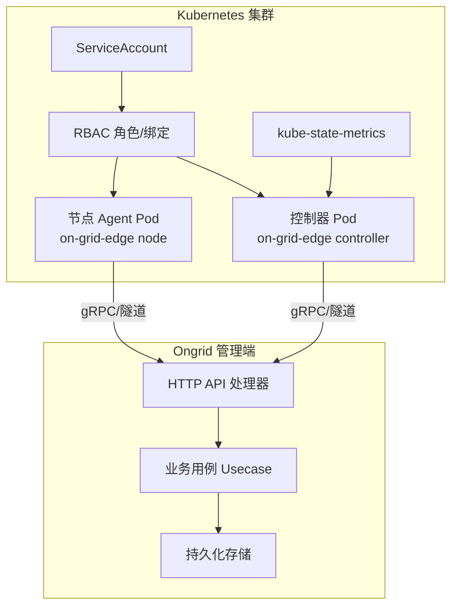
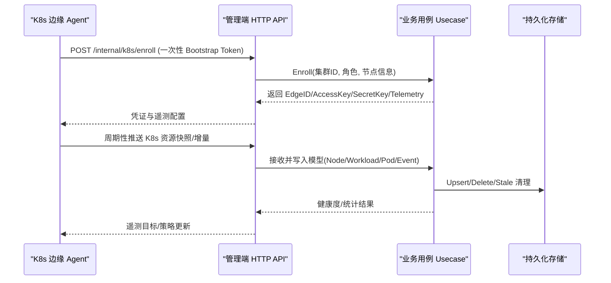
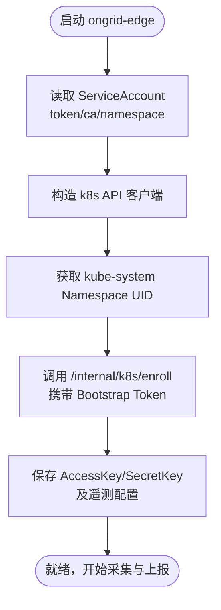
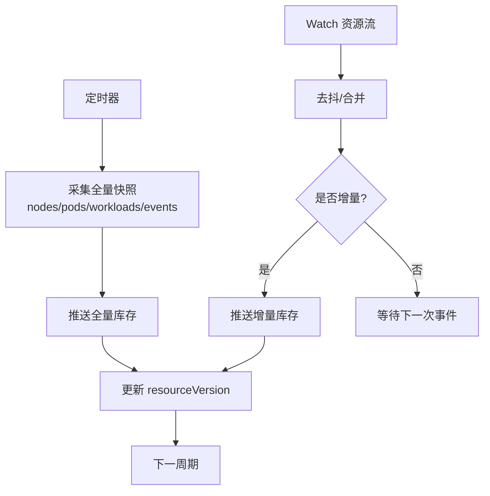
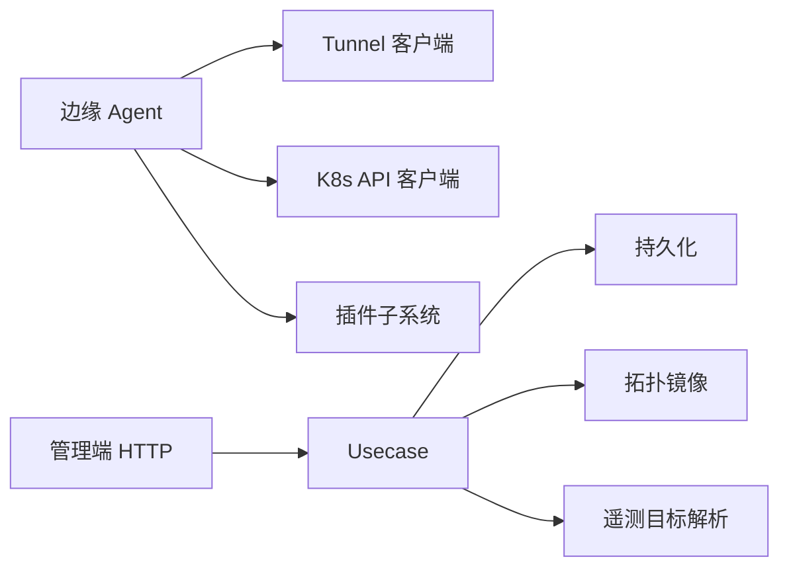

# 云平台集成

<cite>
**本文引用的文件**
- [k8s.proto](file://api/manager/k8s/v1/k8s.proto)
- [main.go](file://cmd/ongrid-edge/main.go)
- [identity.go](file://internal/edgeagent/k8s/identity.go)
- [inventory.go](file://internal/edgeagent/k8s/inventory.go)
- [usecase.go](file://internal/manager/biz/k8s/usecase.go)
- [http.go](file://internal/manager/server/k8s/http.go)
- [rbac.yaml](file://deploy/kubernetes/ongrid-edge/templates/rbac.yaml)
- [serviceaccount.yaml](file://deploy/kubernetes/ongrid-edge/templates/serviceaccount.yaml)
- [deployment.yaml](file://deploy/kubernetes/ongrid-edge/templates/deployment.yaml)
- [daemonset.yaml](file://deploy/kubernetes/ongrid-edge/templates/daemonset.yaml)
- [configmap.yaml](file://deploy/kubernetes/ongrid-edge/templates/configmap.yaml)
- [controller-credentials-secret.yaml](file://deploy/kubernetes/ongrid-edge/templates/controller-credentials-secret.yaml)
- [telemetry-credentials-secret.yaml](file://deploy/kubernetes/ongrid-edge/templates/telemetry-credentials-secret.yaml)
- [metrics-scraper-deployment.yaml](file://deploy/kubernetes/ongrid-edge/templates/metrics-scraper-deployment.yaml)
- [kube-state-metrics.yaml](file://deploy/kubernetes/ongrid-edge/templates/kube-state-metrics.yaml)
- [kubernetes.md](file://internal/manager/biz/knowledge/builtin_vault/systems/container/kubernetes.md)
</cite>

## 目录
1. [简介](#简介)
2. [项目结构](#项目结构)
3. [核心组件](#核心组件)
4. [架构总览](#架构总览)
5. [详细组件分析](#详细组件分析)
6. [依赖关系分析](#依赖关系分析)
7. [性能与可扩展性](#性能与可扩展性)
8. [部署与权限规划](#部署与权限规划)
9. [故障排除指南](#故障排除指南)
10. [结论](#结论)

## 简介
本文件面向 Ongrid 平台的“云平台集成”能力，聚焦与 Kubernetes 集群的深度集成：包括集群发现、资源监控（Node/Pod/Workload/Event）、事件处理、自动化操作、认证授权（ServiceAccount、RBAC、证书管理）、多云环境管理与扩展开发方法。文档以代码级事实为依据，提供架构图、序列图、流程图和排障指引，帮助读者快速理解并安全落地。

## 项目结构
Ongrid 的 Kubernetes 集成由“边缘侧（K8s Agent）+ 管理侧（Manager）”两部分组成：
- 边缘侧（cmd/ongrid-edge/internal/edgeagent/k8s）：在 K8s 集群内运行，负责发现集群身份、采集资源快照与增量变更、推送指标与遥测数据至云端。
- 管理侧（internal/manager/biz/k8s + internal/manager/server/k8s）：提供集群注册、健康度聚合、资源查询、事件清理、遥测配置下发等能力，并通过 HTTP API 暴露给前端或外部系统。
- 部署模板（deploy/kubernetes/ongrid-edge）：提供 ServiceAccount、RBAC、Deployment/DaemonSet、ConfigMap、Secret、Metrics Scraper、Kube-State-Metrics 等完整安装清单。

图表来源
- [deployment.yaml](file://deploy/kubernetes/ongrid-edge/templates/deployment.yaml)
- [daemonset.yaml](file://deploy/kubernetes/ongrid-edge/templates/daemonset.yaml)
- [serviceaccount.yaml](file://deploy/kubernetes/ongrid-edge/templates/serviceaccount.yaml)
- [rbac.yaml](file://deploy/kubernetes/ongrid-edge/templates/rbac.yaml)
- [kube-state-metrics.yaml](file://deploy/kubernetes/ongrid-edge/templates/kube-state-metrics.yaml)
- [http.go](file://internal/manager/server/k8s/http.go)
- [usecase.go](file://internal/manager/biz/k8s/usecase.go)

章节来源
- [main.go:66-134](file://cmd/ongrid-edge/main.go#L66-L134)
- [http.go:93-106](file://internal/manager/server/k8s/http.go#L93-L106)

## 核心组件
- 集群发现与身份识别：通过读取 ServiceAccount 与 kube-system Namespace UID 确定物理集群身份。
- 资源盘点与增量同步：控制器模式定期全量拉取 Node/Pod/Workload/Event 快照，结合 Watch 实现增量推送；支持按命名空间范围限制。
- 指标与遥测：支持抓取本地 /metrics、网关指标、数据库导出器、主机/进程指标，并推送到管理端或后端。
- 管理端能力：集群注册、健康度聚合、资源查询、事件保留与清理、遥测配置刷新、Bootstrap Token 轮换。
- 认证与授权：基于 ServiceAccount 与 RBAC 的最小权限原则；控制器与节点使用不同 SA 与 ClusterRole。

章节来源
- [identity.go:11-33](file://internal/edgeagent/k8s/identity.go#L11-L33)
- [inventory.go:85-170](file://internal/edgeagent/k8s/inventory.go#L85-L170)
- [main.go:231-280](file://cmd/ongrid-edge/main.go#L231-L280)
- [usecase.go:243-274](file://internal/manager/biz/k8s/usecase.go#L243-L274)
- [rbac.yaml:102-173](file://deploy/kubernetes/ongrid-edge/templates/rbac.yaml#L102-L173)

## 架构总览
Ongrid 采用“边云协同”的架构：K8s 内的 ongrid-edge 作为数据采集与执行代理，通过隧道将资源快照、指标与事件上报到管理端；管理端负责统一建模、存储、分析与对外 API。

图表来源
- [http.go:504-553](file://internal/manager/server/k8s/http.go#L504-L553)
- [usecase.go:501-549](file://internal/manager/biz/k8s/usecase.go#L501-L549)
- [inventory.go:177-225](file://internal/edgeagent/k8s/inventory.go#L177-L225)

## 详细组件分析

### 集群发现与认证
- 集群身份：通过读取 kube-system Namespace 的 UID 获得不可变集群标识，避免多集群混淆。
- 服务账户与证书：从 ServiceAccount 目录加载 token、ca.crt、namespace，构建 HTTPS 客户端访问 kube-apiserver。
- 边缘注册：使用一次性 Bootstrap Token 调用内部接口完成注册，获取长期凭证与遥测配置。

图表来源
- [identity.go:11-33](file://internal/edgeagent/k8s/identity.go#L11-L33)
- [inventory.go:707-741](file://internal/edgeagent/k8s/inventory.go#L707-L741)
- [http.go:504-553](file://internal/manager/server/k8s/http.go#L504-L553)
- [main.go:537-668](file://cmd/ongrid-edge/main.go#L537-L668)

章节来源
- [identity.go:11-33](file://internal/edgeagent/k8s/identity.go#L11-L33)
- [inventory.go:707-741](file://internal/edgeagent/k8s/inventory.go#L707-L741)
- [main.go:537-668](file://cmd/ongrid-edge/main.go#L537-L668)

### 资源监控与事件处理
- 全量快照：控制器定时拉取 Node/Pod/Workload/Event，记录 resourceVersion 与收集耗时。
- 增量 Watch：对 nodes/pods/events/apps.* 等资源建立 watch，合并去抖后推送增量，必要时触发全量重同步。
- 健康度聚合：统计降级工作负载、Pending/CrashLoopBackOff/OOM/ImagePullBackOff Pod、NotReady 节点等。
- 事件保留：按 TTL 与每集群上限清理历史事件，控制存储增长。

图表来源
- [inventory.go:85-170](file://internal/edgeagent/k8s/inventory.go#L85-L170)
- [inventory.go:346-444](file://internal/edgeagent/k8s/inventory.go#L346-L444)
- [inventory.go:536-641](file://internal/edgeagent/k8s/inventory.go#L536-L641)
- [usecase.go:283-338](file://internal/manager/biz/k8s/usecase.go#L283-L338)

章节来源
- [inventory.go:85-170](file://internal/edgeagent/k8s/inventory.go#L85-L170)
- [inventory.go:346-444](file://internal/edgeagent/k8s/inventory.go#L346-L444)
- [inventory.go:536-641](file://internal/edgeagent/k8s/inventory.go#L536-L641)
- [usecase.go:283-338](file://internal/manager/biz/k8s/usecase.go#L283-L338)

### 指标与遥测
- 指标采集：支持本地 /metrics、网关指标、数据库导出器、主机/进程指标插件，按配置周期抓取并推送。
- 遥测目标：可配置 Prometheus Remote Write、Loki/Tempo 接入点，支持 BasicAuth/Bearer/TLS 策略。
- 配置刷新：边缘侧定时刷新遥测配置并持久化，保证后端地址或密钥变更时自动生效。

章节来源
- [main.go:231-280](file://cmd/ongrid-edge/main.go#L231-L280)
- [main.go:670-755](file://cmd/ongrid-edge/main.go#L670-L755)
- [usecase.go:185-222](file://internal/manager/biz/k8s/usecase.go#L185-L222)

### 管理端 API 与数据模型
- API 能力：集群增删改查、健康度、节点/工作负载/Pod/事件列表、操作审计、Bootstrap Token 轮换、内部注册与遥测配置刷新。
- 数据模型：定义集群、节点、工作负载、Pod、事件、动作审计等消息类型，用于前后端与服务间通信。

章节来源
- [http.go:93-106](file://internal/manager/server/k8s/http.go#L93-L106)
- [http.go:166-186](file://internal/manager/server/k8s/http.go#L166-L186)
- [http.go:222-267](file://internal/manager/server/k8s/http.go#L222-L267)
- [http.go:293-325](file://internal/manager/server/k8s/http.go#L293-L325)
- [http.go:327-371](file://internal/manager/server/k8s/http.go#L327-L371)
- [http.go:373-466](file://internal/manager/server/k8s/http.go#L373-L466)
- [http.go:468-502](file://internal/manager/server/k8s/http.go#L468-L502)
- [k8s.proto:9-27](file://api/manager/k8s/v1/k8s.proto#L9-L27)
- [k8s.proto:57-81](file://api/manager/k8s/v1/k8s.proto#L57-L81)
- [k8s.proto:179-257](file://api/manager/k8s/v1/k8s.proto#L179-L257)
- [k8s.proto:259-329](file://api/manager/k8s/v1/k8s.proto#L259-L329)
- [k8s.proto:331-391](file://api/manager/k8s/v1/k8s.proto#L331-L391)

### 自动化操作与审计
- 操作审计：统一记录写操作的工具调用、审批模式、决策与执行时间，屏蔽敏感参数。
- 审批流程：支持 ReviewGate 与人工审批融合，确保高风险变更可追溯。

章节来源
- [http.go:47-77](file://internal/manager/server/k8s/http.go#L47-L77)
- [k8s.proto:331-367](file://api/manager/k8s/v1/k8s.proto#L331-L367)

## 依赖关系分析
- 边缘侧依赖：tunnel 客户端、k8s API 客户端、插件子系统（日志/追踪/指标/数据库导出）。
- 管理侧依赖：HTTP 路由、业务用例、持久化仓库、拓扑镜像、遥测目标解析器。
- 部署依赖：ServiceAccount、RBAC、Helm Chart、Prometheus/Loki/Tempo 等观测栈。

图表来源
- [main.go:136-149](file://cmd/ongrid-edge/main.go#L136-L149)
- [inventory.go:44-83](file://internal/edgeagent/k8s/inventory.go#L44-L83)
- [http.go:79-91](file://internal/manager/server/k8s/http.go#L79-L91)
- [usecase.go:224-274](file://internal/manager/biz/k8s/usecase.go#L224-L274)

章节来源
- [main.go:136-149](file://cmd/ongrid-edge/main.go#L136-L149)
- [inventory.go:44-83](file://internal/edgeagent/k8s/inventory.go#L44-L83)
- [http.go:79-91](file://internal/manager/server/k8s/http.go#L79-L91)
- [usecase.go:224-274](file://internal/manager/biz/k8s/usecase.go#L224-L274)

## 性能与可扩展性
- Watch 去抖与重试：watch 失败指数退避重试，资源版本过期触发全量重同步，保障最终一致性。
- 批量与分页：列表接口支持 limit/offset，事件清理分批删除，避免大事务。
- 指标采样限制：支持样本数与字节数限制，防止单次推送过大。
- 可扩展点：新增资源类型只需扩展 watchSpecs 与 collectWorkloads；遥测目标可通过 Resolver 注入。

章节来源
- [inventory.go:377-444](file://internal/edgeagent/k8s/inventory.go#L377-L444)
- [inventory.go:446-521](file://internal/edgeagent/k8s/inventory.go#L446-L521)
- [usecase.go:283-338](file://internal/manager/biz/k8s/usecase.go#L283-L338)
- [main.go:248-279](file://cmd/ongrid-edge/main.go#L248-L279)

## 部署与权限规划

### 部署清单要点
- ServiceAccount：为控制器与节点分别创建独立 SA，遵循最小权限。
- RBAC：
  - 节点 SA：仅允许读取 kube-system 命名空间以发现集群 UID。
  - 控制器 SA：允许 get/list/watch 节点、命名空间、Pod、Service、Endpoints、PVC、Event、Pod Log；允许 patch/delete Pod、eviction；apps 组 deployments/statefulsets/daemonsets/replicasets 只读与部分 patch；batch 组 jobs/cronjobs 只读。
- Deployment/DaemonSet：控制器以 Deployment 部署，节点以 DaemonSet 部署，挂载必要 Secret/ConfigMap。
- ConfigMap/Secret：存放遥测凭据、控制器凭据、公共 URL 等。
- Metrics Scraper/Kube-State-Metrics：按需启用，用于更丰富的指标与状态采集。

章节来源
- [serviceaccount.yaml](file://deploy/kubernetes/ongrid-edge/templates/serviceaccount.yaml)
- [rbac.yaml:102-173](file://deploy/kubernetes/ongrid-edge/templates/rbac.yaml#L102-L173)
- [deployment.yaml](file://deploy/kubernetes/ongrid-edge/templates/deployment.yaml)
- [daemonset.yaml](file://deploy/kubernetes/ongrid-edge/templates/daemonset.yaml)
- [configmap.yaml](file://deploy/kubernetes/ongrid-edge/templates/configmap.yaml)
- [controller-credentials-secret.yaml](file://deploy/kubernetes/ongrid-edge/templates/controller-credentials-secret.yaml)
- [telemetry-credentials-secret.yaml](file://deploy/kubernetes/ongrid-edge/templates/telemetry-credentials-secret.yaml)
- [metrics-scraper-deployment.yaml](file://deploy/kubernetes/ongrid-edge/templates/metrics-scraper-deployment.yaml)
- [kube-state-metrics.yaml](file://deploy/kubernetes/ongrid-edge/templates/kube-state-metrics.yaml)

### 认证与授权最佳实践
- 使用 ServiceAccount 而非用户令牌，关闭不必要的 automountServiceAccountToken。
- 按角色拆分 RBAC：节点仅具备发现身份的最小权限；控制器具备必要的只读与有限写权限。
- 证书管理：通过 ServiceAccount 提供的 ca.crt 构建 TLS 客户端，强制 TLS1.2+。
- 令牌轮换：支持旋转 Bootstrap Token，降低泄露风险。

章节来源
- [rbac.yaml:102-173](file://deploy/kubernetes/ongrid-edge/templates/rbac.yaml#L102-L173)
- [inventory.go:707-741](file://internal/edgeagent/k8s/inventory.go#L707-L741)
- [http.go:468-483](file://internal/manager/server/k8s/http.go#L468-L483)
- [kubernetes.md:128-149](file://internal/manager/biz/knowledge/builtin_vault/systems/container/kubernetes.md#L128-L149)

### 多云环境管理建议
- 每个集群独立 SA/RBAC 与 Secret，避免跨集群权限扩散。
- 统一命名规范与标签，便于拓扑与成本分摊。
- 集中式遥测目标：通过管理端下发遥测配置，边缘侧自动刷新，减少手工维护。
- 隔离命名空间：按团队/业务划分 namespace，配合 RBAC 与网络策略。

[本节为概念性指导，不直接引用具体文件]

### 扩展开发方法
- 新增资源监控：在 watchSpecs 与 collectWorkloads 中增加资源 group/resource/kind，并在 DTO/模型层补齐字段。
- 新增遥测目标：实现 TelemetryTargetResolver/RemoteWriteResolver，在启动时注入。
- 新增操作能力：在工具链中注册新 Tool，完善审计与审批流程。

章节来源
- [inventory.go:446-521](file://internal/edgeagent/k8s/inventory.go#L446-L521)
- [usecase.go:185-222](file://internal/manager/biz/k8s/usecase.go#L185-L222)
- [http.go:47-77](file://internal/manager/server/k8s/http.go#L47-L77)

## 故障排除指南
- 无法发现集群 UID：检查 ServiceAccount 是否正确挂载、kube-system 可读、环境变量 KUBERNETES_SERVICE_HOST/PORT 正确。
- 注册失败：确认 Bootstrap Token 有效、/internal/k8s/enroll 可达、TLS 设置正确。
- Watch 频繁断开：关注资源版本过期与权限不足（Forbidden/NotFound），必要时触发全量重同步。
- 指标未上报：检查指标端点可达、插件配置、遥测目标与鉴权。
- 事件过多导致存储压力：调整事件保留策略与每集群上限。

章节来源
- [identity.go:11-33](file://internal/edgeagent/k8s/identity.go#L11-L33)
- [main.go:537-668](file://cmd/ongrid-edge/main.go#L537-L668)
- [inventory.go:377-444](file://internal/edgeagent/k8s/inventory.go#L377-L444)
- [usecase.go:283-338](file://internal/manager/biz/k8s/usecase.go#L283-L338)

## 结论
Ongrid 的 Kubernetes 云平台集成通过“边云协同”的架构实现了高可靠、低侵入的资源监控与自动化管理能力。借助 ServiceAccount 与 RBAC 的最小权限模型、Watch 驱动的增量同步、以及可插拔的遥测目标，平台能够在多云环境下稳定运行并持续扩展。建议在生产环境中严格遵循 RBAC 最小权限、定期轮换令牌、合理配置事件保留与指标采样限制，并结合拓扑与审计能力进行闭环治理。