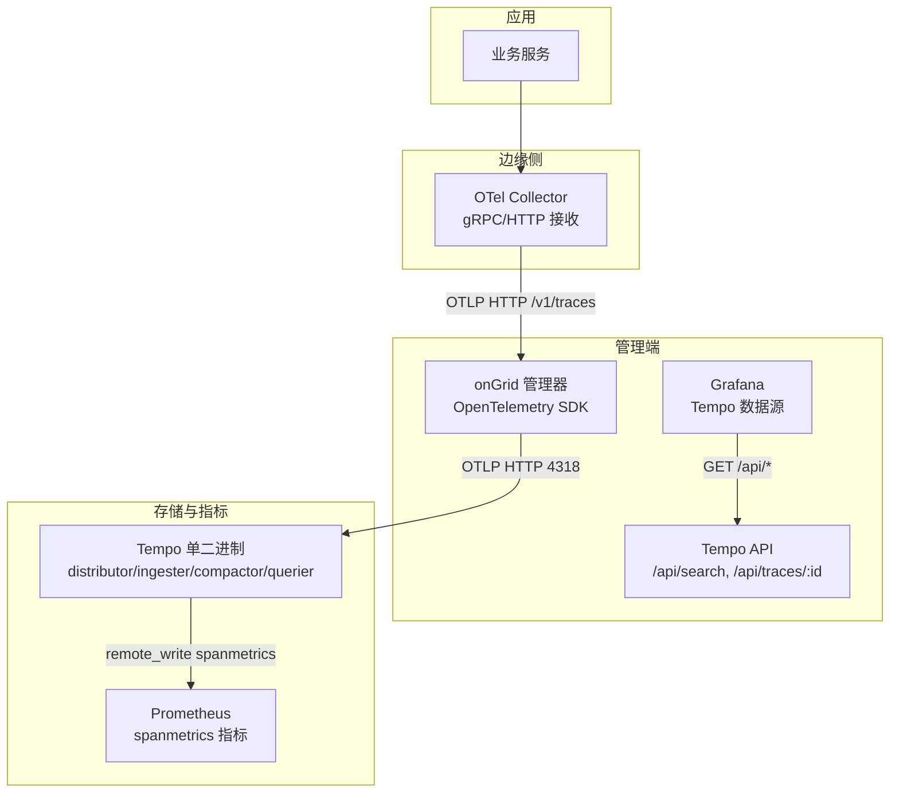
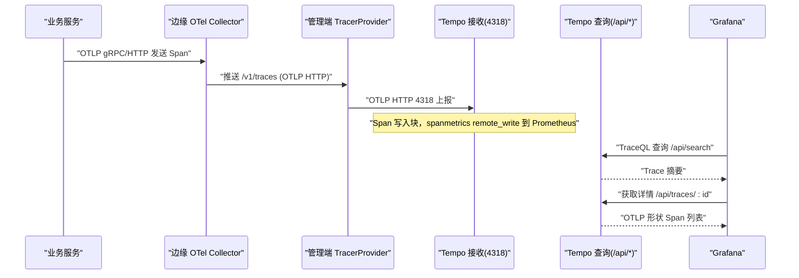
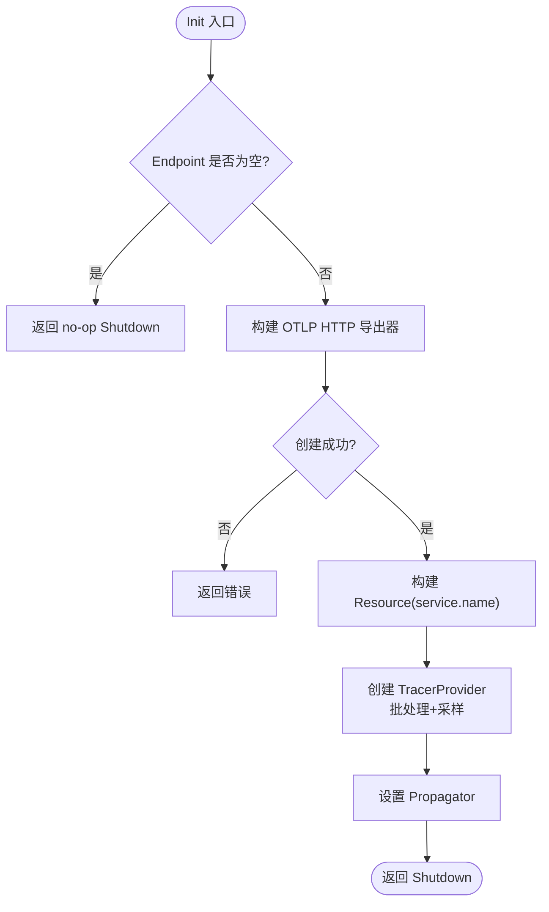
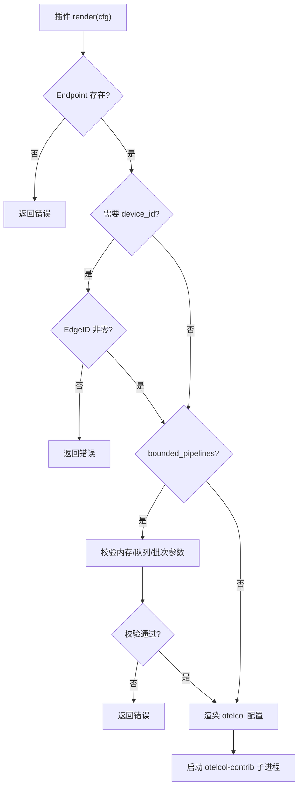
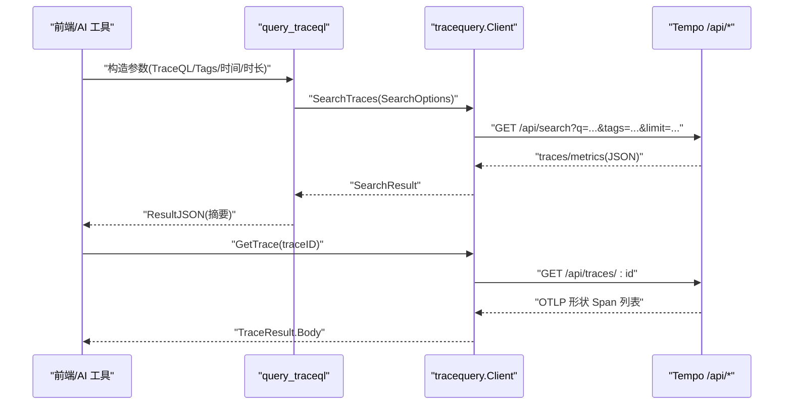
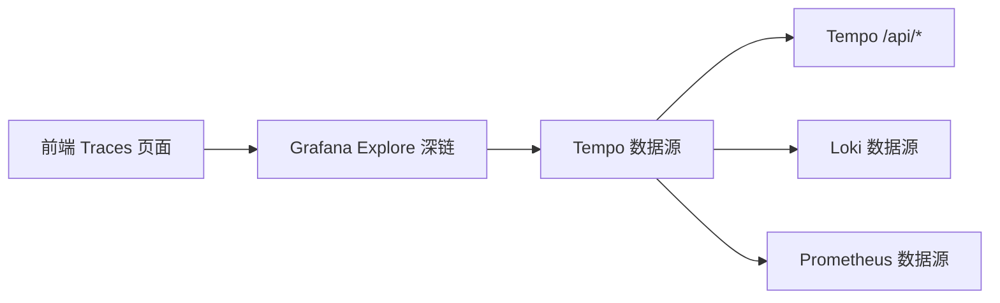
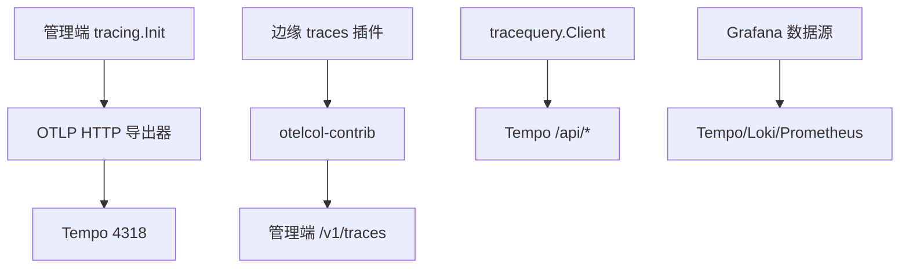

# 分布式追踪集成

<cite>
**本文引用的文件**
- [tracing.go](file://internal/pkg/tracing/tracing.go)
- [tempo-config.yaml](file://deploy/install/tempo-config.yaml)
- [tempo.yml（Grafana 数据源）](file://deploy/grafana/provisioning/datasources/tempo.yml)
- [query_traceql.go](file://internal/manager/biz/aiops/tools/query_traceql.go)
- [client.go（tracequery 客户端）](file://internal/pkg/tracequery/client.go)
- [render.go（边缘 traces 插件渲染）](file://internal/edgeagent/plugins/traces/render.go)
- [plugin.go（边缘 traces 插件入口）](file://internal/edgeagent/plugins/traces/plugin.go)
- [Traces.tsx（前端链路页面）](file://web/src/pages/Traces.tsx)
- [drilldown.ts（Grafana Explore 深链构建）](file://web/src/lib/drilldown.ts)
- [tempo.md（Tempo 架构说明）](file://internal/manager/biz/knowledge/builtin_vault/systems/observability-stack/tempo.md)
</cite>

## 目录
1. [简介](#简介)
2. [项目结构](#项目结构)
3. [核心组件](#核心组件)
4. [架构总览](#架构总览)
5. [详细组件分析](#详细组件分析)
6. [依赖关系分析](#依赖关系分析)
7. [性能与容量规划](#性能与容量规划)
8. [故障排查指南](#故障排查指南)
9. [结论](#结论)
10. [附录：配置示例与最佳实践](#附录配置示例与最佳实践)

## 简介
本文件面向 Ongrid 平台的分布式追踪集成，重点说明与 Tempo 的链路追踪集成方案，包括 OpenTelemetry 协议支持、追踪数据的采集与上报机制、服务间调用追踪、性能瓶颈识别与依赖关系分析、可视化与查询分析方法，以及采样策略优化、存储容量规划与分布式系统故障排查实践。

## 项目结构
Ongrid 在管理端与边缘端分别实现了追踪能力：
- 管理端通过 OpenTelemetry SDK 初始化 TracerProvider，将 Span 以 OTLP HTTP 方式上报到 Tempo；同时提供 TraceQL 查询工具与 Grafana 数据源集成。
- 边缘端通过 traces 插件拉起 OpenTelemetry Collector 子进程，接收本地应用的 OTLP gRPC/HTTP，再转发至管理端的 /v1/traces 或外部 Tempo。
- Grafana 预置 Tempo 数据源，启用 traces-to-logs、traces-to-metrics 与服务图，便于从链路下钻到日志与指标。

图表来源
- [tempo-config.yaml:6-17](file://deploy/install/tempo-config.yaml#L6-L17)
- [tempo.yml（Grafana 数据源）:1-50](file://deploy/grafana/provisioning/datasources/tempo.yml#L1-L50)
- [client.go:39-77](file://internal/pkg/tracequery/client.go#L39-L77)
- [render.go:16-34](file://internal/edgeagent/plugins/traces/render.go#L16-L34)

章节来源
- [tempo-config.yaml:6-77](file://deploy/install/tempo-config.yaml#L6-L77)
- [tempo.yml（Grafana 数据源）:1-50](file://deploy/grafana/provisioning/datasources/tempo.yml#L1-L50)
- [client.go:39-77](file://internal/pkg/tracequery/client.go#L39-L77)
- [render.go:16-34](file://internal/edgeagent/plugins/traces/render.go#L16-L34)

## 核心组件
- 管理端追踪初始化：使用 OpenTelemetry SDK 创建 TracerProvider，设置资源属性（service.name）、批处理导出器、采样策略与传播器，统一向 Tempo 上报 Span。
- 边缘 traces 插件：生成并运行 OTel Collector 配置，接收本地 OTLP gRPC/HTTP，注入设备标识，批量后推送到管理端 /v1/traces。
- TraceQL 查询工具：封装对 Tempo /api/search 和 /api/traces/:id 的访问，支持按 TraceQL、标签、时间范围、时长过滤等搜索，并将结果返回给 AI 工具或前端。
- Grafana 数据源：预置 ongrid-tempo 数据源，启用 traces-to-logs、traces-to-metrics 与服务图，支持从链路跳转到日志与指标面板。

章节来源
- [tracing.go:35-106](file://internal/pkg/tracing/tracing.go#L35-L106)
- [render.go:16-34](file://internal/edgeagent/plugins/traces/render.go#L16-L34)
- [query_traceql.go:15-88](file://internal/manager/biz/aiops/tools/query_traceql.go#L15-L88)
- [tempo.yml（Grafana 数据源）:1-50](file://deploy/grafana/provisioning/datasources/tempo.yml#L1-L50)

## 架构总览
下图展示了从应用产生 Span 到最终可视化的完整链路：

图表来源
- [tempo-config.yaml:10-17](file://deploy/install/tempo-config.yaml#L10-L17)
- [client.go:111-157](file://internal/pkg/tracequery/client.go#L111-L157)
- [tempo.yml（Grafana 数据源）:18-50](file://deploy/grafana/provisioning/datasources/tempo.yml#L18-L50)

## 详细组件分析

### 管理端追踪初始化（OpenTelemetry + Tempo）
- 功能要点
  - 通过 Config 指定 ServiceName、Endpoint、Insecure、SamplingRatio。
  - 构建 OTLP HTTP 导出器，设置批处理超时（快速刷新）。
  - 设置 Resource（service.name），避免版本冲突。
  - 使用 ParentBased + TraceIDRatioBased 采样。
  - 注册全局 TracerProvider 与 TextMapPropagator（TraceContext + Baggage）。
- 关键路径
  - Init(ctx, cfg) -> 创建 exporter -> 创建 TracerProvider -> 设置 Propagator -> 返回 Shutdown。
- 错误处理
  - Endpoint 为空时返回 no-op shutdown，允许无追踪模式启动。
  - 采样比例非法时回退为 1.0。
  - 导出器创建失败返回错误。

图表来源
- [tracing.go:60-106](file://internal/pkg/tracing/tracing.go#L60-L106)

章节来源
- [tracing.go:35-106](file://internal/pkg/tracing/tracing.go#L35-L106)

### 边缘 traces 插件（OTel Collector 子进程）
- 功能要点
  - 插件名“traces”，对应 OTLP 信号命名约定。
  - 渲染 per-edge 的 otelcol 配置：receivers（gRPC/HTTP 绑定到 docker bridge/localhost）、resource detection、注入 device_id、batch、exporter（指向管理端 /v1/traces）。
  - 明确不在边缘做 tail sampling，保持边缘无状态。
  - 支持可选的 Kubernetes telemetry gateway 模式（同时启用 Loki/Prometheus 导出）。
- 配置校验
  - 必须提供 Endpoint。
  - 若未设置 omit_device_id，则要求 EdgeID 非零。
  - 有界管道模式下对 memory_limit/spike_limit、batch_send_size/max_size、queue_size 进行严格校验。

图表来源
- [render.go:16-34](file://internal/edgeagent/plugins/traces/render.go#L16-L34)
- [render.go:283-334](file://internal/edgeagent/plugins/traces/render.go#L283-L334)

章节来源
- [plugin.go:1-22](file://internal/edgeagent/plugins/traces/plugin.go#L1-L22)
- [render.go:16-34](file://internal/edgeagent/plugins/traces/render.go#L16-L34)
- [render.go:283-334](file://internal/edgeagent/plugins/traces/render.go#L283-L334)

### TraceQL 查询工具与客户端
- 功能要点
  - 封装 Tempo /api/search 与 /api/traces/:id 的 GET 请求。
  - SearchOptions 支持 TraceQL、Tags、Limit、Start/End、Min/MaxDuration。
  - TagValues 用于 UI 下拉填充 service.name/name。
  - 限制单次响应体大小，记录非 2xx 的警告日志。
- 工具层（AI 工具）
  - query_traceql 工具强制至少一个过滤条件，防止全表扫描。
  - 支持 device_id 注入到 spanset 中，避免跨主机误匹配。
  - 默认时间窗口为最近 1 小时，limit 默认 50。

图表来源
- [query_traceql.go:185-275](file://internal/manager/biz/aiops/tools/query_traceql.go#L185-L275)
- [client.go:111-201](file://internal/pkg/tracequery/client.go#L111-L201)

章节来源
- [query_traceql.go:15-285](file://internal/manager/biz/aiops/tools/query_traceql.go#L15-L285)
- [client.go:16-253](file://internal/pkg/tracequery/client.go#L16-L253)

### Grafana 数据源与可视化
- 数据源配置
  - ongrid-tempo 数据源，启用 traces-to-logs（跳转 Loki）、traces-to-metrics（基于 spanmetrics 的 RED 面板）、服务图。
  - URL 通过环境变量注入，默认指向内置 Tempo 容器。
- 前端交互
  - Traces 页面支持 TraceQL、service/operation 筛选、trace_id 直接查找、实时轮询。
  - 一键打开 Grafana Explore 深链，携带当前查询与时间范围。

图表来源
- [tempo.yml（Grafana 数据源）:1-50](file://deploy/grafana/provisioning/datasources/tempo.yml#L1-L50)
- [Traces.tsx:303-331](file://web/src/pages/Traces.tsx#L303-L331)
- [drilldown.ts:190-222](file://web/src/lib/drilldown.ts#L190-L222)

章节来源
- [tempo.yml（Grafana 数据源）:1-50](file://deploy/grafana/provisioning/datasources/tempo.yml#L1-L50)
- [Traces.tsx:35-104](file://web/src/pages/Traces.tsx#L35-L104)
- [Traces.tsx:303-331](file://web/src/pages/Traces.tsx#L303-L331)
- [drilldown.ts:190-222](file://web/src/lib/drilldown.ts#L190-L222)

## 依赖关系分析
- 管理端 tracing 模块依赖 OpenTelemetry SDK 与 OTLP HTTP 导出器，输出到 Tempo 的 4318 端口。
- 边缘 traces 插件依赖 otelcol-contrib 子进程，接收本地 OTLP 并转发到管理端 /v1/traces。
- tracequery 客户端依赖 HTTP 客户端与 BaseURLResolver，调用 Tempo 的 /api/search 与 /api/traces/:id。
- Grafana 数据源依赖 Tempo、Loki、Prometheus，实现链路-日志-指标联动。

图表来源
- [tracing.go:68-106](file://internal/pkg/tracing/tracing.go#L68-L106)
- [render.go:16-34](file://internal/edgeagent/plugins/traces/render.go#L16-L34)
- [client.go:39-77](file://internal/pkg/tracequery/client.go#L39-L77)
- [tempo.yml（Grafana 数据源）:1-50](file://deploy/grafana/provisioning/datasources/tempo.yml#L1-L50)

章节来源
- [tracing.go:68-106](file://internal/pkg/tracing/tracing.go#L68-L106)
- [render.go:16-34](file://internal/edgeagent/plugins/traces/render.go#L16-L34)
- [client.go:39-77](file://internal/pkg/tracequery/client.go#L39-L77)
- [tempo.yml（Grafana 数据源）:1-50](file://deploy/grafana/provisioning/datasources/tempo.yml#L1-L50)

## 性能与容量规划
- 采样策略
  - 管理端默认 head sampling 比例为 1.0（全量），可按需下调（如 0.1）以降低 Span 体积。
  - 边缘侧不执行 tail sampling，保持无状态；tail sampling 作为管理端职责。
- 批处理与延迟
  - 批处理超时设置为 2 秒，确保事故期间的 Span 尽快可见。
- Tempo 配置
  - 保留期 7 天（168h），块大小约 100MB，WAL 与对象存储路径分离。
  - 每租户 ingestion rate limit 20MB/s，burst 30MB/s，单 trace 最大 50MB。
- 指标联动
  - spanmetrics 远程写入 Prometheus，支撑 RED 面板与告警。
- 容量建议
  - 根据 Span 体积与保留期估算磁盘需求：日 Span 数 × 平均 Span 大小 × 保留天数。
  - 关注 ingester 队列深度与 compactor 合并频率，避免积压。

章节来源
- [tracing.go:48-51](file://internal/pkg/tracing/tracing.go#L48-L51)
- [tracing.go:91-99](file://internal/pkg/tracing/tracing.go#L91-L99)
- [tempo-config.yaml:23-77](file://deploy/install/tempo-config.yaml#L23-L77)

## 故障排查指南
- 无法上报 Span
  - 检查管理端 tracing.Init 是否成功，Endpoint 是否正确，Insecure 是否与部署环境一致。
  - 确认边缘 traces 插件已正确渲染并启动 otelcol-contrib，Endpoint 指向管理端 /v1/traces。
- 查询不到 Trace
  - 确认时间窗口与 TraceQL 过滤条件是否过紧；优先使用 service/operation 缩小范围。
  - 使用 trace_id 直接查找，避免全表扫描。
- 慢查询与资源占用
  - 限制 Limit，缩短时间窗口；避免无过滤的全量搜索。
  - 关注 Tempo 冷块扫描导致的延迟，合理设置 min/max duration 过滤。
- 指标缺失
  - 确认 spanmetrics 已启用且 remote_write 到 Prometheus。
  - 检查 Grafana 数据源 traces-to-metrics 配置是否正确。

章节来源
- [tracing.go:60-106](file://internal/pkg/tracing/tracing.go#L60-L106)
- [render.go:283-334](file://internal/edgeagent/plugins/traces/render.go#L283-L334)
- [query_traceql.go:185-275](file://internal/manager/biz/aiops/tools/query_traceql.go#L185-L275)
- [client.go:111-201](file://internal/pkg/tracequery/client.go#L111-L201)
- [tempo-config.yaml:30-77](file://deploy/install/tempo-config.yaml#L30-L77)

## 结论
Ongrid 平台通过管理端 OpenTelemetry SDK 与边缘 traces 插件，构建了端到端的分布式追踪体系。结合 Tempo 的存储与查询能力、Grafana 的数据源联动，实现了链路查看、延迟分析与错误定位。通过合理的采样策略与容量规划，可在保证可观测性的同时控制成本与性能开销。

## 附录：配置示例与最佳实践
- 管理端初始化
  - 设置 ServiceName、Endpoint（如 tempo:4318）、Insecure（Docker 内网为 http）、SamplingRatio（按需调整）。
  - 使用 otelhttp.NewMiddleware 包裹 HTTP 路由以自动埋点。
- 边缘 traces 插件
  - 配置 Endpoint 为管理端 /v1/traces；如需鉴权，设置 AuthUser/AuthPass。
  - 开启 bounded_pipelines 时，合理设置 memory_limit_mib、memory_spike_limit_mib、batch_send_size、batch_max_size、queue_size。
- Grafana 数据源
  - 配置 ongrid-tempo 数据源 URL；启用 traces-to-logs（Loki）、traces-to-metrics（Prometheus）、服务图。
- 查询与分析
  - 使用 TraceQL 精确过滤；优先使用 service/operation 缩小范围。
  - 借助 Grafana Explore 深链进行火焰图与服务图分析。
- 容量与采样
  - 根据业务规模调整 head sampling 比例；监控 Tempo 的 ingester 队列与 compactor 合并情况。
  - 定期评估保留期与磁盘使用，必要时调整 block_retention 与 max_block_bytes。

章节来源
- [tracing.go:35-106](file://internal/pkg/tracing/tracing.go#L35-L106)
- [render.go:16-34](file://internal/edgeagent/plugins/traces/render.go#L16-L34)
- [tempo.yml（Grafana 数据源）:1-50](file://deploy/grafana/provisioning/datasources/tempo.yml#L1-L50)
- [tempo-config.yaml:23-77](file://deploy/install/tempo-config.yaml#L23-L77)