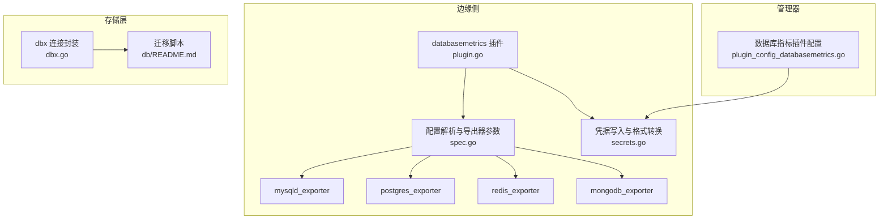
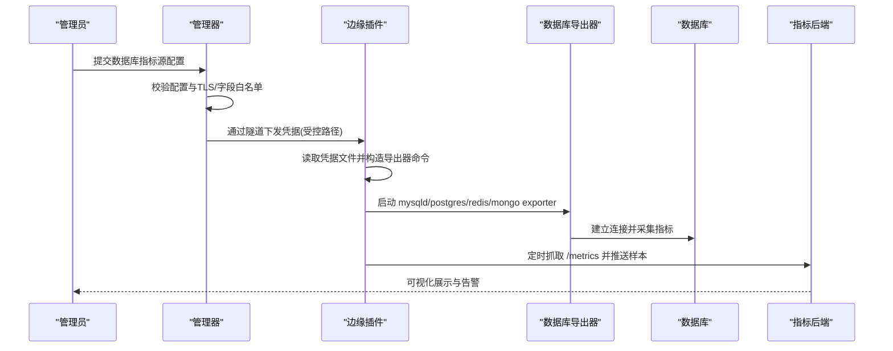
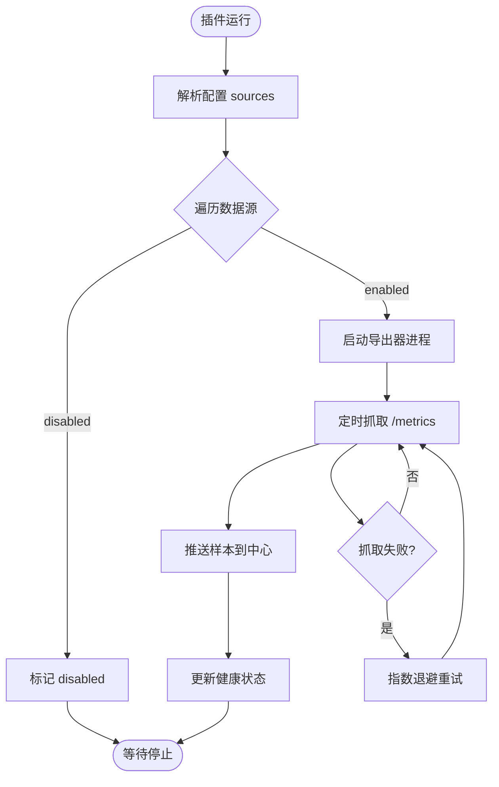
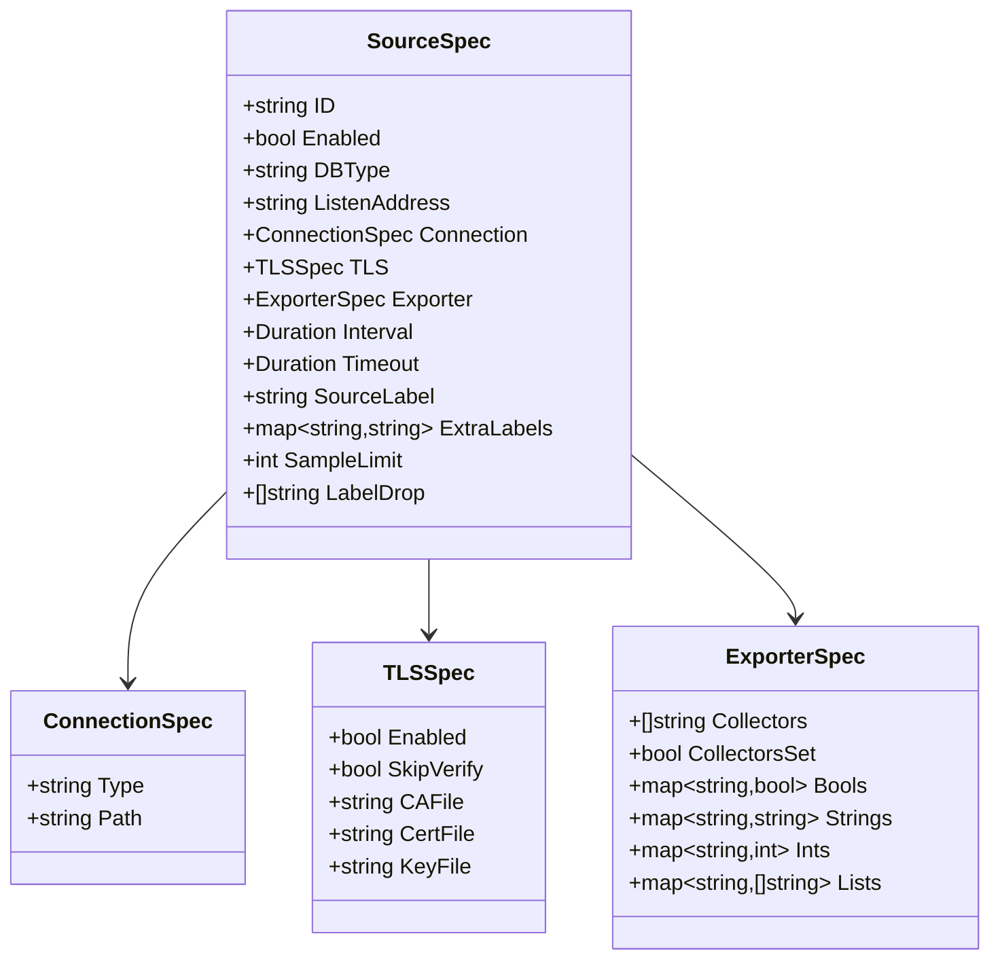
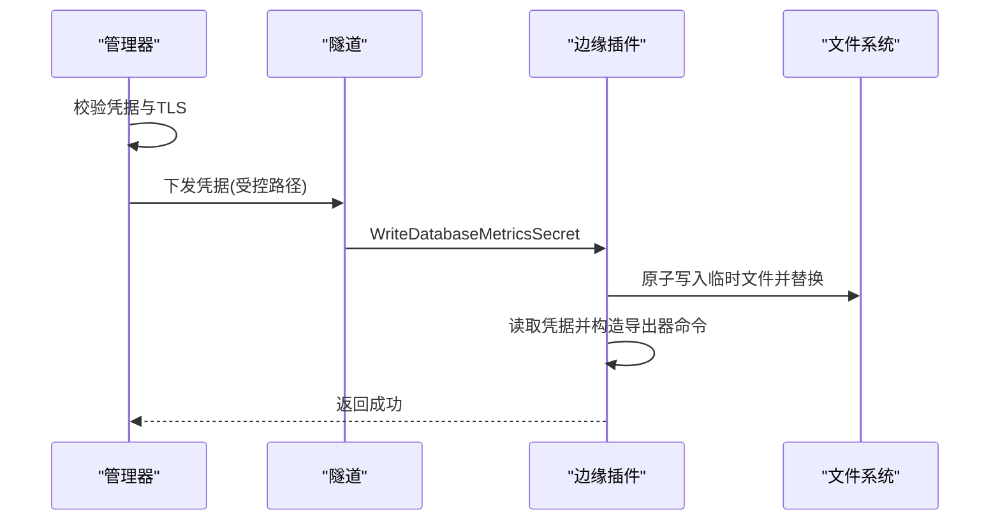
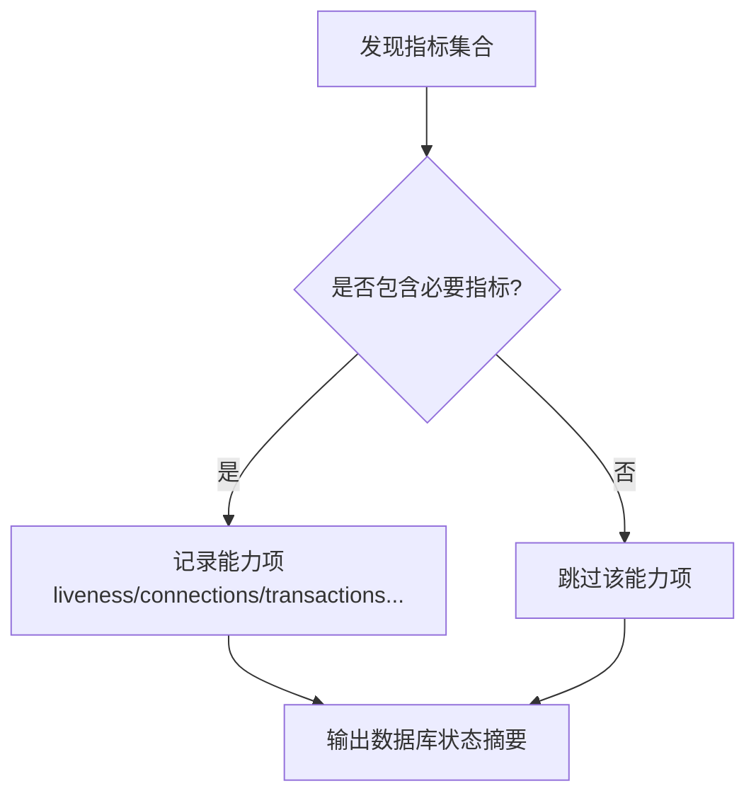
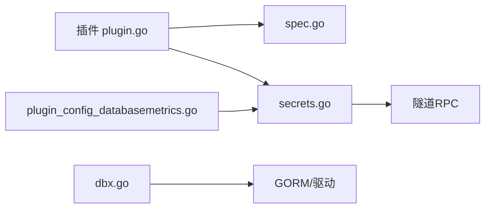

# 数据库集成

<cite>
**本文引用的文件**
- [internal/edgeagent/plugins/databasemetrics/plugin.go](file://internal/edgeagent/plugins/databasemetrics/plugin.go)
- [internal/edgeagent/plugins/databasemetrics/spec.go](file://internal/edgeagent/plugins/databasemetrics/spec.go)
- [internal/edgeagent/plugins/databasemetrics/secrets.go](file://internal/edgeagent/plugins/databasemetrics/secrets.go)
- [internal/manager/biz/edge/plugin_config_databasemetrics.go](file://internal/manager/biz/edge/plugin_config_databasemetrics.go)
- [internal/pkg/dbx/dbx.go](file://internal/pkg/dbx/dbx.go)
- [db/README.md](file://db/README.md)
- [internal/manager/biz/aiops/tools/analyze_database_status.go](file://internal/manager/biz/aiops/tools/analyze_database_status.go)
</cite>

## 目录
1. [简介](#简介)
2. [项目结构](#项目结构)
3. [核心组件](#核心组件)
4. [架构总览](#架构总览)
5. [详细组件分析](#详细组件分析)
6. [依赖关系分析](#依赖关系分析)
7. [性能与调优](#性能与调优)
8. [故障诊断指南](#故障诊断指南)
9. [结论](#结论)
10. [附录：配置示例与最佳实践](#附录：配置示例与最佳实践)

## 简介
本章节面向 Ongrid 平台的数据库集成能力，覆盖 MySQL、PostgreSQL、MongoDB、Redis 等主流数据库的监控与数据采集。文档说明连接配置与安全认证（含连接池、SSL/TLS、权限控制）、指标采集实现（性能、连接状态、查询统计）、配置示例、性能调优与故障诊断方法，并提供监控最佳实践与扩展开发指南。

## 项目结构
Ongrid 的数据库集成由“边缘侧插件 + 管理器配置 + 存储层”三部分构成：
- 边缘侧插件负责启动各数据库导出器进程、周期性抓取指标并推送至中心。
- 管理器负责校验配置、生成安全凭据并下发到边缘节点。
- 存储层使用 GORM 抽象，默认 MySQL，支持 SQLite 用于本地调试。

**图表来源**
- [internal/edgeagent/plugins/databasemetrics/plugin.go:1-120](file://internal/edgeagent/plugins/databasemetrics/plugin.go#L1-L120)
- [internal/edgeagent/plugins/databasemetrics/spec.go:150-203](file://internal/edgeagent/plugins/databasemetrics/spec.go#L150-L203)
- [internal/edgeagent/plugins/databasemetrics/secrets.go:153-338](file://internal/edgeagent/plugins/databasemetrics/secrets.go#L153-L338)
- [internal/manager/biz/edge/plugin_config_databasemetrics.go:235-296](file://internal/manager/biz/edge/plugin_config_databasemetrics.go#L235-L296)
- [internal/pkg/dbx/dbx.go:34-77](file://internal/pkg/dbx/dbx.go#L34-L77)
- [db/README.md:1-15](file://db/README.md#L1-L15)

**章节来源**
- [internal/edgeagent/plugins/databasemetrics/plugin.go:1-120](file://internal/edgeagent/plugins/databasemetrics/plugin.go#L1-L120)
- [internal/edgeagent/plugins/databasemetrics/spec.go:150-203](file://internal/edgeagent/plugins/databasemetrics/spec.go#L150-L203)
- [internal/edgeagent/plugins/databasemetrics/secrets.go:153-338](file://internal/edgeagent/plugins/databasemetrics/secrets.go#L153-L338)
- [internal/manager/biz/edge/plugin_config_databasemetrics.go:235-296](file://internal/manager/biz/edge/plugin_config_databasemetrics.go#L235-L296)
- [internal/pkg/dbx/dbx.go:34-77](file://internal/pkg/dbx/dbx.go#L34-L77)
- [db/README.md:1-15](file://db/README.md#L1-L15)

## 核心组件
- 边缘侧 databasemetrics 插件：管理每个数据源的导出器子进程，按周期抓取 /metrics 并推送到中心。
- 配置解析与导出器参数映射：将用户配置的 db_type、exporter 选项转换为对应导出器的命令行参数。
- 凭据管理与安全：在受控目录下以原子方式写入凭据文件，并按数据库类型生成 DSN/my.cnf/URI。
- 管理器配置校验：对 TLS、端口、字段白名单等进行严格校验，确保仅允许的安全配置生效。
- 存储层 dbx：统一打开 MySQL/SQLite 连接，提供连接可达性检查与日志脱敏。

**章节来源**
- [internal/edgeagent/plugins/databasemetrics/plugin.go:77-130](file://internal/edgeagent/plugins/databasemetrics/plugin.go#L77-L130)
- [internal/edgeagent/plugins/databasemetrics/spec.go:95-166](file://internal/edgeagent/plugins/databasemetrics/spec.go#L95-L166)
- [internal/edgeagent/plugins/databasemetrics/secrets.go:71-108](file://internal/edgeagent/plugins/databasemetrics/secrets.go#L71-L108)
- [internal/manager/biz/edge/plugin_config_databasemetrics.go:235-296](file://internal/manager/biz/edge/plugin_config_databasemetrics.go#L235-L296)
- [internal/pkg/dbx/dbx.go:34-77](file://internal/pkg/dbx/dbx.go#L34-L77)

## 架构总览
下图展示了从管理器配置到边缘侧执行、再到指标上报的完整流程。

**图表来源**
- [internal/manager/biz/edge/plugin_config_databasemetrics.go:235-296](file://internal/manager/biz/edge/plugin_config_databasemetrics.go#L235-L296)
- [internal/edgeagent/plugins/databasemetrics/secrets.go:24-51](file://internal/edgeagent/plugins/databasemetrics/secrets.go#L24-L51)
- [internal/edgeagent/plugins/databasemetrics/plugin.go:178-274](file://internal/edgeagent/plugins/databasemetrics/plugin.go#L178-L274)
- [internal/edgeagent/plugins/databasemetrics/spec.go:168-203](file://internal/edgeagent/plugins/databasemetrics/spec.go#L168-L203)

## 详细组件分析

### 边缘侧插件：生命周期与采集循环
- 插件启动后解析配置，为每个 enabled 的数据源启动一个导出器子进程。
- 定期抓取目标 /metrics，附加 up 样本并通过隧道推送至中心。
- 失败时指数退避重试，记录健康状态与错误信息。

**图表来源**
- [internal/edgeagent/plugins/databasemetrics/plugin.go:145-218](file://internal/edgeagent/plugins/databasemetrics/plugin.go#L145-L218)
- [internal/edgeagent/plugins/databasemetrics/plugin.go:276-324](file://internal/edgeagent/plugins/databasemetrics/plugin.go#L276-L324)

**章节来源**
- [internal/edgeagent/plugins/databasemetrics/plugin.go:77-130](file://internal/edgeagent/plugins/databasemetrics/plugin.go#L77-L130)
- [internal/edgeagent/plugins/databasemetrics/plugin.go:178-274](file://internal/edgeagent/plugins/databasemetrics/plugin.go#L178-L274)

### 配置解析与导出器参数映射
- 支持的 db_type：mysql、postgresql、redis、mongodb。
- 监听地址默认值与端口冲突检测。
- exporter 字段白名单校验，按数据库类型映射为命令行参数。
- 针对 MongoDB 支持 collect_all 或显式 collectors。

**图表来源**
- [internal/edgeagent/plugins/databasemetrics/spec.go:15-52](file://internal/edgeagent/plugins/databasemetrics/spec.go#L15-L52)
- [internal/edgeagent/plugins/databasemetrics/spec.go:95-166](file://internal/edgeagent/plugins/databasemetrics/spec.go#L95-L166)
- [internal/edgeagent/plugins/databasemetrics/spec.go:425-501](file://internal/edgeagent/plugins/databasemetrics/spec.go#L425-L501)

**章节来源**
- [internal/edgeagent/plugins/databasemetrics/spec.go:95-166](file://internal/edgeagent/plugins/databasemetrics/spec.go#L95-L166)
- [internal/edgeagent/plugins/databasemetrics/spec.go:168-203](file://internal/edgeagent/plugins/databasemetrics/spec.go#L168-L203)
- [internal/edgeagent/plugins/databasemetrics/spec.go:425-501](file://internal/edgeagent/plugins/databasemetrics/spec.go#L425-L501)

### 凭据管理与安全认证
- 管理器侧：
  - 校验并清洗凭据字段，删除明文密码，规范化 TLS 配置。
  - 根据 db_type 生成对应的 my.cnf、DSN 或 URI。
  - 限制 TLS 证书路径必须为绝对路径且不含换行符。
- 边缘侧：
  - 通过隧道一次性写入受控目录下的凭据文件，拒绝符号链接，强制 0600 权限。
  - 读取凭据文件并注入环境变量或配置文件供导出器使用。
  - 支持保留密码策略，避免重复输入。

**图表来源**
- [internal/manager/biz/edge/plugin_config_databasemetrics.go:235-296](file://internal/manager/biz/edge/plugin_config_databasemetrics.go#L235-L296)
- [internal/manager/biz/edge/plugin_config_databasemetrics.go:721-893](file://internal/manager/biz/edge/plugin_config_databasemetrics.go#L721-L893)
- [internal/edgeagent/plugins/databasemetrics/secrets.go:24-51](file://internal/edgeagent/plugins/databasemetrics/secrets.go#L24-L51)
- [internal/edgeagent/plugins/databasemetrics/secrets.go:392-637](file://internal/edgeagent/plugins/databasemetrics/secrets.go#L392-L637)

**章节来源**
- [internal/manager/biz/edge/plugin_config_databasemetrics.go:235-296](file://internal/manager/biz/edge/plugin_config_databasemetrics.go#L235-L296)
- [internal/manager/biz/edge/plugin_config_databasemetrics.go:721-893](file://internal/manager/biz/edge/plugin_config_databasemetrics.go#L721-L893)
- [internal/edgeagent/plugins/databasemetrics/secrets.go:71-108](file://internal/edgeagent/plugins/databasemetrics/secrets.go#L71-L108)
- [internal/edgeagent/plugins/databasemetrics/secrets.go:392-637](file://internal/edgeagent/plugins/databasemetrics/secrets.go#L392-L637)

### 指标采集与能力探测
- 采集范围：
  - MySQL：全局状态、InnoDB、性能模式、复制组、用户统计等。
  - PostgreSQL：数据库大小、连接数、事务、缓存命中、IO 时序、锁、WAL 等。
  - Redis：键数量、逻辑库计数、系统指标、集群信息等。
  - MongoDB：数据库/集合数量、对象计数、诊断数据、副本集状态等。
- 能力探测：
  - 基于已发现的指标名称判断可用能力（如 liveness、connections、transactions 等）。
  - 为上层分析工具提供结构化能力描述。

**图表来源**
- [internal/manager/biz/aiops/tools/analyze_database_status.go:970-1345](file://internal/manager/biz/aiops/tools/analyze_database_status.go#L970-L1345)

**章节来源**
- [internal/manager/biz/aiops/tools/analyze_database_status.go:970-1345](file://internal/manager/biz/aiops/tools/analyze_database_status.go#L970-L1345)

### 存储层连接与迁移
- 默认后端 MySQL，通过 GORM 打开并 Ping 验证连通性。
- 支持 SQLite（WAL、busy_timeout、foreign_keys）用于本地调试。
- 生产环境使用 golang-migrate 进行版本化迁移。

**章节来源**
- [internal/pkg/dbx/dbx.go:34-77](file://internal/pkg/dbx/dbx.go#L34-L77)
- [internal/pkg/dbx/dbx.go:79-128](file://internal/pkg/dbx/dbx.go#L79-L128)
- [db/README.md:1-15](file://db/README.md#L1-L15)

## 依赖关系分析
- 插件依赖 spec 解析与 secrets 写入；spec 依赖导出器参数映射；secrets 依赖隧道 RPC。
- 管理器依赖插件配置校验与凭据构建；最终通过隧道下发到边缘。
- 存储层独立于插件，但为平台自身数据持久化提供基础。

**图表来源**
- [internal/edgeagent/plugins/databasemetrics/plugin.go:1-120](file://internal/edgeagent/plugins/databasemetrics/plugin.go#L1-L120)
- [internal/edgeagent/plugins/databasemetrics/spec.go:150-203](file://internal/edgeagent/plugins/databasemetrics/spec.go#L150-L203)
- [internal/edgeagent/plugins/databasemetrics/secrets.go:24-51](file://internal/edgeagent/plugins/databasemetrics/secrets.go#L24-L51)
- [internal/manager/biz/edge/plugin_config_databasemetrics.go:235-296](file://internal/manager/biz/edge/plugin_config_databasemetrics.go#L235-L296)
- [internal/pkg/dbx/dbx.go:34-77](file://internal/pkg/dbx/dbx.go#L34-L77)

**章节来源**
- [internal/edgeagent/plugins/databasemetrics/plugin.go:1-120](file://internal/edgeagent/plugins/databasemetrics/plugin.go#L1-L120)
- [internal/edgeagent/plugins/databasemetrics/spec.go:150-203](file://internal/edgeagent/plugins/databasemetrics/spec.go#L150-L203)
- [internal/edgeagent/plugins/databasemetrics/secrets.go:24-51](file://internal/edgeagent/plugins/databasemetrics/secrets.go#L24-L51)
- [internal/manager/biz/edge/plugin_config_databasemetrics.go:235-296](file://internal/manager/biz/edge/plugin_config_databasemetrics.go#L235-L296)
- [internal/pkg/dbx/dbx.go:34-77](file://internal/pkg/dbx/dbx.go#L34-L77)

## 性能与调优
- 采集间隔与超时：
  - scrape_interval 与 scrape_timeout 需合理设置，避免过度采样导致网络与 CPU 压力。
  - 建议 timeout ≤ interval，防止并发堆积。
- 指标量级控制：
  - sample_limit 限制单次抓取样本数，避免内存峰值。
  - label_drop 可丢弃高基数标签（如 query、statement、collection），降低存储压力。
- 导出器参数优化：
  - MySQL：按需启用 collectors（如 perf_schema.eventsstatements），调整 limit/timelimit。
  - PostgreSQL：控制 stat_statements 的 limit 与 query_length，减少大查询文本。
  - Redis：合理设置 check_keys/check_streams 等批量大小，避免扫描开销。
  - MongoDB：选择必要的 collectors（diagnosticdata、replicasetstatus、fcv），避免全量收集。
- 连接与网络：
  - 导出器与数据库之间尽量同机房部署，降低延迟。
  - 使用 TLS 加密传输，必要时 skip_verify 仅在测试环境使用。
- 存储层：
  - MySQL 开启 Ping 验证，快速暴露配置错误。
  - SQLite 使用 WAL 提升并发读性能。

[本节为通用指导，不直接分析具体文件]

## 故障诊断指南
- 常见错误与定位：
  - 凭据文件权限过宽：插件会拒绝读取，需调整为 0600 或更严格。
  - 监听端口冲突：配置阶段会检测并报错，需更换端口。
  - TLS 证书路径非法：必须为绝对路径且不含换行符。
  - 导出器二进制缺失：插件会报告缺失并终止该数据源。
  - 抓取失败：查看导出器日志与插件健康状态，确认数据库可达性与凭据正确性。
- 健康状态：
  - 插件与数据源均维护 health 快照，包含 last_error、last_success_at、samples 等。
- 回滚与备份：
  - 凭据写入采用原子替换与备份机制，失败时可自动回滚。

**章节来源**
- [internal/edgeagent/plugins/databasemetrics/plugin.go:326-349](file://internal/edgeagent/plugins/databasemetrics/plugin.go#L326-L349)
- [internal/edgeagent/plugins/databasemetrics/spec.go:781-800](file://internal/edgeagent/plugins/databasemetrics/spec.go#L781-L800)
- [internal/manager/biz/edge/plugin_config_databasemetrics.go:876-893](file://internal/manager/biz/edge/plugin_config_databasemetrics.go#L876-L893)
- [internal/edgeagent/plugins/databasemetrics/secrets.go:558-637](file://internal/edgeagent/plugins/databasemetrics/secrets.go#L558-L637)

## 结论
Ongrid 的数据库集成通过边缘侧插件统一管理多类数据库的指标采集，结合管理器侧严格的配置校验与安全凭据下发，实现了安全、可扩展、易运维的监控方案。通过合理的采集策略与导出器参数调优，可在保证指标质量的同时控制资源消耗。存储层提供稳定的数据持久化能力，便于后续分析与可视化。

[本节为总结，不直接分析具体文件]

## 附录：配置示例与最佳实践

### 支持的数据库类型
- MySQL、PostgreSQL、Redis、MongoDB。

**章节来源**
- [internal/edgeagent/plugins/databasemetrics/spec.go:390-397](file://internal/edgeagent/plugins/databasemetrics/spec.go#L390-L397)
- [internal/manager/biz/edge/plugin_config_databasemetrics.go:336-342](file://internal/manager/biz/edge/plugin_config_databasemetrics.go#L336-L342)

### 连接配置要点
- 连接类型：managed（由管理器下发凭据）。
- 凭据字段：host、port、username、database、sslmode、auth_source、tls_* 等。
- 默认端口：MySQL 3306、PostgreSQL 5432、Redis 6379、MongoDB 27017。
- Redis database 字段为索引号（整数）。

**章节来源**
- [internal/edgeagent/plugins/databasemetrics/spec.go:111-122](file://internal/edgeagent/plugins/databasemetrics/spec.go#L111-L122)
- [internal/edgeagent/plugins/databasemetrics/secrets.go:183-227](file://internal/edgeagent/plugins/databasemetrics/secrets.go#L183-L227)

### SSL/TLS 加密
- 支持 ca_file、cert_file、key_file 与 skip_verify。
- PostgreSQL 在 skip_verify 时自动设置 sslmode=require。
- MongoDB 不支持独立的 key_file，需使用合并的 PEM。

**章节来源**
- [internal/manager/biz/edge/plugin_config_databasemetrics.go:847-873](file://internal/manager/biz/edge/plugin_config_databasemetrics.go#L847-L873)
- [internal/edgeagent/plugins/databasemetrics/secrets.go:180-182](file://internal/edgeagent/plugins/databasemetrics/secrets.go#L180-L182)

### 权限控制
- 凭据文件路径限制在受控目录，禁止符号链接。
- 文件权限强制 0600，读取时校验权限。
- 管理器侧清洗并删除明文密码，仅传递必要字段。

**章节来源**
- [internal/edgeagent/plugins/databasemetrics/secrets.go:478-494](file://internal/edgeagent/plugins/databasemetrics/secrets.go#L478-L494)
- [internal/edgeagent/plugins/databasemetrics/plugin.go:326-349](file://internal/edgeagent/plugins/databasemetrics/plugin.go#L326-L349)
- [internal/manager/biz/edge/plugin_config_databasemetrics.go:235-268](file://internal/manager/biz/edge/plugin_config_databasemetrics.go#L235-L268)

### 性能调优建议
- 合理设置 scrape_interval 与 scrape_timeout。
- 使用 label_drop 丢弃高基数标签。
- 按需启用 collectors 并限制统计粒度。
- 导出器与数据库同机房部署，启用 TLS。

[本节为通用指导，不直接分析具体文件]

### 故障诊断步骤
- 检查插件与数据源健康状态与 last_error。
- 查看导出器日志文件（workDir 下按 source.id 命名）。
- 验证凭据文件存在、权限正确、内容非空。
- 确认监听端口无冲突，导出器二进制存在。

**章节来源**
- [internal/edgeagent/plugins/databasemetrics/plugin.go:178-218](file://internal/edgeagent/plugins/databasemetrics/plugin.go#L178-L218)
- [internal/edgeagent/plugins/databasemetrics/plugin.go:242-252](file://internal/edgeagent/plugins/databasemetrics/plugin.go#L242-L252)
- [internal/edgeagent/plugins/databasemetrics/secrets.go:392-414](file://internal/edgeagent/plugins/databasemetrics/secrets.go#L392-L414)

### 扩展开发指南
- 新增数据库类型：
  - 在 spec 中增加 isSupportedDBType 与 defaultListenAddress。
  - 实现 command 分支与 exporterArgs 映射。
  - 在 secrets 中实现凭据构建与 URI/DSN 生成。
  - 在管理器侧添加字段白名单与 TLS 校验。
- 新增采集能力：
  - 在 analyze_database_status 中添加能力探测与指标映射。
- 安全加固：
  - 遵循凭据写入规范，避免敏感信息泄露。

**章节来源**
- [internal/edgeagent/plugins/databasemetrics/spec.go:390-412](file://internal/edgeagent/plugins/databasemetrics/spec.go#L390-L412)
- [internal/edgeagent/plugins/databasemetrics/spec.go:168-203](file://internal/edgeagent/plugins/databasemetrics/spec.go#L168-L203)
- [internal/edgeagent/plugins/databasemetrics/secrets.go:153-338](file://internal/edgeagent/plugins/databasemetrics/secrets.go#L153-L338)
- [internal/manager/biz/edge/plugin_config_databasemetrics.go:426-447](file://internal/manager/biz/edge/plugin_config_databasemetrics.go#L426-L447)
- [internal/manager/biz/aiops/tools/analyze_database_status.go:970-1345](file://internal/manager/biz/aiops/tools/analyze_database_status.go#L970-L1345)