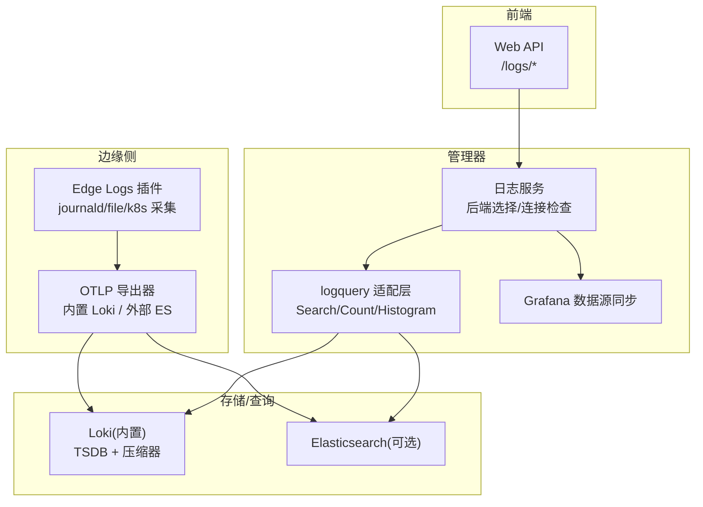
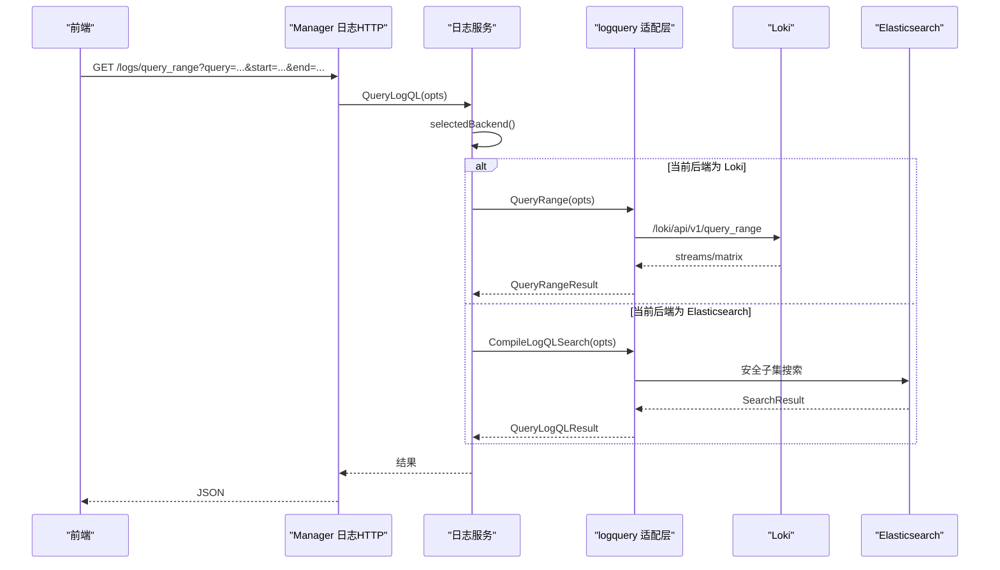
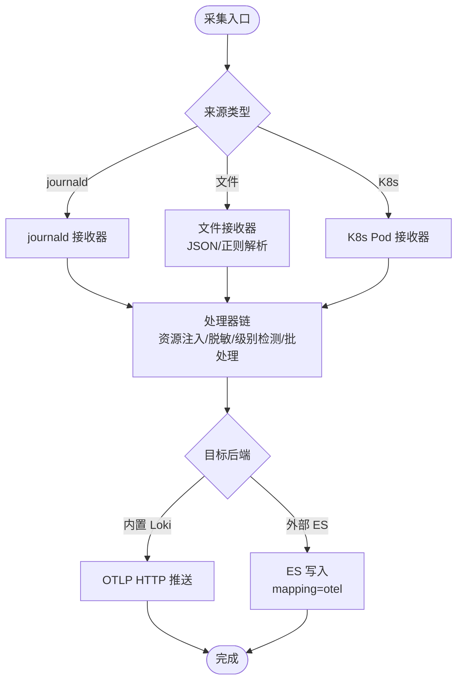
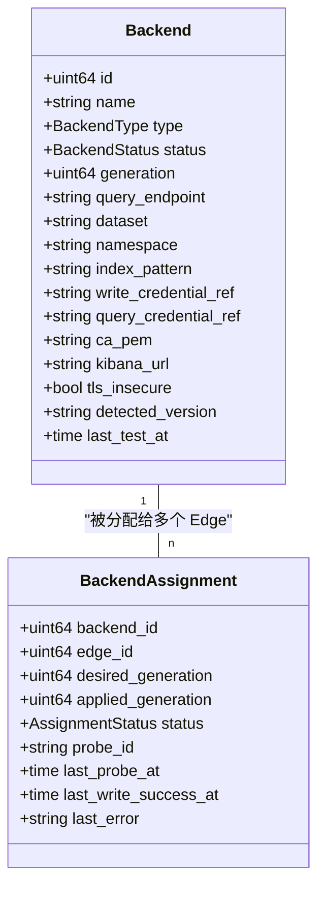
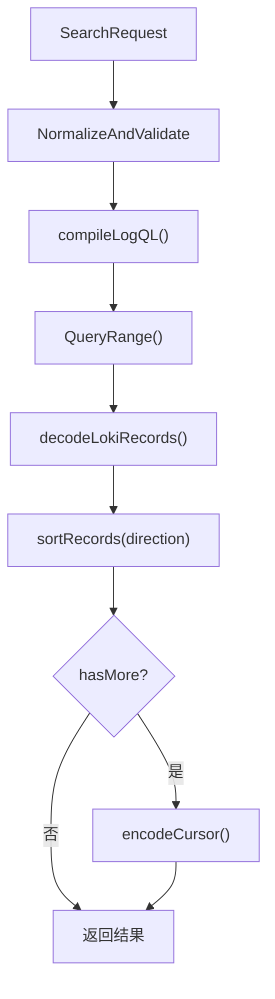
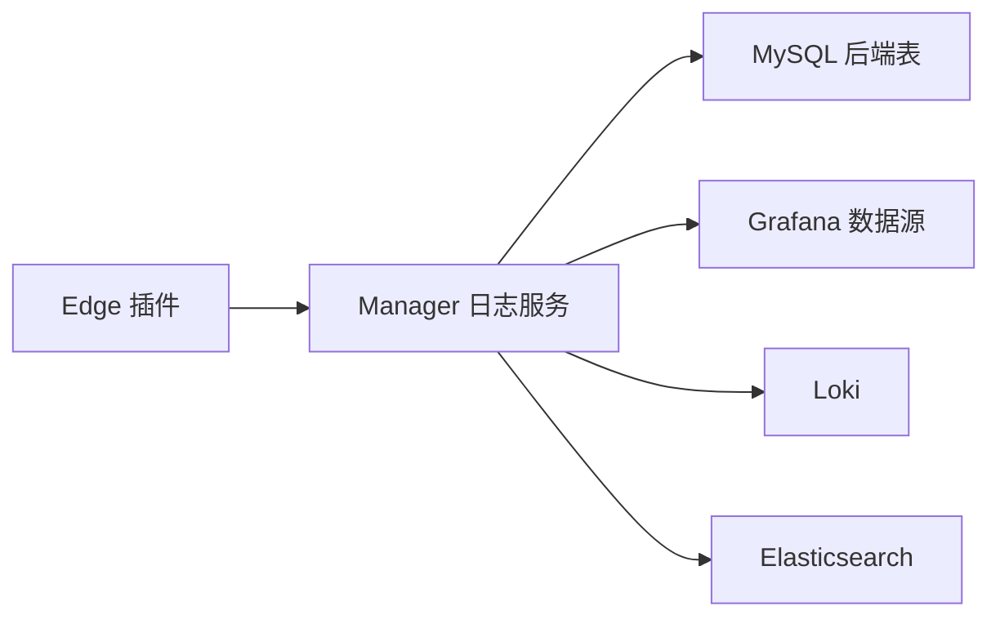

# 日志系统集成

<cite>
**本文引用的文件**
- [loki-config.yaml](file://deploy/install/loki-config.yaml)
- [loki.yml](file://deploy/grafana/provisioning/datasources/loki.yml)
- [service.go](file://internal/manager/biz/logs/service.go)
- [query_logql.go](file://internal/manager/biz/logs/query_logql.go)
- [search.go](file://internal/pkg/logquery/search.go)
- [loki_search.go](file://internal/pkg/logquery/loki_search.go)
- [render.go](file://internal/edgeagent/plugins/logs/render.go)
- [config_tunnel_logs_secret.go](file://internal/edgeagent/plugins/config_tunnel_logs_secret.go)
- [model.go](file://internal/manager/model/logs/model.go)
- [migrate.go](file://internal/manager/data/logs/store/migrate.go)
- [20260818160000_create_log_backends.up.sql](file://db/migrations/20260818160000_create_log_backends.up.sql)
- [http.go](file://internal/manager/server/logs/http.go)
- [logs.ts](file://web/src/api/logs.ts)
</cite>

## 目录
1. [简介](#简介)
2. [项目结构](#项目结构)
3. [核心组件](#核心组件)
4. [架构总览](#架构总览)
5. [详细组件分析](#详细组件分析)
6. [依赖关系分析](#依赖关系分析)
7. [性能与存储策略](#性能与存储策略)
8. [部署与配置](#部署与配置)
9. [查询优化与 LogQL 使用](#查询优化与-logql-使用)
10. [故障诊断与排错](#故障诊断与排错)
11. [结论](#结论)

## 简介
本文件面向 Ongrid 平台的日志系统集成，重点说明与 Loki 的日志聚合、查询能力（含 LogQL）、索引与存储策略、采集器配置与管理、实时查询与分析能力，以及部署配置、查询优化技巧与常见问题解决方案。文档同时覆盖后端服务对多后端（Loki/Elasticsearch）的统一抽象、边缘侧采集器的多源收集、格式解析与标签管理，并提供最佳实践建议。

## 项目结构
Ongrid 的日志系统由以下层次组成：
- 边缘采集层：Edge Agent 内置 logs 插件，负责本地 journald/文件/Kubernetes Pod 日志采集、结构化处理、标签注入与批量导出。
- 数据面写入：通过 OTLP HTTP 将日志推送到 Manager 内置 Loki 或外部 Elasticsearch。
- 控制面路由：Manager 日志服务维护后端选择、连接检查、Grafana 数据源同步等。
- 查询适配层：统一的 logquery 接口屏蔽 Loki/Elasticsearch 差异，提供 Search/Count/Histogram/Label 等能力。
- 前端 API：Web 端通过 REST 调用 Manager 暴露的日志查询、字段枚举、直连 Loki 范围查询等接口。

图表来源
- [render.go:52-251](file://internal/edgeagent/plugins/logs/render.go#L52-L251)
- [service.go:230-265](file://internal/manager/biz/logs/service.go#L230-L265)
- [loki_search.go:30-118](file://internal/pkg/logquery/loki_search.go#L30-L118)
- [http.go:595-615](file://internal/manager/server/logs/http.go#L595-L615)

章节来源
- [render.go:52-251](file://internal/edgeagent/plugins/logs/render.go#L52-L251)
- [service.go:230-265](file://internal/manager/biz/logs/service.go#L230-L265)
- [loki_search.go:30-118](file://internal/pkg/logquery/loki_search.go#L30-L118)
- [http.go:595-615](file://internal/manager/server/logs/http.go#L595-L615)

## 核心组件
- 边缘日志采集器（Edge Agent logs 插件）：支持 journald、文件、Kubernetes Pod 日志；支持 JSON/正则解析；自动注入 device_id、cluster_id、namespace、workload、pod、container、node、service_name、source_id、level、filename、unit 等标签；具备内存限制、批处理、重试、敏感信息脱敏。
- Manager 日志服务：维护后端选择（内置 Loki 或外部 Elasticsearch），执行连接检查、版本探测、Grafana 数据源同步，并对外暴露统一查询路由。
- logquery 适配层：定义后端无关的 Search/Count/Histogram/FieldValues 接口；Loki 实现将产品维度映射为 Label/Structured Metadata 并生成 LogQL；Elasticsearch 实现基于 OTel 文档路径。
- 前端 API：提供搜索、直查 Loki 范围、字段与标签枚举、后端管理等接口。

章节来源
- [render.go:52-251](file://internal/edgeagent/plugins/logs/render.go#L52-L251)
- [service.go:230-265](file://internal/manager/biz/logs/service.go#L230-L265)
- [search.go:138-152](file://internal/pkg/logquery/search.go#L138-L152)
- [logs.ts:82-110](file://web/src/api/logs.ts#L82-L110)

## 架构总览
下图展示了从 Edge 采集到 Manager 查询的完整链路，包括后端选择、查询路由和结果返回。

图表来源
- [query_logql.go:16-49](file://internal/manager/biz/logs/query_logql.go#L16-L49)
- [http.go:595-615](file://internal/manager/server/logs/http.go#L595-L615)
- [loki_search.go:30-118](file://internal/pkg/logquery/loki_search.go#L30-L118)

## 详细组件分析

### 边缘日志采集器（Edge Agent logs 插件）
- 多源采集：
  - journald：默认启用，可配置 units、directory。
  - 文件：支持 include/exclude 模式、JSON/正则解析、多行合并、过期清理。
  - Kubernetes：Pod 日志路径、容器元数据提取、排除系统组件日志。
- 标签与结构化：
  - 资源属性：device_id、cluster_id、cluster_name、k8s.node.name。
  - 业务维度：namespace、pod、container、workload、service_name、source_id、filename、unit。
  - 级别检测：自动识别 JSON/文本中的 level/severity，标准化为 severity_text/number。
- 可靠性：
  - 内存限制、批处理、发送队列、失败重试、健康检查端口。
  - 敏感信息脱敏：body 中常见密钥匹配替换，属性键名过滤。
- 后端输出：
  - 内置 Loki：OTLP HTTP 推送，支持 edge/basic/none 认证模式。
  - 外部 Elasticsearch：要求 HTTPS、API Key 文件、允许 mapping 模式为 otel。

图表来源
- [render.go:52-251](file://internal/edgeagent/plugins/logs/render.go#L52-L251)
- [render.go:298-388](file://internal/edgeagent/plugins/logs/render.go#L298-L388)
- [render.go:502-600](file://internal/edgeagent/plugins/logs/render.go#L502-L600)

章节来源
- [render.go:52-251](file://internal/edgeagent/plugins/logs/render.go#L52-L251)
- [render.go:298-388](file://internal/edgeagent/plugins/logs/render.go#L298-L388)
- [render.go:502-600](file://internal/edgeagent/plugins/logs/render.go#L502-L600)

### Manager 日志服务与后端选择
- 后端模型：
  - Backend：版本化配置（名称、类型、状态、端点、数据集、命名空间、证书、Kibana URL、TLS 设置、检测版本、测试时间）。
  - Assignment：每个 Edge 的连接检查任务（期望/已应用版本、状态、探针ID、最近探针/成功时间、错误）。
- 生命周期：
  - Save/Test/Select：保存配置、探测版本、迁移告警规则、选择后端。
  - SelectLoki：切换到内置 Loki 查询路径，通知 Edge，同步 Grafana。
  - ConnectionCheck：启动/查询连接检查，汇总在线/验证/失败/离线状态。
- 运行时叠加：
  - 为 Edge 下发非敏感 overlay（backend、generation、endpoint、dataset、namespace、CA、TLS 标志）。
  - 敏感凭据通过独立 RPC 下发并物化为文件。

图表来源
- [model.go:24-81](file://internal/manager/model/logs/model.go#L24-L81)

章节来源
- [service.go:303-507](file://internal/manager/biz/logs/service.go#L303-L507)
- [service.go:705-739](file://internal/manager/biz/logs/service.go#L705-L739)
- [model.go:24-81](file://internal/manager/model/logs/model.go#L24-L81)

### logquery 适配层（Loki 实现）
- 字段映射：
  - 产品字段到 Loki label/structured metadata 的映射表，区分是否索引（indexed）。
  - 支持 device_id、cluster_id、namespace、workload、pod、container、node、service_name、source_id、level、file、unit、trace_id、span_id、message。
- 查询编译：
  - 将 Scope/Filters/Keywords 编译为 LogQL 匹配器与行过滤器。
  - 未指定匹配器时强制添加 device_id 非空匹配，避免空查询。
- 分页与游标：
  - 基于时间戳与跳过计数编码游标，支持前后向排序。
- 统计与直方图：
  - Count 使用 instant-query 避免重叠窗口重复计数。
  - Histogram 按区间对齐计算 count_over_time，处理边界偏移。
- 字段值枚举：
  - 索引字段直接走 LabelValues；非索引字段通过扫描记录去重。

图表来源
- [search.go:257-338](file://internal/pkg/logquery/search.go#L257-L338)
- [loki_search.go:390-526](file://internal/pkg/logquery/loki_search.go#L390-L526)
- [loki_search.go:30-118](file://internal/pkg/logquery/loki_search.go#L30-L118)

章节来源
- [search.go:257-338](file://internal/pkg/logquery/search.go#L257-L338)
- [loki_search.go:390-526](file://internal/pkg/logquery/loki_search.go#L390-L526)
- [loki_search.go:30-118](file://internal/pkg/logquery/loki_search.go#L30-L118)

### 前端 API 与直连 Loki
- 结构化搜索：POST /logs/search，支持 scope、keywords、filters、limit、cursor、direction。
- 字段与标签：GET /logs/fields、POST /logs/field-values、GET /logs/labels、GET /logs/labels/{name}/values。
- 直连 Loki：GET /logs/query_range，透传 query/start/end/limit/step/direction，返回 streams/matrix。
- 后端管理：获取/保存/测试/选择后端，连接检查，切换至内置 Loki。

章节来源
- [logs.ts:82-110](file://web/src/api/logs.ts#L82-L110)
- [logs.ts:241-273](file://web/src/api/logs.ts#L241-L273)
- [http.go:595-615](file://internal/manager/server/logs/http.go#L595-L615)

## 依赖关系分析
- 边缘侧依赖：
  - 插件渲染依赖 Edge ID、Endpoint、Spec；输出 OTLP 配置。
  - 认证模式支持 edge/basic/none；禁止内联授权头，需通过文件或环境变量。
- Manager 侧依赖：
  - 日志服务依赖 Repo（持久化）、SecretResolver（凭据解析）、GrafanaSyncer（数据源同步）、AlertMigrator（告警规则迁移）。
  - logquery 适配层依赖 Loki/Elasticsearch 客户端。
- 数据库依赖：
  - MySQL 表 log_backends、log_backend_assignments，软删除与唯一约束保证一致性。

图表来源
- [render.go:502-600](file://internal/edgeagent/plugins/logs/render.go#L502-L600)
- [service.go:230-265](file://internal/manager/biz/logs/service.go#L230-L265)
- [migrate.go:10-30](file://internal/manager/data/logs/store/migrate.go#L10-L30)
- [20260818160000_create_log_backends.up.sql:29-50](file://db/migrations/20260818160000_create_log_backends.up.sql#L29-L50)

章节来源
- [render.go:502-600](file://internal/edgeagent/plugins/logs/render.go#L502-L600)
- [service.go:230-265](file://internal/manager/biz/logs/service.go#L230-L265)
- [migrate.go:10-30](file://internal/manager/data/logs/store/migrate.go#L10-L30)
- [20260818160000_create_log_backends.up.sql:29-50](file://db/migrations/20260818160000_create_log_backends.up.sql#L29-L50)

## 性能与存储策略
- Loki 存储与保留：
  - TSDB schema v13，index_ 前缀，24h 分片周期。
  - retention_period 720h（约30天），compactor 启用，delete_request_store filesystem。
  - limits_config 限制 max_global_streams_per_user、ingestion_rate、max_query_series、max_query_lookback。
- 采集性能：
  - 内存限制、批处理大小、发送队列、重试策略、健康检查。
  - 多行合并、正则/JSON 解析开销可控，最大日志体限制。
- 查询性能：
  - 优先使用索引字段（device_id、cluster_id、namespace、service_name、source_id、level、file、unit）作为匹配器。
  - 非索引字段通过行过滤器 | ~ 或 !~ 进行后过滤。
  - 直查 Loki 范围查询用于高级场景（如 metric 模式），注意 step 与 limit。

章节来源
- [loki-config.yaml:21-64](file://deploy/install/loki-config.yaml#L21-L64)
- [render.go:174-203](file://internal/edgeagent/plugins/logs/render.go#L174-L203)
- [loki_search.go:390-526](file://internal/pkg/logquery/loki_search.go#L390-L526)

## 部署与配置
- 内置 Loki 配置：
  - 单节点文件系统后端，默认 30 天保留，开启结构化元数据。
  - 指标与规则目录隔离，ruler 本地存储。
- Grafana 数据源：
  - ongrid-loki 数据源，超时与最大行数可调，editable 允许运行时更新。
- Edge 插件配置要点：
  - mode：host/kubernetes；kubernetes 需要 cluster_id。
  - sources：至少一个 source，id 稳定、include 必填、parser 可选 plain/json/regex。
  - 认证：内置 Loki 支持 edge/basic/none；禁止内联授权头。
  - 外部 ES：必须 HTTPS、API Key 文件、mapping=otel。

章节来源
- [loki-config.yaml:1-76](file://deploy/install/loki-config.yaml#L1-L76)
- [loki.yml:1-20](file://deploy/grafana/provisioning/datasources/loki.yml#L1-L20)
- [render.go:55-126](file://internal/edgeagent/plugins/logs/render.go#L55-L126)
- [render.go:502-600](file://internal/edgeagent/plugins/logs/render.go#L502-L600)

## 查询优化与 LogQL 使用
- 推荐做法：
  - 使用索引字段缩小范围：device_id、cluster_id、namespace、service_name、source_id、level、file、unit。
  - 关键词匹配：include/exclude 模式 any/all/phrase，转义特殊字符。
  - 结构化过滤：对非索引字段使用 | ~ 或 !~ 行过滤。
  - 分页：利用 cursor 与 direction 实现高效翻页。
- LogQL 示例思路：
  - 流式查询：{device_id="42"} | json | level="error"
  - 聚合：sum(count_over_time({device_id="42"} | json | level="error"[5m]))
  - 直查范围：/logs/query_range?query=...&start=...&end=...&limit=...&step=...
- 注意事项：
  - 未指定匹配器时会自动加入 device_id=~".+" 以避免空查询。
  - 时间窗口上限 MaxSearchWindow 限制查询范围。
  - 直查 Loki 返回 streams/matrix，前端当前以 streams 为主。

章节来源
- [loki_search.go:390-526](file://internal/pkg/logquery/loki_search.go#L390-L526)
- [search.go:257-338](file://internal/pkg/logquery/search.go#L257-L338)
- [logs.ts:241-273](file://web/src/api/logs.ts#L241-L273)

## 故障诊断与排错
- 采集器错误分类：
  - secret_materialization_failed：凭据物化失败（权限/只读文件系统）。
  - collector_config_rejected：配置校验失败（非法字段/表达式）。
  - collector_binary_missing：二进制缺失。
  - collector_not_ready：就绪检查超时。
  - collector_start_failed：其他启动失败。
- 连接检查：
  - 启动连接检查后，观察 pending/verified/failed/offline 状态与 last_error。
  - 对于内置 Loki，若未配置查询路径会返回冲突错误。
- 查询错误：
  - LOG_QUERY_INVALID：参数非法（时间窗口、字段、游标等）。
  - LOG_BACKEND_ERROR：后端请求失败。
  - LOG_QUERY_TIMEOUT：查询超时。

章节来源
- [config_tunnel_logs_secret.go:234-267](file://internal/edgeagent/plugins/config_tunnel_logs_secret.go#L234-L267)
- [service.go:606-650](file://internal/manager/biz/logs/service.go#L606-L650)
- [http.go:731-748](file://internal/manager/server/logs/http.go#L731-L748)

## 结论
Ongrid 的日志系统通过边缘采集器、Manager 控制面与 logquery 适配层，实现了多后端（Loki/Elasticsearch）的统一接入与查询。内置 Loki 提供开箱即用的日志聚合与 LogQL 能力，配合严格的索引与存储策略保障性能与成本。Edge 采集器支持多源、多格式与丰富的标签体系，确保日志的结构化与可观测性。通过连接检查、错误分类与查询优化，平台提供了可靠的日志集成与故障诊断能力。建议在生产环境中合理配置保留期、限制查询窗口、优先使用索引字段，并结合直查 Loki 的高级场景进行性能调优。