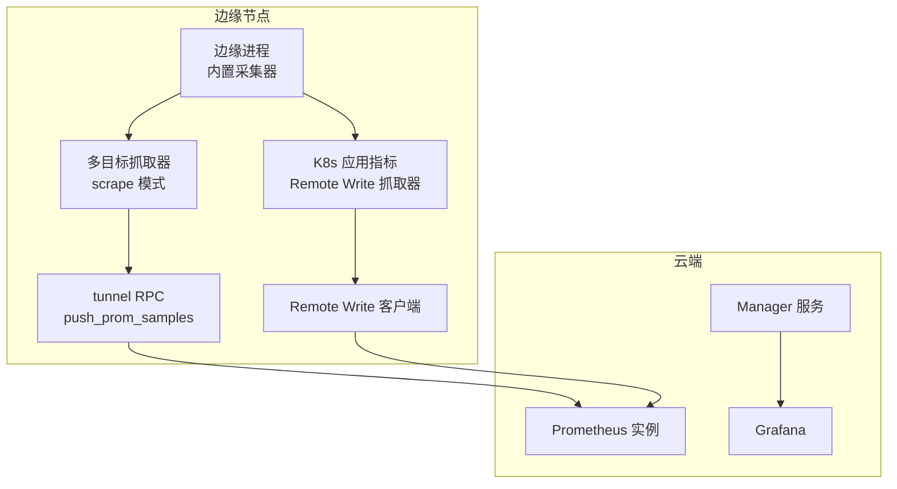
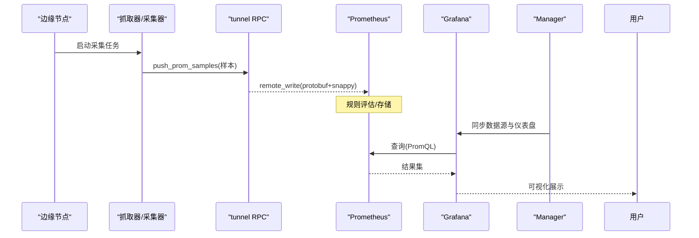
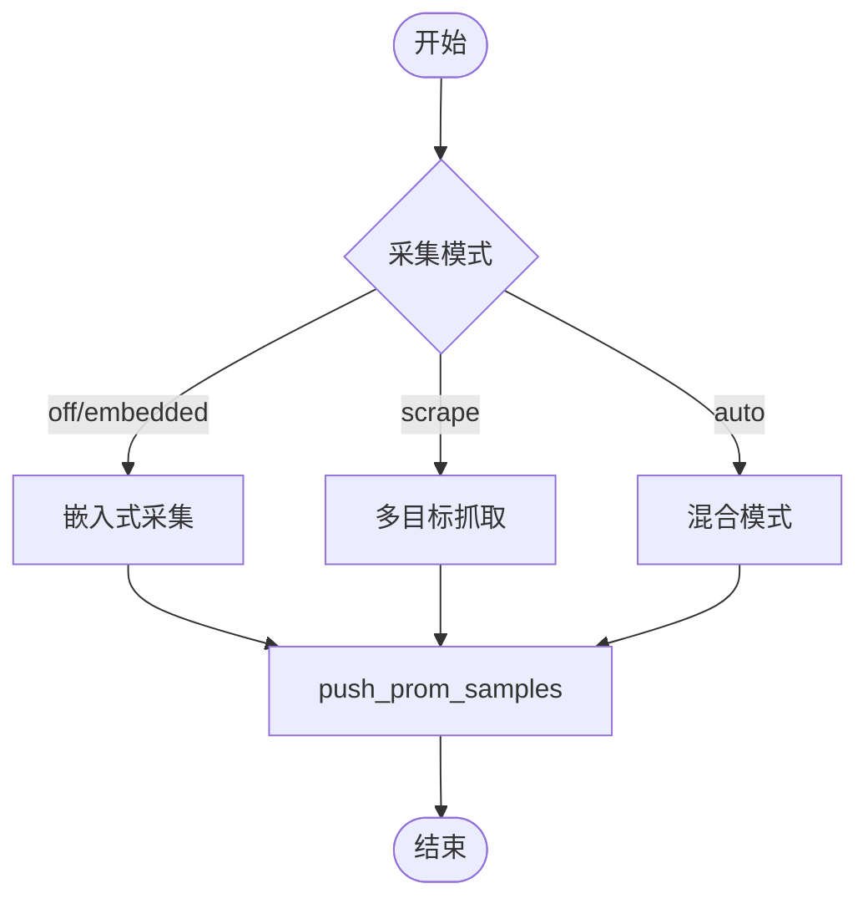
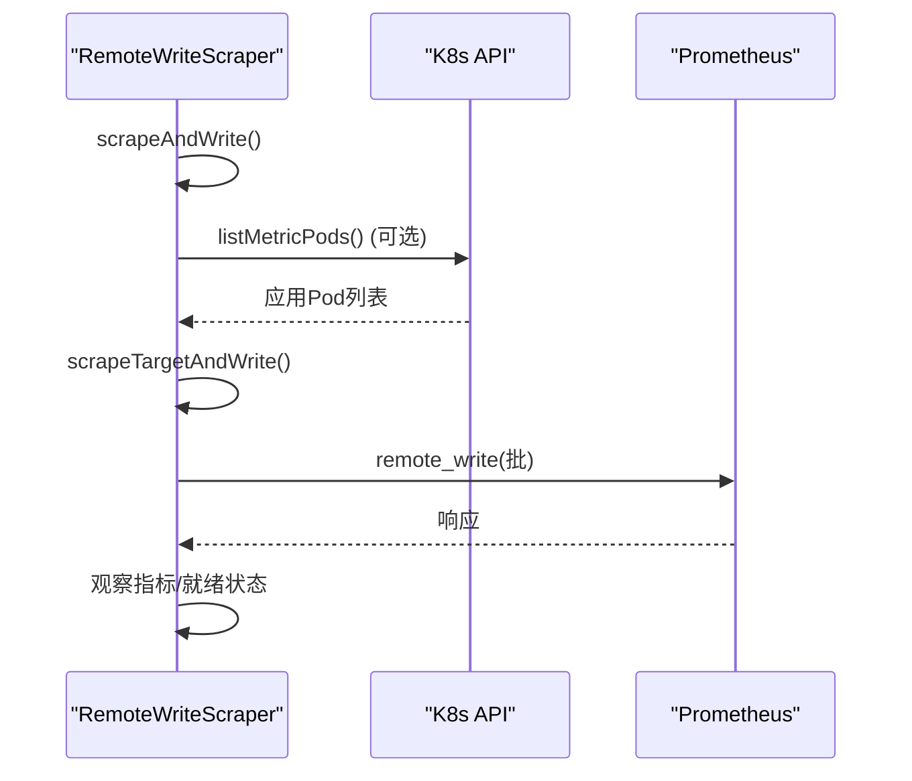
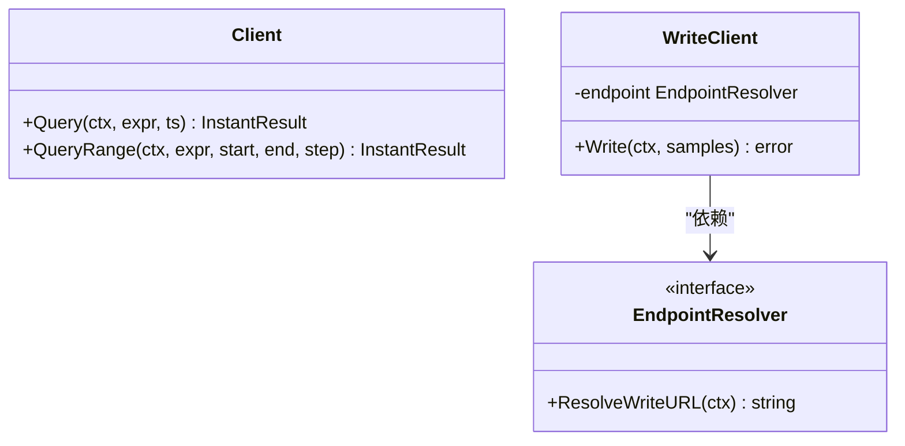
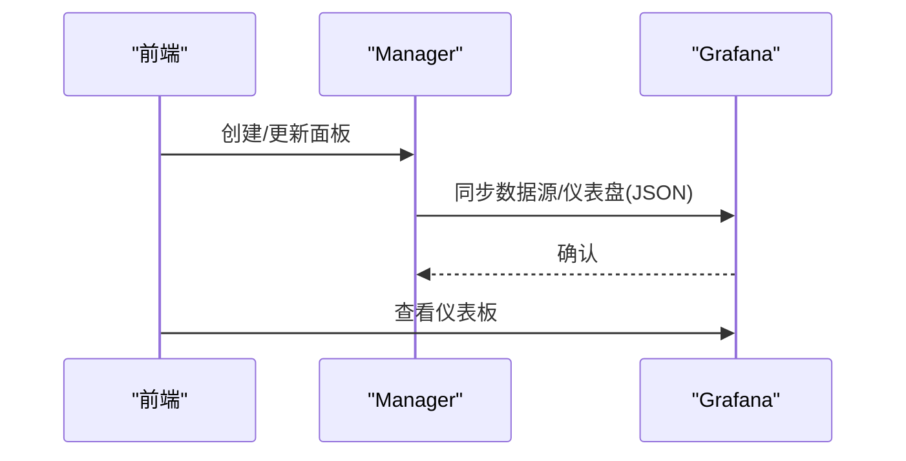
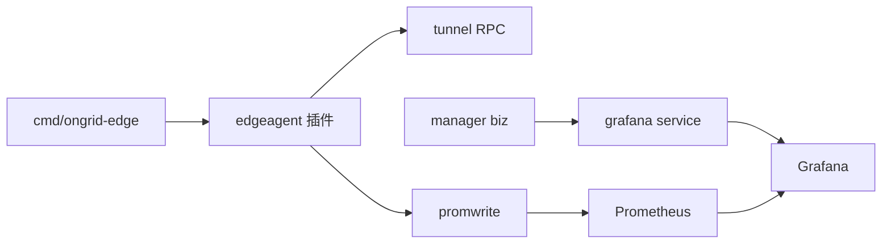

# 监控系统集成

<cite>
**本文引用的文件**
- [cmd/ongrid-edge/main.go](file://cmd/ongrid-edge/main.go)
- [internal/edgeagent/k8s/remote_write_scraper.go](file://internal/edgeagent/k8s/remote_write_scraper.go)
- [internal/edgeagent/plugins/metrics/plugin.go](file://internal/edgeagent/plugins/metrics/plugin.go)
- [internal/edgeagent/plugins/custommetrics/plugin.go](file://internal/edgeagent/plugins/custommetrics/plugin.go)
- [internal/edgeagent/collector/types.go](file://internal/edgeagent/collector/types.go)
- [internal/edgeagent/collector/scrape_config.example.yaml](file://internal/edgeagent/collector/scrape_config.example.yaml)
- [internal/pkg/config/config.go](file://internal/pkg/config/config.go)
- [internal/pkg/promwrite/client.go](file://internal/pkg/promwrite/client.go)
- [internal/pkg/promquery/client.go](file://internal/pkg/promquery/client.go)
- [deploy/install/prometheus/prometheus.yml](file://deploy/install/prometheus/prometheus.yml)
- [deploy/grafana/provisioning/datasources/prometheus.yml](file://deploy/grafana/provisioning/datasources/prometheus.yml)
- [internal/manager/biz/grafana/service.go](file://internal/manager/biz/grafana/service.go)
- [internal/manager/biz/monitor/service.go](file://internal/manager/biz/monitor/service.go)
- [web/src/api/prometheus.ts](file://web/src/api/prometheus.ts)
- [deploy/install/prometheus-rules.yml](file://deploy/install/prometheus-rules.yml)
</cite>

## 目录
1. [简介](#简介)
2. [项目结构](#项目结构)
3. [核心组件](#核心组件)
4. [架构总览](#架构总览)
5. [详细组件分析](#详细组件分析)
6. [依赖关系分析](#依赖关系分析)
7. [性能考虑](#性能考虑)
8. [故障排除指南](#故障排除指南)
9. [结论](#结论)
10. [附录](#附录)

## 简介
本文件面向 Ongrid 平台的监控集成，聚焦与 Prometheus 的指标采集、查询与存储机制，以及 Grafana 仪表板的数据源配置、自动发现与自定义面板开发。文档覆盖从边缘节点采集到云端展示的全链路数据流转，并提供配置示例、性能优化建议与常见问题的排查方法，帮助读者快速落地并扩展监控能力。

## 项目结构
Ongrid 在边缘侧提供多种指标采集方式（嵌入式采集、HTTP 抓取、Kubernetes Remote Write），在云端通过 Manager 统一接入 Prometheus 进行持久化与告警，并通过 Grafana 完成可视化。关键位置如下：
- 边缘侧采集与推送：cmd/ongrid-edge、internal/edgeagent/*
- 云端写入与查询：internal/pkg/promwrite、internal/pkg/promquery
- 部署配置：deploy/install/prometheus、deploy/grafana/provisioning
- 云端服务编排：internal/manager/biz/grafana、internal/manager/biz/monitor

图表来源
- [cmd/ongrid-edge/main.go:130-157](file://cmd/ongrid-edge/main.go#L130-L157)
- [internal/edgeagent/k8s/remote_write_scraper.go:135-189](file://internal/edgeagent/k8s/remote_write_scraper.go#L135-L189)
- [internal/pkg/promwrite/client.go:119-147](file://internal/pkg/promwrite/client.go#L119-L147)
- [deploy/install/prometheus/prometheus.yml:6-20](file://deploy/install/prometheus/prometheus.yml#L6-L20)

章节来源
- [cmd/ongrid-edge/main.go:130-157](file://cmd/ongrid-edge/main.go#L130-L157)
- [internal/edgeagent/k8s/remote_write_scraper.go:135-189](file://internal/edgeagent/k8s/remote_write_scraper.go#L135-L189)
- [deploy/install/prometheus/prometheus.yml:6-20](file://deploy/install/prometheus/prometheus.yml#L6-L20)

## 核心组件
- 边缘采集器与抓取器
  - 嵌入式采集：通过 gopsutil 读取主机/进程指标，走 push_host_metrics 或 push_prom_samples 通道。
  - HTTP 抓取：按 scrape 配置周期性拉取 /metrics，支持 bearer_token、TLS 等。
  - K8s Remote Write 抓取：定时扫描 kubelet/cadvisor 或带注解的应用 Pod，批量写入远程端点。
- 云端写入与查询
  - promwrite：实现 Prometheus remote_write 协议（snappy 压缩 protobuf）。
  - promquery：封装 PromQL 即时与范围查询接口。
- 可视化与自动化
  - Grafana 数据源自动同步：Manager 将 Prometheus/Loki/Elasticsearch 数据源推送到用户 Grafana。
  - 仪表板自动管理：内置仪表盘 JSON，按 UID 覆盖更新；Monitor 页面可动态生成面板并同步到 Grafana。

章节来源
- [internal/edgeagent/collector/types.go:9-36](file://internal/edgeagent/collector/types.go#L9-L36)
- [internal/edgeagent/plugins/metrics/plugin.go:26-35](file://internal/edgeagent/plugins/metrics/plugin.go#L26-L35)
- [internal/edgeagent/plugins/custommetrics/plugin.go:109-162](file://internal/edgeagent/plugins/custommetrics/plugin.go#L109-L162)
- [internal/pkg/promwrite/client.go:1-19](file://internal/pkg/promwrite/client.go#L1-L19)
- [internal/pkg/promquery/client.go:84-117](file://internal/pkg/promquery/client.go#L84-L117)
- [internal/manager/biz/grafana/service.go:1-16](file://internal/manager/biz/grafana/service.go#L1-L16)
- [internal/manager/biz/monitor/service.go:59-94](file://internal/manager/biz/monitor/service.go#L59-L94)

## 架构总览
下图展示了从边缘采集到云端可视化的完整链路，包括三种采集路径与统一的存储/查询/展示层。

图表来源
- [internal/edgeagent/k8s/remote_write_scraper.go:152-189](file://internal/edgeagent/k8s/remote_write_scraper.go#L152-L189)
- [internal/pkg/promwrite/client.go:119-147](file://internal/pkg/promwrite/client.go#L119-L147)
- [internal/manager/biz/grafana/service.go:229-261](file://internal/manager/biz/grafana/service.go#L229-L261)
- [deploy/grafana/provisioning/datasources/prometheus.yml:1-11](file://deploy/grafana/provisioning/datasources/prometheus.yml#L1-L11)

## 详细组件分析

### 边缘侧指标采集与推送
- 采集模式选择
  - off/embedded/scrape/auto：通过环境变量与配置决定采集行为。默认“off”避免重复上报，保留按需 RPC。
  - scrape 模式使用 YAML 配置多目标独立抓取，失败不阻塞其他目标。
- 数据输出
  - CollectorOutput 包含 Source、HostPoint、Samples 字段，Source 区分 embedded 与 scrape:<target>。
- 推送通道
  - 通过 tunnel RPC push_prom_samples 发送样本，附带 edge_id 等标签，由服务端注入设备标识。

图表来源
- [internal/pkg/config/config.go:384-412](file://internal/pkg/config/config.go#L384-L412)
- [internal/edgeagent/collector/types.go:9-36](file://internal/edgeagent/collector/types.go#L9-L36)
- [internal/edgeagent/collector/scrape_config.example.yaml:1-30](file://internal/edgeagent/collector/scrape_config.example.yaml#L1-L30)

章节来源
- [internal/pkg/config/config.go:384-412](file://internal/pkg/config/config.go#L384-L412)
- [internal/edgeagent/collector/types.go:9-36](file://internal/edgeagent/collector/types.go#L9-L36)
- [internal/edgeagent/collector/scrape_config.example.yaml:1-30](file://internal/edgeagent/collector/scrape_config.example.yaml#L1-L30)

### Kubernetes Remote Write 抓取器
- 功能要点
  - 支持固定 endpoint 与基于 K8s API 的应用发现两种模式。
  - 周期执行 scrapeAndWrite，统计 accepted/limit_exceeded，按批次写入 remote_write。
  - Ready 状态反映核心循环是否成功，应用发现失败不影响核心就绪。
- 关键流程
  - targets() 组装目标列表（固定 + 可选应用发现）
  - scrapeTargetAndWrite() 抓取并批处理样本，调用 writeWithRetry()
  - observeScrape/observePush 暴露内部指标

图表来源
- [internal/edgeagent/k8s/remote_write_scraper.go:135-189](file://internal/edgeagent/k8s/remote_write_scraper.go#L135-L189)
- [internal/edgeagent/k8s/remote_write_scraper.go:191-255](file://internal/edgeagent/k8s/remote_write_scraper.go#L191-L255)

章节来源
- [internal/edgeagent/k8s/remote_write_scraper.go:135-189](file://internal/edgeagent/k8s/remote_write_scraper.go#L135-L189)
- [internal/edgeagent/k8s/remote_write_scraper.go:191-255](file://internal/edgeagent/k8s/remote_write_scraper.go#L191-L255)

### Prometheus 写入与查询
- 写入（promwrite）
  - 实现 remote_write 协议，snappy 压缩 protobuf，每条 Sample 作为独立 TimeSeries。
  - EndpointResolver 支持运行时解析 URL，便于热更新。
- 查询（promquery）
  - 封装 /api/v1/query 与 /api/v1/query_range，返回 InstantResult。
  - 错误通过 status/errorType/error 传递。

图表来源
- [internal/pkg/promquery/client.go:84-117](file://internal/pkg/promquery/client.go#L84-L117)
- [internal/pkg/promwrite/client.go:1-19](file://internal/pkg/promwrite/client.go#L1-L19)
- [internal/pkg/promwrite/client.go:119-147](file://internal/pkg/promwrite/client.go#L119-L147)

章节来源
- [internal/pkg/promwrite/client.go:1-19](file://internal/pkg/promwrite/client.go#L1-L19)
- [internal/pkg/promwrite/client.go:119-147](file://internal/pkg/promwrite/client.go#L119-L147)
- [internal/pkg/promquery/client.go:84-117](file://internal/pkg/promquery/client.go#L84-L117)

### Grafana 数据源与仪表板自动化
- 数据源自动同步
  - Manager 将 Prometheus/Loki/Elasticsearch 数据源以稳定 UID 写入用户 Grafana，支持 Bearer/Basic 认证。
  - 内嵌 dashboard JSON 按文件夹与 UID 覆盖更新，确保一致性。
- Monitor 面板到 Grafana
  - 通过 biz/monitor 创建面板定义，映射为 Grafana 面板类型并同步至指定 Dashboard UID。

图表来源
- [internal/manager/biz/grafana/service.go:229-261](file://internal/manager/biz/grafana/service.go#L229-L261)
- [internal/manager/biz/grafana/service.go:643-679](file://internal/manager/biz/grafana/service.go#L643-L679)
- [internal/manager/biz/monitor/service.go:59-94](file://internal/manager/biz/monitor/service.go#L59-L94)

章节来源
- [internal/manager/biz/grafana/service.go:229-261](file://internal/manager/biz/grafana/service.go#L229-L261)
- [internal/manager/biz/grafana/service.go:643-679](file://internal/manager/biz/grafana/service.go#L643-L679)
- [internal/manager/biz/monitor/service.go:59-94](file://internal/manager/biz/monitor/service.go#L59-L94)

### 前端与 Prometheus 集成
- 前端通过后端代理发起 PromQL 查询，封装为 POST /prometheus/launch，返回可直接打开的查询链接。
- 该方式简化了跨域与鉴权问题，同时保持对 Prometheus 的直接访问控制。

章节来源
- [web/src/api/prometheus.ts:1-12](file://web/src/api/prometheus.ts#L1-L12)

## 依赖关系分析
- 边缘侧
  - cmd/ongrid-edge 负责初始化 collector 与插件（metrics、custommetrics、databasemetrics、traces）。
  - 插件通过 tunnel 与 Manager 通信，或直接通过 remote_write 写入 Prometheus。
- 云端侧
  - promwrite/promquery 是通用库，被 biz 层复用。
  - grafana service 依赖 setting 服务获取认证信息，并驱动 Grafana 资源同步。
- 部署配置
  - Prometheus 抓取 ongrid 自身指标；Grafana 数据源指向 Prometheus。

图表来源
- [cmd/ongrid-edge/main.go:317-343](file://cmd/ongrid-edge/main.go#L317-L343)
- [internal/pkg/promwrite/client.go:119-147](file://internal/pkg/promwrite/client.go#L119-L147)
- [internal/manager/biz/grafana/service.go:229-261](file://internal/manager/biz/grafana/service.go#L229-L261)

章节来源
- [cmd/ongrid-edge/main.go:317-343](file://cmd/ongrid-edge/main.go#L317-L343)
- [internal/pkg/promwrite/client.go:119-147](file://internal/pkg/promwrite/client.go#L119-L147)
- [internal/manager/biz/grafana/service.go:229-261](file://internal/manager/biz/grafana/service.go#L229-L261)

## 性能考虑
- 采集频率与超时
  - 合理设置 scrape_interval、timeout，避免高频抓取导致负载过高。
  - K8s 抓取器支持 Interval/Timeout/PushTimeout/SampleLimit/BatchSampleLimit/BatchByteLimit 等参数调优。
- 批处理与限流
  - 使用 batcher 聚合样本，降低网络与序列化开销；注意 BatchByteLimit 防止单次过大。
- 重试与退避
  - 对 remote_write 失败进行有限重试与指数退避，避免雪崩。
- 指标维度控制
  - 限制高基数标签，避免 series 爆炸；必要时在采集侧过滤。
- 存储与查询
  - 调整 Prometheus 全局 scrape_interval/evaluation_interval，平衡实时性与资源占用。
  - 使用合理的 range 查询步长，减少计算压力。

章节来源
- [internal/edgeagent/k8s/remote_write_scraper.go:62-123](file://internal/edgeagent/k8s/remote_write_scraper.go#L62-L123)
- [internal/edgeagent/k8s/remote_write_scraper.go:228-255](file://internal/edgeagent/k8s/remote_write_scraper.go#L228-L255)
- [deploy/install/prometheus/prometheus.yml:6-20](file://deploy/install/prometheus/prometheus.yml#L6-L20)

## 故障排除指南
- 无法抓取指标
  - 检查 scrape 配置中的 URL、bearer_token_file、tls_insecure 是否正确。
  - 确认目标端口可达且 /metrics 正常返回。
- remote_write 失败
  - 验证 EndpointResolver 返回的 URL 有效；检查网络连通性与认证头。
  - 关注重试次数与退避策略，避免频繁重试放大故障。
- 指标缺失或重复
  - 若启用 embedded 与 scrape 双路径，可能产生重复系列；推荐默认 off，仅用 scrape 或按需 RPC。
  - 检查 Source 标签是否为 embedded 或 scrape:<target>，确认去重策略。
- Grafana 数据源不可用
  - 确认 Manager 已同步数据源；检查 Bearer/Basic 认证配置。
  - 校验 Grafana 地址与 TLS 设置（如自签证书需开启跳过校验）。
- 仪表盘未更新
  - 确认 Dashboard UID 未被手动修改；Manager 会以 overwrite=true 覆盖。
  - 检查 Grafana 日志与 Manager 同步日志。

章节来源
- [internal/edgeagent/collector/scrape_config.example.yaml:1-30](file://internal/edgeagent/collector/scrape_config.example.yaml#L1-L30)
- [internal/pkg/promwrite/client.go:119-147](file://internal/pkg/promwrite/client.go#L119-L147)
- [internal/manager/biz/grafana/service.go:229-261](file://internal/manager/biz/grafana/service.go#L229-L261)

## 结论
Ongrid 的监控集成提供了灵活多样的边缘采集方式与稳定的云端存储/查询能力，结合 Grafana 的自动化配置与面板管理，实现了从边缘到云端的端到端可观测性。通过合理的采集策略、批处理与重试机制，可在保证性能的同时提升可靠性。建议在生产环境中优先采用 scrape 模式与远端 Remote Write，配合 Grafana 自动同步，以获得一致且易维护的监控体验。

## 附录

### 配置示例与最佳实践
- 边缘采集模式
  - 推荐使用 scrape 模式，通过 YAML 配置多目标抓取，隔离失败与超时。
  - 对于 K8s 环境，启用应用发现时确保 Pod 具备必要注解与权限。
- Prometheus 规则
  - 使用内置规则文件进行自监控，关注 manager 健康、LLM 错误率、DB 池利用率等。
- Grafana 数据源
  - 通过 Manager 自动同步数据源，避免手工维护；如需外部 Grafana，确保认证与安全策略正确。
- 面板与仪表板
  - 使用 Monitor 页面创建面板，自动生成并同步到 Grafana；避免直接编辑受管仪表板。

章节来源
- [internal/edgeagent/collector/scrape_config.example.yaml:1-30](file://internal/edgeagent/collector/scrape_config.example.yaml#L1-L30)
- [deploy/install/prometheus-rules.yml:1-79](file://deploy/install/prometheus-rules.yml#L1-L79)
- [internal/manager/biz/grafana/service.go:229-261](file://internal/manager/biz/grafana/service.go#L229-L261)
- [internal/manager/biz/monitor/service.go:59-94](file://internal/manager/biz/monitor/service.go#L59-L94)