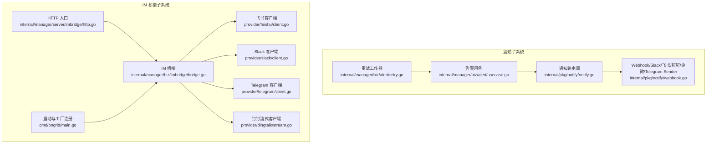
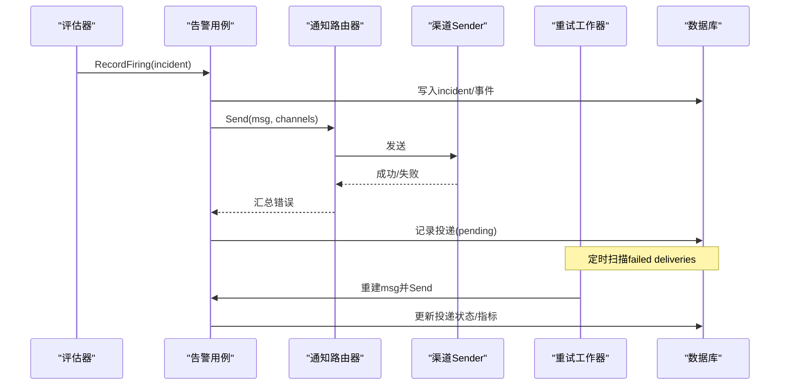
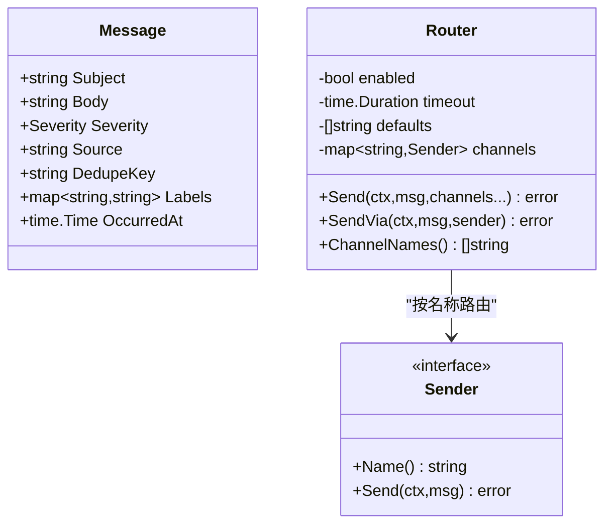
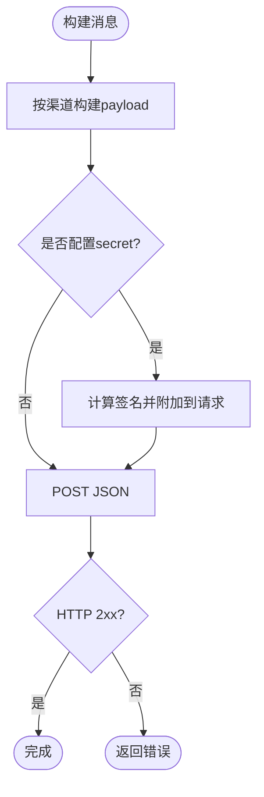
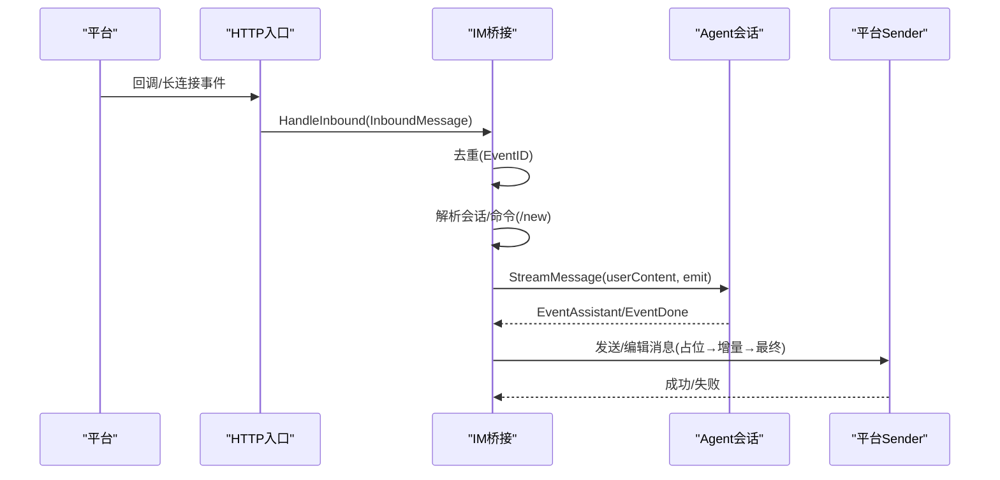
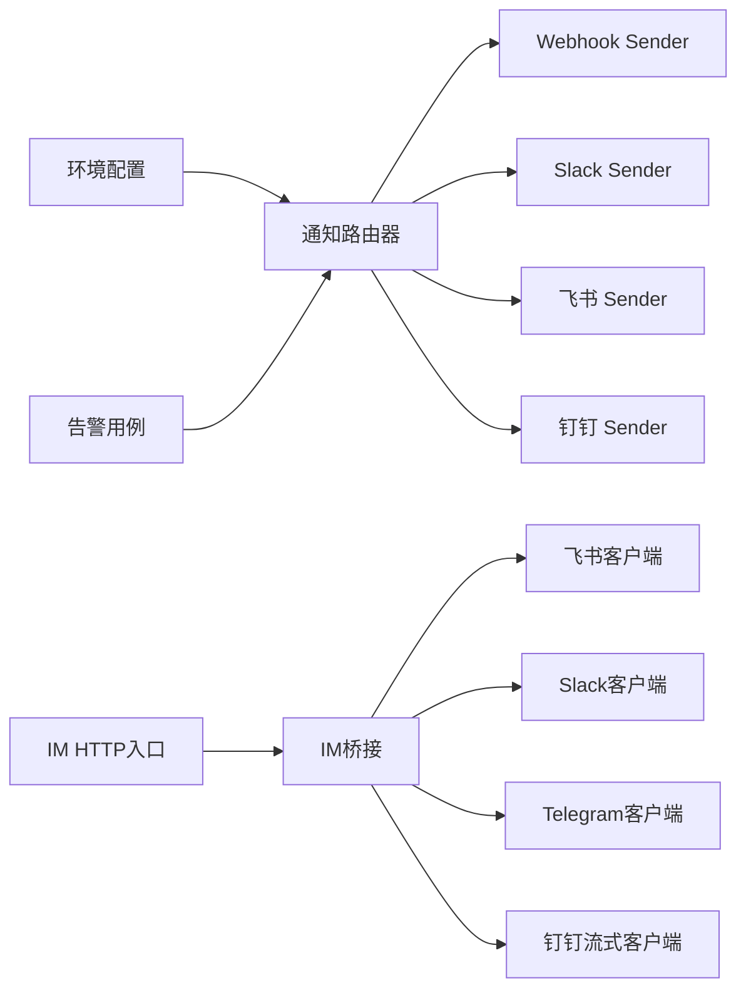

# 通知渠道集成

<cite>
**本文引用的文件**
- [notify.go](file://internal/pkg/notify/notify.go)
- [webhook.go](file://internal/pkg/notify/webhook.go)
- [bridge.go](file://internal/manager/biz/imbridge/bridge.go)
- [http.go](file://internal/manager/server/imbridge/http.go)
- [main.go](file://cmd/ongrid/main.go)
- [usecase.go](file://internal/manager/biz/alert/usecase.go)
- [retry.go](file://internal/manager/biz/alert/retry.go)
- [client.go](file://internal/manager/biz/imbridge/provider/feishu/client.go)
- [client.go](file://internal/manager/biz/imbridge/provider/slack/client.go)
- [client.go](file://internal/manager/biz/imbridge/provider/telegram/client.go)
- [stream.go](file://internal/manager/biz/imbridge/provider/dingtalk/stream.go)
- [notification.proto](file://api/manager/notification/v1/notification.proto)
- [Notifications.tsx](file://web/src/pages/settings/Notifications.tsx)
- [notify_signed_test.go](file://tests/e2e/notify_signed_test.go)
</cite>

## 目录
1. [简介](#简介)
2. [项目结构](#项目结构)
3. [核心组件](#核心组件)
4. [架构总览](#架构总览)
5. [详细组件分析](#详细组件分析)
6. [依赖关系分析](#依赖关系分析)
7. [性能与可靠性](#性能与可靠性)
8. [故障排除指南](#故障排除指南)
9. [结论](#结论)
10. [附录：配置与扩展](#附录：配置与扩展)

## 简介
本文件面向 Ongrid 平台的通知渠道集成，覆盖以下目标：
- 支持的即时通讯平台：Slack、Telegram、飞书、钉钉等主流 IM 工具的配置与使用。
- Webhook 通知机制：自定义通知端点的开发与消息格式定义。
- 通知路由与分发：告警级别映射、去重机制、重试策略。
- 各渠道配置示例、认证设置与故障排除。
- 扩展开发指南与最佳实践。

Ongrid 的通知系统由“告警事件 → 通知路由 → 渠道发送”构成；IM 桥接层则负责将平台消息接入 Ongrid 的会话与智能体流式回复能力。两者共同形成“告警通知 + IM 对话”的统一体验。

## 项目结构
与通知和 IM 相关的代码主要分布在以下模块：
- internal/pkg/notify：通用通知抽象、路由器与各渠道 Sender（Webhook/Slack/飞书/钉钉/企业微信/Telegram）。
- internal/manager/biz/imbridge：IM 桥接业务层，统一处理各平台入站消息、会话映射、流式编辑与去重。
- internal/manager/server/imbridge：HTTP 入口与鉴权（平台签名校验）。
- cmd/ongrid/main.go：启动时注册长连接提供者（飞书/钉钉/Telegram/Slack）并运行 StreamSupervisor。
- internal/manager/biz/alert：告警用例、投递记录与重试工作器。
- api/manager/notification/v1：通知渠道管理 API 定义。
- web/src/pages/settings/Notifications.tsx：通知渠道设置页前端逻辑。
- tests/e2e/notify_signed_test.go：飞书/钉钉签名端到端测试。

**图表来源**
- [notify.go:39-130](file://internal/pkg/notify/notify.go#L39-L130)
- [webhook.go:18-314](file://internal/pkg/notify/webhook.go#L18-L314)
- [bridge.go:50-236](file://internal/manager/biz/imbridge/bridge.go#L50-L236)
- [http.go:1-40](file://internal/manager/server/imbridge/http.go#L1-L40)
- [main.go:1669-1691](file://cmd/ongrid/main.go#L1669-L1691)
- [client.go:15-224](file://internal/manager/biz/imbridge/provider/feishu/client.go#L15-L224)
- [client.go:17-250](file://internal/manager/biz/imbridge/provider/slack/client.go#L17-L250)
- [client.go:1-201](file://internal/manager/biz/imbridge/provider/telegram/client.go#L1-L201)
- [stream.go:17-131](file://internal/manager/biz/imbridge/provider/dingtalk/stream.go#L17-L131)

**章节来源**
- [notify.go:39-130](file://internal/pkg/notify/notify.go#L39-L130)
- [webhook.go:18-314](file://internal/pkg/notify/webhook.go#L18-L314)
- [bridge.go:50-236](file://internal/manager/biz/imbridge/bridge.go#L50-L236)
- [http.go:1-40](file://internal/manager/server/imbridge/http.go#L1-L40)
- [main.go:1669-1691](file://cmd/ongrid/main.go#L1669-L1691)

## 核心组件
- 通知路由器 Router：统一封装多通道发送，支持超时、默认通道、开关控制。
- 渠道 Sender：Webhook（通用）、Slack（Incoming Webhook）、飞书（自定义机器人）、钉钉（自定义机器人）、企业微信（群机器人）、Telegram（Bot API sendMessage）。
- IM 桥接 Bridge：平台无关的消息处理、会话映射、流式编辑、去重。
- 告警用例 Usecase：告警事件写入、静默/冷却门控、通知投递记录。
- 重试工作器 RetryWorker：基于 delivery 表的重试、线性退避、失败计数与指标上报。

**章节来源**
- [notify.go:22-156](file://internal/pkg/notify/notify.go#L22-L156)
- [webhook.go:27-314](file://internal/pkg/notify/webhook.go#L27-L314)
- [bridge.go:50-236](file://internal/manager/biz/imbridge/bridge.go#L50-L236)
- [usecase.go:547-607](file://internal/manager/biz/alert/usecase.go#L547-L607)
- [retry.go:14-234](file://internal/manager/biz/alert/retry.go#L14-L234)

## 架构总览
通知与 IM 两条主线在 Ongrid 中协同工作：
- 告警路径：规则触发 → 写入 incident → 可选 AI 调查/工作流触发 → 构建 notify.Message → Router 分发到各渠道 → 记录投递结果 → 重试工作器兜底。
- IM 路径：平台回调或长连接 → HTTP 入口校验签名 → 标准化为 InboundMessage → Bridge 解析会话/命令 → 调用 Agent 流式输出 → 通过平台特定 Sender 逐步更新消息。

**图表来源**
- [usecase.go:342-513](file://internal/manager/biz/alert/usecase.go#L342-L513)
- [usecase.go:547-607](file://internal/manager/biz/alert/usecase.go#L547-L607)
- [retry.go:98-201](file://internal/manager/biz/alert/retry.go#L98-L201)
- [notify.go:92-156](file://internal/pkg/notify/notify.go#L92-L156)

## 详细组件分析

### 通知路由器与消息模型
- 消息模型 Message：包含主题、正文、严重级别、来源、去重键、标签、发生时间。
- 路由器 Router：支持启用/禁用、超时、默认通道列表；按名称查找 Sender；并发安全地收集错误。
- 从配置构建：根据环境配置自动注册 Webhook/Slack/飞书/钉钉 Sender。

**图表来源**
- [notify.go:22-156](file://internal/pkg/notify/notify.go#L22-L156)

**章节来源**
- [notify.go:22-156](file://internal/pkg/notify/notify.go#L22-L156)

### Webhook 与平台 Sender
- 通用 Webhook：POST JSON，可选 HMAC-SHA256 签名头 X-Ongrid-Signature。
- Slack Incoming Webhook：attachments 格式，颜色条表示严重级别，字段包含 Rule/Incident/Device/Dedupe key。
- 飞书自定义机器人：text 消息，可选 timestamp+sign（HMAC-SHA256 base64）。
- 钉钉自定义机器人：text 消息，URL 追加 timestamp= 与 sign=（HMAC-SHA256 base64）。
- 企业微信群机器人：与钉钉相同 JSON 形状，密钥在 URL query。
- Telegram Bot API：sendMessage，chat_id 在 body，token 在 URL。

**图表来源**
- [webhook.go:27-314](file://internal/pkg/notify/webhook.go#L27-L314)

**章节来源**
- [webhook.go:27-314](file://internal/pkg/notify/webhook.go#L27-L314)

### IM 桥接：会话、去重与流式编辑
- 入站消息标准化：Provider/AppID/ChatID/ThreadID/OpenID/UserName/Text/EventID/ReceiveIDType。
- 会话映射：按 (im_app_id, im_chat_id, thread_id) 映射到 ongrid session；支持 /new 重置会话。
- 去重：基于 (provider, app_id, event_id) 的 seen set，避免重复处理。
- 流式编辑：对支持编辑的平台（如飞书/Slack），先发送占位消息，再逐步更新；不支持编辑的平台（如钉钉）缓冲最终答案一次性回复。

**图表来源**
- [bridge.go:83-236](file://internal/manager/biz/imbridge/bridge.go#L83-L236)
- [http.go:1-40](file://internal/manager/server/imbridge/http.go#L1-L40)

**章节来源**
- [bridge.go:83-236](file://internal/manager/biz/imbridge/bridge.go#L83-L236)

### 各平台实现要点
- 飞书：
  - 获取 tenant_access_token 并缓存，提前刷新避免 401。
  - 发送 rich-text/post 或 text（大消息回退）。
  - 支持 EditText 进行流式更新。
- Slack：
  - Socket Mode 入站（wss），无需公网回调。
  - chat.postMessage/chat.update 出站，blocks 渲染 Markdown。
  - 双令牌：app_token（Socket）与 bot_token（API）。
- Telegram：
  - getUpdates 长轮询（出站，适合代理环境）。
  - sendMessage/editMessageText，对“未修改”错误容忍。
  - 内置 429/5xx 重试与 retry_after 处理。
- 钉钉：
  - 官方 SDK 流式连接，无需公网回调。
  - 不支持编辑历史消息，采用缓冲后一次性 Markdown 回复。

**章节来源**
- [client.go:15-224](file://internal/manager/biz/imbridge/provider/feishu/client.go#L15-L224)
- [client.go:17-250](file://internal/manager/biz/imbridge/provider/slack/client.go#L17-L250)
- [client.go:1-201](file://internal/manager/biz/imbridge/provider/telegram/client.go#L1-L201)
- [stream.go:17-131](file://internal/manager/biz/imbridge/provider/dingtalk/stream.go#L17-L131)

### 告警级别映射与通知内容
- 严重级别：info/warning/critical，用于渠道渲染（如 Slack 颜色条）。
- 标签：rule/incident_id/device_id 等关键信息以结构化字段展示。
- 去重键：pipeline 级 dedupe_key，便于聚合与降噪。
- 来源：scope_type 作为 source 字段。

**章节来源**
- [notify.go:13-31](file://internal/pkg/notify/notify.go#L13-L31)
- [webhook.go:56-115](file://internal/pkg/notify/webhook.go#L56-L115)
- [retry.go:203-231](file://internal/manager/biz/alert/retry.go#L203-L231)

### 通知路由与分发逻辑
- 路由选择：优先显式 channels，否则使用默认 channels。
- 超时控制：每个 channel 发送带上下文超时。
- 错误聚合：多个 channel 的错误合并返回。
- 持久化投递：每条投递记录 pending → success/failed，供重试工作器处理。

**章节来源**
- [notify.go:92-156](file://internal/pkg/notify/notify.go#L92-L156)
- [usecase.go:547-607](file://internal/manager/biz/alert/usecase.go#L547-L607)

### 去重机制
- IM 桥接：seen set 基于 (provider, app_id, event_id)，防止重复处理。
- 告警：incident 按 dedupe_key 上写，重复触发仅 bump 计数，不重复通知（受静默/冷却门控影响）。

**章节来源**
- [bridge.go:124-137](file://internal/manager/biz/imbridge/bridge.go#L124-L137)
- [usecase.go:342-513](file://internal/manager/biz/alert/usecase.go#L342-L513)

### 重试策略
- 线性退避：attempt_count * backoffPerAttempt 最小间隔。
- 最大尝试次数：默认 5 次。
- 周期扫描：默认每 30 秒一次。
- 失败原因与指标：每次重试写入事件并上报 alert_events_total。

**章节来源**
- [retry.go:14-234](file://internal/manager/biz/alert/retry.go#L14-L234)

## 依赖关系分析
- 通知子系统依赖配置与环境变量来注册 Sender；告警用例通过 Notifier 接口解耦具体实现。
- IM 桥接依赖 provider 客户端库，并通过 StreamSupervisor 统一管理长连接生命周期。
- HTTP 入口对外暴露 IM 回调，但鉴权由平台签名保证，不在 JWT 组内。

**图表来源**
- [notify.go:67-90](file://internal/pkg/notify/notify.go#L67-L90)
- [main.go:1669-1691](file://cmd/ongrid/main.go#L1669-L1691)
- [http.go:1-40](file://internal/manager/server/imbridge/http.go#L1-L40)

**章节来源**
- [notify.go:67-90](file://internal/pkg/notify/notify.go#L67-L90)
- [main.go:1669-1691](file://cmd/ongrid/main.go#L1669-L1691)
- [http.go:1-40](file://internal/manager/server/imbridge/http.go#L1-L40)

## 性能与可靠性
- 网络与代理：Telegram/Slack 均设计为出站连接，适合受限网络环境（HTTPS_PROXY）。
- 流式更新：飞书/Slack 支持增量编辑，降低消息风暴；钉钉缓冲最终答案。
- 重试与退避：告警投递具备线性退避与最大尝试次数，避免雪崩。
- 指标与审计：所有投递行为写入事件表并上报指标，便于观测与排障。

[本节提供通用指导，不直接分析具体文件]

## 故障排除指南
- 无法收到通知：
  - 检查 Router 是否启用、默认通道是否正确、各 Sender 是否已注册。
  - 查看 delivery 表中的状态与错误信息，确认是否进入重试队列。
- 渠道签名失败：
  - 飞书：确保 timestamp 与 sign 正确（HMAC-SHA256 base64）。
  - 钉钉：确保 URL 查询参数 timestamp 与 sign 正确。
  - 通用 Webhook：确认 X-Ongrid-Signature 头部与 secret 一致。
- IM 回调无响应：
  - 确认平台签名校验通过（HTTP 入口）。
  - 检查 StreamSupervisor 是否已注册对应 provider 工厂。
- 重复消息：
  - IM 桥接已做 event_id 去重；若仍出现，检查上游是否重复投递。
- 告警风暴：
  - 利用静默与冷却门控；检查 rule 的 NotifyWindowSeconds/NotifyMinFires。

**章节来源**
- [webhook.go:274-314](file://internal/pkg/notify/webhook.go#L274-L314)
- [notify_signed_test.go:1-235](file://tests/e2e/notify_signed_test.go#L1-L235)
- [http.go:1-40](file://internal/manager/server/imbridge/http.go#L1-L40)
- [main.go:1669-1691](file://cmd/ongrid/main.go#L1669-L1691)
- [retry.go:98-201](file://internal/manager/biz/alert/retry.go#L98-L201)

## 结论
Ongrid 的通知与 IM 桥接体系通过统一的抽象与可插拔的渠道实现，既满足告警通知的可靠性与可观测性，又提供了跨平台的 IM 对话能力。借助去重、重试、流式编辑与严格的鉴权机制，系统在复杂网络与高负载场景下仍能保持稳定与高效。

[本节总结性内容，不直接分析具体文件]

## 附录：配置与扩展

### 通知渠道配置
- 环境变量注册：通过配置项启用 Webhook/Slack/飞书/钉钉 Sender，并设置 URL/Secret。
- 存储型渠道：通过 API 创建/更新/删除渠道，支持测试与分页查询。
- 前端设置：通知设置页按语言分组显示可用渠道，支持创建、编辑、测试与删除。

**章节来源**
- [notify.go:67-90](file://internal/pkg/notify/notify.go#L67-L90)
- [notification.proto:37-90](file://api/manager/notification/v1/notification.proto#L37-L90)
- [Notifications.tsx:113-142](file://web/src/pages/settings/Notifications.tsx#L113-L142)

### 认证与安全
- 通用 Webhook：可选 HMAC-SHA256 签名头。
- 飞书：timestamp + sign（HMAC-SHA256 base64）。
- 钉钉：URL 查询参数 timestamp + sign（HMAC-SHA256 base64）。
- Slack：Socket Mode 使用 app_token，API 使用 bot_token。
- Telegram：bot token 在 URL，chat_id 在 body。

**章节来源**
- [webhook.go:274-314](file://internal/pkg/notify/webhook.go#L274-L314)
- [client.go:17-250](file://internal/manager/biz/imbridge/provider/slack/client.go#L17-L250)
- [client.go:1-201](file://internal/manager/biz/imbridge/provider/telegram/client.go#L1-L201)
- [notify_signed_test.go:1-235](file://tests/e2e/notify_signed_test.go#L1-L235)

### 消息格式与渲染
- 通用文本：severity + subject + body + source + dedupe_key。
- Slack attachments：彩色侧边栏 + 结构化字段（Rule/Incident/Device/Dedupe key）。
- 飞书/钉钉/企微：text 消息，必要时富文本（飞书 post）。
- Telegram：HTML 模式，禁用链接预览。

**章节来源**
- [webhook.go:56-115](file://internal/pkg/notify/webhook.go#L56-L115)
- [client.go:198-224](file://internal/manager/biz/imbridge/provider/feishu/client.go#L198-L224)
- [client.go:186-193](file://internal/manager/biz/imbridge/provider/telegram/client.go#L186-L193)

### 扩展开发指南
- 新增渠道 Sender：
  - 实现 Sender 接口（Name/Send）。
  - 在 NewFromConfig 中按配置注册。
  - 如需签名，实现 signTarget 函数。
- 新增 IM Provider：
  - 实现 StreamClientFactory 并在 main.go 中 RegisterFactory。
  - 提供 Sender 适配（支持编辑或缓冲）。
  - 在 HTTP 入口中处理平台签名校验。
- 最佳实践：
  - 使用出站连接（WebSocket/长轮询）以规避防火墙限制。
  - 严格鉴权与签名校验，避免开放回调被滥用。
  - 充分利用去重与重试机制，提升鲁棒性。
  - 保持消息简洁可读，结构化字段便于快速定位问题。

**章节来源**
- [notify.go:67-90](file://internal/pkg/notify/notify.go#L67-L90)
- [webhook.go:194-216](file://internal/pkg/notify/webhook.go#L194-L216)
- [main.go:1669-1691](file://cmd/ongrid/main.go#L1669-L1691)
- [bridge.go:83-236](file://internal/manager/biz/imbridge/bridge.go#L83-L236)