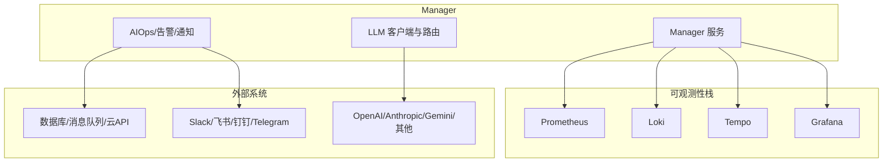
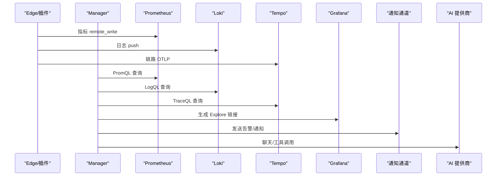
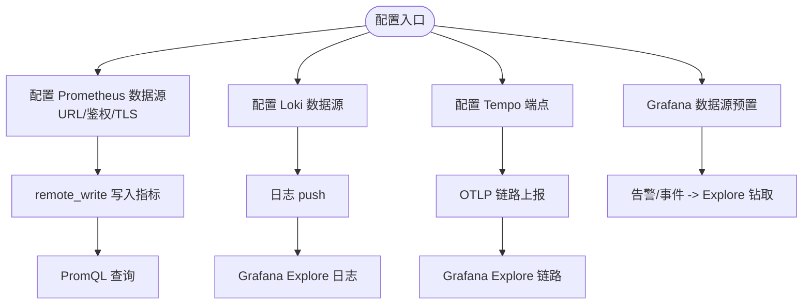
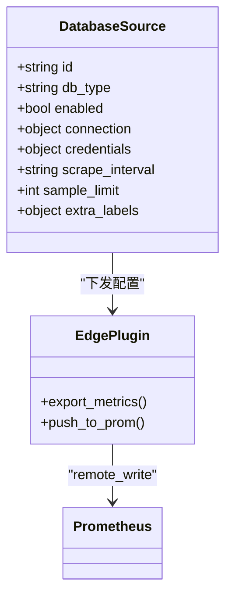
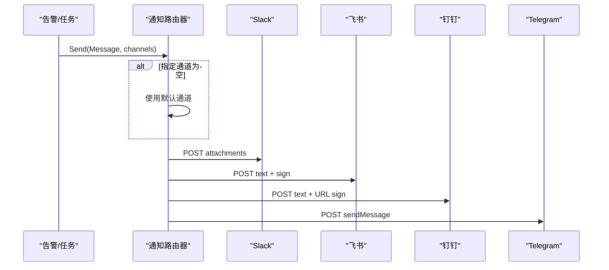
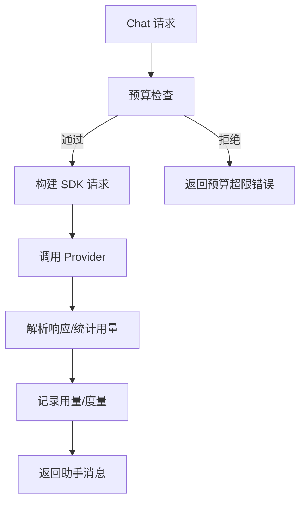
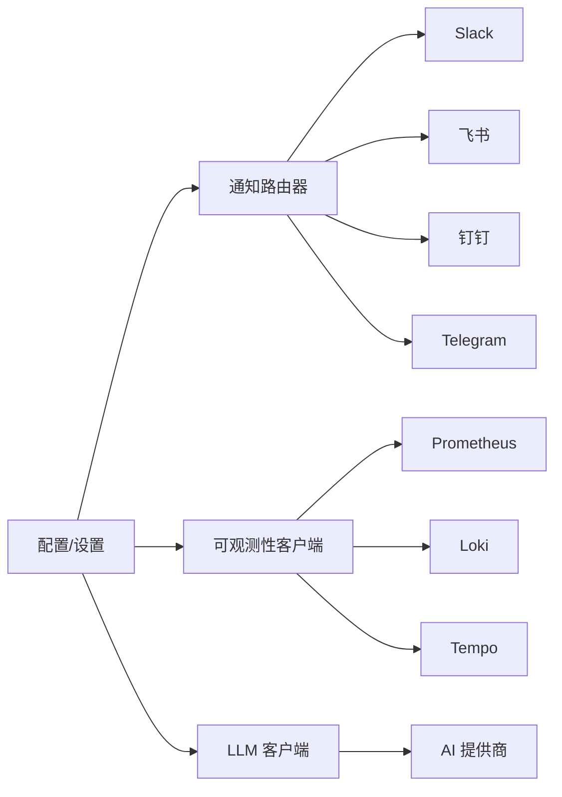

# 集成生态

<cite>
**本文引用的文件**
- [docker-compose.yml](file://deploy/install/docker-compose.yml)
- [llm/client.go](file://internal/pkg/llm/client.go)
- [llm/router.go](file://internal/pkg/llm/router.go)
- [setting/telemetry.go](file://internal/manager/biz/setting/telemetry.go)
- [setting/probe.go](file://internal/manager/biz/setting/probe.go)
- [notify/notify.go](file://internal/pkg/notify/notify.go)
- [notify/webhook.go](file://internal/pkg/notify/webhook.go)
- [config/config.go](file://internal/pkg/config/config.go)
- [imbridge/model.go](file://internal/manager/model/imbridge/model.go)
- [web/src/pages/settings/Integrations.tsx](file://web/src/pages/settings/Integrations.tsx)
- [web/src/api/imbridge.ts](file://web/src/api/imbridge.ts)
- [web/src/pages/EdgeDetail.tsx](file://web/src/pages/EdgeDetail.tsx)
- [prometheus/prometheus.yml](file://deploy/install/prometheus.yml)
- [grafana/datasources/prometheus.yml](file://deploy/grafana/provisioning/datasources/prometheus.yml)
- [grafana/datasources/loki.yml](file://deploy/grafana/provisioning/datasources/loki.yml)
- [grafana/datasources/tempo.yml](file://deploy/grafana/provisioning/datasources/tempo.yml)
</cite>

## 目录
1. [简介](#简介)
2. [项目结构](#项目结构)
3. [核心组件](#核心组件)
4. [架构总览](#架构总览)
5. [详细组件分析](#详细组件分析)
6. [依赖关系分析](#依赖关系分析)
7. [性能考虑](#性能考虑)
8. [故障排除指南](#故障排除指南)
9. [结论](#结论)
10. [附录：配置清单与示例路径](#附录配置清单与示例路径)

## 简介
本文件面向 Ongrid 平台的集成生态，系统性说明与主流监控与可观测性工具（Prometheus、Grafana、Loki、Tempo）的集成方式；数据库、消息队列、云平台 API 等数据源的接入方法；即时通讯渠道（Slack、Telegram、飞书、钉钉）的通知与双向 IM 桥接；以及 OpenAI、Anthropic、Gemini 等 AI 模型提供商的认证与授权机制。文档同时给出最佳实践、性能优化建议、常见场景配置示例与故障排除指引。

## 项目结构
Ongrid 通过容器编排将核心服务与可观测性栈一体化部署，并提供统一的 Manager 侧能力与 Edge 侧采集插件。关键集成点包括：
- 可观测性后端：Prometheus（指标）、Loki（日志）、Tempo（链路）、Grafana（可视化）
- 通知与 IM：Webhook、Slack、飞书、钉钉、Telegram；以及多平台 IM 桥接（Stream/Webhook）
- AI 模型路由：OpenAI、Anthropic、智谱 GLM、Gemini 等统一客户端与提供者路由
- 数据源接入：数据库导出器（MySQL/PostgreSQL/MongoDB/Redis 等），Edge 插件推送 OTLP 遥测

图表来源
- [docker-compose.yml:52-271](file://deploy/install/docker-compose.yml#L52-L271)
- [docker-compose.yml:339-426](file://deploy/install/docker-compose.yml#L339-L426)
- [docker-compose.yml:470-519](file://deploy/install/docker-compose.yml#L470-L519)

章节来源
- [docker-compose.yml:1-528](file://deploy/install/docker-compose.yml#L1-L528)

## 核心组件
- 可观测性数据面
  - Prometheus：接收 remote_write 并暴露 PromQL 查询接口，供 AIOps 工具查询指标
  - Loki：日志写入与查询，配合 Grafana Explore
  - Tempo：OTLP HTTP/gRPC 接收链路数据，提供 TraceQL 查询
  - Grafana：预置数据源与仪表盘，支持从告警/事件直接钻取到 Explore
- 通知与 IM
  - 通知通道：Webhook、Slack、飞书、钉钉、Telegram；支持签名校验与超时控制
  - IM 桥接：支持 Stream（长连接/出站）与 Webhook（入站）两种模式，适配不同网络拓扑
- AI 模型
  - 统一客户端封装 OpenAI 兼容协议，支持多提供者路由、预算控制、重试与度量
  - 环境变量与设置项驱动默认提供者与模型列表

章节来源
- [docker-compose.yml:141-151](file://deploy/install/docker-compose.yml#L141-L151)
- [docker-compose.yml:339-426](file://deploy/install/docker-compose.yml#L339-L426)
- [docker-compose.yml:470-519](file://deploy/install/docker-compose.yml#L470-L519)
- [notify/notify.go:1-171](file://internal/pkg/notify/notify.go#L1-L171)
- [notify/webhook.go:1-314](file://internal/pkg/notify/webhook.go#L1-L314)
- [llm/client.go:1-732](file://internal/pkg/llm/client.go#L1-L732)
- [llm/router.go:18-59](file://internal/pkg/llm/router.go#L18-L59)

## 架构总览
下图展示了 Ongrid 在部署形态下的集成关系：Manager 作为中枢，向 Prometheus/Loki/Tempo 写入或查询数据，并通过通知通道对外发送告警；IM 桥接提供双向会话；LLM 路由将请求分发至配置的 AI 提供商。

图表来源
- [docker-compose.yml:141-151](file://deploy/install/docker-compose.yml#L141-L151)
- [docker-compose.yml:339-426](file://deploy/install/docker-compose.yml#L339-L426)
- [docker-compose.yml:470-519](file://deploy/install/docker-compose.yml#L470-L519)
- [notify/notify.go:75-90](file://internal/pkg/notify/notify.go#L75-L90)
- [llm/client.go:387-507](file://internal/pkg/llm/client.go#L387-L507)

## 详细组件分析

### 监控与可观测性集成（Prometheus、Grafana、Loki、Tempo）
- 指标（Prometheus）
  - Manager 通过环境变量启用内置 Prometheus，并配置 remote_write 与查询 URL
  - 支持对接外部 TSDB（VictoriaMetrics、Mimir、Cortex、Thanos receive），无需重启即可生效
  - 前端“Prometheus 集成”卡片提供 URL、Basic/Bearer 鉴权、TLS 选项
- 日志（Loki）
  - 单二进制 Loki 运行于容器内，仅暴露内部端口；公网访问经 nginx + edgeauth 鉴权
  - Grafana 预置 Loki 数据源，Explore 可直接跳转
- 链路（Tempo）
  - OTLP HTTP :4318 与 gRPC :4317 接收链路数据；HTTP 查询 :3200
  - Manager 侧提供就绪探针检查 /ready，确保链路查询可用
- 可视化（Grafana）
  - 预置数据源（Prometheus/Loki/Tempo），支持子路径部署
  - 告警/事件页面支持一键跳转到 Explore，自动计算时间窗口

图表来源
- [docker-compose.yml:141-151](file://deploy/install/docker-compose.yml#L141-L151)
- [docker-compose.yml:339-426](file://deploy/install/docker-compose.yml#L339-L426)
- [docker-compose.yml:470-519](file://deploy/install/docker-compose.yml#L470-L519)
- [setting/telemetry.go:42-83](file://internal/manager/biz/setting/telemetry.go#L42-L83)
- [setting/probe.go:83-106](file://internal/manager/biz/setting/probe.go#L83-L106)
- [web/src/pages/settings/Integrations.tsx:229-252](file://web/src/pages/settings/Integrations.tsx#L229-L252)
- [web/src/pages/settings/Integrations.tsx:1571-1602](file://web/src/pages/settings/Integrations.tsx#L1571-L1602)

章节来源
- [docker-compose.yml:141-151](file://deploy/install/docker-compose.yml#L141-L151)
- [docker-compose.yml:339-426](file://deploy/install/docker-compose.yml#L339-L426)
- [docker-compose.yml:470-519](file://deploy/install/docker-compose.yml#L470-L519)
- [setting/telemetry.go:42-83](file://internal/manager/biz/setting/telemetry.go#L42-L83)
- [setting/probe.go:83-106](file://internal/manager/biz/setting/probe.go#L83-L106)
- [web/src/pages/settings/Integrations.tsx:229-252](file://web/src/pages/settings/Integrations.tsx#L229-L252)
- [web/src/pages/settings/Integrations.tsx:1571-1602](file://web/src/pages/settings/Integrations.tsx#L1571-L1602)

### 数据源接入（数据库、消息队列、云平台 API）
- 数据库采集
  - 支持 MySQL、PostgreSQL、MongoDB、Redis 等类型，Edge 侧通过插件导出指标
  - 凭据通过隧道一次性下发至 Edge 本地 Secret，Manager 不保存明文
  - 提供模板化配置（连接信息、TLS、采样限制、标签过滤）
- 消息队列与云 API
  - 通过 Edge 插件与自定义采集器接入；结合 Prometheus remote_write 统一汇聚
  - 云平台 API 可通过 Skill/Tool 调用，结果回写至指标/日志/知识库

图表来源
- [web/src/pages/EdgeDetail.tsx:2868-2966](file://web/src/pages/EdgeDetail.tsx#L2868-L2966)
- [web/src/pages/EdgeDetail.tsx:3315-3424](file://web/src/pages/EdgeDetail.tsx#L3315-L3424)

章节来源
- [web/src/pages/EdgeDetail.tsx:2868-2966](file://web/src/pages/EdgeDetail.tsx#L2868-L2966)
- [web/src/pages/EdgeDetail.tsx:3315-3424](file://web/src/pages/EdgeDetail.tsx#L3315-L3424)

### 即时通讯渠道与 IM 桥接（Slack、Telegram、飞书、钉钉）
- 通知通道
  - 支持 Webhook、Slack、飞书、钉钉、Telegram；可配置名称、超时、默认通道
  - 飞书/钉钉支持签名校验；Slack 使用 Incoming Webhook；Telegram 使用 Bot API
- IM 桥接
  - 支持 Stream（出站长连接/WebSocket）与 Webhook（入站回调）两种模式
  - 支持白名单 allow_from 安全策略；Telegram/Slack 要求 allow_from 防止滥用
  - 支持多语言 locale 与 idle_timeout_seconds 等参数

图表来源
- [notify/notify.go:75-90](file://internal/pkg/notify/notify.go#L75-L90)
- [notify/notify.go:95-130](file://internal/pkg/notify/notify.go#L95-L130)
- [notify/webhook.go:27-45](file://internal/pkg/notify/webhook.go#L27-L45)
- [notify/webhook.go:141-192](file://internal/pkg/notify/webhook.go#L141-L192)
- [config/config.go:527-534](file://internal/pkg/config/config.go#L527-L534)

章节来源
- [notify/notify.go:1-171](file://internal/pkg/notify/notify.go#L1-L171)
- [notify/webhook.go:1-314](file://internal/pkg/notify/webhook.go#L1-L314)
- [config/config.go:527-534](file://internal/pkg/config/config.go#L527-L534)
- [web/src/api/imbridge.ts:1-33](file://web/src/api/imbridge.ts#L1-L33)
- [imbridge/model.go:1-34](file://internal/manager/model/imbridge/model.go#L1-L34)

### 第三方 AI 服务认证与授权（OpenAI、Anthropic、Gemini）
- 统一客户端
  - 遵循 OpenAI 协议形状，支持 BaseURL 覆盖、超时控制、预算限制、度量与重试
  - 对推理模型（如 o-series、gpt-5.x）自动处理温度等采样参数
- 提供者路由
  - 支持 openai、anthropic、zhipu、gemini 等多提供者；可从环境变量或设置项动态解析
  - 默认提供者可由环境或 UI 选择；未配置时返回 noop 并提示缺少密钥
- 安全与成本
  - 预算检查在请求前进行，记录实际用量；避免超支
  - 敏感字段（如 API Key）不在指标标签中泄露

图表来源
- [llm/client.go:387-507](file://internal/pkg/llm/client.go#L387-L507)
- [llm/client.go:117-128](file://internal/pkg/llm/client.go#L117-L128)
- [llm/router.go:18-59](file://internal/pkg/llm/router.go#L18-L59)

章节来源
- [llm/client.go:1-732](file://internal/pkg/llm/client.go#L1-L732)
- [llm/router.go:18-59](file://internal/pkg/llm/router.go#L18-L59)

## 依赖关系分析
- Manager 与可观测性后端
  - 通过环境变量与设置项管理 Prometheus/Loki/Tempo 的连接与鉴权
  - Grafana 数据源由 provisioning YAML 预置，便于快速启用
- 通知与 IM
  - 通知路由器根据配置注册各通道 Sender；支持超时与默认通道
  - IM 桥接支持多提供者与模式（Stream/Webhook），并具备安全白名单
- AI 模型
  - 客户端缓存 SDK 实例并按 (apiKey, baseURL) 区分；Resolver 提供动态凭证
  - 预算检查与度量贯穿调用链

图表来源
- [notify/notify.go:75-90](file://internal/pkg/notify/notify.go#L75-L90)
- [docker-compose.yml:141-151](file://deploy/install/docker-compose.yml#L141-L151)
- [docker-compose.yml:339-426](file://deploy/install/docker-compose.yml#L339-L426)
- [docker-compose.yml:470-519](file://deploy/install/docker-compose.yml#L470-L519)
- [llm/client.go:222-261](file://internal/pkg/llm/client.go#L222-L261)

章节来源
- [notify/notify.go:75-90](file://internal/pkg/notify/notify.go#L75-L90)
- [docker-compose.yml:141-151](file://deploy/install/docker-compose.yml#L141-L151)
- [docker-compose.yml:339-426](file://deploy/install/docker-compose.yml#L339-L426)
- [docker-compose.yml:470-519](file://deploy/install/docker-compose.yml#L470-L519)
- [llm/client.go:222-261](file://internal/pkg/llm/client.go#L222-L261)

## 性能考虑
- 指标存储与查询
  - 合理设置 Prometheus 保留时间与大小上限，避免磁盘压力
  - 对高基数标签进行 drop 或重命名，减少内存占用
- 日志与链路
  - 控制日志采样率与批量大小；链路采样按业务重要性调整
  - 使用 Grafana Explore 的时间窗口与聚合降低查询负载
- 通知与 IM
  - 为每个通道设置合理的超时；避免阻塞主流程
  - 使用去重键（dedupe_key）抑制重复告警风暴
- AI 模型
  - 启用预算检查与默认超时；对推理模型避免发送不支持的采样参数
  - 使用 Resolver 缓存凭证，减少频繁读取设置的开销

[本节为通用指导，不直接分析具体文件]

## 故障排除指南
- 无法写入指标
  - 检查 Manager 的 Prometheus URL、Remote Write URL、鉴权与 TLS 配置
  - 确认 Prometheus 已启用 remote_write 接收器且端口可达
- 日志不可见
  - 确认 Loki 配置与 nginx edgeauth 鉴权正确；验证 Grafana 数据源 URL
- 链路查询失败
  - 检查 Tempo OTLP 端点与 HTTP 查询端点；使用就绪探针验证
- 通知发送失败
  - 核对通道名称、URL、Secret；查看通知超时与错误信息
  - 飞书/钉钉需校验签名；Slack 使用 Incoming Webhook URL 鉴权
- IM 桥接无消息
  - 确认 Stream/Webhook 模式与 allow_from 白名单；检查代理与防火墙
- AI 调用报错
  - 检查 Provider 的 API Key、BaseURL、默认模型；留意预算超限错误

章节来源
- [docker-compose.yml:141-151](file://deploy/install/docker-compose.yml#L141-L151)
- [docker-compose.yml:339-426](file://deploy/install/docker-compose.yml#L339-L426)
- [docker-compose.yml:470-519](file://deploy/install/docker-compose.yml#L470-L519)
- [notify/notify.go:95-130](file://internal/pkg/notify/notify.go#L95-L130)
- [notify/webhook.go:274-314](file://internal/pkg/notify/webhook.go#L274-L314)
- [llm/client.go:387-507](file://internal/pkg/llm/client.go#L387-L507)

## 结论
Ongrid 提供了开箱即用的可观测性集成与灵活的扩展能力：通过统一的数据面（Prometheus/Loki/Tempo）与可视化（Grafana），结合多渠道通知与 IM 桥接，形成完整的运维闭环；AI 模型路由与预算控制保障智能能力的稳定与可控。建议在生产环境中严格配置鉴权与 TLS、合理设置保留与采样策略、并为通知与 IM 配置超时与白名单，以获得最佳稳定性与性能。

[本节为总结性内容，不直接分析具体文件]

## 附录：配置清单与示例路径
- 可观测性数据源
  - Prometheus 数据源：[prometheus.yml](file://deploy/grafana/provisioning/datasources/prometheus.yml)
  - Loki 数据源：[loki.yml](file://deploy/grafana/provisioning/datasources/loki.yml)
  - Tempo 数据源：[tempo.yml](file://deploy/grafana/provisioning/datasources/tempo.yml)
  - 内置 Prometheus 配置：[prometheus.yml](file://deploy/install/prometheus.yml)
- 通知通道与环境变量
  - 通知配置加载：[config.go:527-534](file://internal/pkg/config/config.go#L527-L534)
  - 通知路由器与 Sender：[notify.go:75-90](file://internal/pkg/notify/notify.go#L75-L90)、[webhook.go:27-45](file://internal/pkg/notify/webhook.go#L27-L45)
- IM 桥接
  - 前端 API 定义：[imbridge.ts:1-33](file://web/src/api/imbridge.ts#L1-L33)
  - 模型与提供者常量：[model.go:1-34](file://internal/manager/model/imbridge/model.go#L1-L34)
- 数据库采集
  - 模板与编辑器：[EdgeDetail.tsx:2868-2966](file://web/src/pages/EdgeDetail.tsx#L2868-L2966)、[EdgeDetail.tsx:3315-3424](file://web/src/pages/EdgeDetail.tsx#L3315-L3424)
- AI 模型
  - 客户端与路由：[client.go:1-732](file://internal/pkg/llm/client.go#L1-L732)、[router.go:18-59](file://internal/pkg/llm/router.go#L18-L59)

章节来源
- [docker-compose.yml:141-151](file://deploy/install/docker-compose.yml#L141-L151)
- [docker-compose.yml:339-426](file://deploy/install/docker-compose.yml#L339-L426)
- [docker-compose.yml:470-519](file://deploy/install/docker-compose.yml#L470-L519)
- [notify/notify.go:75-90](file://internal/pkg/notify/notify.go#L75-L90)
- [notify/webhook.go:27-45](file://internal/pkg/notify/webhook.go#L27-L45)
- [config/config.go:527-534](file://internal/pkg/config/config.go#L527-L534)
- [web/src/api/imbridge.ts:1-33](file://web/src/api/imbridge.ts#L1-L33)
- [imbridge/model.go:1-34](file://internal/manager/model/imbridge/model.go#L1-L34)
- [web/src/pages/EdgeDetail.tsx:2868-2966](file://web/src/pages/EdgeDetail.tsx#L2868-L2966)
- [web/src/pages/EdgeDetail.tsx:3315-3424](file://web/src/pages/EdgeDetail.tsx#L3315-L3424)
- [llm/client.go:1-732](file://internal/pkg/llm/client.go#L1-L732)
- [llm/router.go:18-59](file://internal/pkg/llm/router.go#L18-L59)