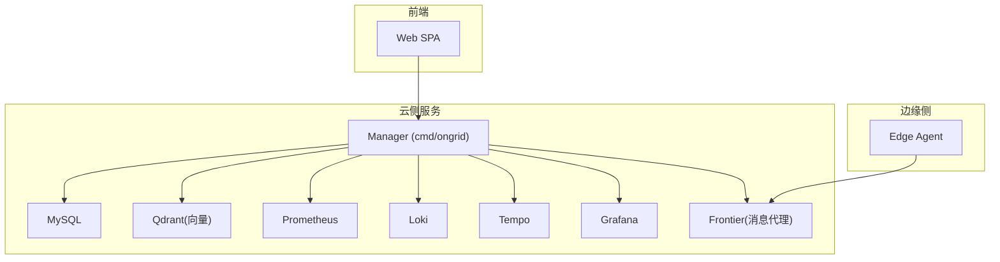
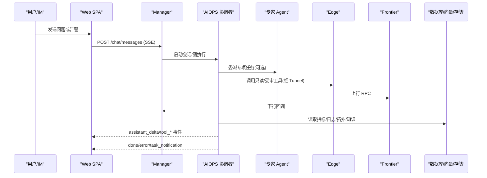
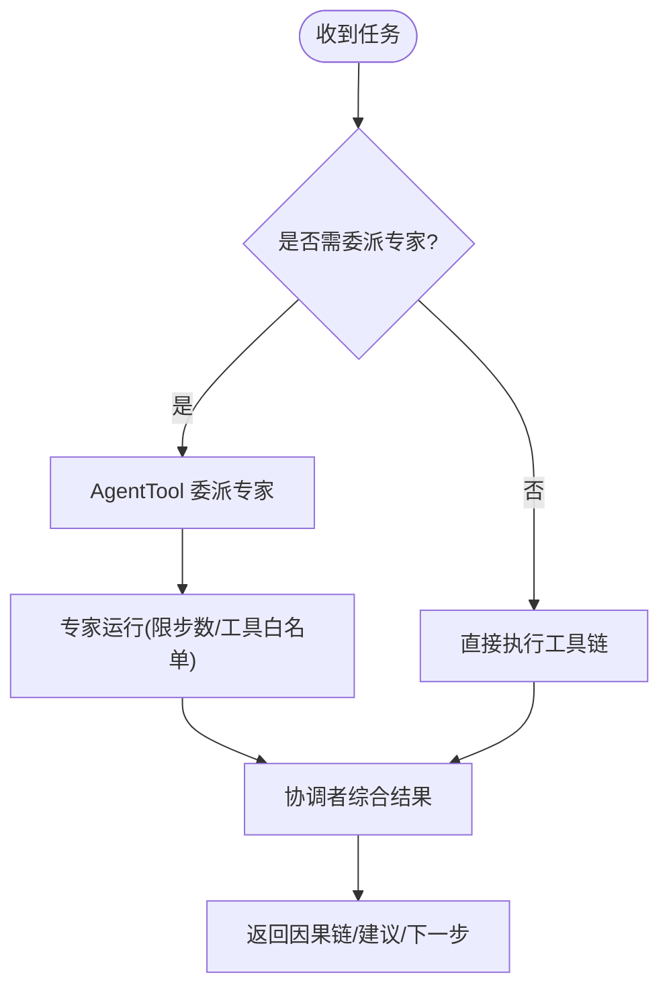
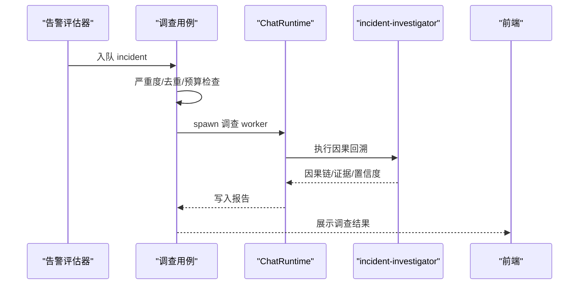
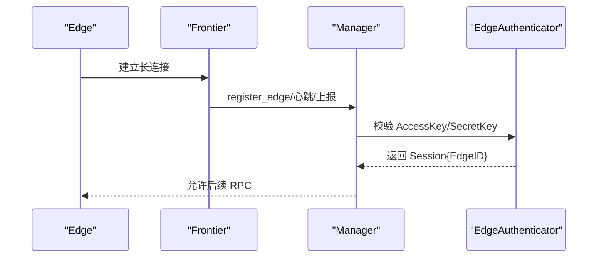
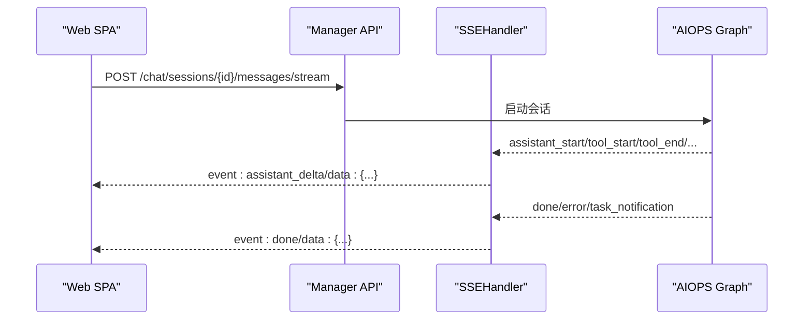
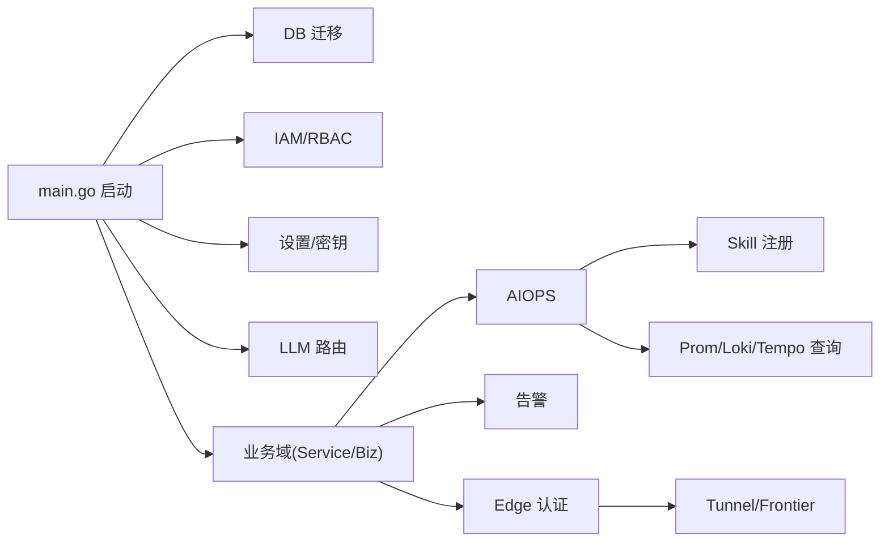

# 项目概述

<cite>
**本文引用的文件**
- [README.md](file://README.md)
- [cmd/ongrid/main.go](file://cmd/ongrid/main.go)
- [deploy/docker-compose.yml](file://deploy/docker-compose.yml)
- [deploy/install/install.sh](file://deploy/install/install.sh)
- [agents/incident-investigator.md](file://agents/incident-investigator.md)
- [agents/specialist-ops.md](file://agents/specialist-ops.md)
- [internal/pkg/tunnel/types.go](file://internal/pkg/tunnel/types.go)
- [internal/manager/service/frontierbound/handlers.go](file://internal/manager/service/frontierbound/handlers.go)
- [internal/manager/biz/edge/authn.go](file://internal/manager/biz/edge/authn.go)
- [internal/manager/biz/alert/investigator/usecase.go](file://internal/manager/biz/alert/investigator/usecase.go)
- [internal/manager/biz/aiops/graph/callbacks/sse.go](file://internal/manager/biz/aiops/graph/callbacks/sse.go)
- [web/src/api/chat.ts](file://web/src/api/chat.ts)
- [internal/manager/server/operatorrun/http.go](file://internal/manager/server/operatorrun/http.go)
</cite>

## 目录
1. [简介](#简介)
2. [项目结构](#项目结构)
3. [核心组件](#核心组件)
4. [架构总览](#架构总览)
5. [关键组件详解](#关键组件详解)
6. [依赖关系分析](#依赖关系分析)
7. [性能与可扩展性](#性能与可扩展性)
8. [故障排查指南](#故障排查指南)
9. [结论](#结论)
10. [附录：快速开始](#附录快速开始)

## 简介
Ongrid 是一个 AI Agent 驱动的运维平台，目标是让系统“理解基础设施、定位根因并自动修复”。它把指标、日志、链路、拓扑、变更事件与知识检索整合在一起，通过协调者（Coordinator）与专家型 Agent（Specialists）协作，实现告警驱动自动调查、RCA 因果溯源、只读工具审计执行、以及受审批的写操作。平台支持零信任安全架构（Edge 主动拨号、无入站端口）、多云与 Kubernetes 生命周期管理、以及基于 SSE 的实时通信机制，并提供一键式可观测性栈部署能力。

核心价值主张
- 以 Agent 为中心的自动化：从告警到 RCA 再到修复建议，端到端闭环
- 零信任数据面：Edge 外连，主机不暴露 SSH/HTTP 端口
- 多模型路由与 RAG：Bring Your Own Model + 本地/云端嵌入向量库
- 全栈可观测性：Prometheus/Loki/Tempo/Grafana 开箱即用
- 工作流与技能市场：可编排、可审计、可复用

## 项目结构
仓库采用分层与领域划分相结合的组织方式：
- cmd：服务入口（云侧 ongrid、边缘 ongrid-edge）
- internal：业务域与通用库
  - manager：云平台侧业务（AIOPS、告警、设备、Kubernetes、日志、追踪、设置、MCP、工作流等）
  - edgeagent：边缘采集、插件、命令策略、抓包、升级等
  - iam：身份与权限（组织、成员、用户、RBAC）
  - skill：Agent 技能注册与执行
  - pkg：跨域通用库（LLM、Tunnel、鉴权、配置、日志、查询客户端等）
- api：gRPC/Proto 接口定义（IAM、AIOps、Alert、Edge、K8s、Logs、Metric、Notification、PacketCapture、Setting、Tunnel）
- deploy：安装脚本、Docker Compose、Nginx、Grafana/Loki/Tempo/Prometheus/SearXNG/Qdrant 配置
- web：前端 SPA（React/TypeScript），包含聊天、监控、拓扑、知识库、工作流等页面
- agents：Agent 角色与行为规范（incident-investigator、specialist-*、reviewer）
- scripts：发布、测试、验证脚本

图表来源
- [cmd/ongrid/main.go:1-12](file://cmd/ongrid/main.go#L1-L12)
- [deploy/docker-compose.yml:39-185](file://deploy/docker-compose.yml#L39-L185)
- [deploy/docker-compose.yml:214-367](file://deploy/docker-compose.yml#L214-L367)

章节来源
- [cmd/ongrid/main.go:1-12](file://cmd/ongrid/main.go#L1-L12)
- [deploy/docker-compose.yml:1-12](file://deploy/docker-compose.yml#L1-L12)

## 核心组件
- 协调者与专家 Agent：协调者负责任务拆解与调度；专家 Agent（如 incident-investigator、specialist-ops）专注特定领域，具备受限工具集与最大迭代次数控制，避免空转与越权。
- 告警驱动 RCA：当告警触发时，自动派生调查 worker，结合拓扑、指标、日志、链路、变更事件进行因果回溯，输出证据链与置信度。
- 零信任隧道：Edge 主动连接 Frontier 建立长连接，Manager 通过服务绑定端口与 Edge 通信；每次调用都经过 AccessKey/SecretKey 认证。
- 实时通信：SSE 将 Agent 运行过程（assistant_start/delta/end、tool_start/end、done/error、task_notification）推送到前端，提供“边思考边呈现”的体验。
- 多云与 K8s 生命周期：通过 Edge 接入集群，统一纳管节点、Pod、Workload、事件，并与拓扑关联。
- 可观测性栈：内置 Prometheus/Loki/Tempo/Grafana，Agent 可直接生成查询与面板。

章节来源
- [agents/incident-investigator.md:1-121](file://agents/incident-investigator.md#L1-L121)
- [agents/specialist-ops.md:1-72](file://agents/specialist-ops.md#L1-L72)
- [internal/manager/biz/alert/investigator/usecase.go:1-32](file://internal/manager/biz/alert/investigator/usecase.go#L1-L32)
- [internal/pkg/tunnel/types.go:1-31](file://internal/pkg/tunnel/types.go#L1-L31)
- [internal/manager/service/frontierbound/handlers.go:55-67](file://internal/manager/service/frontierbound/handlers.go#L55-L67)
- [internal/manager/biz/edge/authn.go:57-74](file://internal/manager/biz/edge/authn.go#L57-L74)
- [internal/manager/biz/aiops/graph/callbacks/sse.go:22-49](file://internal/manager/biz/aiops/graph/callbacks/sse.go#L22-L49)
- [web/src/api/chat.ts:247-280](file://web/src/api/chat.ts#L247-L280)

## 架构总览
Ongrid 由云侧 Manager 与边缘 Edge 组成，通过 Frontier 消息代理建立双向通道。Manager 暴露 HTTP API、Prometheus /metrics，并集成 IAM、AIOPS、告警、日志、追踪、设置、工作流等能力。Edge 负责采集、插件、命令策略、抓包、升级等。前端通过 Nginx 反向代理访问 Manager API，并通过 SSE 获取 Agent 实时事件。

图表来源
- [cmd/ongrid/main.go:1-12](file://cmd/ongrid/main.go#L1-L12)
- [internal/manager/biz/aiops/graph/callbacks/sse.go:22-49](file://internal/manager/biz/aiops/graph/callbacks/sse.go#L22-L49)
- [internal/pkg/tunnel/types.go:1-31](file://internal/pkg/tunnel/types.go#L1-L31)
- [web/src/api/chat.ts:247-280](file://web/src/api/chat.ts#L247-L280)

## 关键组件详解

### 协调者与专家 Agent
- 协调者：负责任务分解、上下文聚合、预算与迭代控制、委派专家。
- 专家 Agent：
  - incident-investigator：顺因果链溯源到“0 号病人”，产出根因、因果链、现象、置信度与验证建议。
  - specialist-ops：聚焦单台机器的服务/进程/计划任务状态与恢复建议，任何写操作走审批。
- 能力声明与工具白名单/黑名单、最大迭代次数、权限模式在 Agent 描述中固化，确保可审计与可控。

图表来源
- [agents/incident-investigator.md:1-121](file://agents/incident-investigator.md#L1-L121)
- [agents/specialist-ops.md:1-72](file://agents/specialist-ops.md#L1-L72)
- [internal/manager/biz/aiops/tools/agent_tool.go:152-163](file://internal/manager/biz/aiops/tools/agent_tool.go#L152-L163)

章节来源
- [agents/incident-investigator.md:1-121](file://agents/incident-investigator.md#L1-L121)
- [agents/specialist-ops.md:1-72](file://agents/specialist-ops.md#L1-L72)

### 告警驱动 RCA 流水线
- 告警触发后，PipelineEvaluator 通知路径将事件入队至调查用例。
- 调查用例根据严重度、去重、预算门控决定是否 spawn 调查 worker。
- Worker 运行 incident-investigator agent，最终写入 investigation_reports，供前端 IncidentDetail 渲染。

图表来源
- [internal/manager/biz/alert/investigator/usecase.go:1-32](file://internal/manager/biz/alert/investigator/usecase.go#L1-L32)
- [agents/incident-investigator.md:63-121](file://agents/incident-investigator.md#L63-L121)

章节来源
- [internal/manager/biz/alert/investigator/usecase.go:1-32](file://internal/manager/biz/alert/investigator/usecase.go#L1-L32)

### 零信任安全与 Edge 隧道
- 零入站端口：Edge 主动拨号到 Frontier，Manager 仅监听服务绑定端口；主机无需开放 SSH/HTTP。
- 认证：AccessKey/SecretKey 校验成功后建立 Session（含 EdgeID），后续所有 RPC 均携带该身份。
- 审计：所有调用经 Tunnel 层转发，配合命令策略与 RBAC 审计。

图表来源
- [internal/pkg/tunnel/types.go:1-31](file://internal/pkg/tunnel/types.go#L1-L31)
- [internal/manager/service/frontierbound/handlers.go:55-67](file://internal/manager/service/frontierbound/handlers.go#L55-L67)
- [internal/manager/biz/edge/authn.go:57-74](file://internal/manager/biz/edge/authn.go#L57-L74)

章节来源
- [internal/pkg/tunnel/types.go:1-31](file://internal/pkg/tunnel/types.go#L1-L31)
- [internal/manager/service/frontierbound/handlers.go:55-67](file://internal/manager/service/frontierbound/handlers.go#L55-L67)
- [internal/manager/biz/edge/authn.go:57-74](file://internal/manager/biz/edge/authn.go#L57-L74)

### 实时通信（SSE）
- 后端通过 SSEHandler 将 Agent 运行事件（assistant_start/delta/end、tool_start/end、done/error、task_notification）推送到前端。
- 前端使用 fetch 打开 SSE 流，按事件类型追加消息、工具调用状态与完成信号。

图表来源
- [internal/manager/biz/aiops/graph/callbacks/sse.go:22-49](file://internal/manager/biz/aiops/graph/callbacks/sse.go#L22-L49)
- [web/src/api/chat.ts:247-280](file://web/src/api/chat.ts#L247-L280)
- [internal/manager/server/operatorrun/http.go:210-260](file://internal/manager/server/operatorrun/http.go#L210-L260)

章节来源
- [internal/manager/biz/aiops/graph/callbacks/sse.go:22-49](file://internal/manager/biz/aiops/graph/callbacks/sse.go#L22-L49)
- [web/src/api/chat.ts:247-280](file://web/src/api/chat.ts#L247-L280)
- [internal/manager/server/operatorrun/http.go:210-260](file://internal/manager/server/operatorrun/http.go#L210-L260)

### 多云与 Kubernetes 生命周期
- 通过 Edge 接入集群，统一纳管节点、Pod、Workload、事件，并将资源映射到拓扑。
- 提供创建/列举/删除集群、节点与 Pod 过滤、事件拉取、健康摘要等能力。

章节来源
- [internal/manager/service/k8s/service.go:1-43](file://internal/manager/service/k8s/service.go#L1-L43)

## 依赖关系分析
- Manager 启动流程：加载配置 → 初始化 OTel → 打开数据库并迁移 → 构建 IAM/RBAC → 初始化设置与密钥 → 注入 LLM 路由 → 组装各业务域 Service/Server → 启动 HTTP/Metrics。
- 外部依赖：MySQL（默认）、Qdrant（向量）、Prometheus/Loki/Tempo/Grafana（可观测性）、Frontier（消息代理）。
- 模块耦合：AIOPS 依赖 LLM、SkillRegistry、Tunnel、Log/Trace/Prom 查询客户端；告警依赖调查用例与 ChatRuntime；Edge 认证依赖 EdgeBiz 与 Tunnel。

图表来源
- [cmd/ongrid/main.go:208-800](file://cmd/ongrid/main.go#L208-L800)

章节来源
- [cmd/ongrid/main.go:208-800](file://cmd/ongrid/main.go#L208-L800)

## 性能与可扩展性
- Agent 预算控制：专家 Agent 限制最大工具调用次数与迭代轮次，避免空转与过度消耗。
- 工具延迟与降级：ToolBag 延迟展开（超过阈值时对专业工具隐藏 schema，先搜索再展开），减少提示长度与成本。
- 并发与超时：SSE 事件流支持取消（AbortSignal），服务端会释放在途 Tunnel 调用；LLM 请求带默认超时。
- 可观测性：自监控指标（alert evaluator 延迟、prom remote_write 结果）与 OpenTelemetry 追踪，便于定位瓶颈。

[本节为通用指导，不直接分析具体文件]

## 故障排查指南
- 无法登录/鉴权失败：检查 JWT Secret 是否已替换默认值；确认 IAM/RBAC 策略已正确初始化。
- Edge 离线：确认 Frontier 可达、Edge 证书/密钥正确；查看 last_seen_at 与在线状态。
- 告警未触发 RCA：检查告警严重度、去重规则、租户预算；确认调查 worker 未被跳过。
- SSE 无事件：确认前端 Accept: text/event-stream；检查 SSEHandler 是否启用；查看 done/error 事件。
- 数据库/向量/可观测性不可用：检查 MySQL/Qdrant/Prom/Loki/Tempo 健康；核对环境变量与网络连通。

章节来源
- [cmd/ongrid/main.go:310-328](file://cmd/ongrid/main.go#L310-L328)
- [internal/manager/biz/alert/investigator/usecase.go:1-32](file://internal/manager/biz/alert/investigator/usecase.go#L1-L32)
- [internal/manager/biz/aiops/graph/callbacks/sse.go:22-49](file://internal/manager/biz/aiops/graph/callbacks/sse.go#L22-L49)

## 结论
Ongrid 通过“协调者+专家”的 Agent 体系，将可观测性数据、知识检索与运维动作串联起来，实现了从告警到根因、从诊断到修复建议的闭环。零信任隧道保障数据安全，SSE 提供实时交互体验，多云与 K8s 生命周期管理覆盖现代基础设施。配合一键部署的可观测性栈，团队可以快速落地智能运维。

[本节为总结，不直接分析具体文件]

## 附录：快速开始
目标：一条命令部署完整的可观测性栈与管理平面。

步骤
- 下载发行版并按架构解压
- 运行安装脚本，自动准备 Docker、Compose、TLS、数据目录、Edge 资产与 .env
- 启动 compose 服务，等待 MySQL、Frontier、Prometheus/Loki/Tempo/Grafana 就绪
- 浏览器访问 HTTPS 地址，首次登录管理员账号

参考命令（示例）
- AMD64：
  - wget https://github.com/ongridio/ongrid/releases/download/v0.13.4/ongrid-v0.13.4-linux-amd64.tar.xz
  - tar -xf ongrid-v0.13.4-linux-amd64.tar.xz && cd ongrid-v0.13.4-linux-amd64
  - sudo ./install.sh
- ARM64：
  - wget https://github.com/ongridio/ongrid/releases/download/v0.13.4/ongrid-v0.13.4-linux-arm64.tar.xz
  - tar -xf ongrid-v0.13.4-linux-arm64.tar.xz && cd ongrid-v0.13.4-linux-arm64
  - sudo ./install.sh

说明
- install.sh 会自动检测并安装 Docker/Compose（若缺失），生成 TLS 证书与随机密钥，准备 Edge 资产与数据目录，并引导填写 PUBLIC_URL 等关键参数。
- 生产环境建议使用自有域名与证书，并在 .env 中配置必要的密钥与模型凭据。

章节来源
- [README.md:58-86](file://README.md#L58-L86)
- [deploy/install/install.sh:1-120](file://deploy/install/install.sh#L1-L120)
- [deploy/install/install.sh:641-800](file://deploy/install/install.sh#L641-L800)