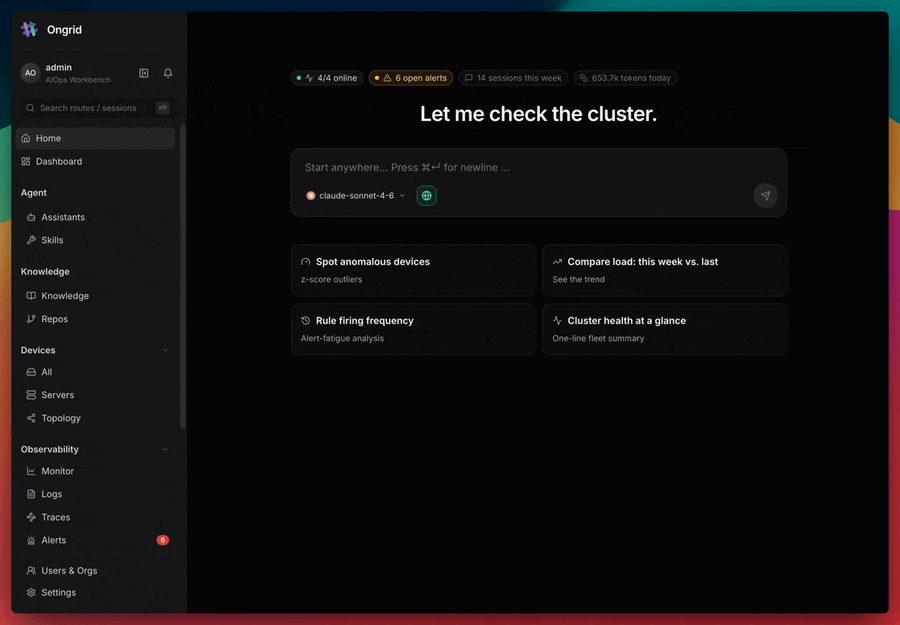
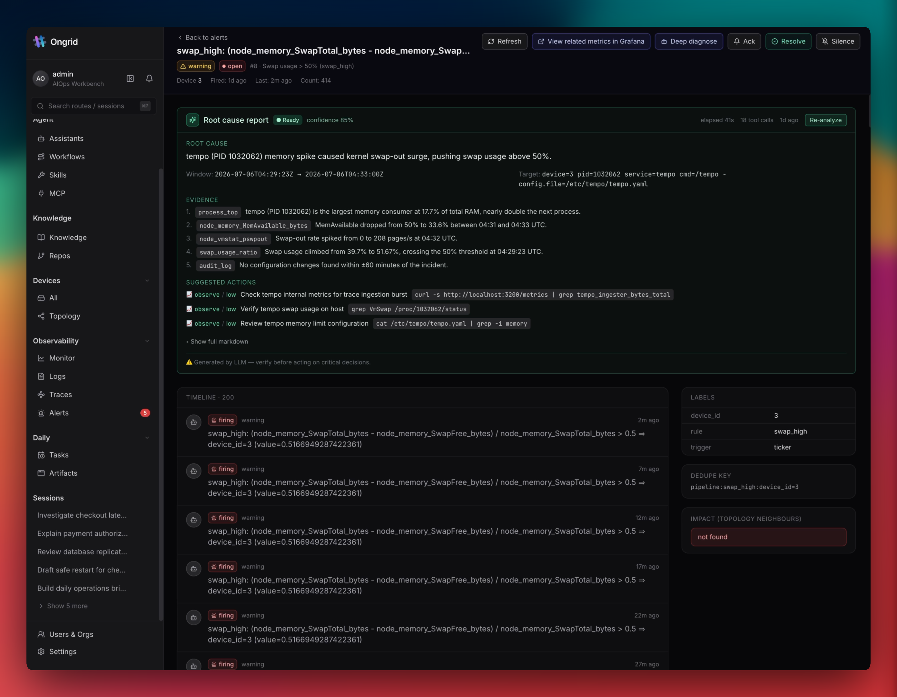
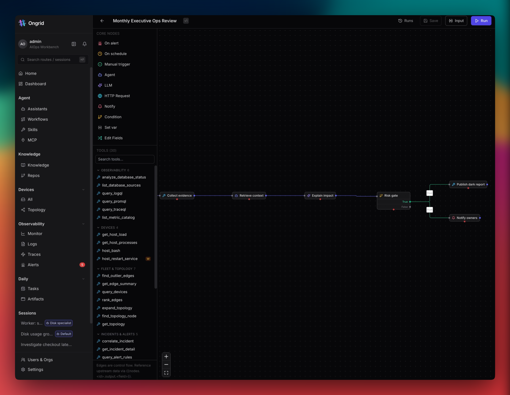
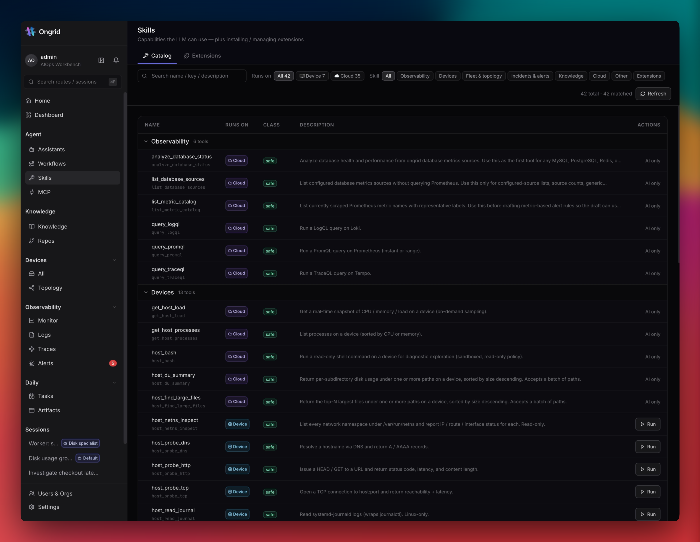
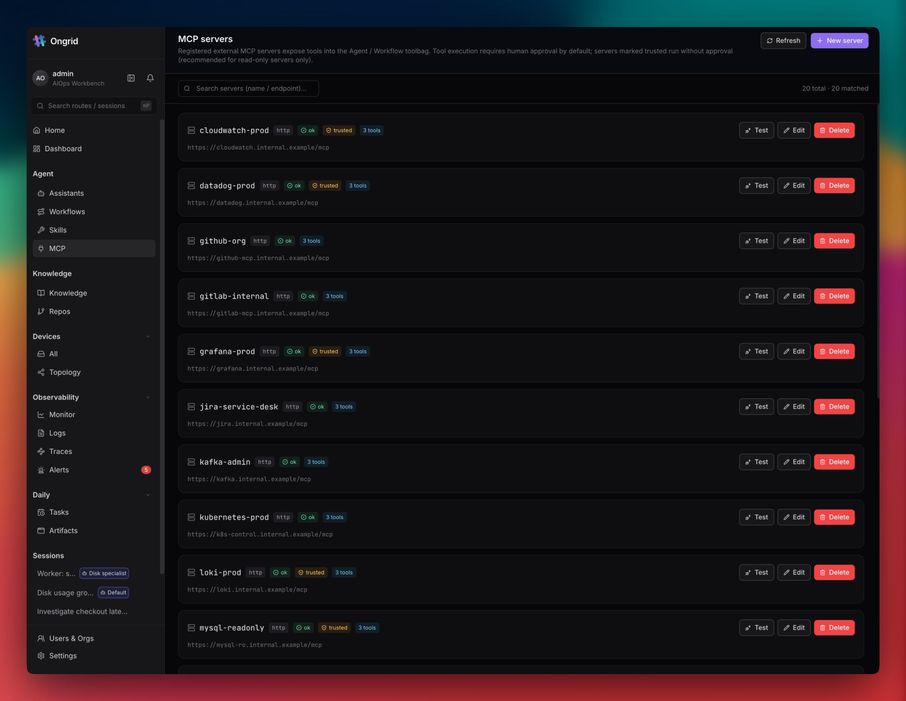
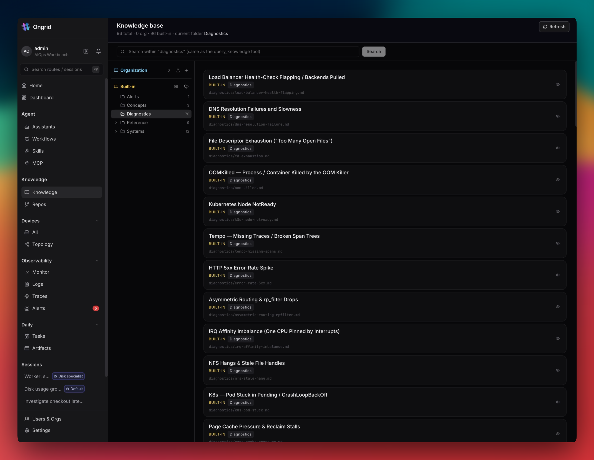
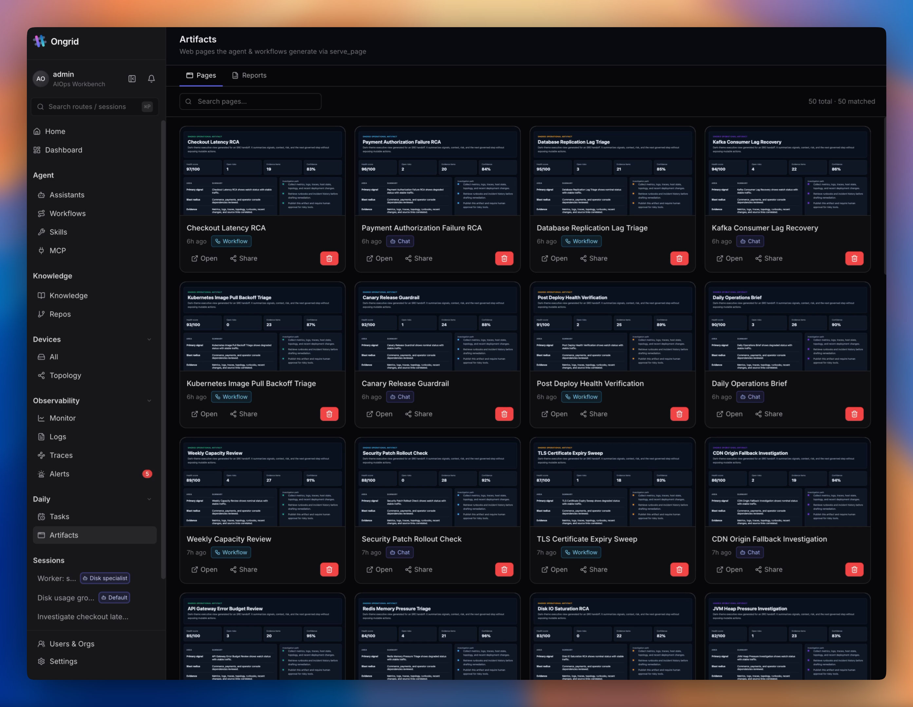
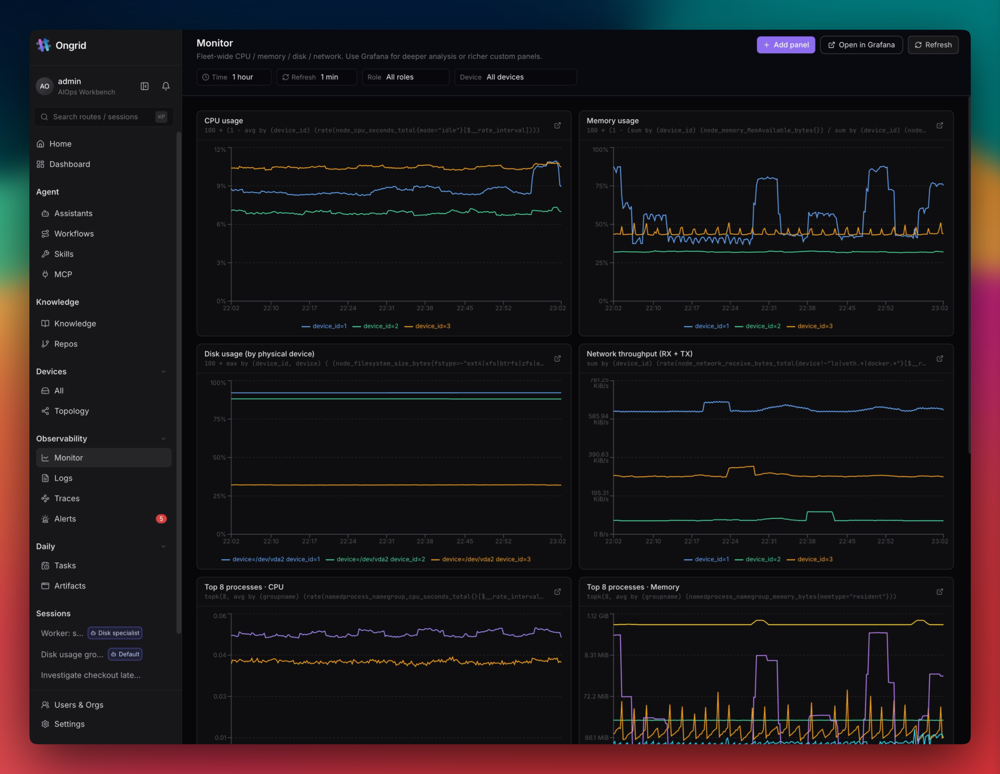
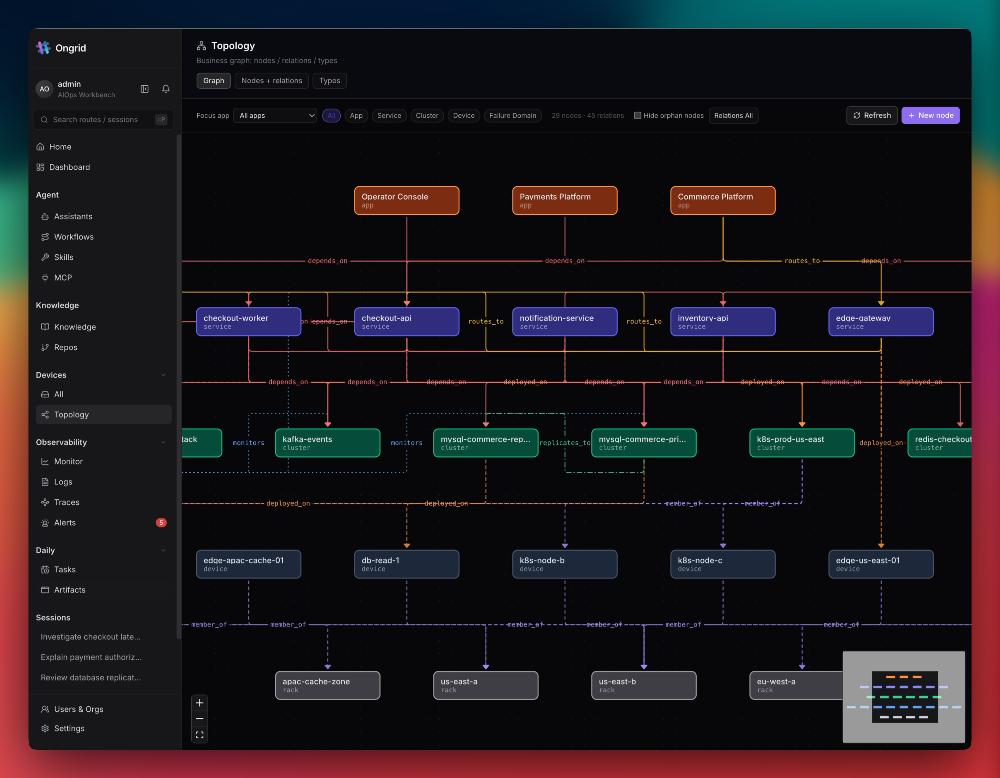
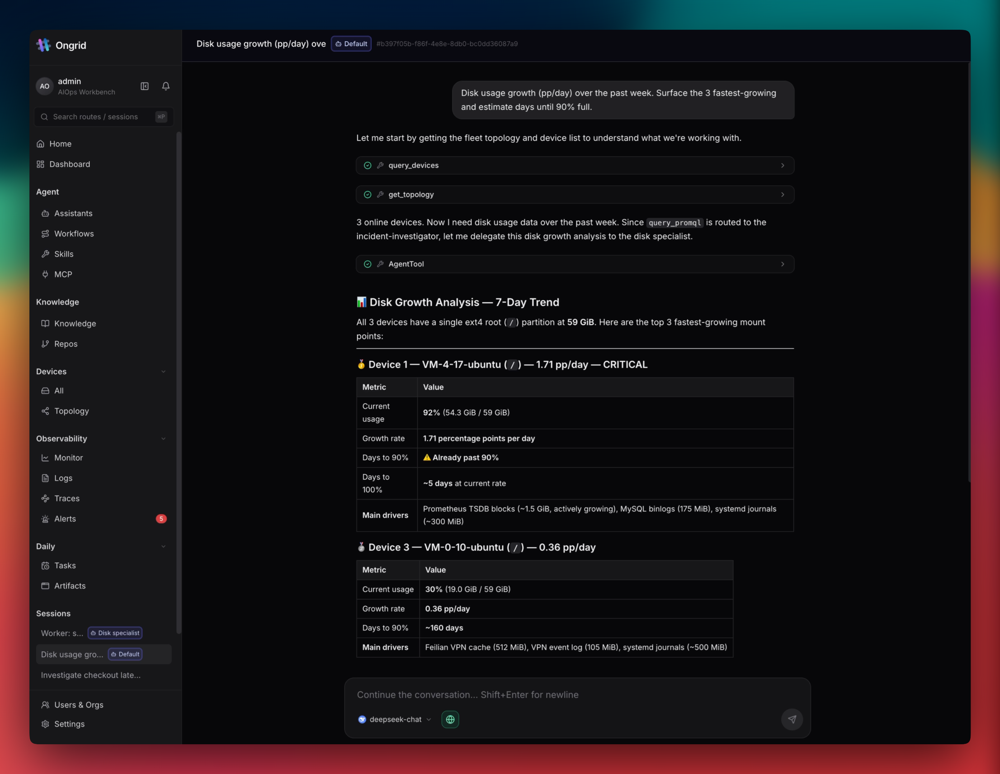

#  Ongrid

> **Ein Ops-KI-Agent, der deine Infrastruktur versteht, die Ursache findet und sie behebt — direkt aus Slack oder Telegram.**

*Metriken · Logs · Traces · Topologie-Auswirkungsbereich · Ursachenkorrelation · Remote-Ausführung · alarmgesteuerte Auto-Untersuchung · RAG-Suche über Wissen und Code · Spezialisten-Agenten und Skills.*

[](https://goreportcard.com/report/github.com/ongridio/ongrid)
[](https://github.com/ongridio/ongrid/releases/latest)
[](go.mod)
[](https://www.gnu.org/licenses/agpl-3.0.html)
[](#features)
[](CONTRIBUTING.md)
[](https://t.me/ongridai)
[](https://join.slack.com/t/ongrid-co/shared_invite/zt-400skx7hz-WU1nmF1XVYH4S3Q1NfWrbw)

<p>
  <a href="https://trendshift.io/repositories/48061?utm_source=repository-badge&amp;utm_medium=badge&amp;utm_campaign=badge-repository-48061" target="_blank" rel="noopener noreferrer">
    
  </a>
</p>

[English](./README.md) | [简体中文](./README_ZH.md) | [日本語](./README_JA.md) | [한국어](./README_KO.md) | [Español](./README_ES.md) | [Français](./README_FR.md) | Deutsch | [Português](./README_PT.md) | [Русский](./README_RU.md)

---

<p align="center">
  
</p>

<p align="center">
  
  <br />
  <strong>☸️ Kubernetes-Lebenszyklusverwaltung ist jetzt verfügbar</strong><br />
  <sub>Registrieren Sie Cluster über Edge, prüfen Sie Workloads und Ereignisse, verwalten Sie Upgrades und verbinden Sie Kubernetes-Ressourcen mit der Topologie.</sub>
</p>

<div align="center">

[Funktionen](#funktionen) • [Installation](#installation) • [Integrationen](#integrationen) • [Lizenz](#lizenz)

</div>

## Funktionen

- 🤖 **Coordinator + Specialist Agenten** — der Coordinator delegiert an SRE / Netzwerk / DB / Asset Sub-Agenten
- 🚨 **Auto-Investigation bei Alarm** — der Investigator startet einen RCA-Worker, schreibt die Ursache in den Chat
- 🔍 **Grundursachen-RCA** — durchläuft die Topologie, korreliert Metriken/Logs/Traces, identifiziert eine Quellcode-Zeile
- 🔒 **Null eingehende Ports** — der Edge wählt nach außen; kein Port 22 / 80 / 443 auf Hosts
- 💻 **SSH im Browser** — Shell über Rückwärtstunnel, keine Schlüssel, kein Jumpbox, alles auditiert
- 🐳 **Selbst-Hosting in einem Befehl** — `install.sh` startet die gesamte Stack
- 📊 **Eingebaute Observability** — Prometheus + Loki + Tempo + Grafana bereit, der Agent schreibt die Queries
- 🧠 **Eigenes Modell mitbringen** — Anthropic / OpenAI / GLM / DeepSeek / Gemini / Kimi, Hot-Routing
- 💬 **Zweiwege-IM-Kanäle** — Slack / Telegram / Larksuite / DingTalk / WeCom, Sprache pro Kanal
- 🛠️ **Schreibgeschützte Host-Tools** — bash Sandbox + 26+ Tools, jeder Aufruf auditiert
- ☸️ **Kubernetes-Lebenszyklus** — Cluster registrieren, Workloads und Events prüfen, Upgrades verwalten und Kubernetes-Ressourcen in die Topologie spiegeln
- 🌐 **Netzwerkgeräteverwaltung** — Nachbarn über Edge-Hosts erkennen, per SNMP prüfen, Schnittstellen abfragen und Host-Geräte-Verbindungen abbilden

## Installation

Laden Sie das aktuelle Release für Ihre Serverarchitektur (`linux-amd64` oder `linux-arm64`) herunter, entpacken Sie es und führen Sie das Installationsskript aus (Ubuntu 22.04+, Debian 12+, RHEL/Rocky 9):

Wählen Sie den Befehl für Ihre Serverarchitektur:

**AMD64**
```bash
wget https://github.com/ongridio/ongrid/releases/download/v0.13.4/ongrid-v0.13.4-linux-amd64.tar.xz
tar -xf ongrid-v0.13.4-linux-amd64.tar.xz && cd ongrid-v0.13.4-linux-amd64
sudo ./install.sh
```

**ARM64**
```bash
wget https://github.com/ongridio/ongrid/releases/download/v0.13.4/ongrid-v0.13.4-linux-arm64.tar.xz
tar -xf ongrid-v0.13.4-linux-arm64.tar.xz && cd ongrid-v0.13.4-linux-arm64
sudo ./install.sh
```

**🇨🇳 Festlandchina** — Wenn GitHub langsam ist, verwenden Sie die passende CDN-Mirror-URL für Ihre Architektur:

```bash
# AMD64
wget https://ongrid.cloud/dl/ongrid-v0.13.4-linux-amd64.tar.xz

# ARM64
wget https://ongrid.cloud/dl/ongrid-v0.13.4-linux-arm64.tar.xz
```

## Produkttour

### Root-Cause-Analyse

<p align="center">
  
</p>

Starte mit einem Alert oder einer Betriebsfrage und sammle Topologie, Geräte, Metriken, Logs und Änderungen für eine belegbare Analyse.

### Workflow Builder

<p align="center">
  
</p>

Verbinde Trigger, Agents, Tools, Bedingungen und Benachrichtigungen zu wiederverwendbaren Automationen.

### Skill-Katalog

<p align="center">
  
</p>

Zeige die Tools, die Agents aufrufen können, inklusive Beschreibung und Grenzen.

### MCP-Server

<p align="center">
  
</p>

Registriere externe MCP-Server und binde ihre Tools in dasselbe gesteuerte Inventar ein.

### Knowledge Vault

<p align="center">
  
</p>

Indexiere Runbooks, Incident-Historie, Architekturhinweise und Repositories als durchsuchbaren Kontext.

### Artefakt-Zentrale

<p align="center">
  
</p>

Speichere erzeugte Seiten und Berichte zentral, standardmäßig privat und gut prüfbar.

### Monitoring

<p align="center">
  
</p>

Prüfe Flottenzustand, Logs, Traces und Alerts im selben Workspace.

### Topologie-Karte

<p align="center">
  
</p>

Visualisiere Abhängigkeiten und Blast Radius, um Incident-Auswirkungen nachzuvollziehen.

### Freigabe- und Schreib-Gate

<p align="center">
  
</p>

Halte riskante Aktionen hinter Freigaben und sichtbaren Policy-Grenzen.

## Dokumentation

Die vollständige Produktdokumentation ist auf [ongrid.cloud](https://ongrid.cloud/docs/get-started/introduction) verfügbar.

| Bereich | Einstieg |
|---|---|
| **Erste Schritte** | [Introduction](https://ongrid.cloud/docs/get-started/introduction) · [Quickstart](https://ongrid.cloud/docs/get-started/quickstart) · [Architecture](https://ongrid.cloud/docs/get-started/architecture) · [Concepts](https://ongrid.cloud/docs/get-started/concepts) |
| **Installation und Betrieb** | [Server install](https://ongrid.cloud/docs/install/server) · [Edge install](https://ongrid.cloud/docs/install/edge) · [First boot](https://ongrid.cloud/docs/install/first-boot) · [Upgrade](https://ongrid.cloud/docs/install/upgrade) |
| **Funktionen** | [Alerts](https://ongrid.cloud/docs/capabilities/alerts) · [RCA](https://ongrid.cloud/docs/capabilities/rca) · [Monitoring](https://ongrid.cloud/docs/capabilities/monitoring) · [Logs](https://ongrid.cloud/docs/capabilities/logs) · [Traces](https://ongrid.cloud/docs/capabilities/traces) · [Knowledge](https://ongrid.cloud/docs/capabilities/knowledge) · [Skills](https://ongrid.cloud/docs/capabilities/skills) |
| **Agents** | [Overview](https://ongrid.cloud/docs/agents/overview) · [Coordinator](https://ongrid.cloud/docs/agents/coordinator) · [Incident investigator](https://ongrid.cloud/docs/agents/incident-investigator) · [Specialists](https://ongrid.cloud/docs/agents/specialists) · [Reviewer](https://ongrid.cloud/docs/agents/reviewer) |
| **Referenz** | [API](https://ongrid.cloud/docs/reference/api) · [CLI](https://ongrid.cloud/docs/reference/cli) · [Alert rules](https://ongrid.cloud/docs/reference/alert-rules) · [Skill manifest](https://ongrid.cloud/docs/reference/skill-manifest) · [Data plane](https://ongrid.cloud/docs/reference/data-plane) |

## Integrationen

Drop-in für die Observability-, Channel- und Modell-Stacks, die Ihr Team bereits nutzt.

| | |
|---|---|
| **Observability** | &nbsp;&nbsp;&nbsp;&nbsp;&nbsp;&nbsp;&nbsp;&nbsp;&nbsp;&nbsp;&nbsp;&nbsp;&nbsp;&nbsp;&nbsp; |
| **Kanäle** | &nbsp;&nbsp;&nbsp;&nbsp;&nbsp;&nbsp;&nbsp;&nbsp;&nbsp;&nbsp;&nbsp;&nbsp;&nbsp;&nbsp;&nbsp; |
| **Modelle** | &nbsp;&nbsp;&nbsp;&nbsp;&nbsp;&nbsp;&nbsp;&nbsp;&nbsp;&nbsp;&nbsp;&nbsp;&nbsp;&nbsp;&nbsp; |

## Lizenz

AGPLv3 — siehe [LICENSE](LICENSE).
