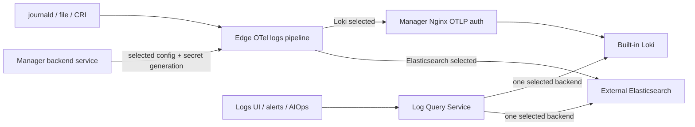

# HLD-001：日志采集、存储与查询解耦

- 状态：已批准
- 日期：2026-08-18
- 更新：2026-08-24
- 关联 PRD：[PRD-004：外部 Elasticsearch 日志中心](../requirements/PRD-004-elasticsearch-log-center.md)
- 关联 RFC：[RFC-003：OTel 日志采集与 Elasticsearch 直写](../rfc/RFC-003-otel-elasticsearch-logs.md)
- 关联 ADR：[ADR-031：Edge 直写外部 Elasticsearch](../adr/ADR-031-edge-direct-elasticsearch-logs.md)

## 系统边界

本功能不新增独立服务。Manager 管理日志后端配置并查询当前选中的后端；Edge 使用同一个 OTel Collector 日志流水线，按当前配置直写内置 Loki 或外部 Elasticsearch。Manager 不转发日志正文，也不合并两个后端的数据。

## 组件职责

| 组件 | 职责 |
| --- | --- |
| Logs Backend Service | 保存 ES 配置、测试连接、选择 Loki/ES、生成运行配置、执行独立设备连接检查 |
| Edge logs plugin | 渲染 OTel 配置、保存 checkpoint/queue、加载受限写凭证、直写当前后端 |
| Plugin Secret RPC | 按 generation 投递固定 logs secret slot，并校验 Edge 身份 |
| Log Query Service | 把产品查询直接路由到当前后端，返回后端无关的日志记录 |
| Loki Adapter | 把结构化查询映射为 LogQL，并支持原生 `query_logql` |
| Elasticsearch Adapter | 固定 data stream 边界，使用 PIT/search_after、聚合和字段映射 |
| Alert Rule Migration | 在后端选择前把可移植的旧 LogQL 规则事务化为 `log_search`，刷新 evaluator 缓存 |
| Logs UI | 使用稳定字段、筛选、分页和直方图，不拼接后端 DSL |

## 数据流

## 状态模型

- Loki 是内置默认后端，不需要数据库记录。
- Elasticsearch 配置只保存 `selected` 或 `unselected`。
- 选择 ES 时先验证 Manager 查询端点、写入端点和 API Key 权限；成功后直接选中，失败则请求失败且原选择不变。
- 选择 Loki 时直接清除 ES 选中项并下发配置；后端设备检查仍是选择后的独立操作。
- 选择 ES 写入前先完成旧日志规则的原子迁移与内存缓存刷新。迁移不是后端状态；失败直接结束本次请求，数据库中的后端选中项不变。选择 Loki 不需要迁移，保持直接切换。
- 不存在候选、灰度、shadow、rolling back、自动回退或历史后端时间线。
- 每个 Edge 只渲染当前选中的一个 exporter。

## 设备连接检查

设备连接检查是选择后的独立操作，不参与后端选择：

1. Manager 枚举启用了 logs 的 Host Edge。
2. 为本次检查生成唯一 generation 和 probe id。
3. 在线 Edge 加载当前配置并写入探针；Manager 从当前后端查询探针。
4. UI 按在线设备显示已验证数/在线总数，轮询展示进度。
5. 离线 Edge 不阻止选择，重连后按当前选中配置收敛。

assignment 仅保存检查所需的 desired/applied generation、probe 状态、时间和错误，不表示后端切换阶段。

## 查询模型

产品请求只包含时间范围、稳定 scope、关键字、允许字段 filter、排序、limit 和 cursor。Manager 每次读取当前选中项并直接调用一个适配器；适配器的 opaque cursor 原样返回，不再包裹 Manager 查询计划。ES cursor 持有 PIT，服务端、Web 和 AIOps 调用方在不再继续翻页时都必须显式关闭；失败的续页请求也由 adapter 关闭 PIT。

| 产品字段 | Loki | Elasticsearch OTel mapping |
| --- | --- | --- |
| `device_id` | `device_id` | `resource.attributes.device_id` |
| `cluster_id` | `cluster_id` | `resource.attributes.cluster_id` |
| `namespace` | `namespace` | `resource.attributes.namespace` |
| `workload` / `pod` / `container` / `node` | 同名 label 或 metadata | `resource.attributes.*` |
| `source_id` | `ongrid_source` | `resource.attributes.ongrid_source` |
| `level` | `level` / OTel severity | `severity_text` |
| `file` / `unit` | `filename` / `unit` | `resource.attributes.filename` / `unit` |
| `trace_id` / `span_id` | 同名 metadata | 同名字段 |
| `message` | log line | `body.text` |

`query_logql` 保持单一工具名：Loki 原样执行完整 LogQL 并返回 Loki 结果；ES 只接受可无损翻译的 stream selector 和 line filter 子集，并返回精简的 ES 日志结果。它不把 ES 结果伪造成 Loki streams。

## 告警迁移

- evaluator 只把 `log_search` 作为跨后端日志告警的规范存储形态；新写入不持久化 `log_match`/`log_volume`。
- 旧规则迁移复用 `query_logql` 的安全子集编译器，将 selector/line filter 转为关键词、等值、存在、集合或前缀筛选，并保留窗口、比较符、绝对计数阈值及 Loki stream 身份对应的 `group_by`；两个后端都按同一组标签生成逐组 incident。
- 全部候选先完成解析，再由 Repo 在一个事务中 compare-and-swap 更新；避免半数规则已迁移、半数仍绑定 Loki。
- 数据库更新后先刷新 evaluator 缓存，再写 ES 选中项。host scope 自动补充 `device_id` 分组和存在约束；只有自定义 LogQL 无法映射到统一查询契约时才阻止 ES 切换并给出具体规则 key。

## 存储和安全

- Manager 数据库只保存控制状态，不保存日志正文。
- ES 使用固定的 `logs-ongrid.<dataset>.otel-<namespace>` data stream 范围。
- 写、读 API Key 分离；Edge 只获得写凭证，Manager 只使用查询凭证。
- secret 不进入普通 plugin spec、URL、argv、状态 API 或日志。
- 查询字段和 index pattern 由服务端 allowlist 固定，不接收 Elasticsearch DSL。
- 内置 Loki 只通过 Nginx 暴露精确 OTLP 写入口；Manager Go 不承载日志流量。

## 故障语义

- 保存配置不改变当前后端。
- 测试连接不改变当前后端。
- 选择失败不改变当前后端；选择成功后不因后续设备检查结果自动回退。
- 旧告警迁移失败不改变当前后端；如果迁移已完成而后端验证/选择随后失败，规范化的 `log_search` 仍可在原后端继续执行。
- Edge 配置校验失败时保留本机上一份可运行配置并上报错误。
- 旧后端数据继续保留，但产品只查询当前选中的后端，不迁移、不联邦查询。
- Promtail 不再属于当前制品；紧急回退使用上一 Ongrid 发布版本。

## 验证

- Go 单元测试与竞态测试覆盖选择、连接检查、查询路由、分页和字段映射。
- 前端测试覆盖刷新取消、稳定字段面板、分页和连接检查进度。
- 发布前使用捆绑的 Collector 验证 Loki/ES 配置，并完成真实 Edge 网络、TLS 和 API Key 验收。
